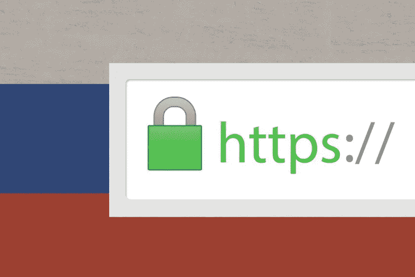
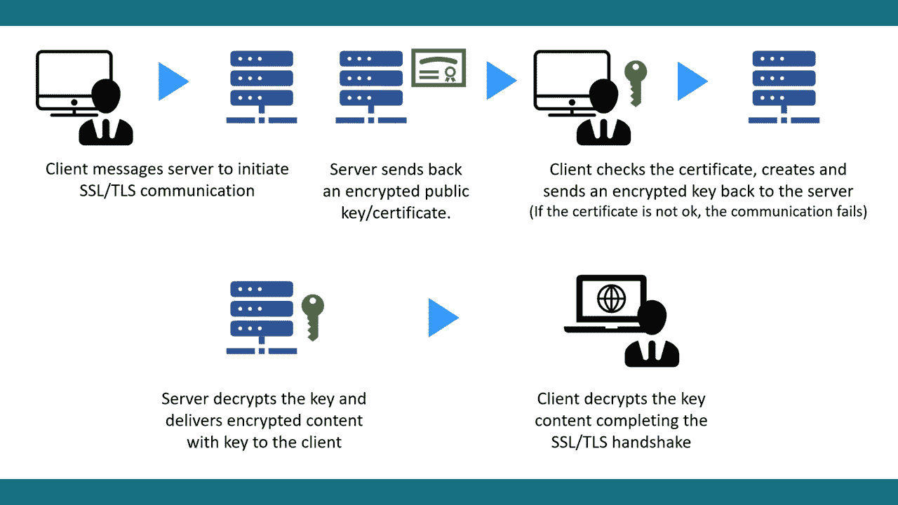

# 俄罗斯建立自己的 TLS 认证机构以避免制裁

> 原文：<https://medium.com/coinmonks/russia-establishes-its-own-tls-certificate-authority-to-avoid-sanctions-a8221b72b729?source=collection_archive---------5----------------------->

HTTP Connections

俄罗斯已经建立了一个国内可信的 TLS 认证机构(CA ),以帮助俄罗斯网站更新其 TLS 证书，并继续为其访问者提供服务。

在入侵乌克兰之前，俄罗斯的网站需要向国际认证机构支付费用来更新他们的 TLS 证书。然而，由于入侵也导致了严厉的制裁，这些西方国家的签字当局不能再接受付款，因此不能更新证书。

如果网站证书过期，浏览器将显示一条消息，表明用户想要访问的页面不安全——为了解决这个问题，俄罗斯当局提出了一种国内 CA。

# 什么是 TLS

TLS(通常称为 SSL 或 TLS/SSL)是一种加密协议，通过加密在浏览器、您访问的网站和网站服务器之间发送的数据来保护互联网。正如 DigiCert 解释的那样，这些证书保持数据传输的私密性，防止数据被修改、丢失或被盗。

Working of TLS Certificate

根据俄罗斯公共服务门户网站 Gosuslugi 上的一则通知，如本文专题艺术中的翻译版本所示，如果外国安全证书过期或被外国 ca 撤回，这些证书将取代外国安全证书。根据该门户网站，该服务适用于在俄罗斯运营的所有法律实体，证书应要求在五个工作日内交付给网站所有者。

# “数字铁幕”

过去两周，俄罗斯的互联网服务被多家美国主要互联网供应商切断，其中包括据报道为俄罗斯提供服务的第二大互联网运营商 Cogent Communications。美国另一家主要的互联网供应商 Lumen 于 3 月 8 日紧随其后，将该国公民推向了一些分析师所称的“新的数字铁幕”

倡导俄罗斯数字自由的互联网保护协会的执行董事米哈伊尔·克利马列夫告诉《华盛顿邮报》，他“对此非常害怕”

“我想告诉全世界的人们，如果你关闭俄罗斯的互联网，那么这意味着切断 1.4 亿人获得至少一些真实信息的渠道。只要互联网存在，人们就能发现真相。不会有互联网——所有俄罗斯人只会听宣传。”

# 两个浏览器识别新的 CA

“如果外国安全证书被吊销或过期，它将取代它，”俄罗斯公共服务门户网站 Gosuslugi 上发布的公告的粗略翻译如下。“数字发展部将提供免费的国内模拟。该服务在 5 个工作日内根据请求提供给法律实体—网站所有者。”

所有这些并不像听起来那么简单。正如*bleeding computer*所说，一个 CA 需要得到网络浏览器的信任，并且要达到这一点——它需要通过“各种公司”的审查。这似乎不可能一蹴而就。

目前的情况是，只有两个浏览器认为新的 CA 值得信任:Yandex 和 Atom。俄罗斯用户对 Chrome、Firefox、Edge 等浏览器的唯一替代。前者是基于俄罗斯的，而后者是开源的。该出版物称，到目前为止，俄罗斯储蓄银行、VTB 和俄罗斯央行已经收到了这些新证书。

展望未来，大约 200 个域名已经收到了新 TLS 证书的通知，但由于它们不是强制性的，所以一开始就不知道这些公司需要多长时间来采用它们，或者有多少公司会这样做。

俄罗斯入侵乌克兰导致的制裁正在对入侵者的经济造成损害。许多服务，如 PayPal，Visa，Mastercard，甚至 SWIFT，在该国都无法使用，而大多数西方零售商，如微软，苹果，谷歌，麦当劳，可口可乐，以及许多许多其他公司，已经退出。

对于网络安全公司 Venafi 的专家来说，新的俄罗斯 CA 的建立也可能为俄罗斯实体带来灾难性的单点故障，因为他们认为 CA 是“对隐私和在线自由的明确打击”，因为它赋予了俄罗斯政府监视其公民和欺骗任何西方互联网服务的权力。

“所有这些都不足为奇，”Venafi 的首席安全策略师 Kevin Bocek 说。

“这是反对开放互联网和扩大对公民控制的冲突的进一步升级。俄罗斯还把自己锁在了全球经济之外，让当代和未来几代俄罗斯公民的经济增长希望变得暗淡。”

Venafi 的安全工程师 Pratik Selva 补充说:“可以肯定的是，这个新的 CA 将成为目前对俄罗斯实体发动网络攻击的匿名组织和其他组织的主要目标。”“与世界其他地方不同，俄罗斯政府和私营部门的网站和基础设施都没有 CA，所以这个会关闭或受到损害。连接到它的每个网站都将与互联网断开连接，直到创建新的 CA 并颁发新的证书。”

# 俄罗斯也可能给自己带来巨大风险

“新的俄罗斯 CA 的建立也可能为俄罗斯实体创造灾难性单点故障的可能性，”Venafi 的高级安全工程师 Pratik Savla 说。

“可以有把握地认为，这个新的 CA 将是目前对俄罗斯实体发动网络攻击的“匿名者”和其他组织的主要目标。与世界其他地方不同，俄罗斯政府和私营部门的网站和基础设施都没有 CAs，所以如果这个网站瘫痪或受到威胁，所有与之相连的网站都将与互联网断开连接，”萨夫拉说。

## 在 Linkedin 上关注我，保持联系

[https://www.linkedin.com/in/ishanshahzad/](https://www.linkedin.com/in/ishanshahzad/)