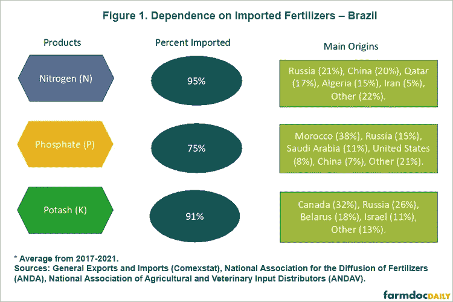
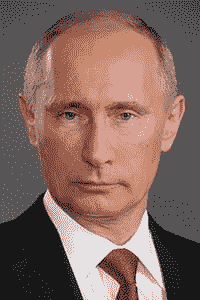

# 俄罗斯正在南美和中亚展示实力

> 原文：<https://medium.com/coinmonks/russia-is-flexing-its-muscles-in-south-america-and-central-asia-d9f32e63d5e6?source=collection_archive---------34----------------------->

我写这个故事是为了回应我读到的本周在德国举行的 G7 峰会**。随着中国的“一带一路”倡议(BRI)在七国集团议程上的重要位置，据报道，他们已经邀请其他国家——阿根廷、印度、印尼、塞内加尔和南非——加入与世界领导人关于当前全球粮食安全形势的讨论。**

**这种情况最初是由新冠肺炎疫情的爆发引起的，但由于乌克兰战争而加剧——因为这场战争，俄罗斯受到了世界其他国家的排斥，因为俄罗斯限制了乌克兰的粮食出口，并封锁了对全球粮食出口至关重要的黑海港口。**

**由于俄乌冲突，能源和商品是全球经济最大的担忧，除其他因素外，德国正在准备更多的 [**煤厂**](https://www.cnbc.com/2022/06/20/ukraine-war-germany-turns-to-coal-as-russia-throttles-gas-supplies.html?__source=androidappshare) ，美国正在准备更多的采矿项目，如亚利桑那州的 [**铜世界综合体**](https://www.mining.com/hudbay-minerals-needs-1-3bn-for-copper-world-project-in-arizona/) ，法国总统马克龙正在与罗马尼亚谈判，以恢复从奥德萨到多瑙河的旧铁路运输路线，以增加从乌克兰到多瑙河的**

******所有这些经济活动都是在美国和欧洲制裁俄罗斯关键液化天然气行业的背景下发生的，例如 Novatek 的 [**北极液化天然气 2 项目**](https://www.upstreamonline.com/politics/sanctions-hit-russian-manufacturers-struggle-to-advance-countrys-lng-ambitions/2-1-1242028?utm_term=upstream) **。********

****能源和大宗商品正成为外交和政治的主要内容。这里有两个例子可以说明俄罗斯是如何给南美和中亚最大的经济体带来问题的:巴西和哈萨克斯坦。****

> ****交易新手？尝试[加密交易机器人](/coinmonks/crypto-trading-bot-c2ffce8acb2a)或[复制交易](/coinmonks/top-10-crypto-copy-trading-platforms-for-beginners-d0c37c7d698c)****

# ****俄罗斯在巴西化肥市场的关键地位****

********

****I received the data from this diagram on the University of Illinois’s Farm Doc Daily. It’s a university publication from the Department of Agricultural and Consumer Economics. See the full report here: [https://farmdocdaily.illinois.edu/2022/03/war-in-ukraine-and-its-effect-on-fertilizer-exports-to-brazil-and-the-us.html](https://farmdocdaily.illinois.edu/2022/03/war-in-ukraine-and-its-effect-on-fertilizer-exports-to-brazil-and-the-us.html)****

****我想谈谈俄罗斯之前在巴西化肥市场的主导地位。****

****看上面的图表。俄罗斯在所有三个类别中都名列前茅——占氮出口的 21%，磷出口的 15%，钾出口的 26%。这里还需要指出的是，中国和白俄罗斯一直在努力满足巴西的化肥消费需求。中国在 2021 年限制出口，白俄罗斯的钾肥行业一直是美国和欧洲制裁的目标。****

> ****请阅读我在 Medium 上发表的这篇关于诺帝伦有限公司首席执行官转型的报道，了解全球化肥行业的更多动态:[https://Medium . com/@ 44 jmonroe 91/what-go-down-at-the-the-world-large-potash-producer-Nutrien-ltd-c 174d 19 e 403d](/@44jmonroe91/what-went-down-at-the-worlds-largest-potash-producer-nutrien-ltd-c174d19e403d)****

****图表显示，俄罗斯在巴西氮肥进口依赖方面领先于所有其他国家。由于中国的化肥目前不在考虑范围内，这种情况可能会导致更多的俄罗斯进口。****

****如前所述，俄罗斯的 Acron 集团一直是美国国际贸易法院反补贴税(CVD)争端的目标。美国最大的氮和氨生产商 CF Industries[**向**](https://www.federalregister.gov/documents/2021/12/03/2021-26313/urea-ammonium-nitrate-solutions-from-the-russian-federation-preliminary-affirmative-countervailing) 法院请愿，指控俄国对尿素硝酸铵溶液(UAN)的补贴使美国生产商和出口商在市场上处于不公平的优势。****

****俄罗斯很可能会败诉，因为初步裁定已经做出有利于 CF Industries 的裁决。这将有效地把 Acron 集团挤出美国 UAN 市场，而它曾是这个市场的领导者之一。俄罗斯可能打算继续向需要氮肥的国家出口尽可能多的氮肥。巴西将是其主要目标之一。****

**** [## 肥料外交的概念

### 2022 年 5 月 3 日，巴西宣布政府将出访北非，目的是参与…

medium.com](/@44jmonroe91/the-concept-of-fertilizer-diplomacy-b710b2fb1a35) 

# 哈萨克斯坦对俄罗斯的出口依赖

[**2022 年 5 月 18 日**](https://eurasianet.org/amid-sanctions-kazakh-firm-stops-supplying-russian-steelworks) 哈萨克斯坦最大的铁矿石出口商和富集商索科洛夫-萨里拜矿业生产协会(SSGPO)决定暂时停止向位于西伯利亚的俄罗斯马格尼托戈尔斯克钢铁厂(MMK)供货。

俄国的 MMK 的回应是 [**指责**](https://www.vedomosti.ru/business/articles/2022/05/17/922281-posle-otkaza-kazahstana-metalloinvesta) 美国和西方的制裁。

[**【几内亚】**](/coinmonks/crude-oil-iron-ore-are-signaling-a-reboot-in-the-global-commodity-supercycle-2e87325a8a05) 的铁矿石开采项目显示，在 [**全球大宗商品超级周期**](/coinmonks/goldman-sachs-bull-market-for-battery-metals-is-over-ab3a41e29d48) 期间，不管地缘政治如何，随着中国和澳大利亚等国家争夺铁矿石和其他金属的供需，对金属的强劲需求将会上升。

这就是为什么哈萨克斯坦和俄罗斯之间最近的局势不应该被轻视。只要看看里海管道财团(CPC)上发生的事情，就能理解目前能源和大宗商品的地缘政治性质。

 [## 俄罗斯如何在 2022 年扰乱里海管道财团(CPC)和全球供应

### 我写这篇文章是因为 2022 年 6 月 3 日的一篇报道，报道称哈萨克斯坦将把其重要的石油出口更名为…

medium.com](/@44jmonroe91/how-russia-disrupted-the-caspian-pipeline-consortium-cpc-and-global-supplies-in-2022-9fc1799eca6e) 

圣彼得堡国际经济论坛被用作俄罗斯向世界展示其如何致力于其政治议程的舞台。

用俄国总统弗拉基米尔·普京的话说:

论坛的周年纪念是在整个国际社会面临困难的时候举行的。西方国家多年来在经济政策上的错误和不合理的制裁导致了全球通货膨胀的浪潮，正常供应链的中断，以及贫困和粮食短缺的急剧增加。然而，随着这些挑战的出现，新的前景正在出现。这就是为什么论坛的口号——新世界中的新机遇——看起来如此贴切。

“新世界中的新机遇”听起来像是经典的修正主义，但它也表明了俄罗斯对全球大宗商品超级周期的重要性——或者至少自认为如此。例如，中国国家主席兼董事长在圣彼得堡论坛上站在俄国一边，宣称由美国领导的“单极世界时代”已经结束。

虽然可以理解的是，大多数人会关注俄罗斯对乌克兰发动的非人道战争，但随着世界各地国际难民和国内流离失所者(IDPs)的激增，全球大宗商品超级周期正在推动俄罗斯等国家的经济实力。

这使得俄罗斯能够改变中亚后苏联地区的整个局势。哈萨克斯坦非常担心，所以该国不得不利用圣彼得堡论坛向世界展示，面对日益逼近的俄罗斯边境威胁，其领土完整**是安全的。**

**这在很多方面都是对世界的绝望恳求——美国？—促进哈萨克斯坦的主权事业，因为美国和欧洲对俄罗斯石油和天然气行业的制裁会给这个国家带来很大损失。**

****

**Source: St. Petersburg International Economic Forum, “To participants, organizers and guests of the 25th St. Petersburg International Economic Forum” [https://forumspb.com/en/](https://forumspb.com/en/)******