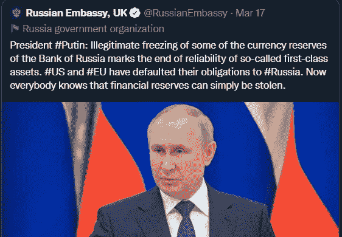
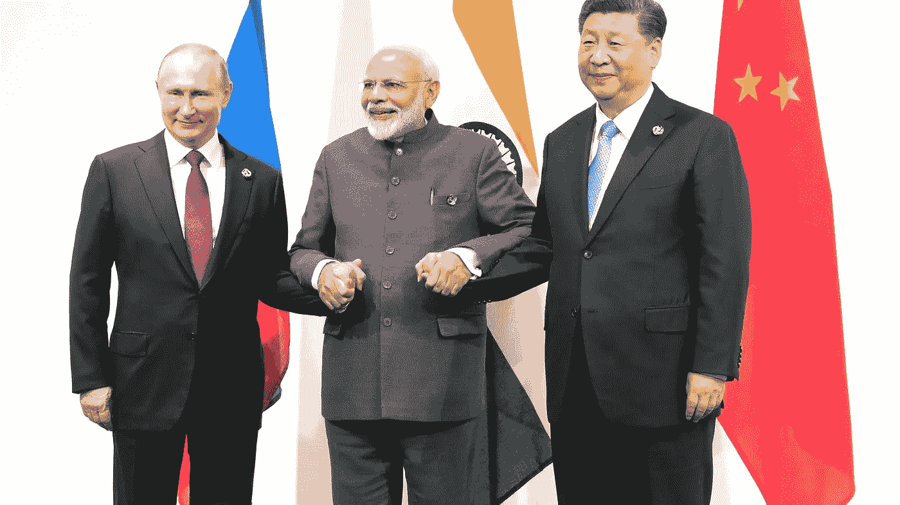
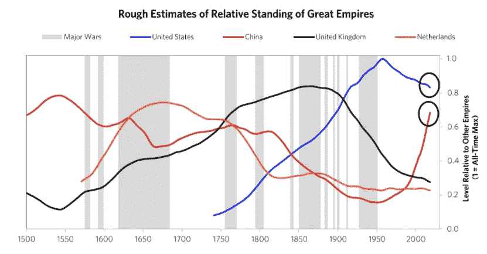

# 俄罗斯在推行去美元化，有什么启示？

> 原文：<https://medium.com/coinmonks/russia-is-pursuing-de-dollarization-what-are-the-implications-11ec1ff3466e?source=collection_archive---------29----------------------->

去美元化的一个例子:**中国和俄罗斯**寻求减少美元的使用，或使其经济“去美元化”，以保护其经济免受美国的制裁，减少美国经济和货币政策的影响，并维护其全球经济领导地位的品牌。

## 为什么这个话题是趋势性的，为什么俄罗斯在追求这个方向？

由于入侵乌克兰引发的战争导致的制裁，俄罗斯被迫走上了这条道路。美国和欧洲已经对俄罗斯、俄罗斯寡头和俄罗斯国有银行实施了制裁。基本上，我们有这些目标人群，他们的银行和主要行业，我们冻结了他们的资产。

然而，弗拉基米尔·普京在几年前就预见到了这些制裁，近年来他一直在努力减少俄罗斯在西方制裁下的风险敞口。他一直在努力摆脱美元，并增加其他资产，以防它们被 SWIFT 和其他西方金融工具切断。首先，俄国已经积累了大量的外汇储备，弗拉基米尔·普京已经停止向西方大国借钱。他认为，俄罗斯可以通过这些储备和西方尚未批准的一件事(截至 2022 年 4 月 5 日)为自己融资——俄罗斯的石油和天然气以美元和其他西方货币进行交易，这使普京能够获得资本和对欧盟的一些影响力。

第二，在对抗美元主导地位的斗争中，他们一直在与中国合作支持人民币。他们一直在开发另一个支付网络，以减少对 SWIFT 的依赖，因为俄罗斯希望在不受西方制裁的情况下运营。不幸的是，他们并不孤单，还有其他国家可能会受到西方制裁的伤害，希望通过只持有美元储备来降低风险，或者希望利用放弃美元的威胁作为杠杆。

From the Russian Embassy’s Twitter

## 那么——还有谁在考虑去美元化，这意味着什么？

另一个石油大国最近宣布了一条类似的去美元化道路，沙特阿拉伯，它对美国越来越失望，最近声明它将开始用人民币为其对中国的石油销售定价，他们正在考虑一些基于人民币的期货合同。这将是一份新的期货合约，标志着与石油美元的背离。《华尔街日报》的文章称，如果发生这种情况，“此举可能会削弱美元在国际金融体系中的主导地位，几十年来，美国一直依赖国际金融体系印刷国库券，为预算赤字融资。总部位于华盛顿的全球安全分析研究所(Institute for the Analysis for the Global Security)联合主任、经济学家盖尔·卢夫特(Gal Luft)说，石油市场，乃至整个全球大宗商品市场，是美元作为储备货币地位的**保险单。卢夫特合著了一本关于去美元化的书，并表示，如果将这堵墙拆除，它可能会开始倒塌。作为一名美国公民，这些头条新闻在很大程度上没有被注意到，然而，它们激起了我的兴趣，特别是考虑到我们的预算赤字(3 万亿美元)以及由于 Covid 刺激计划、量化宽松和低利率导致的赤字的巨大增加。**

此外，印度一直在与俄罗斯合作开发 SWIFT 的替代方案。从[这篇来自《经济时报》的](http://Russia’s financial messaging system SPFS will be linked with the Chinese cross-border interbank payment system CIPS. While India still does not have a domestic financial messaging system, it plans to link the Central Bank of Russia’s platform with a service that is under development, the persons cited earlier told ET  Read more at: https://economictimes.indiatimes.com/news/economy/foreign-trade/india-russia-china-explore-alternative-to-swift-payment-mechanism/articleshow/72048472.cms?utm_source=contentofinterest&utm_medium=text&utm_campaign=cppst) 2019 文章，“俄国的金融信息系统 SPFS 将与中国的跨境银行间支付系统 CIPS 连接。尽管印度仍没有国内金融信息系统，但它计划将俄罗斯央行的平台与一项正在开发的服务连接起来”。这一体系可能会将东西方的金融体系分割开来，我认为这一范式转变可能会对西方产生重大的长期影响。

## 那么，制裁是正确的举措吗？

我要说，考虑到俄罗斯在乌克兰采取的行动，采取行动是绝对必要的。我们正在利用的这些工具将立即给所有俄罗斯带来痛苦，然而，从长远来看，其影响可能会被不同地看待，并可能使中国受益匪浅。我在《日经新闻》上发表的一篇关于这个主题的 2020 年[文章](https://asia.nikkei.com/Politics/International-relations/China-and-Russia-ditch-dollar-in-move-toward-financial-alliance)中找到了这篇文章，哈佛大学经济学家杰弗里·弗兰克尔(Jeffery Frankel)就制裁问题发表了如下看法，“制裁对美国来说是一个非常强大的工具，但像任何工具一样，你**面临的风险是，如果你过度使用它们**，其他人将开始寻找替代方案，”他说。“我认为，认为美元作为头号国际货币将永远不会受到挑战的想法是愚蠢的。”我再次认为对俄罗斯的制裁是合理的，但是，我认为实施这些制裁可能会迅速加快这种去美元化的趋势，我认为这对于美国/欧盟的长期来说不是好事，可能会有效地结束美元和石油美元 50 年的统治。

**那么，如果美元不再是头号国际货币，人们会选择什么货币呢？**在他的《应对变化中的世界秩序的原则》一书中，雷伊·达里奥为我们提供了一张图，这张图突出了与迅速崛起的中国相比处于相对衰落中的美国。考虑到俄罗斯、沙特阿拉伯、巴西(央行对人民币的敞口翻了两番)以及潜在的印度的发展，我相信我们将继续让世界上一些最强大的国家出于许多不同的原因被人民币/数字元所吸引。明确地说，我认为这将需要相当长的时间才能发生，然而，作为一个长期投资者，这是值得警惕的。有趣的是，雷伊·达里奥提出了另一种不受民族国家控制的货币。奇怪的是，他没有提到比特币，尽管它似乎拥有他所描述的品质。那么，加密和比特币是如何融入这幅图景的呢？

[https://www.linkedin.com/pulse/big-cycles-over-last-500-years-ray-dalio/](https://www.linkedin.com/pulse/big-cycles-over-last-500-years-ray-dalio/)

## 技术专家和大技术倾向于什么？

许多技术专家完全相信，一种全球性的、分散的货币是自由所必需的。我倾向于相信比特币最大化主义者(比如杰克·多西)，他们是比特币的坚定支持者，因为比特币具有:稀缺性、不可夺取性、不可审查性，因为它不受中央权力机构控制，并且对通货膨胀保持中立。因此，所有选择它的人都会因为它的可靠性和节能性而受益。我认为，由于我们没完没了地印钞，美元将继续面临通胀和逆风，我们将看到美元走下坡路，我们将看到东西方金融工具之间的分化。

我认为，比特币和其他潜在的加密货币可能会成为许多人用来对冲这种下跌的工具，并最终可能会在世界市场上进行一些交易。然而，要实现这一点，它可能会面临西方政府更坚定的抵制。但是，它最终可能会被采纳，因为这些国家的人民将选择自由，而不希望央行数字货币或另一种外币长期保持他们的购买力。观察、推测和关注去美元化和替代货币的发展将会很有趣。

干杯，

透视加密

> 加入 Coinmonks [电报频道](https://t.me/coincodecap)和 [Youtube 频道](https://www.youtube.com/c/coinmonks/videos)了解加密交易和投资

# 另外，阅读

*   [Bookmap 点评](https://coincodecap.com/bookmap-review-2021-best-trading-software) | [美国 5 大最佳加密交易所](https://coincodecap.com/crypto-exchange-usa)
*   最佳加密[硬件钱包](/coinmonks/hardware-wallets-dfa1211730c6) | [Bitbns 评论](/coinmonks/bitbns-review-38256a07e161)
*   [新加坡十大最佳加密交易所](https://coincodecap.com/crypto-exchange-in-singapore) | [购买 AXS](https://coincodecap.com/buy-axs-token)
*   [红狗赌场评论](https://coincodecap.com/red-dog-casino-review) | [Swyftx 评论](https://coincodecap.com/swyftx-review) | [CoinGate 评论](https://coincodecap.com/coingate-review)
*   [投资印度的最佳密码](https://coincodecap.com/best-crypto-to-invest-in-india-in-2021)|[WazirX P2P](https://coincodecap.com/wazirx-p2p)|[Hi Dollar Review](https://coincodecap.com/hi-dollar-review)