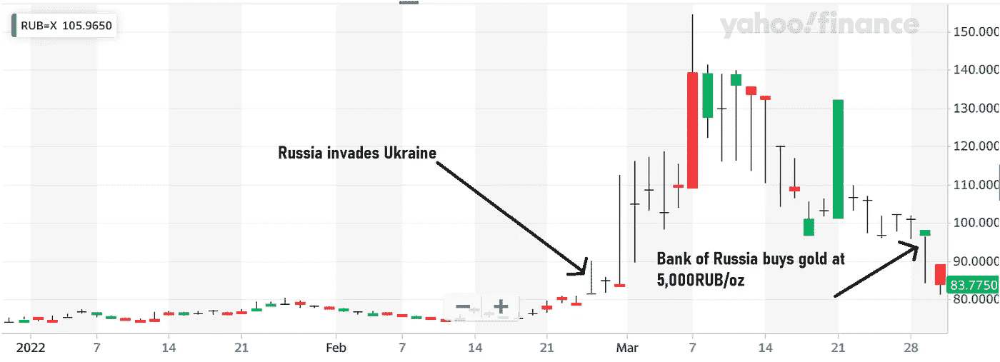
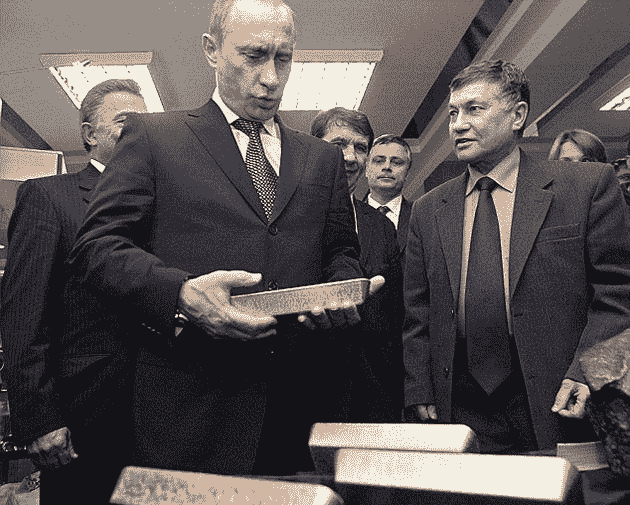
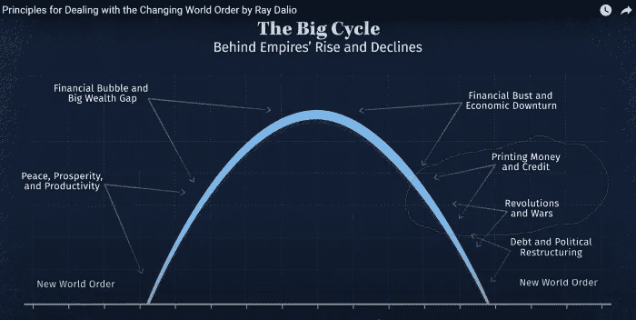
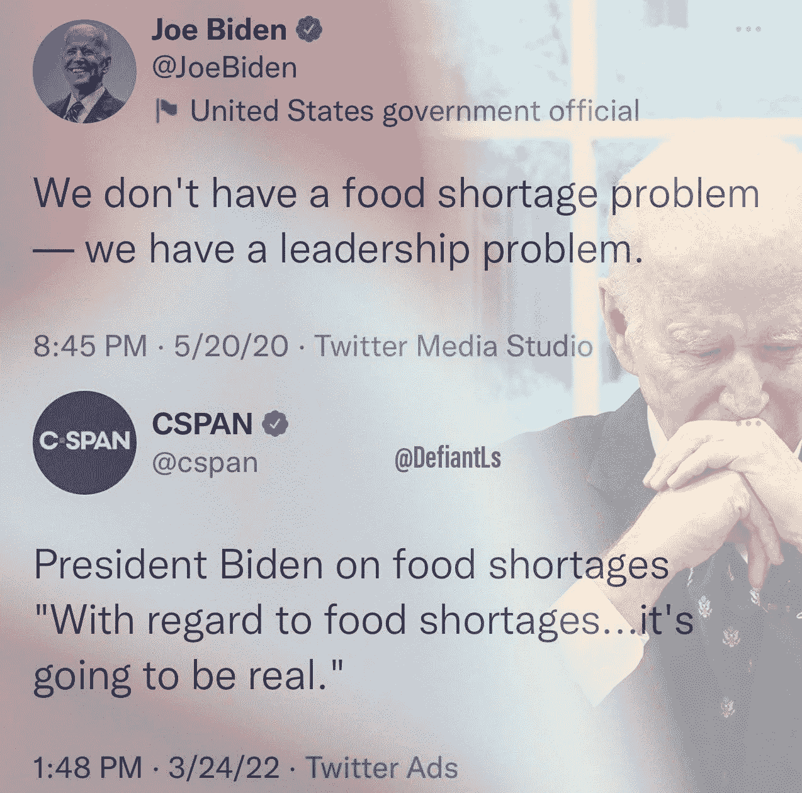

# 俄罗斯将黄金与卢布挂钩，反弹至战前水平

> 原文：<https://medium.com/coinmonks/russia-pegs-gold-to-ruble-rebounds-to-pre-war-levels-b95889d13d4f?source=collection_archive---------0----------------------->

俄罗斯让美国受到地缘政治的牵制，希望将新的金本位与石油美元——相当于石油卢布——结合起来。**本周，** [**俄国宣布将以每克 5000 卢布的固定价格购买黄金，为期 3 个月**](https://www.centralbanking.com/central-banks/financial-stability/7943086/bank-of-russia-fixes-gold-price-and-increases-loans) **，试图创造新的金本位**。与此同时，俄罗斯已开始要求寻求从俄罗斯购买化石燃料的国家以卢布或黄金支付，并考虑允许“友好”国家使用比特币和美元替代货币。现在**卢布已经完全从制裁后的** [**暴跌中恢复过来**](https://www.cbc.ca/news/business/russia-invasion-economy-column-don-pittis-1.6367198) **，你可以从今天的头条看到，“** [**卢布反弹到战前水平。普京的计划目前正在发挥作用**](https://bestinau.net/ruble-bounces-back-to-pre-war-levels-putins-plan-is-working-for-now/) **”，其中详细介绍了俄罗斯为帮助卢布建立支撑而实施的一些国内政策。**

> ***莫斯科做了什么来提振卢布？***
> 
> -中央银行将利率提高了一倍多，达到 20%。这鼓励了俄罗斯储户以本币形式存钱。
> 
> -出口商被要求将 80%的外汇收入兑换成卢布，而不是美元或欧元。
> 
> -禁止俄罗斯经纪人出售外国人拥有的证券。
> 
> -不允许居民在俄罗斯境外进行银行转账。
> 
> -俄罗斯威胁要求用卢布支付天然气，而不是欧元或美元。

一篇通过 Seeking Alpha 发表的文章总结了“ [**俄罗斯将卢布纳入金本位的三步走方案**](https://seekingalpha.com/article/4498704-russias-3-step-program-to-put-the-ruble-on-a-gold-standard)**:**

> 第一步:向由于制裁而无法在国际上出售黄金的俄罗斯国内银行提供溢价固定价格，鼓励国内黄金流入俄罗斯银行。
> 
> 第二步:通过坚持用卢布支付能源，在国际上加强卢布，将固定价格也变成溢价，鼓励国际黄金流入俄罗斯。
> 
> 第三步:以固定汇率将卢布变成可信的黄金替代品。
> 
> 5000RUB 窗口将于 6 月 30 日关闭。之后俄罗斯是否宣布卢布可兑换黄金？以什么速度？与其投机卢布，不如购买黄金。

## 第一步:积累黄金

在这份声明发布之前，俄罗斯已经在国内市场购买了大量黄金。美国经历了特别的努力，除了一般的制裁外，T2 还特别制裁俄国的外国黄金购买行为。大约三周前，[俄罗斯央行确实暂停了黄金购买](https://www.kitco.com/news/2022-03-16/Russians-are-on-gold-buying-spree-as-ruble-collapses-and-sanctions-hurt-economy.html)，原因是"*俄罗斯人争相投资金条和金币以保护自己的储蓄"*并"*将库存留给普通消费者"，黄金需求激增*

央行在政策公告后的一份声明中表示:

央行在周一的一份声明中表示:“目前，家庭购买金条实物黄金的需求有所增加，特别是受到取消这些业务的增值税的推动。”

3 月 9 日，普京签署了一项法律，废除对购买金属征收 20%的增值税。这是为了鼓励购买贵金属而非外币，因为俄罗斯公民在卢布暴跌后试图寻找避风港。

然而，中央银行停止购买国内黄金的时期[在上周](https://www.reuters.com/business/finance/russian-cenbank-restart-buying-gold-banks-will-pay-fixed-price-march-28-2022-03-25/)已经结束，因为**中央银行已经恢复购买黄金。**

## 第二步:用卢布固定黄金价格，鼓励外国黄金流入

如前所述，本周俄国[宣布](https://www.kitco.com/news/2022-03-28/Russia-sets-fixed-gold-price-as-it-restarts-official-bullion-purchases.html)在 3 个月的时间里，他们将确定每克黄金的买入价为 5000 卢布(60 美元)——这实际上设定了一个底线(低于当前每克 62.5 美元的世界市场价格)。

俄罗斯议会议长兼俄罗斯杜马能源委员会主席 Pavel Zavalny，[上周](https://www.marketwatch.com/story/russia-just-made-a-case-for-owning-goldand-nobody-noticed-11648415950)表示，如果各国寻求从俄罗斯购买石油、天然气或其他资源，“ ***让他们要么用硬通货支付，这对我们来说是黄金，要么在我们方便的时候支付，这是国家货币。”***

[据 investing.com](https://www.investing.com/currencies/usd-cny)报道，代表俄国的扎瓦尔尼也一直鼓励中国“去美元化”,转而使用黄金、卢布或人民币结算。

通过最近要求“不友好的”国家主要以卢布或黄金支付，并为其石油提供 20%的折扣，他们正在为黄金储备流入该国创造一个渠道。此外，对俄罗斯黄金的制裁以及 5000 卢布兑 1 克的挂钩政策为市场创造了永久的套利机会，从而产生了向央行出售黄金的压力。[“AustroLib”写作求阿尔法](https://seekingalpha.com/article/4498704-russias-3-step-program-to-put-the-ruble-on-a-gold-standard)雄辩地总结道:

> ***这是布伦特原油和乌拉尔原油的价格差，换句话说就是俄罗斯境外的石油和俄罗斯境内的石油的价格差*** *。没错，这两种等级的石油并不完全相同，但自乌克兰入侵 T21 以来，套利活动明显激增。这种极端的差异显然是因为制裁切断了俄罗斯石油市场与世界其他地区的联系，因此无论俄罗斯石油能够通过防火墙获得什么，都有很大的折扣。*
> 
> 但是美国及其盟友也在制裁俄罗斯黄金。那有什么用？它创造了同样的差价和套利机会。俄罗斯黄金现在比非俄罗斯黄金便宜得多，因为俄罗斯黄金与黄金市场的其他部分 *隔绝了，如果你从俄罗斯购买黄金被抓住，就有遭到报复的风险。伦敦金银市场协会已经禁止俄罗斯黄金在其注册处注册。*
> 
> ***因此，如果你是一家俄罗斯银行，你有一些黄金，除非以很高的折扣，否则你不能卖给国外的人，而俄罗斯银行提出以更低的折扣从你这里购买，这对你来说仍然是溢价，俄罗斯银行分割差额，增加黄金储备，这样稳定了卢布。以下是年初以来的卢布/美元汇率。***

由于黄金交易商在公开市场上购买打折的俄罗斯黄金，并以较低的折扣将其返还给央行，套利交易商从中获利，这种动态将对俄罗斯央行产生持续的黄金抛售压力。过去 3 个月俄罗斯黄金购买的固定汇率是该过程第二部分的试运行。由于中央银行有大量的卢布可以花，他们将积累黄金，并试图将卢布与黄金挂钩。请记住，如果美国没有决定通过迅速启动单边制裁来试图在经济上孤立俄罗斯，这种动力就不会发挥作用。美国正在通过强行发动一场经济战争来分裂世界经济，而俄罗斯正在利用这一点并寻求推翻国王。

这篇文章的最后一段摘录如下:

> ***没错，俄罗斯最终需要在某个时候“出售黄金”，以获得它所需要的东西【与央行出售黄金的固定汇率挂钩，而不是固定的购买汇率】**。但俄罗斯可以做到这一点，而无需实际转移任何黄金。为什么它可以简单地以固定汇率宣布卢布为硬黄金替代品。换句话说，金本位制。但在此之前，它首先必须确保自己有必要的储备(如果经过测试的话)，目前它正在通过分割西方大国提供的套利来做到这一点，这些西方大国已经制裁了它的黄金，并将其与全球市场隔绝。*
> 
> *俄罗斯央行还必须确保其货币政策足够紧缩(目前利率为 20%)以守住底线。然后，它可以坚持用卢布支付俄罗斯商品，现在卢布是硬黄金的替代品。*
> 
> *这就是货币替代品的魅力所在，也就是金本位体系中的黄金替代品。这种货币取代了黄金，所以你不必亲自搬运这些东西，这既痛苦又昂贵。*
> 
> ***西方金融思想认为，如果他们通过制裁降低俄罗斯黄金的价格，他们就会通过减少他们可能用这些黄金购买的东西的数量来伤害俄罗斯。**事实上，**他们实际上是在帮助俄罗斯，鼓励黄金流入该国**，并让俄罗斯银行以更低的成本积累更多黄金，以便在时机成熟时以可信的汇率支撑卢布。*

**

***第三步:将卢布与黄金挂钩***

*按照求阿尔法的 Austrolib 的说法，下一步就是“ ***强化卢布，从西方*** 引流黄金”。有趣的是，3 月 4 日，下面的标题被刊登出来:“渥太华出售了几乎所有的黄金储备，只剩下 77 盎司或者更少”。但是，正如 CBC 在上述文章中指出的:*

*然而，这并不意味着所有政府都在抛售他们的黄金储备。俄罗斯、印度和中国等国家目前正在增加外汇储备。世界黄金协会称，去年下半年，各国央行增加了 336 吨储备，比前一年增加了 25%*

*Kitco News [援引贵金属专家 Everett Millman 的话说](https://www.goodreturns.in/news/gold-rate-marginally-bearish-russia-intends-to-link-ruble-directly-to-gold-rate-1244371.html?story=2)，****俄罗斯的意图是让卢布的价值与黄金的价值直接挂钩。为每克黄金设定一个固定的价格似乎是有意的。* ***当谈到俄罗斯如何在美元体系之外寻求资金并管理其央行融资时，这非常重要*** *”*****

**如果俄罗斯成功创造了新的金本位，并同时鼓励以卢布购买石油的增长(即使人民币和本币也成为可接受的石油交易货币)，这可以被视为金本位和石油美元动态的混合。这当然是对美元作为储备货币的直接挑战。**

****零对冲报道*西方是如何迷失的:一种摇摇欲坠的世界储备货币*****

> **与此同时，尽管媒体试图将普京描绘成希特勒 2.0，但俄罗斯领导人知道一些头条新闻所忽略的事情，即:世界需要他的石油。**
> 
> ****没有俄罗斯的石油，全球能源和经济体系将会崩溃，因为这个体系有太多的债务，无法突然单干和/或反击。****
> 
> **看看主权债务是如何削弱期权并改变全球舞台的？与此同时，俄罗斯没有像欧盟和美国那样债务占 GDP 的比例，它可以开始要求用卢布而不是美元支付石油。**
> 
> **在撰写本文时，阿拉伯国家正与中国、俄罗斯和法国私下讨论停止用美元出售石油。这些举措将削弱美元的需求和实力，为从马里布到曼哈顿的通胀火上浇油。**
> 
> **我想知道拜登、哈里斯或他们“专家”圈子里的任何人是否考虑过这一点？**

**Zerohedge 也同意本文的观点:**

> **然而，底线是，世界正在慢慢从一个世界储备货币时代转向一个日益多元化的货币体系。**
> 
> **一旦制裁和金融战争的魔鬼从瓶子里出来，就很难再放回去。对西方及其美元主导的货币体系的信任正在改变。**
> 
> **通过采取冻结俄罗斯外汇储备、制裁俄罗斯国际货币基金组织特别提款权并取消其对 SWIFT 支付系统的访问权的惊人决定，美国获得了短期头条新闻以显得“强硬”，但开辟了一条通往更长期后果的道路，这将使其(及其美元)走软。**
> 
> **随着多货币石油成为新的环境，通胀的赢家将再次是大宗商品、工业和某些房地产。**

****普京也预测到了这一点，他最近广播消息**,**“让我重申，整个全球经济和贸易都遭受了重大打击，对美元作为主要储备货币的信任也是如此。**俄罗斯央行部分货币储备被非法冻结，标志着所谓一级资产可靠性的终结。事实上，美国和欧盟已经拖欠了对俄罗斯的债务。现在每个人都知道，金融储备很容易被窃取，许多国家在不久的将来可能会开始——我相信这将会发生——将它们的纸面和数字资产转化为真正的原材料储备:土地、食品、黄金和其他真正的资产。”**

## **这些棋步可能会推翻美元，并启动一个由地区集团组成的多极世界秩序**

**这个月我写了两篇文章，分别是 3 月 8 日的“[乌克兰危机引发比特币基本面的巨大转变](https://bitboycrypto.com/ukraine-crisis-triggered-a-massive-shift-in-fundamentals-for-bitcoin/)”和 19 日的“[美国霸权受到威胁，沙特、阿联酋、印度无视制裁威胁，转向俄罗斯和中国](/coinmonks/us-hegemony-threatened-as-saudis-uae-india-ignore-threats-of-sanctions-turn-to-russia-china-9473f26a6342)”。这是第三部分，因为前两部分的预测正被最近的发展所验证，并且在那些部分中引入的概念综合起来支持这一部分的基础。**

**为了没有阅读前两篇文章的读者，我想重述一下“[乌克兰危机引发比特币](https://bitboycrypto.com/ukraine-crisis-triggered-a-massive-shift-in-fundamentals-for-bitcoin/)基本面的巨大转变”的论点，主要是说不断上涨的能源价格将减少比特币的抛售压力，制裁将增加需求(对比特币和其他商品)，因为俄罗斯及其贸易伙伴试图避免制裁，其结论包括:**

> **乌克兰/俄罗斯冲突已经改变了比特币的短期和中期基本面，因为美联储现在可能不会那么积极地采取紧缩政策，甚至可能会完全推迟，这取决于事态如何发展。**
> 
> ***B .从短期到长期来看，制裁和 Swift 系统解散极大地刺激了中央银行和国际交易商/进口商/出口商将比特币和加密用作储备货币。***
> 
> **美利坚帝国很可能正处于垂死挣扎，因为它拼命寻求保持统治地位。也许是时候对抗美国霸权了。**

**在结论中，我主要通过雷伊·达里奥的帝国兴衰“大周期”的镜头分析了世界的现状，以及“ ***帝国如何几乎总是以债务危机、帝国货币的贬值/贬值以及其货币作为储备货币的作用逐渐减弱*** ”而告终。正如帝国的终结以其储备货币地位的下降为标志一样，帝国崛起的标志也是其货币作为储备货币的崛起。结论假设了人类的岔路口，我们要么重复循环，要么开始分权。**

****

**自从我的文章发表以来，我们已经看到了诸如“[高盛承认沙特-中国石油贸易标志着美元储备地位的“侵蚀””](https://www.zerohedge.com/markets/goldman-admits-saudi-china-oil-trade-signals-erosion-dollar-reserve-status)和“[美国必须打破新的中国-俄罗斯-沙特石油轴心](https://www.dallasnews.com/opinion/commentary/2022/03/13/the-us-must-bust-up-the-new-china-russia-saudi-axis-of-oil/)”的标题**

**就在昨天，**俄罗斯外交部长** [**宣布，俄罗斯旨在与中国建立一个新的“民主世界秩序”**](https://www.cbsnews.com/news/russia-china-lavrov-visit-beijing-vladimir-putin-xi-jinping-new-world-order/) 。谢尔盖·拉夫罗夫(Sergey Lavrov)利用世界各国和人民对主权的渴望，他们发现自己被迫(或者更确切地说是由于暗示和明示的威胁而被迫)成为美国的附庸国。**

**“ ***我们，与你们一起，与*** [***我们的同情者******将走向*** *一个* ***多极、公正、民主的世界秩序”***](https://www.cbsnews.com/news/philippines-leader-rodrigo-duterte-new-world-order-russia-china-un-icc/)**

**正如哥伦比亚广播公司(CBS)报道的那样，乌克兰战争爆发前几天，在北京奥运会开幕式期间，俄罗斯和中国向世界发表的一份联合声明中，他们发布了一份声明，称“ ***试图将俄罗斯和中国描绘成民主和自由的传播者，而不是世界舞台上民主和自由的挑战者。*****

**联合声明的部分内容如下:**

**“世界舞台上一些代表少数的势力继续主张以单边主义方式解决国际问题，诉诸强权政治，干涉别国内政，损害别国合法权益，挑起矛盾、分歧和对抗。”**

**这是他们一直在宣传的信息，而美国则把它宣传为民主和专制之间的斗争。**

## **美国欺负原型将是它的垮台，世界已经受够了**

**T4 所谓的“强权政治”的许多策略包括经济战，如制裁，还包括对那些不服从的人进行威胁和暴力威胁。这是很多人多年来一直在说的话，比如塔尔西·加巴德和罗恩·保罗。对于对一国经济实施单边制裁的实际意义以及美国轻易以此威胁各国的后果有基本了解的人来说，这是显而易见的。谁想被一个好战的疯子统治，如果你不答应他们的要求，他会大规模屠杀你的平民？正如他们所说，这对生意不利。**

**当然，除了作为控制手段的经济战，还有更公开的形式，如军事行动或政变。但归根结底，这些形式的帝国主义和对主权的漠视是不可持续的，因为它不会在国家之间建立健康的关系。附庸国经常感觉被剥削了，就像一群寄生虫，而不是互惠互利的关系。俄罗斯和中国正感受到这种情绪，并把自己作为一个解决方案，传播他们将尊重其他国家主权的信息。最终，我不认为这是他们的真实意图，尤其是中国，但这不是本文的重点。关键是——就像美国大选一样——世界经常发现自己在两害相权取其轻——对许多人来说，中国/俄罗斯集团的保证比另一个选择更有吸引力，那就是让美国继续占据主导地位。事实是，美国不尊重其他国家的主权，而中国/俄罗斯轴心则保证他们会尊重。**

****在“** [**美国霸权受到威胁之际，沙特、阿联酋、印度无视制裁的威胁，转而投向俄罗斯和中国**](/coinmonks/us-hegemony-threatened-as-saudis-uae-india-ignore-threats-of-sanctions-turn-to-russia-china-9473f26a6342) **”中，我分解了其中的原因，并指出了，美国将中立国推入俄罗斯和中国怀抱的效果**。即沙特阿拉伯、印度、南非。尽管随着北约继续试图迫使双方就范，这一点在本周变得越来越明显，例如，最近的头条新闻是，" [**匈牙利的欧尔班因在乌克兰战争中的'中立性'而受到批评**](https://apnews.com/article/russia-ukraine-putin-business-budapest-viktor-orban-c289237f0c626ce9447bd1c78ebcd8ae)**

> ****虽然他的方法在他的许多支持者中获得了支持，但欧尔班不愿明确采取行动支持乌克兰，并坚持维护他在俄罗斯的经济利益，这导致了其他欧洲领导人的沮丧和愤怒——尤其是乌克兰总统本人……****
> 
> ****"**我想就此打住，实话实说，一劳永逸。你必须自己决定和谁在一起。******

****在我的第一篇文章中，我总结如下:****

> ******“随着沙特寻求放弃石油美元，印度寻求在对俄贸易中逐步取消美元作为储备货币**(以及未来可能的贸易伙伴如中国)，**美元的储备货币地位面临巨大威胁。沙特阿拉伯偏离了它在其中发挥作用的标准，这可能会鼓励其他国家效仿。类似地，随着多个国家加强与俄罗斯和中国**(或其盟友，如阿联酋与叙利亚总统阿萨德的会晤)**的关系，并藐视美国的愿望和隐含或直接的威胁，这可能会鼓励其他国家在未来做同样的事情——摧毁美国的霸权。”******

****最后一段内容如下:****

> ****“我们可能正在见证美国帝国及其储备货币的衰落，与此同时，一个新兴的权力结构和世界经济体系正在崛起，金砖国家将成为全球新的主导力量。”****

****自那以后，越来越多的媒体、世界政府机构和政治评论家越来越多地承认这一可观察到的现实情况。 [**昨天，俄罗斯副外长表示，金砖国家**](https://sputniknews.com/20220330/brics-countries-will-be-at-heart-of-new-world-order-russian-deputy-foreign-minister-says-1094329705.html) **(巴西、俄罗斯、印度、中国和南非)将成为“新世界秩序”的核心。******

> *****“从各方面来看……这些国家将成为新的世界秩序的基础，”*这位副外长说，接着他告诉 RT，俄罗斯正努力与任何有兴趣合作的国家建立联系****

****俄罗斯外交官里亚布科夫(Ryabkov)在接受 RT 采访时表示，俄罗斯决定要求与“不友好的”(北约盟国)国家签订天然气合同时支付卢布:****

> ****里亚布科夫告诉 RT. “我们不是在修改合同的[条款]，我们是在保护我们的利益免受海啸的影响，这是一波完全不负责任的制裁，刚刚冲击了国际贸易和国际体系的基础。”****

****如前所述，他们愿意接受的不仅仅是卢布，还有黄金。同样，过去一周，他们一直在公开考虑接受比特币作为支付手段，以避免制裁——这导致比特币价格飙升。同样，他们愿意接受友好货币的本国货币，这不会迫使他们在公开市场上将本国货币兑换成另一种货币，使他们出售的货币贬值，并对他们兑换的货币施加购买压力。****

> *****“美元不再是我们的支付手段，对我们来说，它已经失去了所有的利息，”* [扎瓦尼补充道](https://www.youtube.com/watch?v=odFjwXB5IU4)，称美钞比“糖纸”好不了多少****
> 
> *******“我们向中国提议改用卢布和人民币等国家货币结算已经有很长时间了。与土耳其，将是里拉和卢布。*******
> 
> *******也可以交易比特币。*******

****提到里拉，值得注意的是土耳其的埃尔多安已经[在三月初告诉普京，土耳其](https://www.dailysabah.com/business/economy/trade-can-be-conducted-in-ruble-yuan-gold-erdogan-tells-putin)愿意用人民币、卢布或黄金进行交易。另一个被我们推入俄罗斯/中国阵营的国家。[俄国和印度在卢布和卢比交易方面取得了进一步进展。](https://www.bloomberg.com/news/articles/2022-03-30/russia-proposes-swift-alternative-to-india-for-ruble-payments)最近一轮印中和谈被[称](https://indianexpress.com/article/india/fifteenth-round-india-china-talks-resolve-ladakh-standoff-positive-constructive-chinese-military-7846641/)。中国的“积极和建设性”。与此同时，正如 Antiwar.com 3 月 31 日在一篇题为“[美国警告印度不要大幅增加俄罗斯石油进口](https://news.antiwar.com/2022/03/31/us-warns-india-against-significant-increase-in-russian-oil-imports/)”的文章中所报道的，美国正继续威胁印度进行符合印度自身利益的贸易:****

> ****一名拜登政府官员告诉路透社记者，印度从俄罗斯进口石油的大幅增加可能会让新德里面临“巨大风险”，因为华盛顿正因印度与莫斯科的合作而加大对印度的威胁****
> 
> ****一名拜登政府官员告诉路透社记者，印度从俄罗斯进口石油的大幅增加可能会让新德里面临“巨大风险”，因为华盛顿正因印度与莫斯科的合作而加大对印度的威胁****

****我在“[美国霸权受到威胁，沙特、阿联酋、印度无视制裁威胁，转向俄罗斯和中国](/coinmonks/us-hegemony-threatened-as-saudis-uae-india-ignore-threats-of-sanctions-turn-to-russia-china-9473f26a6342)”中谈到了之前的制裁威胁，解释了这种策略是如何适得其反的——我前两篇文章的整体含义是，这种策略是我们立即采取的反应，这或许是各国首先希望保持距离的根本原因:****

> ****如果印度不制裁俄罗斯，美国甚至威胁要制裁印度。 ***这种企图胁迫的结果是什么？对美国金融安全和美元强势产生负面影响的反作用。印度刚刚从俄罗斯购买了 300 万桶石油。他们甚至考虑在与俄罗斯的贸易中放弃美元，这是迄今为止的标准。*******
> 
> ****……请记住，印度 85%的石油依赖进口，预计今年该国的总需求将超过 8%。从经济上讲，从俄罗斯购买打折石油无疑符合印度的最大利益。****

****当我们谈到美国通过其侵略和胁迫将一些国家推向俄罗斯和中国的怀抱，这是我上一篇文章的主题时，值得指出最近的新闻，[“柬埔寨在美国的压力下与中国签署军事协议”](http://Cambodia Signs Military Deal With China After US Pressure)。****

> ****柬埔寨和中国军方签署了一份谅解备忘录来促进合作。这笔交易是在拜登政府因柬埔寨与中国的关系而对其实施制裁和武器禁运后达成的。****

****与此同时，普京要求“不友好”的国家提供卢布——G7 最近拒绝了这一要求，但其他国家似乎正在权衡各种选择。希腊在 31 日召开了一次“紧急会议”,就普京对卢布的需求进行讨论。****

****作为 G7 的主要成员，德国正处于不得不限量供应的边缘(T2 和许多欧洲国家一样，如奥地利)。虽然他们[拒绝了卢布需求](https://abcnews.go.com/Business/wireStory/germany-g7-rejects-russias-demand-pay-gas-rubles-83718737)，但他们尚未被切断，因为[贸易仍在继续](https://finance.yahoo.com/news/germany-says-putin-backing-off-202540466.html)，因为[最近](https://www.dw.com/en/germany-says-putin-agreed-to-keep-payments-for-gas-in-euros/a-61310461)，*“俄罗斯领导人表示，资金将支付给俄罗斯天然气工业股份公司银行，该银行不是制裁的对象，然后以卢布形式转移到俄罗斯”*这仍对卢布造成购买压力，但俄罗斯因兑换而在支付中略有流动性损失】。俄罗斯正在试水，寻求反击美国的制裁，并在另一方变得更强大。迄今为止，卢布已经做到了这一点。时间会告诉我们未来会如何发展。值得注意的是，虽然俄罗斯正在利用制裁并试图改变制裁，就像一名武术战士将对手的力量转向对自己有利的方向一样，但这些制裁伤害了世界其他地区。Antiwar.com 在“ [Lavrov 说西方已经对俄国发动了一场‘全面的、混合的战争’](https://news.antiwar.com/2022/03/25/lavrov-says-the-west-has-launched-a-total-hybrid-war-against-russia/)****

> ****正如拜登总统周四警告的那样，制裁丝毫没有停止乌克兰的战斗，反而对整个世界产生了影响。“这些制裁的代价不仅仅是强加给俄罗斯，它也强加给很多国家，包括欧洲国家和我们的国家。”****

## *****这一切意味着什么*****

*****MarketWatch 的布雷特·阿伦德对俄罗斯最近将黄金购买与卢布挂钩的举措进行了报道，他得出了以下结论:*****

> *****这将意味着什么？也许没什么。或者 ***也许很多。尤其是如果中国、印度等国紧随其后，这些国家可能不会欢迎美国通过其对全球储备货币的垄断权来控制全球金融体系。********
> 
> *****这也增加了长期投资组合中至少持有一些黄金的理由。不，不是因为它肯定会上涨，甚至可能会上涨。而是因为它可能——而且可能会这样做，而其他一切都不了了之，或者走到了尽头。比如在地缘政治或金融危机中，非西方集团决定挑战美国的金融霸权和“金元”。*****

*****Investing.com 发表了一篇题为“ [**货币战争中心论俄国的黄金**](https://www.investing.com/analysis/currency-wars-center-on-russias-gold-200621000)**的文章，很好地概括了这一点:*******

> *******全球对美联储纸币美元作为世界储备货币的信心正在迅速丧失。*******
> 
> *******如果美国突然宣布冻结一家主要外国央行的美元资产，并禁止其黄金流通，许多其他国家将担心自己可能会成为下一个被列入黑名单的国家。他们自然希望有一个 B 计划。…*******
> 
> *******自从美国在 1971 年取消黄金可兑换性以来，法定的“美元标准”就一直有效——得到石油和沙特阿拉伯及其他石油输出国组织生产国承诺[完全]接受美元作为支付手段的隐性支持[在市场上形成持续的美元购买压力，以维持价值和缓冲通胀，并在本质上通过全球石油需求支持美元]。*******
> 
> *******石油美元现在有失去其霸权的危险。虽然美国历史上一直能够利用其金融和军事实力来让中东国家保持一致，但它在试图迫使整个世界避开俄罗斯方面可能高估了自己的实力。*******
> 
> *******就像发动任何战争一样，无论多么正当，总会有反弹。针对俄国的金融系统的公开武器化将导致针对美联储纸币的反击。*******
> 
> *******一种货币的价值不能仅仅通过武力来维持。历史上许多独裁政权都走上了恶性通货膨胀的经济毁灭之路。*******

*******俄罗斯赢得了这场地缘政治战争，还是我们搬起石头砸了自己的脚？不管怎样，就经济稳定性而言，前面的道路是暗淡的。就在我的上一篇文章发表后，**拜登本人曾说，** ***“我认为，我们正处于世界经济的拐点——不仅仅是世界经济，是整个世界。…现在是事情发生变化的时候了。我们将——将会有一个新的世界秩序，我们必须领导它。”**********

*******Tulsi Gabbard 在一次采访中对此进行了评论，**提醒拜登** " ***你不是上帝*** "，接着说*“如果你试图假装你是，会有什么结果——即使是出于良好的意愿——****不幸的是，会有什么结果，会给世界上[他]应该试图拯救的人带来更多的痛苦，更多的苦难，但也是为了美国人民。**********

> *********“因为* ***乔·拜登已经告诉我们，****‘嘿，自由不是自由。“你们，美国人民将会为此付出代价。”如果他继续认为他是并且能够以某种方式控制这个世界上所有的人和所有的事情，那就是我们将要看到的。*********

*********昨天，《每日邮报》发表了标题 ***“贝莱德投资公司总裁警告‘有资格的一代’需要为短缺和高通胀的冲击做好准备:专家警告美国人今年将为基本商品每月多支付 433 美元”************

********本质上，贝莱德是在说*“农民们，做好准备，领主的围攻战适得其反，你们(et)的农奴将为此付出代价。”* [法国正在酝酿扩大食品券](https://www.reuters.com/world/europe/frances-macron-mulls-food-stamps-help-poor-households-cope-with-ukraine-war-2022-03-22/)。拜登 3 天前说了，我引用一下****短缺将是真正的*** 。至少他保留了 G——尽管 CSPAN 等一些人将他的引用正式化，并删除了他们引用中的缩写(如果这值得一提的话)(事实上，我只是觉得这很幽默)。*********

****************

********我跑题了，俄罗斯似乎在地缘政治棋局上胜过了美国。这反映在卢布最近反弹至战后水平以及美国与外国关系的持续恶化上。美元作为储备货币可能会继续受到越来越多的批评，美国发起的经济战争对 T2 的影响将会增加，对冲美国霸权，无论是增加对商品、密码的敞口，还是仅仅购买[化肥](https://www.wsj.com/articles/fertilizer-prices-surge-as-ukraine-war-cuts-supply-leaving-farmers-shocked-11648114381)和子弹，都可能是一个好主意**。如果西方领导人不检查自己，看起来俄罗斯会将死它。**********

## ********4/01 更新:[普京设定卢布天然气付款的最后期限](https://www.rt.com/russia/553053-putin-sets-deadline-for-ruble/)【4 月 1 日】********

> ************俄罗斯总统弗拉基米尔·普京周四*** *签署法令，要求来自所谓“不友好”国家的买家支付卢布天然气款。这些国家因乌克兰持续的冲突而对莫斯科* *实施制裁。**********
> 
> *******这项措施将于周五生效，要求买家在俄罗斯银行开立账户，以方便付款。…*******
> 
> *******总统说:“如果不友好的国家从 4 月 1 日开始不以卢布付款，我们将认为这是对天然气合同的违约，在这种情况下，现有的合同将被取消。"*******

> *******加入 Coinmonks [电报频道](https://t.me/coincodecap)和 [Youtube 频道](https://www.youtube.com/c/coinmonks/videos)了解加密交易和投资*******

# *******另外，阅读*******

*   *******[Bookmap 评论](https://coincodecap.com/bookmap-review-2021-best-trading-software) | [美国 5 大最佳加密交易所](https://coincodecap.com/crypto-exchange-usa)*******
*   *******最佳加密[硬件钱包](/coinmonks/hardware-wallets-dfa1211730c6) | [Bitbns 评论](/coinmonks/bitbns-review-38256a07e161)*******
*   *******[新加坡十大最佳加密交易所](https://coincodecap.com/crypto-exchange-in-singapore) | [收购 AXS](https://coincodecap.com/buy-axs-token)*******
*   *******[红狗赌场评论](https://coincodecap.com/red-dog-casino-review) | [Swyftx 评论](https://coincodecap.com/swyftx-review) | [CoinGate 评论](https://coincodecap.com/coingate-review)*******
*   *******[投资印度的最佳加密软件](https://coincodecap.com/best-crypto-to-invest-in-india-in-2021)|[WazirX P2P](https://coincodecap.com/wazirx-p2p)|[Hi Dollar Review](https://coincodecap.com/hi-dollar-review)*******