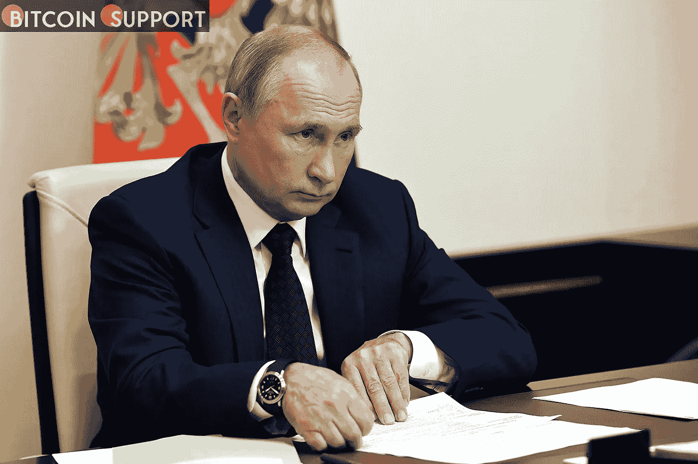
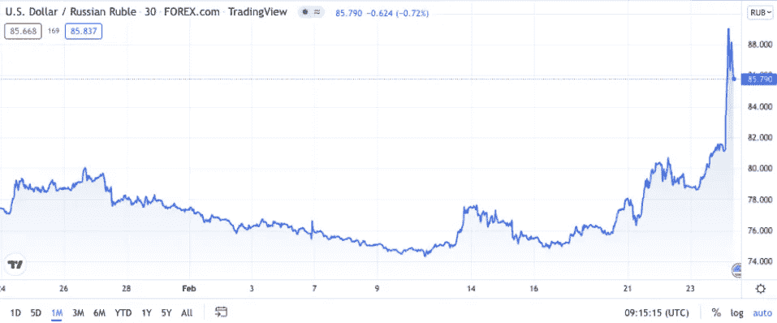

# 官方消息:如果制裁过于严厉，俄罗斯将没收零售存款

> 原文：<https://medium.com/coinmonks/russia-will-seize-retail-deposits-if-sanctions-are-imposed-too-harshly-official-c69b1399f1ca?source=collection_archive---------18----------------------->

[**https://bitcoinsupports.com/**](https://bitcoinsupports.com/)

俄罗斯最大的银行俄罗斯储蓄银行(Sberbank)否认就周四被列入美国制裁名单一事发表误导性声明。随着俄罗斯军队入侵乌克兰，如果西方实施严厉制裁，零售客户可能面临资金损失的风险。

据俄罗斯共产党党员、国家杜马经济政策委员会副主席尼古拉·阿雷菲耶夫(Nikolai Arefiev)称，俄罗斯的储蓄可能会因该国的制裁而被没收。如果西方国家决定禁止俄罗斯的所有外国现金，阿雷菲耶夫周一在接受当地新闻机构 NEWS.ru 采访时表示，俄罗斯政府可能会收集价值约 60 万亿卢布(7500 亿美元)的个人账户。这位官员说，“如果所有外国资金都被封锁，政府将别无选择，只能没收所有人的存款，或 60 万亿卢布，以应对危机，”他指出，俄罗斯在海外有 6400 亿美元的黄金和外汇储备。他还表示，对俄罗斯的潜在制裁包括可能与 SWIFT 断绝关系以及外汇限制。俄罗斯总统弗拉基米尔·普京宣布在乌克兰开展特别军事行动，这可能引发一系列针对俄罗斯顶级银行的制裁，包括国有的俄罗斯储蓄银行和 VTB。

据当地媒体报道，俄罗斯储蓄银行(Sberbank)周四晚间宣布被加入美国制裁名单时犯了一个错误，但后来删除了该通知，声称该公告是错误的，是由“网站崩溃”引起的。俄罗斯储蓄银行的网站声明，该银行及其所有系统都照常运行，客户和法律组织可以完全使用他们的资金和服务。警告称:“我们对环境的任何变化都做好了准备，并制定了各种方案来确保我们客户的资金、资产和利益的安全，以及我们所有职能部门的正常运作。”。俄罗斯外交部周四表示:“毫无疑问，我们将坚定地回应这些制裁，不一定是以对称的方式，但报复将是适当的，不会让美国受损。”据比特币基地前首席技术官、加密投资者巴拉吉·斯里尼瓦桑(Balaji Srinivasan)称，该部正威胁要与西方展开一场网络战:

[【https://twitter.com/balajis/status/1496780363393167365】](https://twitter.com/balajis/status/1496780363393167365)

最新消息传出之际，俄罗斯卢布兑美元汇率跌至历史低点，对于那些希望在公开市场上购买美元的人来说，指数跃升至 1 美元兑 115 卢布或更高，仅几周前才从 1 美元兑 74 卢布上涨了 35%。据当地消息人士称，俄罗斯储蓄银行周四向其客户提供了以 100 卢布购买美元的机会。

根据 CoinGecko 的数据，新事件对俄罗斯股市和加密货币市场产生了重大影响，比特币(BTC)自 2021 年 6 月以来首次暂时跌破 35000 美元。自去年 8 月以来，总市值首次跌破 1.7 万亿美元。FTX 比特币交易所首席执行官萨姆·班克曼-弗里德称，加密和股票市场的大抛售是“为战争买单”
**访问我们的网站:-**[**https://bitcoinsupports.com/**](https://bitcoinsupports.com/)

**免责声明:以上为作者观点，不应视为投资建议。读者应该自己做研究。**

> 加入 Coinmonks [电报频道](https://t.me/coincodecap)和 [Youtube 频道](https://www.youtube.com/c/coinmonks/videos)了解加密交易和投资

# 另外，阅读

*   [氹欞侊贸易评论](https://coincodecap.com/anny-trade-review) | [CoinSpot 评论](https://coincodecap.com/coinspot-review)
*   [新加坡十大最佳加密交易所](https://coincodecap.com/crypto-exchange-in-singapore) | [购买 AXS](https://coincodecap.com/buy-axs-token)
*   [投资印度的最佳加密软件](https://coincodecap.com/best-crypto-to-invest-in-india-in-2021) | [WazirX P2P](https://coincodecap.com/wazirx-p2p)
*   [7 个最佳零费用加密交换平台](https://coincodecap.com/zero-fee-crypto-exchanges)
*   [最佳网上赌场](https://coincodecap.com/best-online-casinos) | [期货交易机器人](/coinmonks/futures-trading-bots-5a282ccee3f5)
*   [分散交易所](https://coincodecap.com/what-are-decentralized-exchanges) | [比特 FIP](https://coincodecap.com/bitbns-fip) | [宾邦评论](https://coincodecap.com/bingbon-review)
*   [用信用卡购买密码的 10 个最佳地点](https://coincodecap.com/buy-crypto-with-credit-card)
*   [加拿大最佳加密交易机器人](https://coincodecap.com/5-best-crypto-trading-bots-in-canada) | [Bybit vs 币安](https://coincodecap.com/bybit-binance-moonxbt)