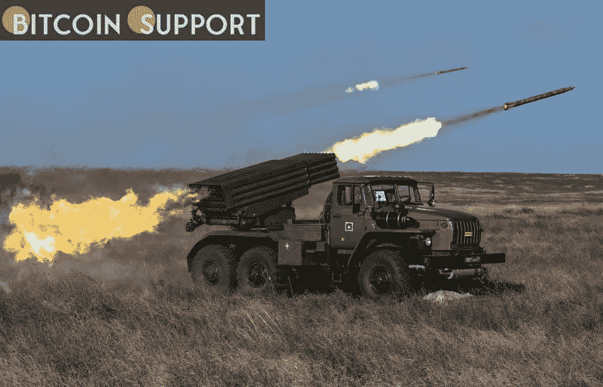

# 俄罗斯袭击乌克兰 2000 亿美元在数小时内抹去密码

> 原文：<https://medium.com/coinmonks/russian-attack-on-ukraine-200-billion-wiped-off-crypto-within-hours-f71a409b528f?source=collection_archive---------47----------------------->

**Visit our website:-** [**https://bitcoinsupports.com/**](https://bitcoinsupports.com/)

俄罗斯与乌克兰开战后，加密市场的价值在 24 小时内下跌了 2000 亿美元。现在焦点转移到西方可能对莫斯科的制裁上。这是乔·拜登所说的:“美国及其盟友将对这次袭击做出果断回应。”本周早些时候，美国及其欧洲盟友对俄罗斯实施了一些制裁，但市场认为此举是积极的，因为制裁力度非常有限。当情况变得更糟时，拜登曾表示，美国将采取更严厉的措施。

***本周的制裁针对两家俄罗斯银行、某些俄罗斯精英以及该国的债务市场。但他们避开了俄罗斯对欧洲的主要石油出口，以及任何大型银行。这个月乌克兰边境出现了很多问题。对于股票来说，这是糟糕的一周，加密市场的价值已经从本月早些时候的高点下跌了近 5000 亿美元。避险资产是唯一受益者。Stablecoins 的交通流量很大。黄金价格也上涨了。

周四，比特币跌破 35000 美元关键支撑位。大多数替代硬币都出现了两位数的跌幅。

任何来自西方的强势行动都有可能导致更多的死亡，冲突很可能是未来几天的主要故事。

***与更广泛的金融市场一样，加密货币的价格在未来几周很可能会波动，受俄罗斯-乌克兰冲突相关事件的影响很大。此外，美联储加息预计将对比特币价格构成下行压力。***

***Naeem Aslam，Avatrade 首席市场分析师***

**接下来会发生什么？在经历了大量的损失之后，市场可能会静观其变。2014 年底，以科技股为主的纳斯达克指数下跌了约 4.4%。不过之后迅速反弹。今年晚些时候，它甚至创下了年内新高。

比特币往往与美国科技股走势一致，这可能导致市场在今年晚些时候反弹。但是不断上升的通货膨胀和利率对他们来说也可能是一个大问题。*****

**访问我们的网站:**【https://bitcoinsupports.com/】

****免责声明:这些是作者的观点，不应被视为投资建议。读者应该自己做研究。****

> **加入 Coinmonks [电报频道](https://t.me/coincodecap)和 [Youtube 频道](https://www.youtube.com/c/coinmonks/videos)了解加密交易和投资**

# **另外，阅读**

*   **[顶级付费加密货币和区块链课程](https://coincodecap.com/blockchain-courses)**
*   **[MXC 交易所评论](/coinmonks/mxc-exchange-review-3af0ec1cba8c) | [Pionex vs 币安](https://coincodecap.com/pionex-vs-binance) | [Pionex 套利机器人](https://coincodecap.com/pionex-arbitrage-bot)**
*   **[如何在印度购买比特币？](/coinmonks/buy-bitcoin-in-india-feb50ddfef94) | [WazirX 审查](/coinmonks/wazirx-review-5c811b074f5b)**
*   **[印度的加密交易所](/coinmonks/bitcoin-exchange-in-india-7f1fe79715c9) | [比特币储蓄账户](/coinmonks/bitcoin-savings-account-e65b13f92451)**
*   **[Cloudbet 赌场评论](https://coincodecap.com/cloudbet-casino-review) | [点火赌场评论](https://coincodecap.com/ignition-casino-review)**
*   **[币安收费](/coinmonks/binance-fees-8588ec17965) | [僵尸加密审查](/coinmonks/botcrypto-review-2021-build-your-own-trading-bot-coincodecap-6b8332d736c7) | [热点审查](/coinmonks/hotbit-review-cd5bec41dafb)**
*   **[my constant Review](https://coincodecap.com/myconstant-review)|[8 款最佳摇摆交易机器人](https://coincodecap.com/best-swing-trading-bots)**
*   **[我的加密副本交易经历](/coinmonks/my-experience-with-crypto-copy-trading-d6feb2ce3ac5) | [AAX 交易所评论](/coinmonks/aax-exchange-review-2021-67c5ea09330c)**