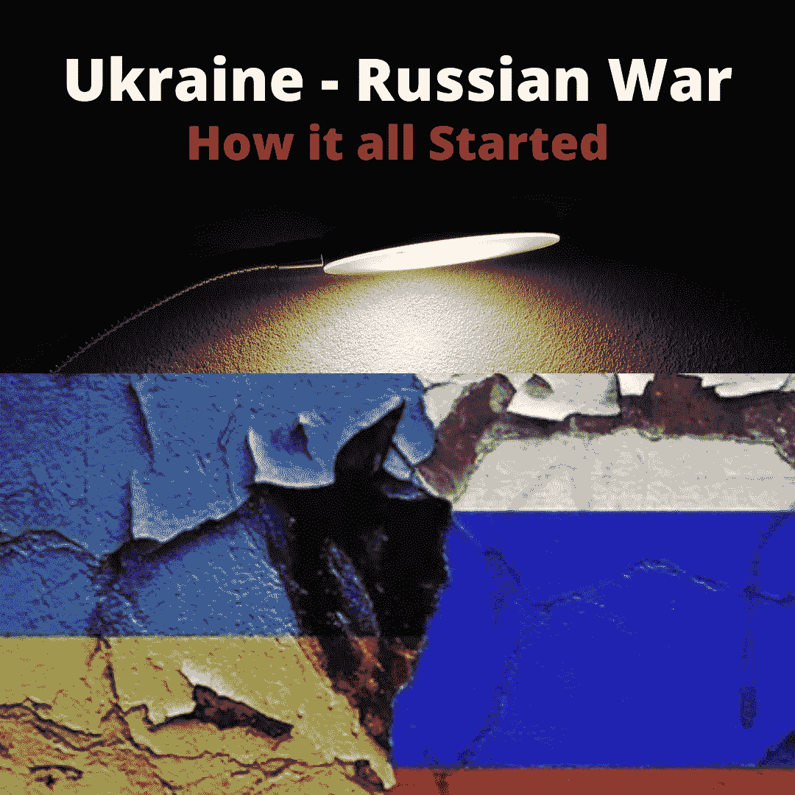

# 俄乌战争“这一切是如何开始的”。

> 原文：<https://medium.com/coinmonks/russian-ukraine-war-how-it-all-started-40ca58b93b76?source=collection_archive---------35----------------------->

在 9 世纪，有一个叫基辅罗斯的地方，它是斯拉夫人的家园，也是基辅的首都。俄罗斯人和乌克兰人都从这个斯拉夫国家汲取了血统。但在接下来的几个世纪里，许多事情都发生了变化，对弗拉基米尔·普京来说，乌克兰处于俄罗斯的统治之下。它拥有国防工业、大片农田和大量核武库。冷战期间，乌克兰是美国的主要对手。

1991 年苏联解体，乌克兰和俄罗斯独立。乌克兰继承了大部分核武库，但在 1994 年将其交给俄罗斯，作为交换，莫斯科保证乌克兰的安全，并承诺尊重他们国家的主权..他们和这些国家一起签署了布达佩斯备忘录:白俄罗斯，哈萨克斯坦，美国，英国。

快进到 2013 年 11 月，维克多·亚努科维奇(Viktor Yanukovych)是乌克兰总统，以专横、腐败以及最重要的是公开支持莫斯科而闻名。

2013 年，乌克兰政府决定暂停签署欧盟-乌克兰结盟协定，而是选择与俄罗斯和欧亚经济联盟建立更密切的关系，并向俄罗斯收取了 150 亿美元的佣金。这引发了一场要求乌克兰总统维克多·亚努科维奇辞职的抗议，因为许多乌克兰人觉得自己被卖给了莫斯科，所以这场抗议被贴上了#亲欧盟示威的标签。欧元，因为抗议是关于欧洲和独立广场，因为它发生在基辅独立广场。我们今天所知的独立广场是市民高呼“亚努科维奇必须下台”的地方。

在 11 月 30 日暴力驱散抗议者后，抗议活动有所增加，导致更多人加入抗议活动。俄罗斯支持亚努科维奇，而西方支持抗议者。

2014 年 1 月，亚努科维奇政府被推翻，总统被驱逐出乌克兰，但随后，他逃到了俄罗斯。在这一点上，少数人感到被剥夺了权利，而在边界的另一边，俄罗斯对失去了傀儡感到愤怒。

为了挽回局面，莫斯科吞并了克里米亚。为什么是克里米亚？克里米亚是一个半岛，位于黑海。1954 年，苏联领导人尼基塔·赫鲁晓夫(nikita khrushcuvh)将克里米亚从俄罗斯苏维埃社会主义共和国移交给乌克兰苏维埃社会主义共和国，意图是通过移交加强乌克兰和俄罗斯人民之间的兄弟关系。

1991 年乌克兰独立时，克里米亚加入了乌克兰。这个半岛被给予特别自治权。它仍然是俄罗斯军事基地的所在地，莫斯科承诺尊重克里米亚自治。

当亚努科维奇在 2014 年被乌克兰赶下台时，俄罗斯军方开始占领克里米亚的政府大楼，因此随后举行了公投。3 月 16 日，克里米亚投票决定成为俄罗斯的一部分。对普京来说，这是克里米亚的复活，但对世界其他地方来说，这是克里米亚的吞并。

焦点随后转移到了乌克兰东部，那里的俄罗斯分离主义者开始夺取领土。2014 年 7 月 17 日，一架载有 298 人的飞机被这些叛军击落，因此乌克兰军队决定驱逐他们。分离主义者开始节节败退，直到俄罗斯军队介入，入侵乌克兰东部，与叛军并肩作战。接下来是俄罗斯、乌克兰和西方之间的一系列会谈，导致了明斯克法庭。双方同意停火，撤军，乌克兰同意在叛军控制的地区举行选举。8 年过去了，明斯克法庭仍未得到执行。

乌克兰是除俄罗斯之外最大的欧洲国家。它占地 603，550 多平方公里，人口 4，400 万，国内生产总值 1，556 亿美元，人均收入 3，727 美元。

今天，乌克兰分为东部和西部。西方更欧洲化，而东方更接近俄罗斯，他们在情感和地理上有着共同的文化遗产。

在西方，大多数乌克兰人说乌克兰语，而东方人说母语俄语。在西方，俄罗斯受到怀疑，而在东方，由于共同的历史和遗产，俄罗斯被视为与乌克兰合二为一。

俄罗斯已经占领的反叛地区包括卢甘斯克和顿涅茨克，这两个地区统称为顿巴斯地区。俄罗斯将军队驻扎在乌克兰边境，只是为了确保北约停止扩张。

NATO 代表北大西洋公约组织，是一个军事联盟。以下是北约的创始国:

比利时、加拿大、丹麦、法国、冰岛、意大利、卢森堡、荷兰、挪威、葡萄牙、英国、美国。

冷战期间，希腊和土耳其于 1952 年加入，西德于 1955 年加入，西班牙于 1982 年加入。

并且在冷战后，这些国家在冷战后加入:德国(1990)、捷克、匈牙利、波兰(1999)、保加利亚、爱沙尼亚、拉脱维亚、立陶宛、罗马尼亚、斯洛伐克、斯洛文尼亚(2004)、阿尔巴尼亚、克罗地亚(2009)、黑山(2017)、北马其顿(2020)。

现在，乌克兰也想加入北约，但普京希望北约排除乌克兰和所有前主权国家。事实上，这只是故事的一半，还有很多隐藏在历史中。

还有国内政治，随着普京吞并克里米亚，他恢复了俄罗斯的超级大国形象，事实上，许多俄罗斯人认为乌克兰独立是一个错误。诚然，乌克兰曾被俄罗斯统治，他们有着共同的历史遗产，但根据殖民历史宣称乌克兰是俄罗斯的领土是错误的。过去的帝国主义不能为今天的扩张主义辩护。

现任乌克兰总统沃洛季米尔·泽伦斯基(Volodymyr Zelensky)公开批评俄罗斯，公开反对俄罗斯占领乌克兰东部，他已经成为乌克兰的脉搏。乌克兰希望保持独立于俄罗斯，但弗拉基米尔·普京希望成为复兴俄罗斯帝国主义的人，并且没有意识到世界已经发生了变化。

对此你有什么看法？你觉得故事还有另一面吗？请分享你的想法。

> 加入 Coinmonks [电报频道](https://t.me/coincodecap)和 [Youtube 频道](https://www.youtube.com/c/coinmonks/videos)了解加密交易和投资

# 另外，阅读

*   [3 商业评论](/coinmonks/3commas-review-an-excellent-crypto-trading-bot-2020-1313a58bec92) | [Pionex 评论](https://coincodecap.com/pionex-review-exchange-with-crypto-trading-bot) | [Coinrule 评论](/coinmonks/coinrule-review-2021-a-beginner-friendly-crypto-trading-bot-daf0504848ba)
*   [莱杰 vs n rave](/coinmonks/ledger-vs-ngrave-zero-7e40f0c1d694)|[莱杰 nano s vs x](/coinmonks/ledger-nano-s-vs-x-battery-hardware-price-storage-59a6663fe3b0) | [币安评论](/coinmonks/binance-review-ee10d3bf3b6e)
*   [Bybit Exchange 审查](/coinmonks/bybit-exchange-review-dbd570019b71) | [Bityard 审查](https://coincodecap.com/bityard-reivew) | [Jet-Bot 审查](https://coincodecap.com/jet-bot-review)
*   [3 commas vs crypto hopper](/coinmonks/3commas-vs-pionex-vs-cryptohopper-best-crypto-bot-6a98d2baa203)|[赚取加密利息](/coinmonks/earn-crypto-interest-b10b810fdda3)
*   最好的比特币[硬件钱包](/coinmonks/hardware-wallets-dfa1211730c6) | [BitBox02 回顾](/coinmonks/bitbox02-review-your-swiss-bitcoin-hardware-wallet-c36c88fff29)
*   [BlockFi vs 摄氏度](/coinmonks/blockfi-vs-celsius-vs-hodlnaut-8a1cc8c26630) | [Hodlnaut 审核](/coinmonks/hodlnaut-review-best-way-to-hodl-is-to-earn-interest-on-your-bitcoin-6658a8c19edf) | [KuCoin 审核](https://coincodecap.com/kucoin-review)
*   [Bitsgap 评审](/coinmonks/bitsgap-review-a-crypto-trading-bot-that-makes-easy-money-a5d88a336df2) | [Quadency 评审](/coinmonks/quadency-review-a-crypto-trading-automation-platform-3068eaa374e1) | [Bitbns 评审](/coinmonks/bitbns-review-38256a07e161)
*   [加密复制交易平台](/coinmonks/top-10-crypto-copy-trading-platforms-for-beginners-d0c37c7d698c) | [Coinmama 审核](/coinmonks/coinmama-review-ace5641bde6e)
*   [印度的加密交易所](/coinmonks/bitcoin-exchange-in-india-7f1fe79715c9) | [比特币储蓄账户](/coinmonks/bitcoin-savings-account-e65b13f92451)