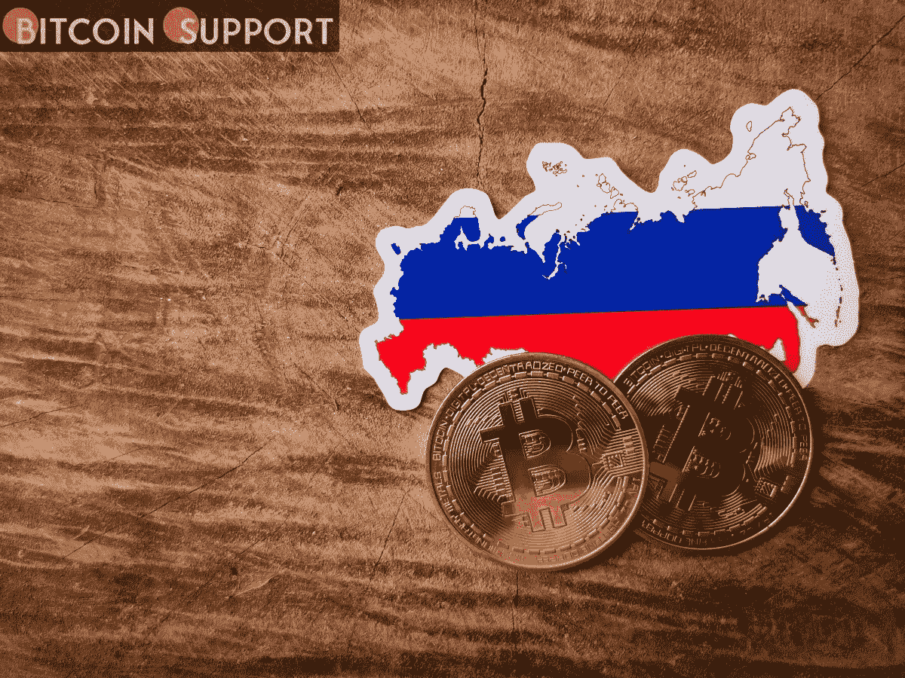

# 据总理称，俄罗斯人总共拥有 1300 亿美元的加密货币

> 原文：<https://medium.com/coinmonks/russians-collectively-own-130-billion-in-cryptocurrency-according-to-the-prime-minister-4c7cd9228358?source=collection_archive---------62----------------------->

**Visit our website:-** [**https://bitcoinsupports.com/**](https://bitcoinsupports.com/)

据报道，俄罗斯人拥有超过 1300 亿美元的比特币，但政府尚未颁布加密立法。俄罗斯总理表示，俄罗斯人拥有价值数十亿美元的比特币，但政府尚未通过该行业的立法框架。俄罗斯总理米哈伊尔·米舒斯汀周四在俄罗斯政府年度报告陈述中宣布，俄罗斯人集体拥有超过 10 万亿卢布(1300 亿美元)的比特币(BTC)等加密货币。总理没有提及这一数字的来源，只是说这是基于“不同的评估”“我们很清楚，超过 1000 万年轻人打开了加密钱包，转移了总计超过 10 万亿卢布的巨额资金。”如果准确的话，米舒斯汀目前对俄罗斯密码持有量的估计非常接近俄罗斯的黄金储备，据报道，截至 2022 年 3 月底，俄罗斯的黄金储备总额为 1400 亿美元。据白宫估计，俄罗斯的黄金储备约占央行总储备的 20%。

俄罗斯政府发布最新数据的几个月前，俄罗斯央行宣布了分析去年国内加密货币持有水平的计划。自那以后，央行估计俄罗斯每年的加密货币交易超过 50 亿美元。此外，今年早些时候，一些消息来源预测俄罗斯的加密货币持有量将达到 2140 亿美元。

[https://twitter.com/jonnytickle/status/1512021343998517248](https://twitter.com/jonnytickle/status/1512021343998517248)

尽管俄罗斯人正在迅速投资加密货币，但俄罗斯政府一直迟迟没有通过明确的法律来监管蓬勃发展的加密货币行业，几个政府机构无法就如何管理该行业达成一致。在听取了其他部委和当局的意见后，俄罗斯财政部周五向政府提交了俄罗斯加密法案的修订版。正如之前报道的那样，俄罗斯央行一直公开反对加密货币，今年早些时候，俄罗斯央行行长埃尔韦拉·纳比乌琳娜向政府施压，要求禁止比特币。随着俄罗斯成为世界上受制裁最多的国家，一些全球领导人对俄罗斯能够通过使用加密货币逃避制裁的说法提出了警告。欧盟理事会周五批准了对俄罗斯的第五套制裁措施，包括禁止向俄罗斯提供“高价值加密资产服务”。“这将有助于堵塞漏洞，”该委员会在一份官方声明中表示。据报道，本周早些时候，俄罗斯央行第一副行长 Ksenia Yudaeva 表示，在俄罗斯使用加密技术规避制裁“几乎是不可能的”，特别是在重大交易中。此前，据报道，央行表示，比特币等加密货币“实际上是一种金融传销。”

比特币行业的几位杰出领袖确信，俄罗斯人永远不会采用加密货币作为逃避制裁的手段。全球交易量最大的加密货币交易所的创始人兼首席执行官赵昌鹏周三表示，俄罗斯人无法真正利用加密货币来规避制裁。这是因为加密货币交易不是匿名的，正如他解释的那样:

**“大多数交易，尤其是大额交易，必须通过集中的交易所进行，因为分散的交易所目前缺乏足够的流动性。因此，认为比特币是匿名的观点是不正确的。比特币的匿名功能极其有限。”**

**访问我们的网站:-**[**https://bitcoinsupports.com/**](https://bitcoinsupports.com/)

**免责声明:以上为作者观点，不应视为投资建议。读者应该自己做研究。**

> 加入 Coinmonks [电报频道](https://t.me/coincodecap)和 [Youtube 频道](https://www.youtube.com/c/coinmonks/videos)了解加密交易和投资

# 另外，阅读

*   [加拿大最佳加密交易机器人](https://coincodecap.com/5-best-crypto-trading-bots-in-canada) | [库币评论](https://coincodecap.com/kucoin-review)
*   [用于 Huobi 的加密交易信号](https://coincodecap.com/huobi-crypto-trading-signals) | [HitBTC 审查](/coinmonks/hitbtc-review-c5143c5d53c2)
*   [如何在 FTX 交易所交易期货](https://coincodecap.com/ftx-futures-trading) | [OKEx vs 币安](https://coincodecap.com/okex-vs-binance)
*   [OKEx vs KuCoin](https://coincodecap.com/okex-kucoin) | [摄氏替代品](https://coincodecap.com/celsius-alternatives) | [如何购买 VeChain](https://coincodecap.com/buy-vechain)
*   [ProfitFarmers 回顾](https://coincodecap.com/profitfarmers-review) | [如何使用 Cornix Trading Bot](https://coincodecap.com/cornix-trading-bot)