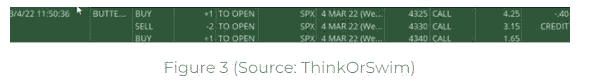

# 车辙蝴蝶 vs. SPX 蝴蝶由乔希普考什奇

> 原文：<https://medium.com/coinmonks/rut-butterfly-vs-spx-butterfly-by-josip-causic-d1dbd54a0b7?source=collection_archive---------30----------------------->

阿尔伯特·爱因斯坦曾经说过:“一切都是相对于其他事物而言的”。这句话也适用于期权。具体来说，除非我们有至少两个这样的例子，否则我们不会知道一只叫断翅蝴蝶(c . BWB)的蝴蝶是好是坏。因此，本文将着眼于 BWB 和 BWB。

第一部分:车辙

2022 年 3 月 16 日，买入“断翅蝴蝶”( c . BWB ),目的是持有它直到最后，因为知道它可能会因美联储声明引起的波动而被刺穿多次。不像特斯拉交易(点击她在超链接[www . tradewithfos . com/managing-a-tsla-options-Butterfly-payed-by-a-credit-structure](https://www.tradewithufos.com/managing-a-tsla-options-butterfly-paid-by-a-credit-structure))也是分段管理的叫断翅蝴蝶，这种 RUT 交易从开始到结束都被视为一个单一的结构。它的价值为 0.85 英镑，风险为 4.15 英镑，有可能获得 5.85 英镑。图 1 显示了这个名为“断翅蝴蝶”的活动的入场券，以及所有相关的详细信息。

然而，图表 1 显示了 3/16 美联储日的 RUT 收盘价，这也是结算价 2030.72

底线是，在到期时，拉特 c BWB 没有实现其最大利润 585。反而车辙赚了 157。到期时的 2030 多头看涨期权是在现金交易(ATM)中，价值为 72 美元，因为结算价格为 2030.72 美元，当 85 美元的信贷进入时，加上 72 美元，实现了 157 美元的利润。图 2 显示了经纪人如何以执行价格乘以 100(203，000)的价值行使 2030 看涨期权，然后以结算价格(203，072)卖出，赚取差价。

然而，SPX 上类似的“断翅蝴蝶”更有利可图，因为它更贴近自己的直觉(它的中间执行价格)。

**第二部:SPX**

SPX c BWB，放置在 3 月 4 日星期一，进入相同的意图持有它，直到到期，这可以被认为是一个日内交易。截止日期是 3 月 4 日。就我个人而言，我认为 c BWB 是一个内置保护的熊市。由于空头看涨期权的宽度比多头看涨期权的宽度宽 5 个点，因此获得了 0.40 的信用，如下图 3 所示。如果 SPX 收盘价低于最低执行价 4325，那么唯一的利润只有 40 美元。虽然 460 美元是最大风险，但最大利润可能是 540 美元。

然而，标准普尔 500 指数收盘于 4328.87 点，接近 BWB 期货价格。即肠道是 4330 售出罢工。通过拥有长 SPX 4325 调用，其内在值为 3.87(如图 4 中绿色矩形所示)。而较高的单位；长的 4340 电话和两个短的 4330 电话是超价的，已经过期没有价值了。总的来说，在交易开始时，SPX 在结算 387 美元等于 427 美元后赚了 40 美元。

总之，这两种交易的主要相似之处在于它们都是现金结算的。通过频繁交易相同的产品(如 RUT & SPX)，亲密关系得到了发展。期权交易者每天都可以在相同的报价机上使用各种各样的策略。因此，消除了对交易候选的搜索。BWB 是一种可以交易的策略，因为我们确信经纪人不会在交易的最后几分钟代表我们退出交易，即使他们是自动柜员机，只要这些交易是在现金结算的基础上进行的，如 RUT 或 SPX 等美国主要指数。

如果你有任何问题，我很乐意在 tradewithufos.com 网站上回答。你可以去[**【www.tradewithufos.com/josip】**](https://www.tradewithufos.com/josip)然后滚动到底部你会找到一个 Q & A 框。

乔希普·考什奇

> 加入 Coinmonks [电报频道](https://t.me/coincodecap)和 [Youtube 频道](https://www.youtube.com/c/coinmonks/videos)了解加密交易和投资

# 另外，阅读

*   [有哪些交易信号？](https://coincodecap.com/trading-signal) | [Bitstamp vs 比特币基地](https://coincodecap.com/bitstamp-coinbase) | [买索拉纳](https://coincodecap.com/buy-solana)
*   [ProfitFarmers 点评](https://coincodecap.com/profitfarmers-review) | [如何使用 Cornix Trading Bot](https://coincodecap.com/cornix-trading-bot)
*   [十大最佳加密货币博客](https://coincodecap.com/best-cryptocurrency-blogs) | [YouHodler 评论](https://coincodecap.com/youhodler-review)
*   [MyConstant Review](https://coincodecap.com/myconstant-review) | [8 款最佳摇摆交易机器人](https://coincodecap.com/best-swing-trading-bots)
*   [MXC 交易所评论](/coinmonks/mxc-exchange-review-3af0ec1cba8c) | [Pionex vs 币安](https://coincodecap.com/pionex-vs-binance) | [Pionex 套利机器人](https://coincodecap.com/pionex-arbitrage-bot)