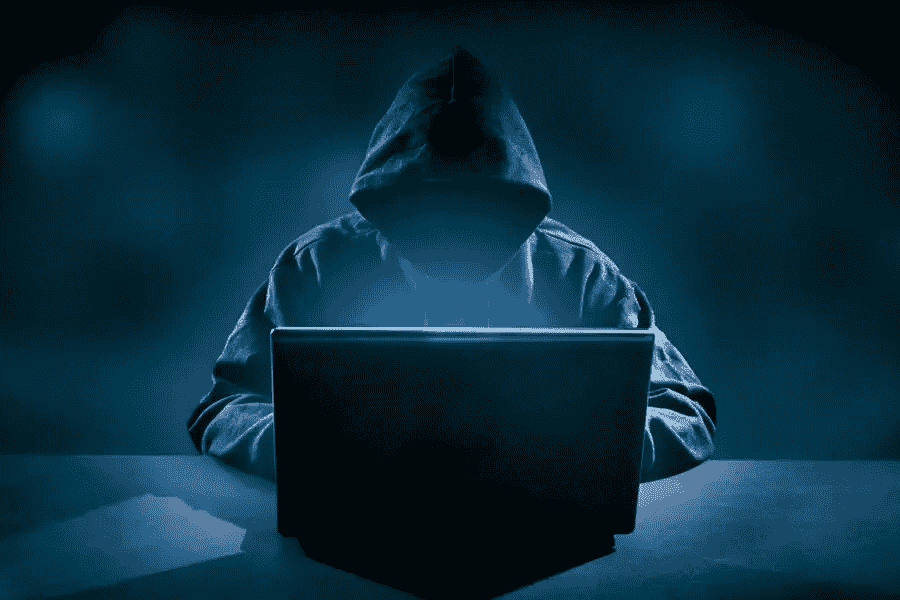

# Saddle Finance 在黑客入侵 Derev 博客中损失超过 1000 万美元

> 原文：<https://medium.com/coinmonks/saddle-finance-loses-over-10-million-in-hack-derev-blog-2ba4b5d66527?source=collection_archive---------11----------------------->

# 快速拍摄:

*   DeFi 协议公司 Saddle Finance 在最近的一次攻击中损失了 1000 万美元。
*   **BlockSec 帮助追回了 380 万美元的资金损失**。

在最近的一次黑客攻击后，Saddle Finance 损失了 1000 多万美元。这次攻击被[发现](https://twitter.com/saddlefinance/status/1520329884526170116)，并由 Saddle Finance 的开发人员在 Twitter 上传播。