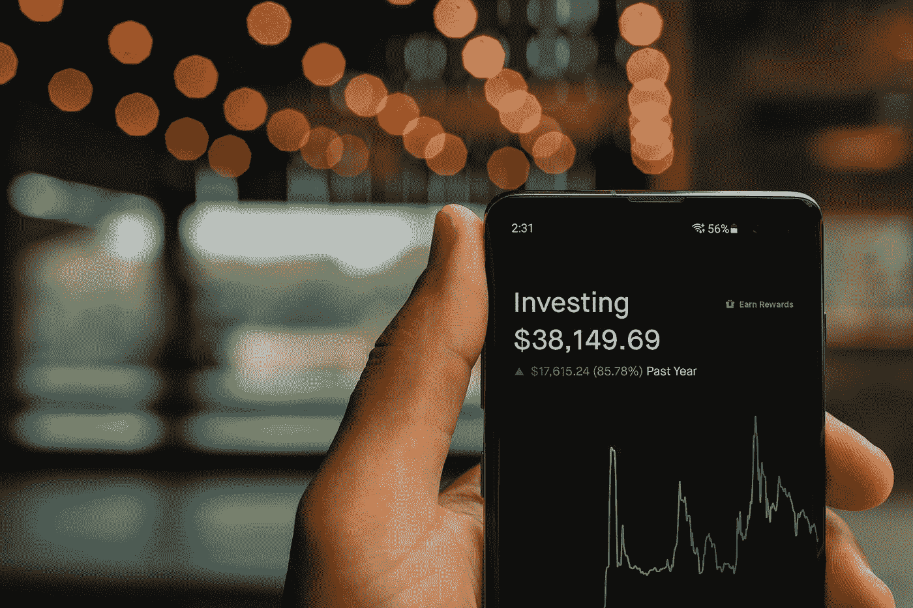

# 2022 年使用 Crypto 赚取被动收入的安全方式

> 原文：<https://medium.com/coinmonks/safe-way-to-earn-passive-income-with-crypto-in-2022-ea9e9a465f9b?source=collection_archive---------8----------------------->

Photo by [PiggyBank](https://unsplash.com/@piggybank?utm_source=medium&utm_medium=referral) on [Unsplash](https://unsplash.com?utm_source=medium&utm_medium=referral)

许多人一听到“加密”这个词，就会联想到波动性、快速获利或损失。不应该总是这样。由于区块链技术，有风险更低的投资选择，但仍能获得行业回报。

怎么会？这就是我在这篇文章中所写的。

# 为什么要选择无聊的

对于加密领域的大多数人来说，稳定币只是他们的货币在其他加密货币和法定货币之间的一种临时形式。

许多投资者想逃离美元，这就是为什么大多数人对稳定的货币不感兴趣。

然而，稳定的资本在动荡的市场中提供稳定性，同时我们可以受益于区块链生态系统的优势，如赌注、贷款、流动性池等。

# 集中还是不集中

区块链技术的主要目标是打破集中化的趋势，但你仍然可以选择你更喜欢哪一个。

有了集中的解决方案，你把你的钱交给一个机构，这个机构通过贷款和投资其他资产来管理你的钱。你还可以从分散式金融解决方案——“DeFi”中进行选择，这种解决方案由名为智能合约的自动化算法运行。

集中式解决方案的优势在于网络攻击发生时的保险和法律背景。在 DeFi 的例子中，你受益于自动化、更便宜的交易和平台费用。

# TerraUSD 赢得了比赛

增长最快的 stablecoin 项目之一是由 Terra $LUNA 区块链支持的，并遵循被称为 TerraUSD 或$UST 的美元价值。

你可能会问为什么这个项目在目前的市场上取得了成功，而几个月前，每个人都把 USDT 作为稳定币，在许多密码交易所，USDT 是主要支持的稳定币。

**2021 年。11 月**2022 年，UST 的市值为**28 亿美元**，而现在是**。4 月份是 168 亿美元。这主要是因为 USDT 是中央集权的，在过去的几个月里，许多钱包被政府冻结了。**

TerraUSD 由算法驱动，这是目前市场上最大、最先进的 stablecoin 项目。

# 锚协议和 Terra 站钱包

在 Terra 区块链最受欢迎的去中心化平台之一是 Achor 协议，我们可以将我们的 TerraUSD 押在**上，以获得平均 19.5%的 APY。**

您还可以通过流行的 LUNA 钱包(称为 Terra Station Wallet)使用该平台的赌注选项，有时交易费用甚至更低。

如果你仍然想坚持通过金融机构的集中解决方案，我会推荐 [Nexo](https://nexo.sjv.io/6bDdJQ) ，在那里你可以从你的 UST 存款中获得**13–17%**的利息*(我也在这里担任大使，所以我对他们的服务很满意)*。

# 我的策略

我根本不是理财顾问，但我认为知道自己风险承受能力的极限是很重要的。稳定的硬币赌注仍然比银行用法定货币提供的储蓄账户更有回报。

对我来说，我专注于一个 **40%** 稳定的币，和 **60%** 主动管理的密码投资组合，但这很费时间，更稳定的币总是更安全。随着年龄的增长，我有越来越多的钱，我正朝着 20-80 的比率*(众所周知的帕累托法则)*。

## 结论

当投资加密货币时，你不必以任何方式冒大风险。如果你知道自己的风险承受能力较低，那么进行稳定的投资并在晚上睡个好觉会更好，压力也会更小。

如果你不想花时间在私钥和恢复短语上，像 BlockFi、Nexo、Celsius 等集中式机构是你更好的选择。

> *加入 Coinmonks* [*电报频道*](https://t.me/coincodecap) *和* [*Youtube 频道*](https://www.youtube.com/c/coinmonks/videos) *了解加密交易和投资*

# 另外，阅读

*   [有哪些交易信号？](https://coincodecap.com/trading-signal) | [Bitstamp vs 比特币基地](https://coincodecap.com/bitstamp-coinbase) | [买索拉纳](https://coincodecap.com/buy-solana)
*   [ProfitFarmers 回顾](https://coincodecap.com/profitfarmers-review) | [如何使用 Cornix Trading Bot](https://coincodecap.com/cornix-trading-bot)
*   [十大最佳加密货币博客](https://coincodecap.com/best-cryptocurrency-blogs) | [YouHodler 评论](https://coincodecap.com/youhodler-review)
*   [my constant Review](https://coincodecap.com/myconstant-review)|[8 款最佳摇摆交易机器人](https://coincodecap.com/best-swing-trading-bots)
*   [MXC 交易所评论](/coinmonks/mxc-exchange-review-3af0ec1cba8c) | [Pionex vs 币安](https://coincodecap.com/pionex-vs-binance) | [Pionex 套利机器人](https://coincodecap.com/pionex-arbitrage-bot)