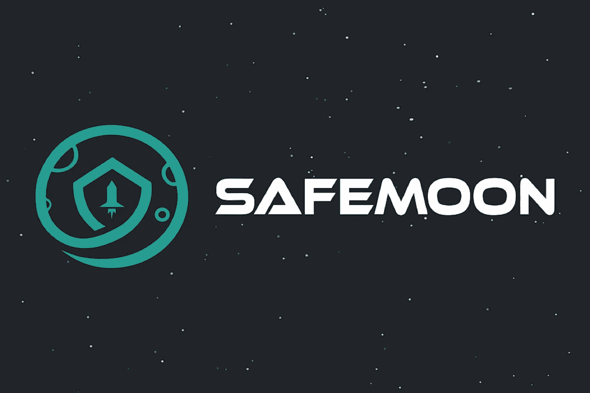

# 安全月？那是什么？

> 原文：<https://medium.com/coinmonks/safemoon-what-is-that-1d1703831150?source=collection_archive---------19----------------------->

Safemoon 是币安智能链上的令牌，而不是 Safemoon 区块链上的硬币。它没有自己的区块链技术；它的供应由币安内部区块链的智能合同管理。SafeMoon 使用基于币安智能链(BSC)的 BEP-20 令牌标准。SafeMoon crypto 是 2021 年 3 月在币安智能链区块链上创建的加密货币令牌。

SafeMoon (SFM)是一种分散式金融(DeFi)令牌，由 John Caron 于 2021 年 3 月创建，是业内的新生事物。SFM(以前称为 SAFEMOON)是币安智能链上推出的符合 BEP-20 的令牌，这是一个区块链平台，使用权威证明(PoSA)模型作为其共识机制。SafeMoon 协议与 BEP-20 SafeMoon 令牌一起工作，后者与自动流动性生成和反射令牌组学相结合。

该功能为 BEP-20 SafeMoon 令牌平台实施令牌燃烧策略，从而减少令牌的供应，以提高其价格和需求。通过这种机制，拥有令牌的粉丝可以获得静态奖励，而出售其 SAFEMOON 令牌的粉丝则不鼓励不断出售。

平台的 SafeMoon BEP-20 令牌每笔交易收取 10%的费用，所以 5%的费用在 SafeMoon 持有人之间分配，剩下的 5%费用分成两部分。交易费的其余 5%进入 PancakeSwap 的流动性池，其中 2.5%被转换为币安硬币(BNB)以提供 SafeMoon (SFM)代币流动性。其余 5%用于 Safemoon 和币安硬币(BNB)的流动性池。

如果你把你的加密钱包连接到 PancakeSwap，你可以用 Safemoon 交易币安硬币，反之亦然。您可以使用 Safemoon 在分散交易所(dex)交易其他代币，如 BSC 上的 PancakeSwap。然后，您可以使用 PancakeSwap 等 Defi 应用程序购买 Safemoon 令牌。在您的钱包中购买币安硬币(BNB ),并从 Safemoon 兑换到 PancakeSwap 等 DEX，或者直接从集中的加密交易所购买 Safemoon，并将 Safemoon 转移到您的钱包中。

如果你已经在币安智能链上有一个钱包，获得 Safemoon 就像用它交换你的分散交换(DEX)钱包(如 PancakeSwap)中的任何其他令牌一样简单。你也可以从 BitLink 这样的集中交易所购买 Safemoon，那里列出了出售的 Safemoon。Safemoon 是一种允许点对点交易的 DeFi 令牌。

SafeMoon 是一种非常不寻常的数字货币，因为 SafeMoon 会对任何试图交易其 safemoon 硬币(或“代币”)的人处以罚款。这还不足以让 SafeMoon 进入市值最高的加密货币名单，但它已经吸引了愿意参与其中的潜在投资者的注意，而 SafeMoon 尽管有销售费，但仍然很便宜。考虑到其中一种新的加密货币没有任何作用，并且未来唯一的利润预期是更多的人会继续购买，这似乎不是一项好的投资。根据 CoinMarketCap 的数据，SafeMoon 目前的总市值超过 24.9 亿美元，就市场支配地位而言，仅超过 200 美元。

SafeMoon 是最新和增长最快的加密货币之一，甚至具有讽刺意味的是，在比特币和以太坊最近创下历史新高的市场中，Dogecoin 的涨幅超过了 11，000%。SafeMoon 目前在 coinmarketcap 上排名第 202 位，市值为 29 亿美元，流通代币供应量为 585 万亿。SafeMoon 很快成为市值第三的币安代币。

自今年早些时候推出 SafeMoon 以来，SafeMoon 专家指出，该公司的 token 经历了很大的波动，5 月份达到 57 亿美元的峰值，现在不到 10 亿美元，这仍然令人印象深刻。还有。这家总部位于犹他州的公司成立不到一年，但拥有令人印象深刻的追随者:数百万用户拥有 SafeMoon 代币或硬币。根据 CoinMarketCap 的数据，SafeMoon V2 令牌目前(2 月 3 日)的交易价格约为 0.00148 美元，在加密货币名单中排名第 3010 位，市值为 9.74 亿美元。SafeMoon 收取 10%的交易费，其中 5%重新分配(或反映)给代币持有者，5%分配给代币创造者控制的钱包，称为流动性池，以创造‘硬价格’。“支架的地板和垫子”。

[来源](https://bigbraincrypto.blogspot.com/2022/02/safemoon-what-is-that.html)

> 加入 Coinmonks [电报频道](https://t.me/coincodecap)和 [Youtube 频道](https://www.youtube.com/c/coinmonks/videos)了解加密交易和投资

*   [杠杆令牌](/coinmonks/leveraged-token-3f5257808b22) | [最佳密码交易所](/coinmonks/crypto-exchange-dd2f9d6f3769) | [Paxful 点评](/coinmonks/paxful-review-4daf2354ab70)
*   [加密套利](/coinmonks/crypto-arbitrage-guide-how-to-make-money-as-a-beginner-62bfe5c868f6)指南| [如何做空比特币](/coinmonks/how-to-short-bitcoin-568a2d0b4ae5)
*   [币安期货交易](https://coincodecap.com/binance-futures-trading)|[3 commas vs Mudrex vs eToro](https://coincodecap.com/mudrex-3commas-etoro)
*   [如何购买 Monero](https://coincodecap.com/buy-monero) | [IDEX 评论](https://coincodecap.com/idex-review) | [BitKan 交易机器人](https://coincodecap.com/bitkan-trading-bot)
*   [尤霍德勒 vs 科恩洛 vs 霍德诺特](/coinmonks/youhodler-vs-coinloan-vs-hodlnaut-b1050acde55a) | [Cryptohopper vs 哈斯博特](https://coincodecap.com/cryptohopper-vs-haasbot)
*   [顶级付费加密货币和区块链课程](https://coincodecap.com/blockchain-courses)
*   [MXC 交易所评论](/coinmonks/mxc-exchange-review-3af0ec1cba8c) | [Pionex vs 币安](https://coincodecap.com/pionex-vs-binance) | [Pionex 套利机器人](https://coincodecap.com/pionex-arbitrage-bot)
*   [如何在印度购买比特币？](/coinmonks/buy-bitcoin-in-india-feb50ddfef94) | [瓦济克斯审查](/coinmonks/wazirx-review-5c811b074f5b)
*   [印度的加密交易所](/coinmonks/bitcoin-exchange-in-india-7f1fe79715c9) | [比特币储蓄账户](/coinmonks/bitcoin-savings-account-e65b13f92451)
*   [Cloudbet 赌场评论](https://coincodecap.com/cloudbet-casino-review) | [点火赌场评论](https://coincodecap.com/ignition-casino-review)
*   [币安收费](/coinmonks/binance-fees-8588ec17965) | [僵尸加密审查](/coinmonks/botcrypto-review-2021-build-your-own-trading-bot-coincodecap-6b8332d736c7) | [热点审查](/coinmonks/hotbit-review-cd5bec41dafb)
*   [my constant Review](https://coincodecap.com/myconstant-review)|[8 款最佳摇摆交易机器人](https://coincodecap.com/best-swing-trading-bots)
*   [我的加密副本交易经历](/coinmonks/my-experience-with-crypto-copy-trading-d6feb2ce3ac5) | [AAX 交易所评论](/coinmonks/aax-exchange-review-2021-67c5ea09330c)
*   [Bybit 融资融券交易](/coinmonks/bybit-margin-trading-e5071676244e) | [币安融资融券交易](/coinmonks/binance-margin-trading-c9eb5e9d2116) | [Overbit 审核](/coinmonks/overbit-review-9446ed4f2188)
*   [有哪些交易信号？](https://coincodecap.com/trading-signal) | [比特斯坦普 vs 比特币基地](https://coincodecap.com/bitstamp-coinbase)
*   [10 本关于加密的最佳书籍](https://coincodecap.com/best-crypto-books) | [英国 5 个最佳加密机器人](https://coincodecap.com/uk-trading-bots)
*   [ko only 回顾](https://coincodecap.com/koinly-review) | [Binaryx 回顾](https://coincodecap.com/binaryx-review)|[Hodlnaut vs CakeDefi](https://coincodecap.com/hodlnaut-vs-cakedefi-vs-celsius)
*   [40 个最佳电报频道](https://coincodecap.com/best-telegram-channels) | [1xBit 回顾](https://coincodecap.com/1xbit-review) | [Keevo 钱包回顾](https://coincodecap.com/keevo-wallet-review)
*   [如何在印度购买以太坊？](https://coincodecap.com/buy-ethereum-in-india) | [如何在币安购买比特币](https://coincodecap.com/buy-bitcoin-binance)
*   [在美国如何使用 BitMEX？](https://coincodecap.com/use-bitmex-in-usa) | [BitMEX 评论](https://coincodecap.com/bitmex-review) | [买入索拉纳](https://coincodecap.com/buy-solana)
*   [德国最佳加密交易所](https://coincodecap.com/crypto-exchanges-in-germany) | [Arbitrum:第二层解决方案](https://coincodecap.com/arbitrum)
*   [比诺莫评论](https://coincodecap.com/binomo-review) | [斯多葛派 vs 3Commas vs TradeSanta](https://coincodecap.com/stoic-vs-3commas-vs-tradesanta)
*   【Capital.com】|[港加密借贷平台](https://coincodecap.com/crypto-lending-hong-kong)
*   [支持卡审核](https://coincodecap.com/uphold-card-review) | [信任钱包 vs 元掩码](https://coincodecap.com/trust-wallet-vs-metamask)