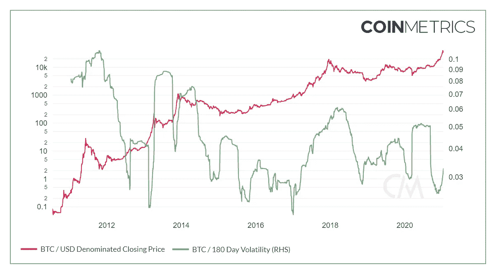
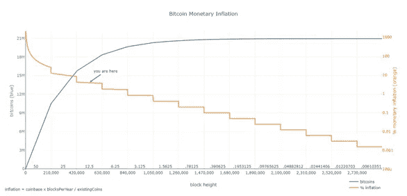
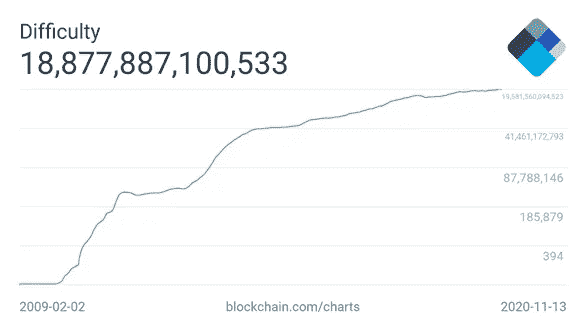
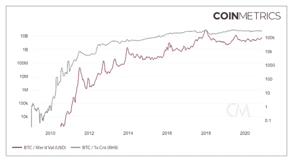
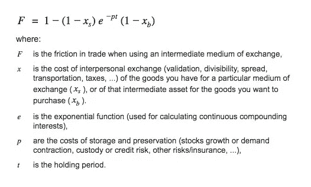

# 第 7 部分:比特币的可销售性

> 原文：<https://medium.com/coinmonks/salability-of-bitcoin-845f393ec844?source=collection_archive---------23----------------------->

这是我的系列文章的第 7 部分，我从奥地利经济学的角度来审视比特币。这一部分将研究比特币的特性，这些特性赋予了它可销售性。在这里阅读其他部分:

*第一部分:* [*奥地利经济学简介*](https://satoshibaggins.medium.com/introduction-to-austrian-economics-54adae65d38b?source=your_stories_page-------------------------------------) *第二部分:* [*货币的起源*](https://satoshibaggins.medium.com/origin-of-money-e04e756578e7) *第三部分:* [*货币的功能和性质*](https://satoshibaggins.medium.com/the-function-and-properties-of-money-975c8f52857)

*第四部分:* [*透过奥地利经济学的镜头看比特币的出现*](https://satoshibaggins.medium.com/the-emergence-of-bitcoin-through-the-lens-of-austrian-economics-36cf7bcd09ff)

*第五部分:* [*回归定理和原型货币悖论*](http://the%20regression%20theorem%20and%20proto%20money%20paradox/)

*第六部分:* [*比特币与回归定理*](https://satoshibaggins.medium.com/bitcoin-and-the-regression-theorem-2d290167ccf1) *第七部分:* [*比特币的畅销*](https://satoshibaggins.medium.com/salability-of-bitcoin-845f393ec844)

—

根据奥地利学派的理论，决定交换媒介能否成功地变成货币的是它的相对可销售性。可销售性(流动性)决定了比特币作为交易媒介的受欢迎程度，因为流动性使交易成本最小化。比特币已经是一种交易媒介，在货币市场上的竞争将严格基于其可销售性，而非来源。要推测比特币在未来的用途，找到比特币的直接使用价值没有帮助，因为这不是决定比特币从媒介到交换到常用交换媒介(即货币)的成功过渡的因素。

这一部分将通过查看[第三部分](https://satoshibaggins.medium.com/the-function-and-properties-of-money-975c8f52857)的框架来考察比特币的可销售性。由于奥地利学派的货币理论是建立在可销售性理论基础上的，所以通过同样的理论框架来考察比特币在逻辑上是一致的。此外，还介绍了一些看待适销性的新方法。这样做是因为本系列中讨论的大多数货币理论的发明时间与现代世界有很大不同。

货币的关键功能是以最小的经济牺牲促进间接交换。使交易成本最小化的财产是可销售的。畅销的概念在[第二部分](https://satoshibaggins.medium.com/origin-of-money-e04e756578e7)中解释，并且将检验比特币的畅销。这一部分可以被视为对一个问题的回答:比特币如何将间接交易的成本降至最低？

**畅销时间**

随时间推移的可销售性的基本特征是稀缺性和对存货稀释的抵抗力。根据比特币协议规则，网络上发行的比特币不会超过 2100 万枚。区块奖励，即新创造的比特币数量，每 21 万个区块就会减少一半，大约需要四年时间。这种块奖励减半一直持续到新的比特币产量为 0(大约 2140 年)。共识规则强制执行这些规则。虽然理论上有可能改变 2100 万英镑的硬性上限，但由于这一规则的共识，这是不现实的。即使比特币的需求增加，总供给也不能像其他商品一样进行调整。从负面来看，这一现实导致了高波动性。虽然仍然波动，图 1 显示波动性随着价格/市场规模的增加而降低。

**Figure 1 BTC 180-Day Volatility/BTC-USD Price (Coinmetrics 2021)**

库存稀释是指现有库存(供应)被新供应稀释的程度。供应计划是预先确定的，使其具有高度可预测性，这可能使其成为可靠的价值储存手段和记账单位。下面的图 2 显示了年度通胀率的下降，整体通胀率下降造成了明显的供应冲击(见 2012 年 11 月、2016 年 7 月和 2020 年 5 月)。

库存稀释可以用库存/流量比来量化。在《比特币标准》(The Bitcoin Standard)一书中，Saifedean Ammous 将存量/流量比率描述为衡量货币“硬度”的指标。衡量标准是新供应与现有库存的比率。它表明相对于现有库存，生产新单位的难度有多大。图 2 显示了比特币通胀率(新供应量)和已经生产的现有比特币(现有存量)之间的背离。在大约四年的时间里，每减少一半，新的供给生产(通货膨胀)就会减少一半，现有的供给增长就会减少。这说明了比特币硬度的长期可预测性，这是稀缺性的一个方面。第二面是需求，无法预测。货币的硬度可以被看作是它对新生产的阻力。

**Figure 2 BTC monetary inflation/BTC supply (BashCo)**

比特币硬度的关键组成部分是一个叫做难度调整的过程。这一过程每 2016 个区块或大约每两周发生一次。它根据网络为生成块所消耗的能量来调整生成新块的难度。如果能量很大，发现块太快，产生块的难度向上调整。当太少的能量和块产生得太慢时，确切的过程正好相反。该过程将块生产时间恢复到其 10 分钟的平均值。图 3 显示了历史难度水平，意味着更多的精力花在了生产比特币上。图 3 中表示难度的单位是平均产生成功(产生一个新块)所需的尝试次数。比特币的生产只能在非常有限的程度上加速。这使得意外或额外的库存稀释成为不可能。相反，它使得股票稀释是预先确定的。

**Figure 3 Bitcoin Difficulty 30-Day Average (Blockchain.com 2020)**

上限供给并不等同于稀缺；比特币的供给和市场总需求之间的关系使其变得稀缺。有上限的供应只是让比特币的供应能够抵御特别的股票稀释。

比特币还引入了数字稀缺性的概念。传统上，文件和图像等数字商品并不稀缺，因为它们可以很容易地被复制。使它们不可复制的尝试已经在知识产权法、版权和数字版权管理中表现出来。这些都被证明是无效的。比特币是一个突破，因为它引入了数字稀缺性，而不需要中介来验证支付的完整性，这在以前的数字支付中是不可能的。从技术上来说，比特币中的一切都可以被复制，因为它是代码，但这种复制将与网络不一致，即不再是同一网络的一部分。

比特币的供应可以用很低的成本进行审计。审核比特币的货币供应量可以通过比特币软件客户端中的一个简单命令(bitcoincli-gettxoutsetinfo)独立完成，这使得验证供应量既便宜又快速。

按照奥地利学派的理论，另一个长期畅销的基本特征是商品的耐久性。比特币本身就是代码，代码就是数字和字母，不随时间衰减的非有形概念。另一个与比特币耐久性本身无关的问题是，耐久性强的人如何存储他们的私钥；有些人可能更喜欢把它们印在一块钢板上，而另一些人则选择把它们储存在记忆中。然而，这个问题与比特币的持久性并无内在联系。由于无形，比特币经久耐用，存储成本低。

比特币因其对共识规则变化的抵制而受到市场的重视，即其不变性。Ammous 在比特币标准书中提到，不变性源自激励结构，其中不同的网络参与者受到激励，以维护当前的共识规则。由于比特币网络的分布式本质，即便是争议不大的变革也很难实现；许多不同的敌对团体需要就可能没有被很好理解并在软件中产生错误的变更达成一致。这导致了对代码变化的厌恶。要改变被称为“比特币核心”的主要比特币软件实现，需要足够大的共识和支持，而这很难实现。

> 抱歉这样打断你的阅读！但是你想要更多但是不同的比特币内容吗？我可能有你需要的东西。
> 
> 它叫做 TLDR 比特币。
> 
> 每周我花 20 个小时看比特币新闻。每个星期天，我都会在一封 3 分钟的邮件里分享我学到的东西。
> 
> 我会一勺一勺地给你讲最好的比特币故事，还夹杂着一些堕落的幽默。
> 
> 你可以在这里订阅:[https://tldrbtc.substack.com/](https://tldrbtc.substack.com/)
> 
> 下周日见，
> 
> 巴金斯
> 
> 好吧，回到奥地利经济学

**太空可售**

影响跨空间销售的最明显的特征是商品的便携性。比特币本质上是可携带的。关于比特币，传统意义上思考便携性是没有用的。这是因为比特币不能像有形商品一样随身携带；比特币不存储在数据存储设备或软件中。比特币这些单位是分散式数据库“比特币区块链”中的条目。这些单元通过私钥控制，私钥提供数字签名来证明对单元的控制。携带这些签名，本质上是数字串的成本最低。在其原生网络上发送比特币的便携性取决于首选的结算时间。目前，一笔 1 亿美元的交易可以在比特币网络上以不到 40 美分的价格发送，并在 10 分钟内完成最终结算，这使得比特币非常便于携带。然而，如果一个人花 1 美元买一杯咖啡，并花 40 美分支付网络费用，比特币就不能被认为是非常便携的。据观察，从长期来看，比特币网络的结算层不适合小额支付，这意味着一般来说，比特币对于大额转账是可移植的。

抵制审查可以被视为对抗政治对金钱影响的一种防御机制。作为一个系统，比特币被设计成信任最小化；廉价的验证使人能够更多地信任数学和软件，而不是机构。这种设计减少了对第三方的信任，Szabo 称之为“安全漏洞”通过运行比特币软件，可以用很小的成本验证比特币。运行完全验证的比特币客户端的存储要求是 350 千兆字节，这可以在大多数计算机上实现，或者通过使用外部硬盘来实现，这些硬盘的获取成本并不高。这种低成本的可验证性使得很难向验证规则集的比特币客户端发送伪造的比特币。该特征使得能够绕过可信的第三方，将该验证外包给第三方。

比特币在网络层面上是可替代的:在网络的眼中，这些单位是无法区分的。作为一个任何人都可以看到的公共区块链，比特币在用于邪恶活动后可能会被“污染”。然而，这种污点是人类附着在比特币上的，而不是网络本身。然而，这可能会成为一个问题。将“干净的”和“肮脏的”比特币分开的做法可能会变得普遍，这可能会导致它们以折价或溢价进行交易，这取决于它们的历史和与非法使用的接近程度。然而，试图通过各种隐私技术(Samourai、Wasabi、Joinmarket)增加比特币的可替代性，旨在通过混淆公司用来分析区块链的启发式方法，并将这些信息提供给执法部门，来提高匿名性。

**通过规模销售**

理论上，比特币可以分成一亿个单位。这些单位被称为 satoshis。尽管理论上可以无限分割比特币，但在某些情况下发送最小数量的比特币是不可能的，因为网络费用会使交易不经济或在技术上无法支付。另一点需要考虑的是，当比特币最小单位的估值对于低价值交易来说变得太有价值时，目前的最小单位在技术上可以分成更小的单位。这一点以及未来潜在的可编程性使得比特币在规模上具有很高的可扩展性。

**可接受性**

各种企业和个人对比特币的接受度一直在稳步增长。2015 年有 7406 个场所接受比特币，2020 年这一数字为 18634 个场所，增长了 151.6%。图 1 显示了比特币作为支付手段在各种场合的发展。图片中的地图拍摄于 5 年前的 11 月 4 日。

这种快速增长可以部分解释为世界变得更加数字化。另一个解释是，人们越来越了解什么样的特征可以让货币媒介变得更好。当古代的原始货币被采用时，人们被这些物品所吸引，却没有关于哪些特征构成好货币的经验数据。作为一项新发明，比特币的优势在于，它是由或多或少了解货币经济学的个人创造和使用的，这可能是推动比特币快速普及的一个因素。

**Image 1 Number of venues accepting bitcoin (Coinmap 2020)**

虽然图 2 只显示了已经正式宣布接受比特币的场馆，但其他公司和个人可能会接受比特币作为他们的产品和服务。检验这一主题的其他指标是比特币网络上转移的总价值和交易计数。虽然这个指标本身并不是比特币可接受性的指标，但它可以让人们了解比特币网络上的活跃程度。图 4 显示了在比特币网络上转移的总价值的历史 30 天移动平均值。转让价值在 2017 年 12 月达到历史最高水平，此后未达到之前的 ATH(历史最高水平)，目前下降了 53.9 %。更乐观的是，交易数量保持在较好的水平，比 2017 年 12 月的 ATH 下降了 22.2 %。图 1 显示 BTC/美元价格在 2017 年 12 月也处于 ATH，表明价格和网络活动是周期性的和相关的。

Figure 4 30-day moving average transfer value in USD/ 30-day moving average transaction count (Coinmetrics 2020)

适销性是货币媒体的基础，因为它降低了交易成本。在图 5 中，摩擦可以概括为间接交换的所有成本，从获得和保存到处理一件商品。这些成本是把货币单位从 A 点送到 B 点，以及其他不太明显的成本。图 5 显示了与使用即时交易媒介或延期交易(价值储存)相关的不同成本。

**Figure 5 Transaction costs (Fernando Nieto, @fnietom)**

可销售性是促成交易成本的特征，它来源于特定的特征(参见本文)。本质上，降低交易成本的交易媒介因此变得更加畅销。

这是我的系列文章的结尾，在这里我通过奥地利经济学的镜头来审视比特币。

感谢您的阅读！

巴金斯