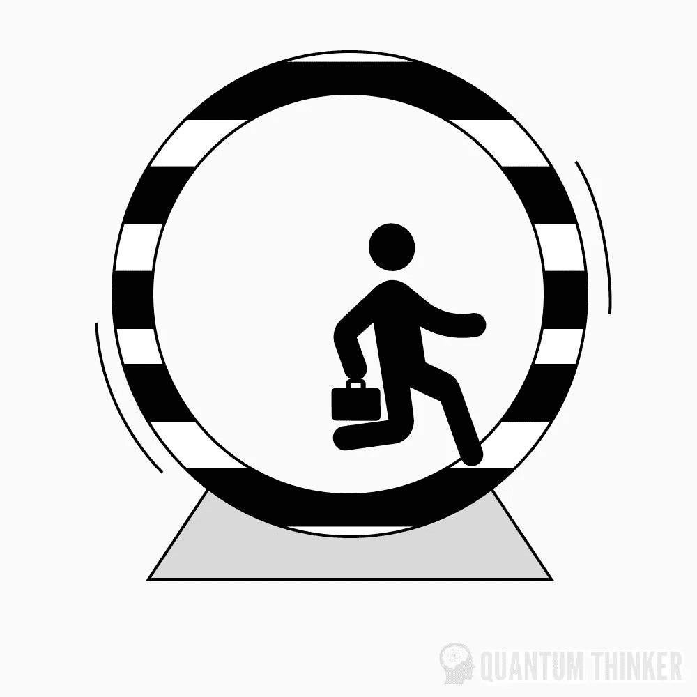
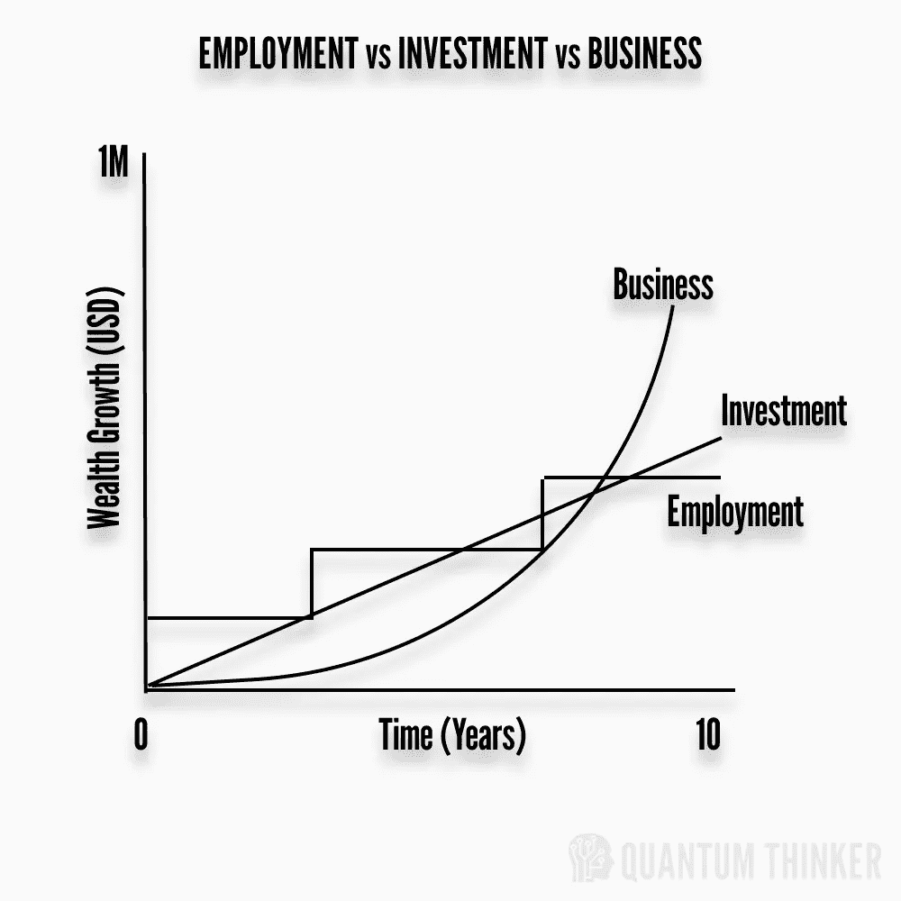
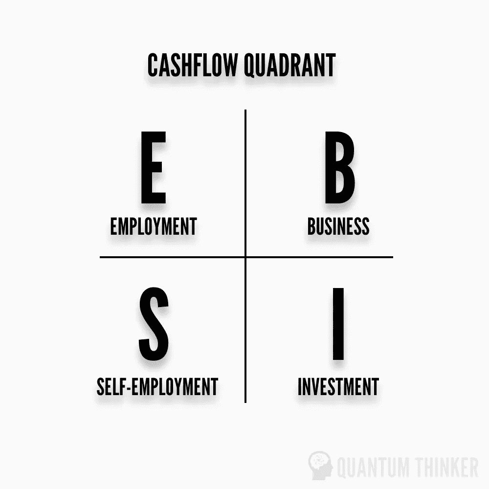
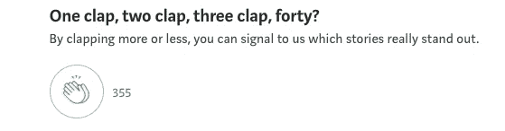

# 工资——一剂金融良药

> 原文：<https://medium.com/coinmonks/salary-a-financial-drug-a0d34feb23d?source=collection_archive---------9----------------------->

***“最有害的三种成瘾物质是海洛因、碳水化合物和一份月薪。”—尼古拉斯·纳西姆·塔勒布***

我花了很多年时间在一个成熟的大集团做全职工作(FTE ),从来没有想过钱是一种不同的毒品，直到我在一家比以前更小的公司换了一份薪水更高的新工作，才感受到压力。

当我换了一份薪水更高的工作，却没有提高我的人际交往和沟通技巧时，我开始在许多方面遭受痛苦，主要是人力方面，而不是技术方面。这些弱点从未暴露出来，因为我以前的公司由于文化、对失败的接受和资源而相当舒适。

事实上，我达到了一定的数字，作为一个成长因素出现在我的心理记分牌上。谈论它并不被广泛接受，但是很多人错误地把他们的工资作为一个精神记分牌，作为成长和繁荣的标志。这在网上被称为**【薪资陷阱】**，我称之为金融毒品。当你接受一份工作仅仅是因为薪水大幅增加，而没有努力克服你隐藏的弱点，因为稳定的文化从来没有遇到过这些弱点。

工资是一种金融毒品，因为它因金钱价值、地位和生活方式的膨胀而显得惊人，但一旦你迷上了它，就很难摆脱。持续救火和压力的阴暗面是精神压力和身体健康下降。

Corporate Hedonic Treadmill — Lifestyle Inflation

理想情况下，我应该首先根据学习潜力对机会进行排序，这在短期内是痛苦的，但从长期来看会有很大的收获。当你把重点放在学习而不是赚钱上时，它会带来满足感和成就感。相信我，在一个不断变化的数字世界里，你可能会有更多的机会。

# 为什么工资是一种金融毒品？

所以，让我们再细分一下:

*   因为你的舒适区和以某种方式处理事情的经验，这种方式在过去对每月/每周支付的固定金额有效。
*   由于缺乏精力，长时间工作或高压环境会降低你的智力。

***“工资是他们给你的让你忘记梦想的药。”—凯文·奥利里***

*   因为生活方式的膨胀，地位和炫耀文化让汽车和房产负债累累。

***“当一个人的薪水取决于他对某件事的不理解时，很难让他理解这件事。”—厄普顿·辛克莱***

*   当你继续在快乐的跑步机上奔跑，却没有意识到薪水离变穷只有一步之遥。

***“工资是为了开支。股权就是财富。”—瓦拉·阿夫沙尔***

*   失去对建设更大的事物和生活方式舒适区的关注。

***“大多数人高估了自己一年能做的事，低估了自己十年能做的事。”—比尔·盖茨***

Salary A financial drug

*   我们的服务意识如此根深蒂固，以至于从童年开始，我们就被教导要努力工作，找到一份好工作，结果却在一生中成为老练的奴隶。并不是我反对薪水，而是薪水带来的舒适泡沫和虚假的安全感是危险的。

当这些成分加入到我们根深蒂固的“安全游戏”心态中时，一种美味的有毒药剂就酿造出来了。

1.  有学校或学院教过我们理财知识吗？—不！！
2.  *我们当中有没有人灌输了企业家的思维模式，或者建立了一个收入来源，在我们不在的时候为我们赚钱？——也许很少*

这并不意味着我反对教育。事实上，接受金融教育是我们大多数人军械库中最重要的武器。

# 那怎么办呢？

这个问题有一个详细的答案，在这里不可能完全解释清楚。我可以简单地概述一下这些要点，你可以了解更多。

*   了解更多节省税款的方法
*   先买资产(升值的东西)后买负债(贬值的东西，包括汽车、衣服、家具等。)
*   不要只投资于安全的来源，比如定期存款，它会让你一年比一年穷(考虑到平均通货膨胀率，它高于存款的回报率)
*   开始投资股票市场和共同基金(确保你在投入之前读了足够多的书，并进行长期投资)
*   灌输强烈的职业道德(机不可失，时不再来)
*   磨砺你的创造技能或开发新的技能(在疫情的世界里，最伟大的职业是通过像 Youtube 这样的平台在网上创造的，这些平台每天都在各个领域产生超级明星)

***“你可以免费学到任何东西”——埃隆马斯克***

*   读书是解决你所有问题的唯一方法，无论是改变你的思维方式、发展业务、学习新技能或投资方法，还是你能想象到的任何事情。

Cashflow Quadrant by Robert Kiyosaki

每当有人问埃隆·马斯克(Elon Musk)他是如何学会建造太空旅行火箭的，这是他的三个字的回答: ***“我读书。”***

***“用勇气和智慧，而不是劳动来赚钱。”—尼古拉斯·纳西姆·塔勒布***

感谢您的阅读，在您离开之前…

> 点击“关注”加入好奇求知者的社区，获取关于金融、健康、哲学、心理学和技术的每周文章。如果您想要电子邮件更新，请单击“信封+”标志。
> 
> 在| [脸书](https://www.facebook.com/thequantumthinker) | [推特](https://twitter.com/QuantumThinker)|[insta gram](https://www.instagram.com/the_quantum_thinker/)|[LinkedIn](https://www.linkedin.com/company/quantumthinker/)|[Pinterest](https://www.pinterest.com/quantum_thinker/)|[Reddit](https://www.reddit.com/r/the_quantum_thinker/)|
> 
> 加入 Coinmonks [电报频道](https://t.me/coincodecap)和 [Youtube 频道](https://www.youtube.com/c/coinmonks/videos)了解加密交易和投资

# 另外，阅读

*   [BigONE 交易所评论](/coinmonks/bigone-exchange-review-64705d85a1d4) | [电网交易机器人](https://coincodecap.com/grid-trading)
*   [氹欞侊贸易评论](https://coincodecap.com/anny-trade-review) | [CoinSpot 评论](https://coincodecap.com/coinspot-review)
*   [新加坡十大最佳加密交易所](https://coincodecap.com/crypto-exchange-in-singapore) | [购买 AXS](https://coincodecap.com/buy-axs-token)
*   [投资印度的最佳加密软件](https://coincodecap.com/best-crypto-to-invest-in-india-in-2021) | [WazirX P2P](https://coincodecap.com/wazirx-p2p)
*   [7 个最佳零费用加密交换平台](https://coincodecap.com/zero-fee-crypto-exchanges)
*   [最佳网上赌场](https://coincodecap.com/best-online-casinos) | [期货交易机器人](/coinmonks/futures-trading-bots-5a282ccee3f5)