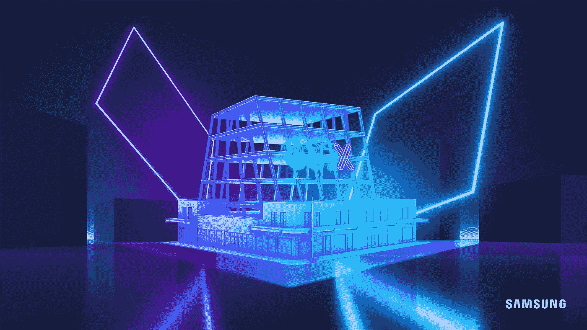

# 三星通过在分散地(马纳)开设商店进入元宇宙

> 原文：<https://medium.com/coinmonks/samsung-enters-the-metaverse-by-opening-a-store-in-decentraland-mana-11a4e619d7d5?source=collection_archive---------8----------------------->

三星正转向元宇宙，与该领域的巨头之一——分散公司(Decentraland)合作。进入虚拟世界的第一步将导致一个限时商店的开放，为用户提供非典型的数字冒险。

Samsung enters the metaverse by opening a store in Decentraland (MANA)

## 三星以分散的方式进入元宇宙