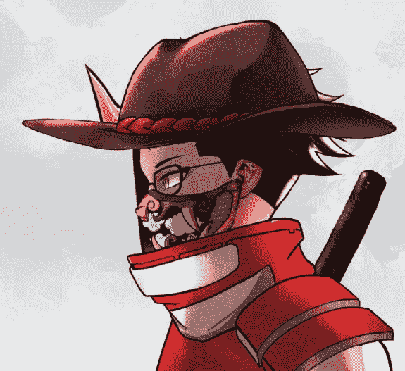
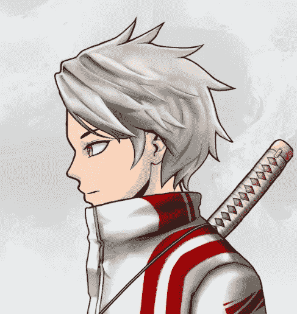
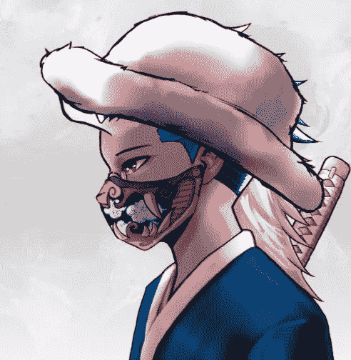
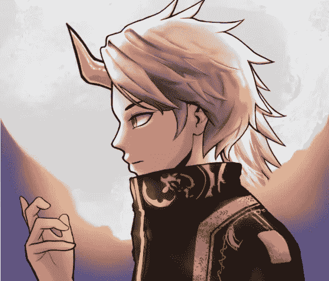
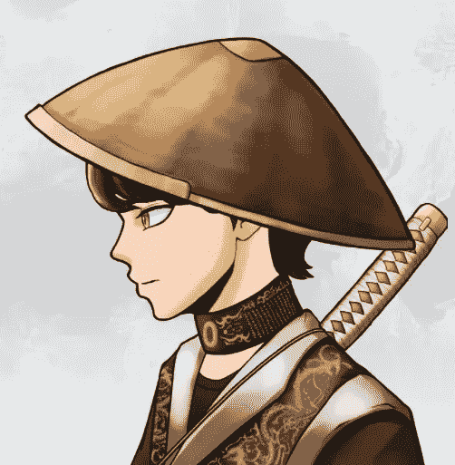

# 武士世家

> 原文：<https://medium.com/coinmonks/samurai-saga-clans-dea9eef067ad?source=collection_archive---------81----------------------->

武士传奇是另一个由 VRMETA 开发的元宇宙游戏。武士传奇最重要的方面是它将我们独特的 NFT 整合到游戏本身。武士传奇在我们的 steam 游戏中是一个开放世界的 RPG，在我们的手游中是一个塔防风格的地牢爬虫。

武士传奇的 NFT 充满了多样性。不仅帽子、背景、服装、面部特征和发型不同，而且每个武士的元数据还包括 5 个氏族之一的成员资格！每个部落都有特殊的能力和特质，如下所述:

Saorong

萨绒——萨绒族一直与居住在萨绒地区的彝族人生活在一起。绍荣门的武士拥有一种类似奥尼斯的超自然力量。

Saorong 是武士传奇中天生的战士。他们的难度很低，并且对敌人造成冲击波伤害。

Hinata

**希纳塔**——希纳塔家族以他们能够在剑的末端使用风的力量而闻名。他们非常敏捷，行动时几乎没有声音，是其他氏族的武士中最令人畏惧的。

Hinatas 是武士传奇中的刺客。他们的难度很高，而且会造成风伤害。

Baumes

**波美斯**——第一个探索黑魔法的部落。自从整个氏族决定转入地下并建立他们自己的地下城市以来，人们对他们知之甚少。

鲍梅斯武士以他们的魔法能力而闻名。他们的难度中等，并且造成元素和动能伤害。

Oioi

Oioi——5 个部落中最富有的一个，并且建立了最文明的“王国”,活跃在海外政治和金矿开采中。扩张导致了内部冲突，老学校的武士们已经离开去建立他们自己的学院。

Oioi 武士以他们的箭术和政治技巧而闻名。它们的难度很高，伤害类型也很关键。

Kensho

剑士——探索剑术艺术的学者。他们在该地区的长期探索使剑宗家族成为最值得武士称号的武士。在现存的 14 个国王中，有 6 个来自肯肖。

剑圣是武士传奇中的圣骑士。他们是中等难度的剑客专家，对敌人造成神圣伤害。

**NFT 铸币业中宗族的作用**

你可能会想，“嗯，有五个部落，这很好。但这与智能合约有什么关系呢？我要怎么做才能得到我喜欢的氏族？”

VRMETA 计划推出武士传奇 NFT 铸币销售分 5 个阶段，每个阶段将允许最大公开拍卖铸币 2000 NFTs。销售的每一个阶段都将以氏族为特征:第一阶段是 Saorong，下一阶段是 Hinata，以此类推。因此，买家应该关注时间表，并准备好尽快出价，以确保他们从自己喜欢的部落中获得一个角色。当然也有可能从每个部落以及^U^铸造一个武士

> 加入 Coinmonks [电报频道](https://t.me/coincodecap)和 [Youtube 频道](https://www.youtube.com/c/coinmonks/videos)了解加密交易和投资

# 另外，阅读

*   [AscendEx 保证金交易](https://coincodecap.com/ascendex-margin-trading) | [Bitfinex 赌注](https://coincodecap.com/bitfinex-staking)
*   [最好的卡达诺钱包](https://coincodecap.com/best-cardano-wallets) | [Bingbon 副本交易](https://coincodecap.com/bingbon-copy-trading)
*   [印度最佳 P2P 加密交易所](https://coincodecap.com/p2p-crypto-exchanges-in-india) | [柴犬钱包](https://coincodecap.com/baby-shiba-inu-wallets)
*   [8 大加密附属计划](https://coincodecap.com/crypto-affiliate-programs) | [eToro vs 比特币基地](https://coincodecap.com/etoro-vs-coinbase)
*   [最佳以太坊钱包](https://coincodecap.com/best-ethereum-wallets) | [电报上的加密货币机器人](https://coincodecap.com/telegram-crypto-bots)