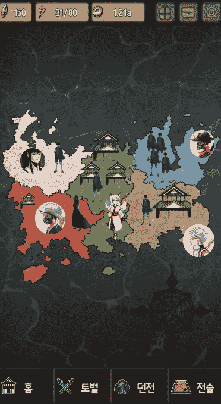
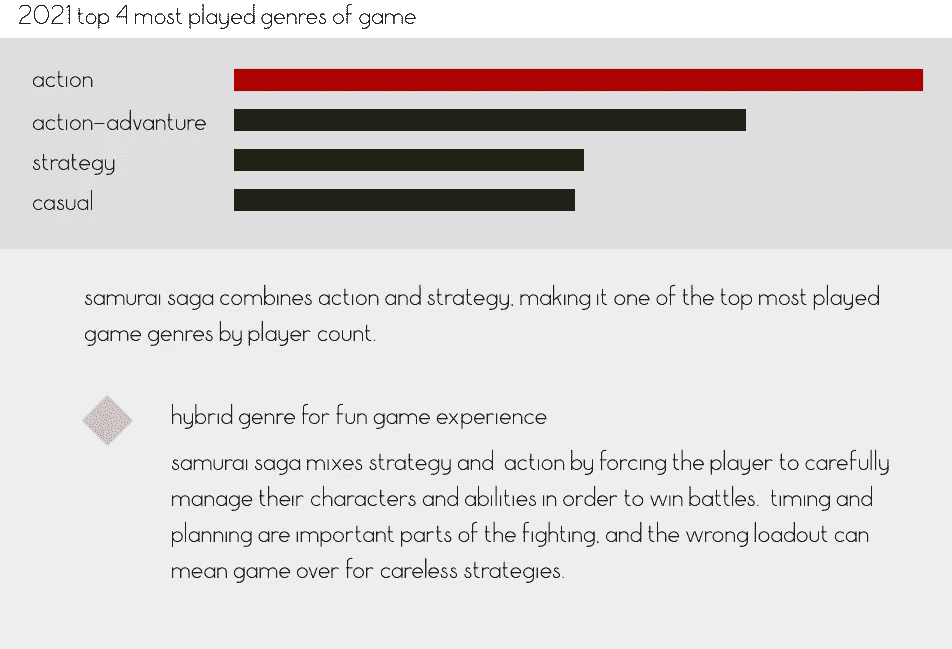
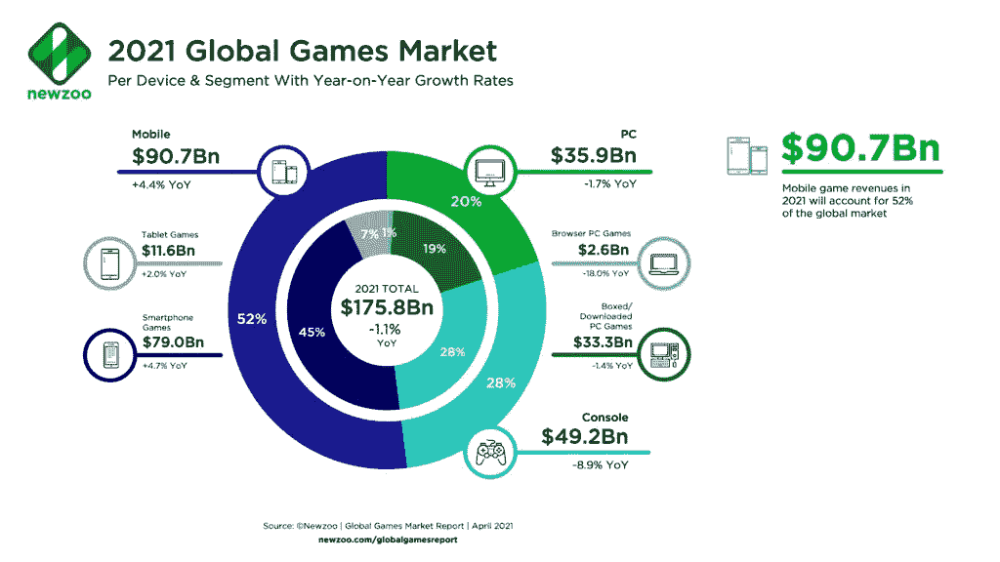
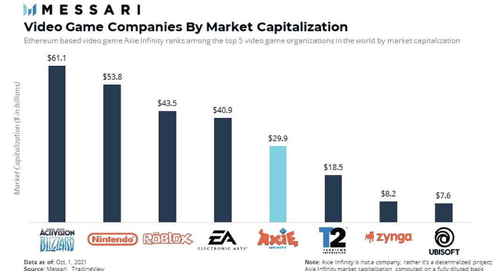
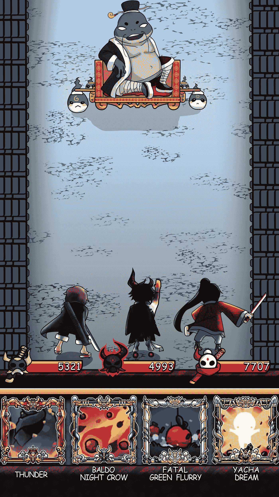
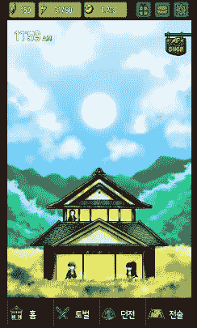

# 武士传奇:市场分析和武士传奇将繁荣的原因

> 原文：<https://medium.com/coinmonks/samurai-saga-market-analysis-and-why-samurai-saga-will-thrive-4d5f1d553004?source=collection_archive---------32----------------------->

移动游戏市场和加密货币市场都处于历史上最热的时期，并同时趋同。这种市场转换在历史上是前所未有的，它为涉足这两个市场的开发商提供了一个独特的机会。在本帖中，我们将考察 2022 年的当前游戏市场，并解释为什么武士传奇在这种环境下有蓬勃发展的潜力。

**无限的可扩展性**

《武士传奇》的背景设定在开放的幻想世界，魔法和现实主义达到了独特的平衡。我们的幻想设定为新的魔法、新类型的怪物、梦幻般的武器和盔甲留下了想象的空间。在像《武士传奇》这样的世界中，设定可以支持游戏的任何独特情况。这个设定给了武士传奇情节很大的灵活性，内战、独特的家庭斗争、新的魔法敌人等等都是可能的。

玩家将可以在故事和游戏特性方面获得源源不断的新内容。仅在手机游戏上，下一章的计划已经在进行中，第二章涉及内战，第三章涉及来自一个未被发现的大陆的外国入侵。

Example of Chapter 2 add-on (Civil War — Alpha)

未来的章节将涉及新的项目和地图。有时候会引入新的游戏模式来配合剧情。例如，第二章将以一个实时战略地图为特色，武士传奇引入了征服世界和成为国王的回合制游戏，作为我们内战版本的一部分。

**市场调查**

在 2022 年，游戏市场由可访问性和移动性定义。移动游戏市场在全球呈指数级增长，证明了这一点，该行业将成为《武士传奇》收入的重要组成部分:

全球移动游戏市场:
(2.095 亿玩家)——368.69 亿美元
中国(5.86 亿玩家)——365.40 亿美元
日本(3220 万玩家)——189.52 亿美元
韩国(1240 万玩家)——61.94 亿美元
德国(1343 万玩家)——60.12 亿美元

目前，移动游戏市场约占游戏市场的 59%,预计将继续呈指数级增长。

武士传奇将不会无法进入这样一个火热而广阔的市场。武士传奇在同时利用爆炸性的移动和加密货币/元宇宙市场方面处于独特的地位，成为任何人都可以通过移动设备访问的头号区块链元宇宙游戏。预计移动游戏市场将在中期增长，并从游戏机和 PC 游戏中夺取越来越多的市场份额。

**成熟市场:将元宇宙与移动结合**

Axie infinity 的巨大成功表明，web3 视频游戏市场尚未饱和，利润丰厚。这是由于传统游戏公司在向去中心化游戏过渡方面进展缓慢，甚至积极反对这一趋势，为新来者敞开了大门。

Axie Inifinity 的市值使其在 2021 年成为游戏巨头之一，与任天堂和 EA 等游戏巨头处于同一水平。手机游戏和加密货币都有巨大的需求，Axie Infinty 是目前唯一利用这一需求的主要项目。

武士传奇将利用这个机会，吸取 Axie Infinity 的经验教训，改进他们的模型。武士传奇将专注于玩家的愉悦性和长期用户保留，作为抓住这一成熟市场份额的两个主要因素。我们已经确定了多种原因，为什么我们对 Axie Infinity 有明显的优势，为什么武士传奇有潜力增长到更大的市场价值。

**Axie Infinity 对战武士传奇**

Axie infinity 是一款非常成功的元宇宙即玩即赚游戏。它改变了世界上许多人的生活。Axie infinity 成功的一部分——它创造了浪人区块链——也是整个元宇宙项目的最大缺陷，让它付出了沉重的代价。这种架构让 Axie infinity 的浪人桥在最近的一次黑客攻击中损失了超过 6 亿美元的加密货币。虽然这种区块链是作为以太坊的侧链开发的，以便节省交易费用并获得有趣游戏体验所需的吞吐量，但这是以安全性为代价的。

由于武士传奇正在索拉纳上全面开发，速度甚至比浪人更快，同时交易成本更低。这一切都没有一个有风险的链桥，所以用户的资金甚至保持安全。

除了技术优势，《武士传奇》在实际游戏性和可访问性方面也更胜一筹。Axie Infinity 的方法是让游戏越来越难进入，这要归功于他们越来越贵的 Axie 购买模式。所以早期进入的玩家可能会成为 Axie 的元宇宙的房东，通过出租 Axie 的部分所有权来滥用他们的权力，这是玩游戏所需的 NFT。他们灾难性的“奖学金”模式是为那些没有时间或精力玩游戏的玩家设计的，让它变成了一个无聊的苦差事，让别人替他们磨。从我们的立场来看，这是难以接受的；我们认为，玩家应该想玩武士传奇，因为它很有趣，而不是一个乏味的家务，而且没有人会在我们的游戏中创造一个封建农奴制的看门人。

《武士传奇》避免了这种令人望而却步的方式，它确保玩家可以一直将《武士传奇》作为一款独立游戏来玩。武士传奇系列中的武士将提供许多独特的优势和特殊的访问权限，就像在任何元宇宙一样。但这里的关键区别是，我们的 NFT 是为了增强武士传奇的元宇宙-玩家仍然可以从应用商店下载武士传奇，并玩整个游戏，而无需支付任何费用。我们把我们的社区放在第一位，而不是投资者，我们相信由于这种模式，我们的社区将对我们的 web3 功能更加开放。

**游戏核心**

《武士传奇》中的角色需要逐渐变得更强，以击败老板并完成游戏。为此，他们解锁技能点，并在武士传奇中升级。

游戏中使用的技能和法术都有自己的升级技能树。《武士传奇》中的每个角色都有独特的技能树。

玩家也可以升级基本的角色属性，比如攻击，冷却时间，法力，防御和闪避。这个升级系统可以让玩家随心所欲地发展角色。每个玩家可以有完全不同的游戏风格来满足他们的想象，并且对他们的角色有独特的好处。一些角色可以专注于 AOE(人群控制)，而另一些角色可以成为精确伤害处理者，快速干掉单个敌人。

由于武器也有自己的技能树，角色特殊化的可能性基本上是无限的。

**庄园**

开发主菜单上的庄园是每个武士的重要目标。庄园可以通过购买新故事和定制房间来升级。额外的房间可以让玩家容纳更多的角色，让玩家在游戏活动中有更多的疲劳。疲劳是让玩家战斗和执行任务的原因，它以基于时间的速率恢复。时间直接显示在菜单上，日落/月出有助于交互显示时间。玩家可以做庄园菜单上的任何事情，包括装备武器、决斗、战役任务和进入商店。

总之，我们认为《武士传奇》很有可能和《Axie Infinity》一样成功，甚至更成功。这是基于我们的市场分析和直接玩 Axie Infinity 的经验。由于我们的游戏是由一个经验丰富的专家团队作为一个独立的游戏来开发的，所以这个游戏对于任何人来说都是有趣和令人兴奋的，而不会强迫他们购买 NFTs 或 Web3。我们希望我们以玩家为先的方法能够鼓励更多的人利用我们紧凑的移动平台，将《武士传奇》作为进入区块链和 NFT 空间的门户。

你怎么想呢?请在下面留下你的评论，我们会很乐意回复你！

*   VRMETA

> 加入 Coinmonks [电报频道](https://t.me/coincodecap)和 [Youtube 频道](https://www.youtube.com/c/coinmonks/videos)了解加密交易和投资

# 另外，阅读

*   [如何开始用加密贷款赚取被动收入](https://coincodecap.com/passive-income-crypto-lending)
*   [BigONE 交易所评论](/coinmonks/bigone-exchange-review-64705d85a1d4) | [电网交易机器人](https://coincodecap.com/grid-trading)
*   [氹欞侊贸易评论](https://coincodecap.com/anny-trade-review) | [CoinSpot 评论](https://coincodecap.com/coinspot-review)
*   [新加坡十大最佳加密交易所](https://coincodecap.com/crypto-exchange-in-singapore) | [购买 AXS](https://coincodecap.com/buy-axs-token)
*   [投资印度的最佳加密软件](https://coincodecap.com/best-crypto-to-invest-in-india-in-2021) | [WazirX P2P](https://coincodecap.com/wazirx-p2p)