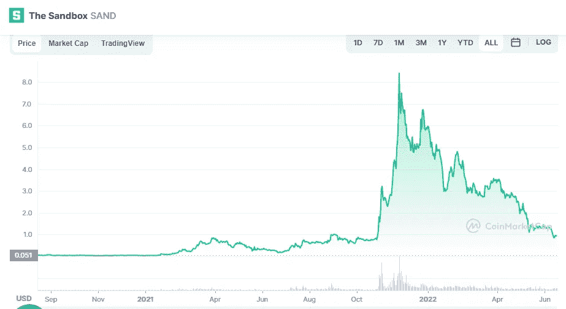

# (沙子):沙盒在六月是一个好的投资吗？

> 原文：<https://medium.com/coinmonks/sand-is-the-sandbox-a-good-investment-in-june-d3f647be1fbc?source=collection_archive---------31----------------------->

Source photo [The Sandbox price today, SAND to USD live, marketcap and chart | CoinMarketCap](https://coinmarketcap.com/currencies/the-sandbox/)

沙箱和分散的土地一样，是一个基于 DAO 的虚拟环境。据称，智能合约可能受到沙箱的支持，沙箱是基于以太坊的区块链。

然而，这两个元诗句在几个方面是不同的。虚拟加密货币被用作沙盒中的原生货币并不奇怪。多边形的第 2 层解决方案…