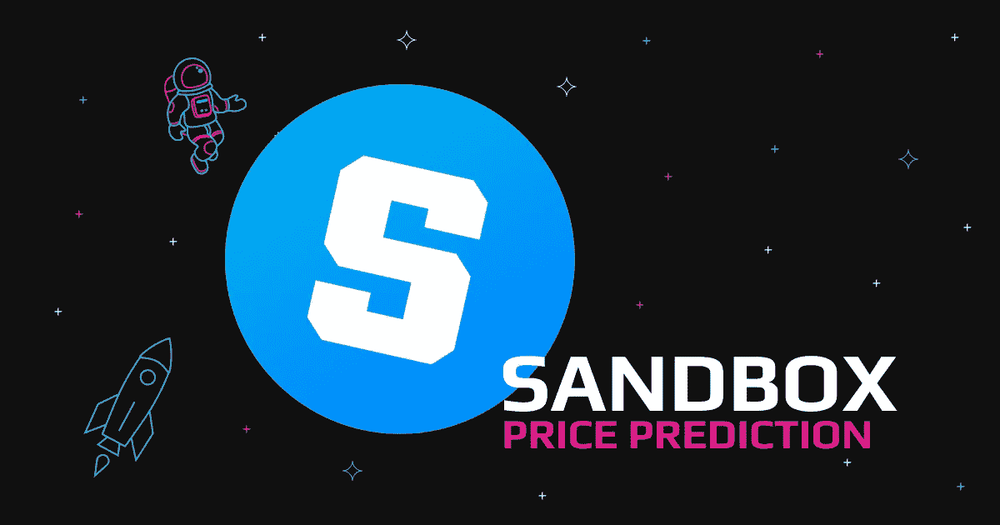
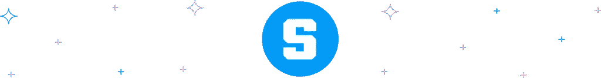
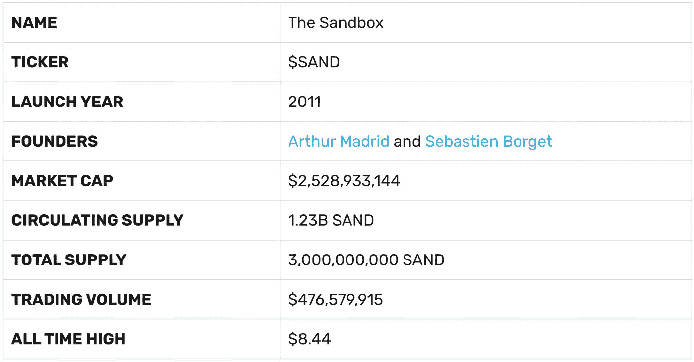
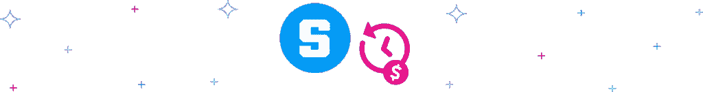
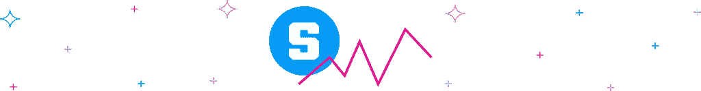
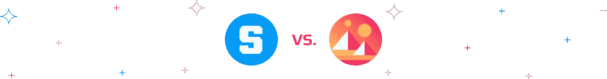
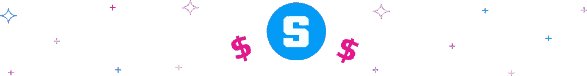

# 沙盒价格预测:是时候进入元宇宙了吗？

> 原文：<https://medium.com/coinmonks/sandbox-price-prediction-time-to-enter-the-metaverse-d9c606d5910e?source=collection_archive---------18----------------------->

随着元宇宙项目的涌现，加密空间正在嗡嗡作响，而[沙盒](https://www.sandbox.game/en/?utm_source=medium&utm_medium=blog&utm_campaign=content-marketing-&utm_content=link)就是这样一个不那么新但令人兴奋的项目。沙盒是一个虚拟世界，允许玩家在以太坊区块链网络中构建、拥有甚至货币化他们的游戏体验。

在成为元宇宙项目之前，沙盒因其两款热门手机游戏而闻名，分别是 2011 年的沙盒和 2016 年的沙盒进化。这两款游戏都非常成功，在 Android 和 iOS 商店上总共获得了 4000 万次下载。

同样，其总部位于区块链的虚拟经济一直以数字为其母语，$SAND 目前的交易价格为 2.53 美元，市值为 29.3 亿美元。尽管如此，加密货币的波动性提出了未来沙盒价格会是多少的问题。

更重要的是，2022 年普遍的牛市正在削弱买家情绪，许多人认为今年可能不是加密爱好者的最佳年份。那么，沙盒的未来会是怎样的呢？它能涨到 10 美元吗？请继续阅读，找出我们预测 2022 年及以后的沙盒价格。

# 沙盒和沙币:概述

Pixowl 在 2012 年推出的 Sandbox 是一款令人兴奋的游戏，它在 3D 元宇宙环境中混合了不可替代的令牌(NFT)和区块链技术。在 2018 年之前，它是一个 web2 平台，当时一家总部位于香港的游戏软件公司 [Animoca Brands 收购了 Pixowl](https://www.animocabrands.com/animoca-brands-acquires-pixowl) ，将沙盒融入了区块链的生态系统。

作为一个元宇宙项目，用户可以在数字房地产环境中购买土地。每一片土地都是一个 NFT，你可以在上面建造各种各样的数字建筑。在玩这个平台的游戏时，你也可以创建其他形式的 NFT，称为资产。

无论是资产还是土地，你都可以在沙盒 NFT 市场上把它们换成乙醚或沙子。

该游戏由三个集成产品组成——VoxEdit、沙盒市场和 GAME MAKER——它们协同工作，使用户能够创建用户生成内容(UGC)。他们还通过智能合同为用户提供全面和广泛的体验，同时保护他们的 UGC 的版权所有权。

作为平台的原生货币，沙币令牌为沙盒虚拟经济提供动力。用户可以通过出售资产，拥有可出租的土地，或者通过玩家拥有的土地上的游戏制造商功能创建游戏并将其货币化来获得它。

# 2021 年沙子价格预测:怎么样？

截至 2022 年 4 月 28 日，沙盒硬币价格为 2.38 美元，上涨了 1.15%，但 2021 年的沙盒价格预测是多少？虽然行业专家预计今年年底的价格约为 15 美元，但沙盒硬币的价格在 2021 年 1 月处于 0.040 美元的最低水平。

专家建议，这是投资者囤积硬币的最佳时机。虽然花了一段时间，但在 2021 年 11 月 25 日，沙币价格设法反弹至 8.4 美元的历史高点。这是从 0.04 美元飙升超过 24，000%。

# 沙盒为什么涨了？

分析师和普通加密投资者都对“沙盒为什么上涨”这个问题感到好奇，试图提供某种沙盒价格预测。首先，基于以太坊的沙盒在去年 3 月达到第一个高峰，几个月后以太坊触及 5 月份的高价。

虽然它还没有恢复到 8.4 美元的历史高点，但我们可以将最近沙币价格的上涨归因于有报道称 [Animoca Brands 希望从新老投资者那里筹集 4 亿美元](https://finance.yahoo.com/news/softbank-backed-sandbox-said-seek-100217370.html)。

2021 年 11 月的沙盒筹款有助于回答为什么沙盒在 Polygon Studios 和 Galaxy Interactive 等大牌投资者的帮助下达到历史新高的那个月上涨。

# 沙盒价格预测

与其他密码一样，沙盒是一种高风险的投资选择，尽管它可以提供高投资回报率(ROI)。然而，由于游戏精心设计的令牌组学、良好的用例、强大的团队支持以及热情活跃的社区，沙盒硬币价格有更高的升值概率。

密码专家和分析师可以使用技术工具来预测未来的沙盒价格，但无论如何你都应该做你的研究。下面是 2022 年到 2030 年的沙盒价格预测。

# 沙盒价格预测 2022

沙盒目前的交易价格为 2.38 美元，但专家们利用他们对 2022 年沙盒价格的预测，预测 ERC 20 元硬币将迎来积极的一年。Wallet Investor 的分析师预测 Sand crypto 价格将迎来牛市，预计年底将达到 6.258 美元。然而，其他人预测沙盒将达到 10 美元至 15 美元之间的历史新高。

# 沙盒价格预测 2025

到 2024 年，世界将见证另一个比特币减半，这将限制新硬币的供应，并在需求保持高水平的情况下增加价格的上涨。所有加密货币都会受到影响比特币的重大事件的影响，因此这可能会使沙盒在 2025 年积极回升。

除此之外，不断增长的用户群、更多的合作伙伴和土地销售让专家们将 2025 年的沙盒价格预测保持在 25 美元的高位。

钱包投资者预计沙币价格将在年底达到 17.456 美元，而[交易野兽](https://tradingbeasts.com/price-prediction/the-sandbox)持有 4.11914 美元的看跌价格情绪。他们分析中的差异表明，没有明确的沙盒价格预测，特别是因为今年显然还很遥远，市场波动可能使其向任何方向摆动。

# 沙盒价格预测 2030

随着 Snadbox 在此期间取得的普遍成功，我们预计它将成为未来十年元宇宙的主要项目之一。如果我们的预期成真，那么 2030 年的看涨沙盒价格预测是合理的。我们预计，到 2030 年，平均价格将保持在 30 美元左右，以适应不断增长的加密市场。

Wallet Investor 的其他行业分析师也预计沙盒加密价格为 28.8 美元，[价格预测](https://priceprediction.net/en/price-prediction/the-sandbox)的分析师将其价格定为 89 美元。Trading Beast 维持对 2030 年沙盒价格预测为 2.78874 美元的看跌立场。

# 沙盒价格预测 Reddit

社交媒体是一个衡量交易者情绪并根据秘密空间中正在进行的讨论得出见解的地方。Reddit 是一个拥有强大而热情的元宇宙和沙盒追随者社区的平台。

虽然他们定期做出预测，但他们的预测没有真正的技术分析或逻辑支持，他们通常纯粹是感性的。

不管这些基于情绪的预测，Reddit 等平台上的预测很重要，因为当它们像病毒一样传播时，它们能够推动市场价格向两个方向发展。总的来说，Reddit 上的沙盒价格预测是乐观的，[一些用户相信](https://www.reddit.com/r/TheSandboxGaming/comments/r655pc/sand_price_predictions/)在 2022 年底之前，一个 ETH 可以卖到 75 到 150 美元。

# 法力与沙子价格预测

$MANA 是分散之地的本地加密令牌，像沙子一样建造在以太坊区块链上，持有者可以用它来买卖 NFT 和虚拟资产。截至本文撰写之时，MANA 目前下跌了 4.15%，交易价格为 1.72 美元。

加密货币专家预测，2022 年底至 2023 年初，MANA 的平均价格将为 4.9 美元。一些人认为法力将在 2025 年达到 10.8 美元，而桑德的范围是 17.456 美元和 25 美元。然而，到 2030 年，法力与沙子的价格预测可能分别为 89 美元和 28.8 美元。

# 沙盒会达到 10 美元吗？

沙盒加密是一个有许多用例的令牌，但沙盒能达到 10 美元吗？随着沙地生态系统的升级，新的合作关系和发展，达到 10 美元是非常可行的。

此外，根据目前的看涨趋势，在去年 11 月几乎越过 9 美元大关后，沙子可能会在很短时间内持续升值到新的历史高点。它只需要投资者相信，在 2022 年及以后，这是一项良好而坚实的投资。

# 哪里可以买到沙盒加密？

有了 [Swapzone](https://swapzone.io/exchange/btc/sand) ，你可以用 700 多种密码以市场上最低的价格兑换美元。前往该网站，浏览即时加密货币兑换提供商的综合列表，并查看他们的速度、报价和汇率。按照以下步骤交换沙盒加密:

1.  在发送部分选择 SAND。
2.  输入您希望交换的金额。
3.  接下来，在“Get Up To”部分选择您想要的加密货币。
4.  选择一个交换条件。
5.  填写您的钱包地址以接收您交换的密码。
6.  发送您的沙子存款到一个生成的地址。
7.  接收您的加密货币

> 加入 Coinmonks [电报频道](https://t.me/coincodecap)和 [Youtube 频道](https://www.youtube.com/c/coinmonks/videos)了解加密交易和投资

# 另外，阅读

*   [CryptoHopper 替代品](/coinmonks/cryptohopper-alternatives-d67287b16d27) | [HitBTC 审查](/coinmonks/hitbtc-review-c5143c5d53c2)
*   [CBET 评论](https://coincodecap.com/cbet-casino-review) | [库科恩 vs 比特币基地](https://coincodecap.com/kucoin-vs-coinbase)
*   [折叠 App 审核](https://coincodecap.com/fold-app-review) | [Kucoin 交易机器人](/coinmonks/kucoin-trading-bot-automate-your-trades-8cf0ca2138e0) | [Probit 审核](https://coincodecap.com/probit-review)
*   [如何匿名购买比特币](https://coincodecap.com/buy-bitcoin-anonymously) | [比特币现金钱包](https://coincodecap.com/bitcoin-cash-wallets)
*   [币安 vs FTX](https://coincodecap.com/binance-vs-ftx) | [最佳(索尔)索拉纳钱包](https://coincodecap.com/solana-wallets)
*   [比诺莫评论](https://coincodecap.com/binomo-review) | [斯多葛派 vs 3Commas vs TradeSanta](https://coincodecap.com/stoic-vs-3commas-vs-tradesanta)