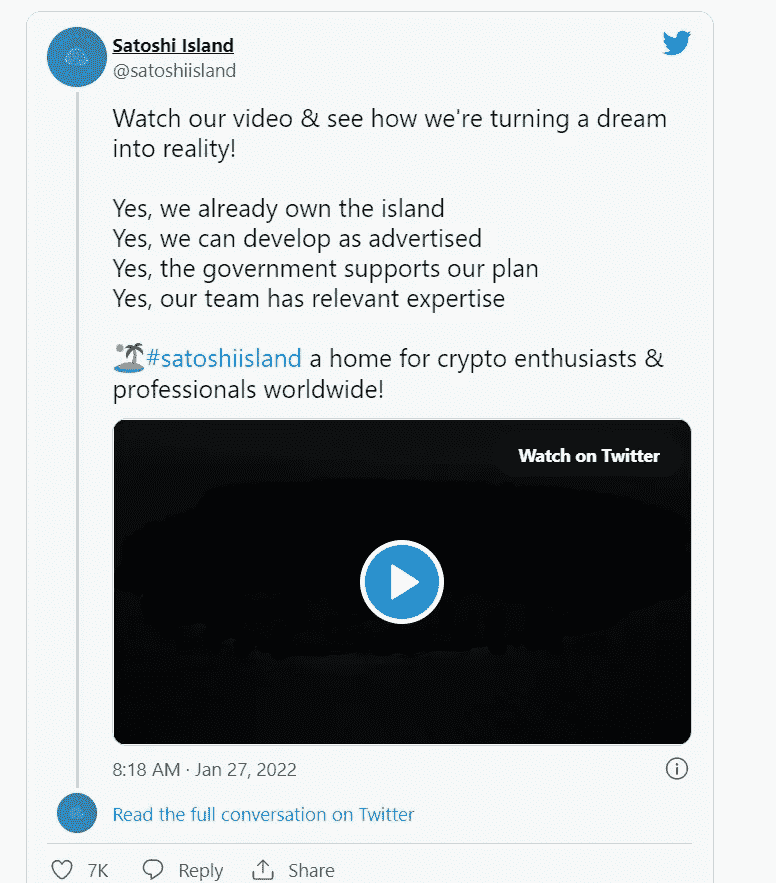
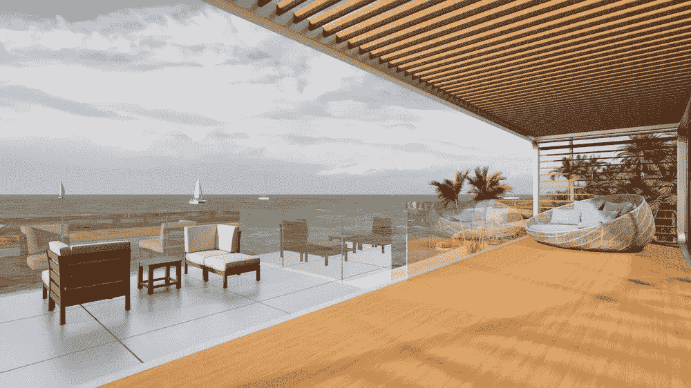
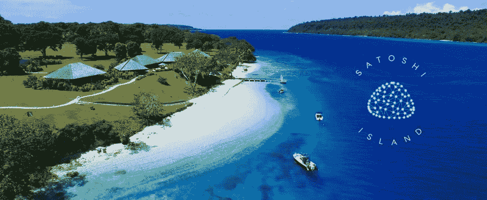
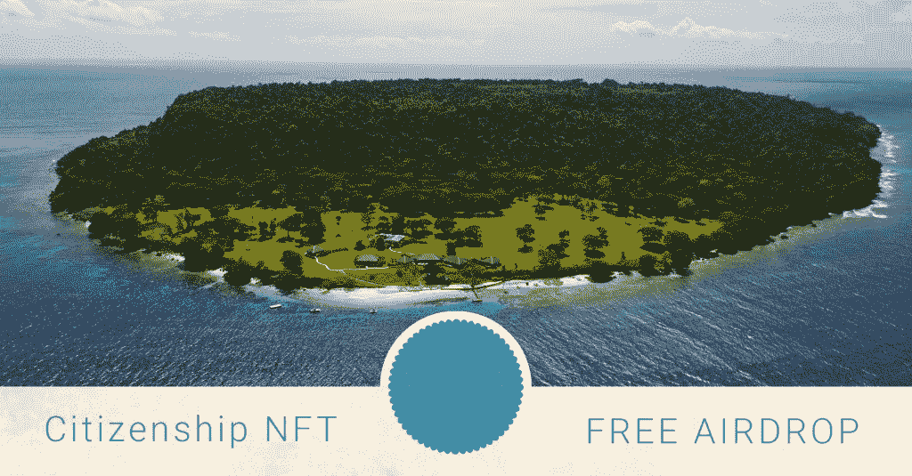

# “Satoshi 岛”加密乌托邦收到 50K 公民申请

> 原文：<https://medium.com/coinmonks/satoshi-island-crypto-utopia-receives-50k-citizenship-nft-applications-49fd551b99c8?source=collection_archive---------67----------------------->

# 佐藤岛

*故事原载于*[*https://koop 360 . com/blog/Satoshi-island-citizenship-applications/*](https://koop360.com/blog/satoshi-island-citizenship-applications/)

> *南太平洋的 Satoshi 岛以建设有史以来第一个加密首都为愿景，在加密货币领域创造了无与伦比的轰动效应。模块化房屋、可持续性、无限制的密码使用和 NFT 公民身份在这里等待着。*

一月份，有史以来第一条关于佐藤岛存在的消息浮出水面。

这是由于澳大利亚加密新闻的报道。事实证明，这个消息不是假的，也不是骗局。事实上，这个位于南太平洋的私人岛屿被越来越多的加密爱好者称为加密之家。聪岛显然是向传说中的匿名创造者比特币、**中本聪致敬。**

****

**一个由四名密码爱好者组成的团队——詹姆斯·劳、本杰明·尼禄、塔拉斯·菲拉托夫和丹尼斯·特罗亚克是开始这个别出心裁的——聪岛的策划者。也许，这个偏远岛屿最独特的地方在于它是 100%加密的。事实上，法定货币在这里是不允许的，该团队设想将其建设成一个真正的加密经济，其中 NFT 代表所有权，支付以加密方式进行。**

**关于这个岛的动机，Satoshi island group 声明“*这个岛打算全年举办活动，房子和总部加密项目，以及作为全世界加密爱好者的聚会场所。”***

**他们还进一步宣布，将来该岛可以作为一个权力下放的自治组织开展工作。**

# **佐藤岛的景象**

****

**创造 Satoshi 岛的想法来自 2017 年的牛市。最初，这个岛的概念是从一个全球的密码社区可以称之为家的地方开始的。然而，该岛实际上是在许多年后被选中的，因为必须满足各种规定。这些是**

*   **该岛需要远离隐私，但不能太远，因为这会阻碍发展。**
*   **尽管这一冒险无疑非常令人兴奋，但团队一致认为它“必须是现实的”**
*   **必须保护该岛免受气候变化和自然灾害的影响。**

**这就是为什么花了几年时间来选择一个完美的岛屿作为拍摄地点，并向公众宣布。**

# **聪岛:迄今为止的信息**

**简而言之，Satoshi Island 的团队已经设法购买了南太平洋的一个岛屿。他们已经获得了建筑许可，甚至声称收到了 50，000 NFT 或不可替代的令牌申请来获得这里的加密居民。**

**虽然该项目似乎有一种加密乌托邦的天赋，但它并不是完全无懈可击的。为了防止像 CryptoLand 或 Fyre Festival 这样的灾难性失败，该团队集中精力制定了一个有效的策略。**

**在那之后，他们已经核对了所有必要的要求和协议，以确保没有任何东西可以归因于它的失败。为了选择理想的地点，团队在全球各地寻找地点，并完成法律程序。此外，在这种情况下，付费营销被积极避免。**

# **瓦努阿图:加密岛的故乡**

****

**寻找佐藤岛的位置绝非易事。这是因为负责管理该岛的政府必须向 T2 的加密货币 T3 世界开放。此外，他们必须愿意展示创新，并发起讨论的发展密码之家。**

**经过深思熟虑和努力，该小组把重点放在一个瓦努阿图。这里的政府表示愿意继续进一步讨论。虽然该国明显缺乏旅游业和就业，但野生动物数量过多。然而，偷猎也是这里的一个主要问题。这个岛，曾经是椰子蟹的聚居地，现在已经濒临灭绝，就在购买这个地方之前。**

# **佐藤岛:位置**

****

**幸运的是，瓦努阿图政府欢迎建立这个加密岛的想法。主要目的是为这里的人们创造更多的就业机会。该团队甚至计划重新繁殖或恢复岛上日益减少的野生动物。**

**瓦努阿图政府已经向 Satoshi Island 团队发送了一封支持信，以开始使用“*最新和最伟大的可持续技术”*建造模块化住宅。这是指太阳能的使用，因为它是一种可再生能源。**

**该团队表示——“当我们与财政部长交谈时，他已经对数字经济的想法和使用区块链技术感兴趣，所以他对让我们的公司和我们行业中的许多优秀人才在瓦努阿图安家的想法感到非常兴奋。”**

# **佐藤岛开发的障碍**

**虽然在 Satoshi 岛上的房屋开发已经准备好了，但是没有一个项目是完全没有障碍的。就在去年，瓦努阿图政府通过了一项法律，规定处理加密资产的公司需要获得特别许可。负责发放这些许可证的机构是瓦努阿图金融服务委员会。在一份令人惊讶的媒体新闻稿中，瓦努阿图金融服务委员会表示，Satoshi 岛尚未获得这种许可证。**

**此外，瓦努阿图财政部长 Johnny Koanapo Rasou 宣称，围绕区块链和加密货币的政策仍然需要改进。事实上，他说——“这是一种新的做事方式，从我们的角度来看，这是瓦努阿图必须认真考虑的事情。我们需要更新立法，以便他们能够吸收加密货币的实施。”**

# ****聪岛公民****

****

**尽管全球成千上万的人都在争夺加密资本，但这并不容易。仅仅申请 NFT 居留权不足以成为该岛的永久居民。事实上，政府已经宣布，每个人在岛上获得公民身份的费用将花费**13 万美元**。之后，他们可以留在这里，享受最真实的秘密经济。计划在今年第四季度为短期访问开放一个私人场所。如果事情按计划进行，房主可以从 2023 年初开始在这里居住。此外，如果你想以另一种方式在元宇宙投资，你可以阅读这篇文章[如何在元宇宙投资:一步一步的指南。](https://koop360.com/blog/how-to-invest-in-the-metaverse/)**

> **交易新手？尝试[加密交易机器人](/coinmonks/crypto-trading-bot-c2ffce8acb2a)或[复制交易](/coinmonks/top-10-crypto-copy-trading-platforms-for-beginners-d0c37c7d698c)**