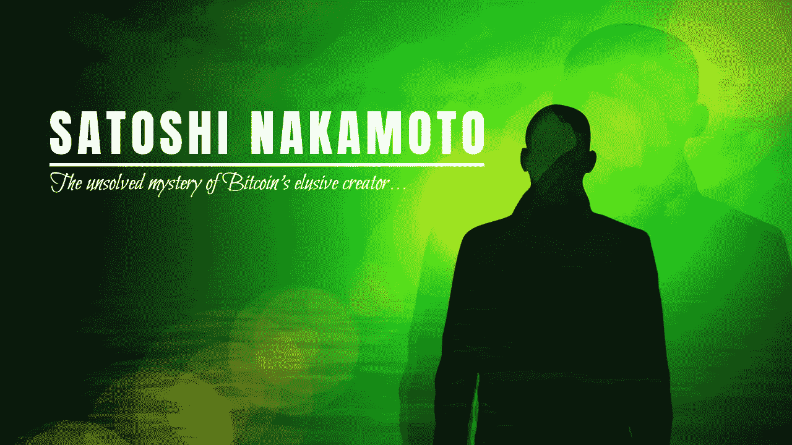
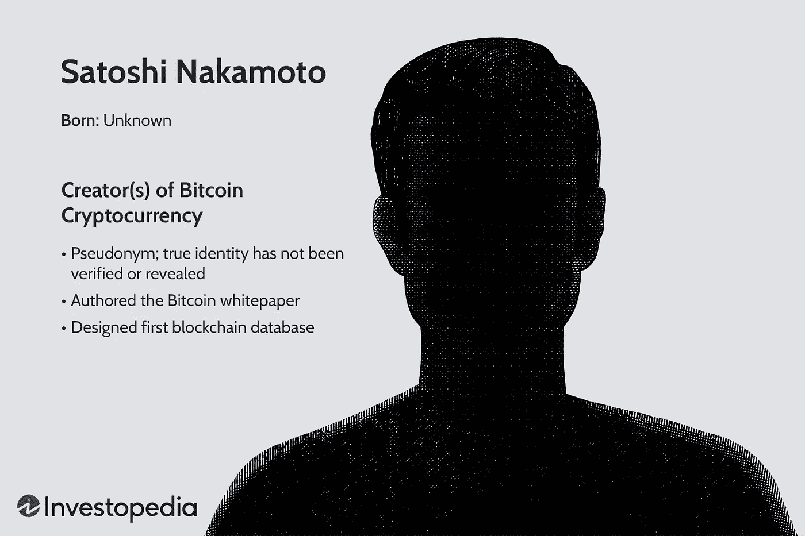

# 中本聪:揭开比特币创造者的神秘面纱

> 原文：<https://medium.com/coinmonks/satoshi-nakamoto-demystifying-the-creator-of-bitcoin-72063f28695d?source=collection_archive---------20----------------------->

Satoshi Nakamoto: The unknown genius behind one of mankind’s biggest inventions — DeFi…

比特币的创始人曾经设想过数字加密货币达到 1 万亿美元的市值吗？我们得问中本聪才知道。

一想到“Satoshi”这个名字，人们就会想到神秘——一个神话。没有人真正知道他是谁或者他们是谁。

2008/2009 年以来绞尽脑汁的常见问题包括:

是假名吗？

是一个人还是一群人？

中本聪是一个真实的人吗？

中本聪在哪里？如果不知道是谁，可能很难回答这样的人是哪里人。

**起源和来自时间的某些知识**

Image credit: Investopedia.

> *我相信在过去的一年半时间里，我在编写代码的时候已经考虑了所有这些小细节，而且有很多这样的细节。本文没有涉及功能细节，但是源代码即将发布。我把主要文件发给你了。(目前可通过请求获得，很快将发布完整版本)。*
> 
> 中本聪

上面的引用是作为交流比特币发展相关信息的电子邮件的一部分而写的。这是中本聪对詹姆斯·a·唐纳德(James A. Donald)的回应，当时后者质疑比特币作为一个万无一失的系统的确定性，他说*“这是这样一个设计的大纲和提案，这是一大进步，但魔鬼在小细节中*。”

假设并承认某个正在工作的头脑是比特币的创造者是安全的。

据信，中本聪于 2007 年开始编写比特币代码，由中本聪研究所负责。到 2008 年 10 月 31 日，他发表了一份白皮书，描述了全球知名的数字加密货币比特币，名为**“比特币:一种点对点电子现金系统”**。必须给他，这是一个精心研究的工作和命题。

> 交易新手？尝试[加密交易机器人](/coinmonks/crypto-trading-bot-c2ffce8acb2a)或[复制交易](/coinmonks/top-10-crypto-copy-trading-platforms-for-beginners-d0c37c7d698c)

随着时间的推移，中本聪成为计算机科学家和黑客等密码学爱好者熟悉的名字，这个名字来自指导比特币发展的电子邮件交流。据《华尔街日报》报道，哈尔·芬尼、尼克·萨伯、大卫·乔姆和戴伟等密码学家和开发人员花了十多年时间试图开发电子版现金。由于种种原因，他们都失败了。在项目开发的两年中，Nakamoto 通过留言板和私人邮件与开发人员交流。

在这些人中，芬尼在最初几周与中本聪远程合作，让比特币网络运行起来。随着该网络于 2009 年 1 月推出，第一笔比特币交易从中本聪转到了芬尼。到 2010 年 12 月，中本聪停止公开发帖。他还在 2011 年停止了与开发人员的交流，将项目的领导权移交给了软件开发人员加文·安德森(Gavin Andresen)。中本聪给另一名开发者的最后一封电子邮件是在 2011 年 4 月 23 日，他在邮件中说，他已经*‘转向其他事情’*，知道比特币的未来在*‘可靠的人手中’*。

**不同色调的中本聪**

在截至 2012 年的 P2P 基金会个人资料上，中本聪自称是一名居住在日本的 37 岁男性。每个人都可以自称是中本聪，或者不是每个人，因为这样的人有能力改变世界并消失。然而，收集到的证据表明，中本聪可能是声称自己身份或被赋予相同身份的四个人之一。

多里安·普伦蒂斯·中本聪——也许是谈判桌上最有发言权的人。2014 年，《新闻周刊》记者利亚·麦格拉思·古德曼(Leah Mcgrath Goodman)在发表的题为《比特币背后的面孔》(The Face Behind Bitcoin)的文章中试图揭示比特币的创造者，震惊了世界。从中本聪的数学技能、气质、日本血统和政治倾向的某些相似性来判断，她认为多里安是幕后的男人。根据古德曼的说法，他也有计算机工程背景，并参与过机密国防项目。

这篇文章将多里安与这一说法联系起来的最有力证据是，在简短的面对面采访中，古德曼问他关于比特币的问题。他回应说:“我不再参与此事，我不能讨论它。”。它已经被转交给其他人了。他们现在负责这件事。我不再有任何联系。这一表面上的承认引发了媒体的兴趣，但多里安·中本聪后来否认与比特币有任何关系，认为这句话只是古德曼的误解。采访时，他一直在谈论工程，而不是比特币。

在 P2P Foundation 上，中本聪后来在一个论坛上证实他不是多里安·中本聪——结束了谣言。

***哈尔·芬尼***——作为一名计算机科学家、程序员和密码学爱好者，芬尼甚至在比特币之前就已经倾向于创造一种数字货币。据称，他是第一个使用比特币软件、提交漏洞报告并改进该技术的人。第一笔比特币交易是在 2009 年由中本聪经手的。

福布斯记者安迪·格林伯格发现有理由相信芬尼可能是中本聪，因为他很早就参与了该软件。另一个有趣的事实是，芬尼是多里安·中本聪的邻居，他住在几个街区之外。一项写作分析咨询服务比较了两人的风格，发现了一些相似之处，这是表明芬尼就是中本聪的最后一条证据。格林伯格接着探讨了芬尼可能用多里安·中本聪的名字作为自己身份的幌子的想法。

芬尼否认了格林伯格的说法，并出示了他与中本聪的电子邮件往来以及他的比特币钱包历史的证据。在进一步检查后，写作咨询公司得出结论，所谓的中本聪给芬尼的电子邮件与前者的其他已发表的作品相匹配，因此不可能是芬尼。

芬尼可以同时作为第一笔比特币交易的发送者和接收者吗？

尼克·萨伯——一名计算机工程师、密码学家和法律学者，他发表的作品与中本聪的写作和关注的专业知识无关，萨伯被认为是创造比特币的幕后黑手。

Szabo 与密码学的关系让他为 DigiCash 工作，digi cash 是一个使用相同技术的数字支付系统。他在 1996 年的一篇题为*“智能合约:数字市场的基石”*的论文中率先提出了智能合约的概念，同时在 2008 年提出了比特黄金的概念。比特黄金被认为是一种分散的货币形式。

萨伯对比特币发展的重大贡献也是暗示他是中本聪的核心，而他们两人在通信中也提到了经济学家卡尔·门格尔。

《比特币:货币的未来》一书的作者多米尼克·弗里斯比确信中本聪和尼克·萨博是同一个人，并提供了间接证据来支持这一点。在这一切中，萨博否认了所有关于他是中本聪的指控。

***克雷格·赖特***——自称中本聪的赖特是一名澳大利亚计算机科学家和商人，他公开声称自己是创造比特币的团队的主要成员，以及中本聪这个假名背后的身份。赖特的承认在很大程度上被视为一个精心策划的计划或骗局，因为 2015 年《连线》和 Gizmodo 的两项平行调查表明，他可能发明了比特币。

赖特的证据主要取决于媒体的贡献。2016 年，英国广播公司(BBC)和《经济学人》(The Economist)发表文章称，赖特使用比特币发展早期创建的密钥对消息进行了数字签名。这些密钥与已知由中本聪创造的比特币块有着千丝万缕的联系。

安全研究员丹·卡明斯基等专家；比特币开发者杰夫·加尔齐克；乔丹·皮尔逊；洛伦佐·弗朗切斯基-比奇莱全部驳回了赖特的说法。Pearson 和 Bicchierai 特别提到，Wright 只是重复使用了 Satoshi 在 2009 年进行的比特币交易中的旧签名作为消息。

Who is Nakamoto?

**中本聪鬼魂**

中本聪的数字隐身和匿名是完美的，如果不是完美的。他使用两个电子邮件地址和一个网站来开展活动。注册他们的人的身份被封锁。无论是私人的还是公开的信息都没有显示出中本聪任何个人的一面，无论是传记还是发生在他身边的事情。全是比特币和代码。

即使有先进的技术，中本聪仍然是一个幽灵。尽管围绕他的身份存在争议，但如果用一个词来形容中本聪，那就是**、【大胆】、**。