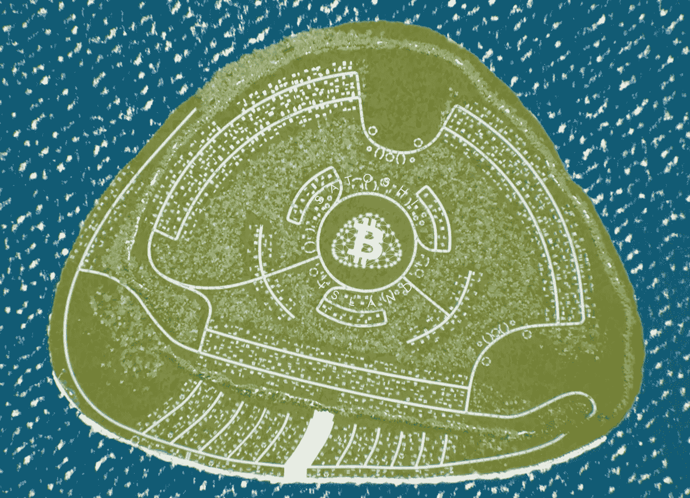
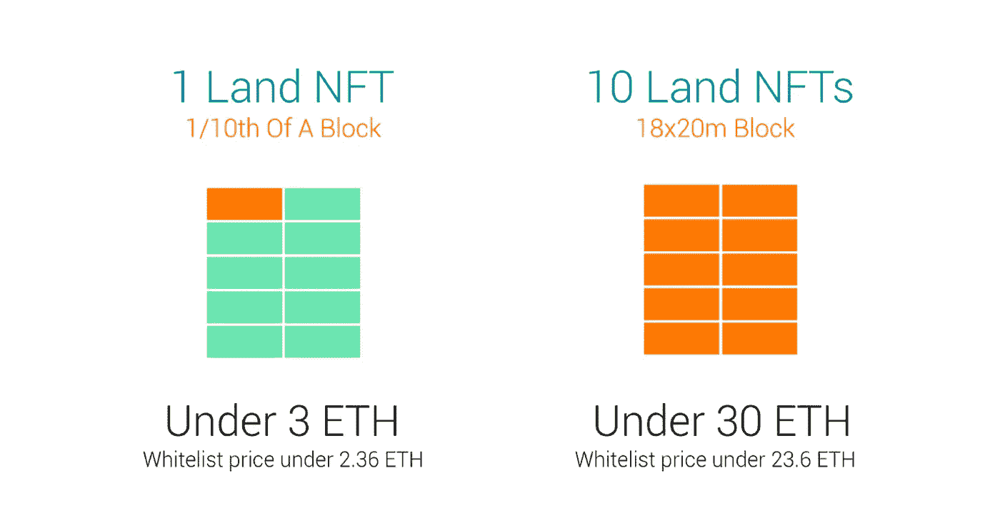
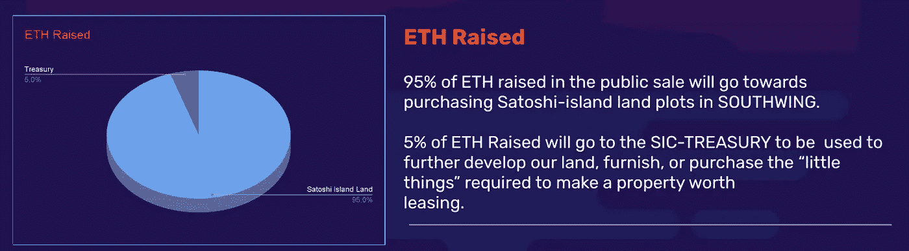
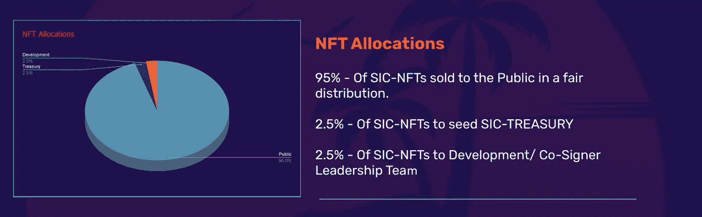
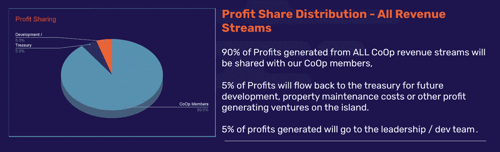
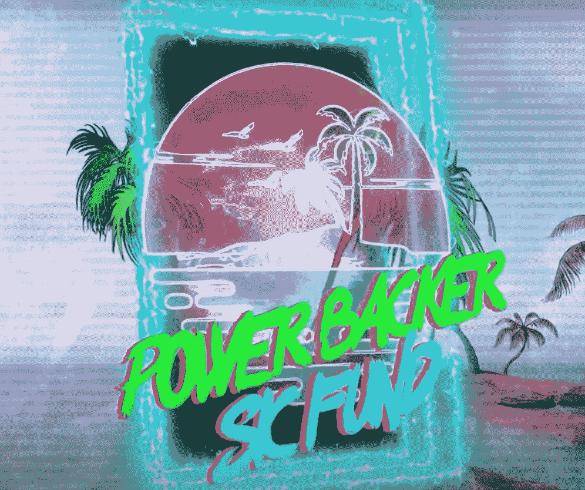
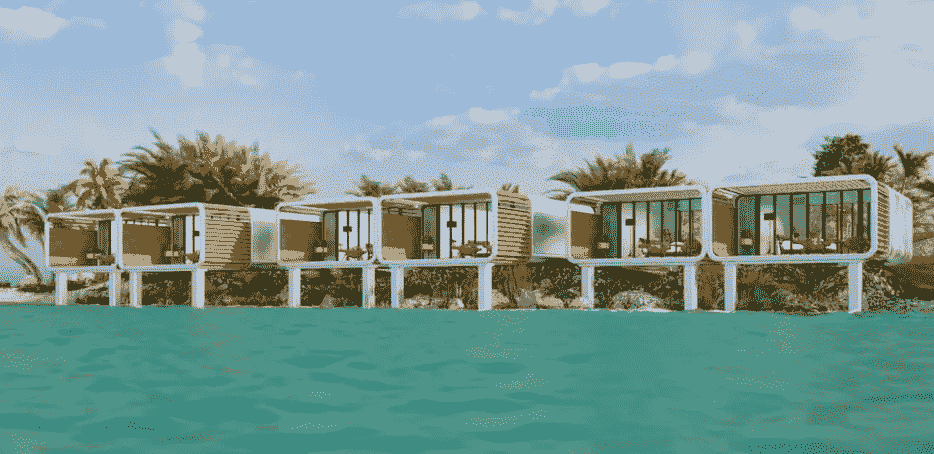
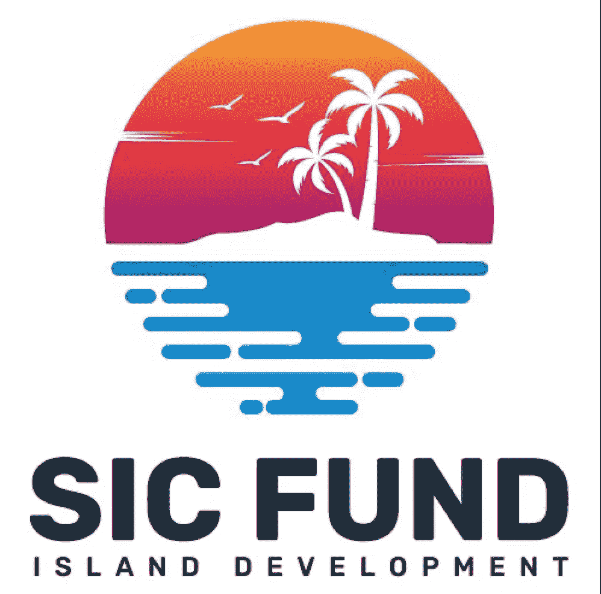

# 周六上午，SICFund 首次公开募股上线！

> 原文：<https://medium.com/coinmonks/saturday-morning-sicfund-initial-share-offering-goes-live-a84424863268?source=collection_archive---------42----------------------->

AEST 时间 23 日星期六上午 10 点(世界协调时 0 点)

[sicfund.io](https://sicfund.io)

## 现在，一切都从 AEST 时间周六上午 10 点开始，我们将推出全球首只象征化基金，致力于购买、开发和租赁真正的象征化岛屿土地。

Satoshi 岛的土地出售即将在月底，我们想在行动中！

我们的目标——尽可能多地购买岛屿土地，并与我们的合作社分享所有权。

接下来，我们聚在一起计划如何将这片土地开发成我们梦想的城堡。

从那里开始，这个想法就是通过向度假者和希望在岛上生活和工作的专业人士出租已开发的房产来创造收益资产。

那么游戏计划是什么？

# 首先，我们需要土地！很多土地！

[satoshi-island.com](https://satoshi-island.com)

理想情况下，我们希望土地处于原始的海滨位置。
然而，链家 VRF 整合确保了销售活动中的土地分配完全随机。

因此，我们获得最好土地的最佳机会是以合作的方式一起去，批量购买。

Satoshi 岛白名单土地出售 20-23ETH 每整块。

[satoshi-island.com](https://satoshi-island.com)

作为合作方，我们已经与团队讨论并实施了确保获得 12-14 个完整区块的步骤。

批量购买将增加我们的机会，在这个创世纪“南翼”阶段的岛屿释放更理想的财产，而不必支付二级市场的溢价。

周六，SICFund 的首次股票发行将于 AEST 时间上午 10 点开始，以筹集第 300 笔资金，并与我们的合作社建立联系。

## 将发行股票并代表一部分，其中—
-1 股=资产池的 0.0476%(1/2100 x 100)。

## 所筹集的 285/300 ETH 将直接用于将于月底进行的佐藤岛南翼土地拍卖。

*   剩下的 15 个 ETH 将成为 SICTreasury 的种子。

[sicfund.io](https://sicfund.io)

## 2000/2100 股将于周六公开发售。

*   50 倍的股票将成为 SICTreasury 的种子。
*   50 股股票将在 12 个月内分配给领导/开发团队。

[sicfund.io](https://sicfund.io)

## 90%的利润将与合作社分享。

*   5%的利润流入 SICTreasury。
*   5%的利润归 SIC 领导团队所有。

[sicfund.io](https:sicfund.io)

# 对于我们的电力支持者(30+分享霍德尔！)

## 任何人购买 30 股或以上的 SICFund 股票，您将获得特别的东西！

[sicfund.io](https://sicfund.io)

# 1 x 有限的权力支持者 NFT 将空投到所有持有 30 股或以上的帐户。

*   在我们的首次销售中，只有购买 30 台或 30 台以上 NFT 的用户才能获得 PowerBacker NFTs。
*   PowerBacker NFTs 提供折扣和独家优惠等福利。

## PowerBacker NFT 持有者有权直接从 SICFund 购买岛屿资产。
在任何“资产清算事件”中，待售资产将以 Opensea 公平市价的 10%折扣提供给支持者。

*   随着我们扩大岛屿业务，未来的公用事业将会到来。

# 所以，我们卖掉我们的 2000 股，购买我们的 12-14 块岛屿土地…然后呢？

## 我们获得了大宗土地，祝贺你！

这才是真正有趣的开始！

[satoshi-island.com](https://satoshi-island.com)

## 现在我们知道我们的土地位于何处，岛屿开发阶段已经开始！

Satoshi island 将发布一系列岛屿开发工具，建筑规范/总体规划将被解锁，这是我们发挥想象力的地方，我们将得到关于建造什么和在哪里建造的建议。

# 当然，我们必须为所有这些想法付出代价。那么这是怎么做到的呢？

我们有 12-14 块岛屿土地，我们可以卖掉一半来开发另一半。

或者，

我们可以保留它们，并通过一系列额外的非稀释性募集来扩大基金，从而实现它们的发展。

社区将会投票，一旦我们的土地安全了，我们可以一起决定如何进行。

但我们的目标应该是构建风险回报比稳定的收益生成型资产，让我们分享…

# 符号化的土地、文化和品牌。

## 一切可以被符号化的东西，都将被符号化。

这个岛上会有很多创造和建立关系网的机会。

通过吸引一群志同道合的加密投资者，天空是我们所能建造的极限。

## 我描绘了佐藤岛的未来，它介于专业人士的世界级目的地和太平洋的神秘迪斯尼乐园之间。

[Bored & Hungry](https://hoo.be/justborednhungry)

# 那么佐藤岛土地会像正常土地一样交易吗？土地令牌化如何影响其价格？

## 这是一个很有意思的问题！

*   瓦努阿图的土地多年来一直表现良好，随着这个避税天堂向新投资开放，未来 5 年的土地估价将会下降。
*   资产的令牌化通过释放真正的全球自由市场的力量，创造了新的估值模型。
*   令牌化允许无形资产的货币化。这就是为什么 Satoshi 岛的贸易很可能与普通的土地有很大的不同。
*   通过发行代币作为所有权的代表，并在治理中发表意见，代币化允许 Satoshi Islands 的无形资产，如其社区、文化、品牌和其他有价值的和以前不可货币化的资产价值被释放，并在其代币价格中表现为土地溢价。
*   代币是可怕的，这是一个俱乐部，大多数人不能在里面。随着 Satoshi Island 的建立，并成为一个加密的文化基因和全球品牌，肯定会有更多的人想要进入而不是适应。
*   代币是获取价值并在全球范围内即时无摩擦传播的终极方式。现实世界土地摩擦的减少和分割将降低准入门槛，并在许多地方房价/地价变得难以承受之际，让更多受众接触有形房地产。

# 加入我们，我们将于 23 日星期六上午 10 点(AEST 时间 0:00UTC)开始首次公开募股！

# 我们要建造它！

[sicfund.io](https://sicfund.io)

> 加入 Coinmonks [电报频道](https://t.me/coincodecap)和 [Youtube 频道](https://www.youtube.com/c/coinmonks/videos)了解加密交易和投资

# 另外，阅读

*   【Capital.com】|[港加密借贷平台](https://coincodecap.com/crypto-lending-hong-kong)
*   [如何在 Uniswap 上交换加密？](https://coincodecap.com/swap-crypto-on-uniswap) | [A-Ads 评论](https://coincodecap.com/a-ads-review)
*   [WazirX vs CoinDCX vs bit bns](/coinmonks/wazirx-vs-coindcx-vs-bitbns-149f4f19a2f1)|[block fi vs coin loan vs Nexo](/coinmonks/blockfi-vs-coinloan-vs-nexo-cb624635230d)
*   [本地比特币审核](/coinmonks/localbitcoins-review-6cc001c6ed56) | [加密货币储蓄账户](https://coincodecap.com/cryptocurrency-savings-accounts)
*   [什么是保证金交易](https://coincodecap.com/margin-trading) | [美元成本平均法](https://coincodecap.com/dca)