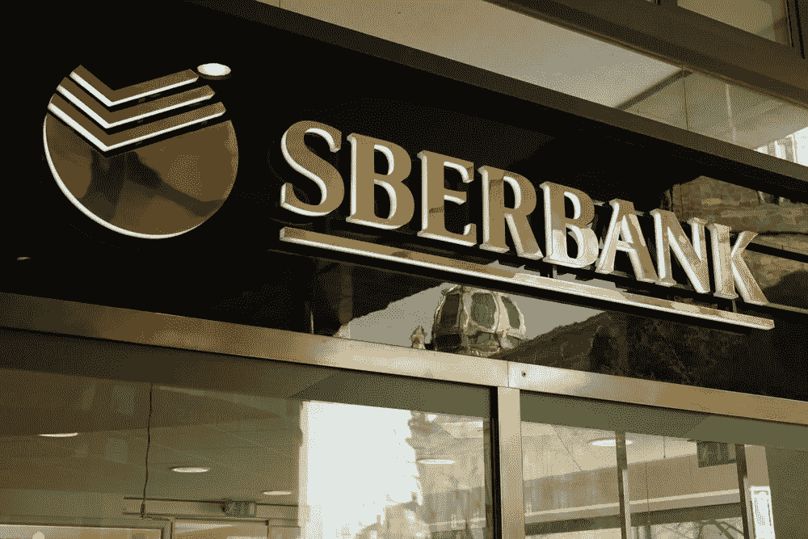

# 俄罗斯银行 Sber 将进行其第一笔数字货币交易

> 原文：<https://medium.com/coinmonks/sber-a-russian-bank-will-conduct-its-first-digital-currency-deal-71d59b907a6d?source=collection_archive---------69----------------------->

加密贷款平台 Celsius Network (CEL)聘请了 Akin Gump Strauss Hauer & Feld 的重组律师，为该公司的财务困境寻找潜在的解决方案。

据报道，该公司正在寻找其他战略选择，如财务重组，除了试图解决目前的问题。报道还指出，Celsius 正在试图寻找能够为这家加密贷款公司提供融资选择的投资者。

周一，Celsius 以极端的市场条件为由，暂停了从其平台上撤回资金。在提现冻结期间，该公司从流动性协议 Aave 拆下了约 2.47 亿美元的包装比特币(BTC)，并将其发送到 FTX 交易所。除了 BTC，该公司还向 FTX 输送了 7450 万美元的乙醚。

随着 Celsius 破产的传言扩散，crypto exchange Nexo 将手伸向了借贷平台。这家加密公司最近告诉 Cointelegraph，Nexo 及其合作伙伴和附属公司可以收购 Celsius 的部分或全部未偿“抵押贷款应收款”。

为了消除持有人对 Celsius 情况的担忧，stablecoin 发行人 Tether (USDT)宣布，围绕借贷平台的当前事件对 Tether 的储备“没有影响”。根据 Tether 的说法，虽然他们确实对摄氏有投资，但这对其储备的稳定性没有影响。公告还强调，摄氏温度的情况是“市场波动”的结果。

与此同时，币安加密交易所周一也暂停了 BTC 在其平台上的提款，就像摄氏暂停开始一样。不过，币安首席执行官赵昌鹏向持有人保证，他们的资金是安全的，交易所将很快开放提款。同一天，密码交易所恢复取款。

俄罗斯银行业巨头 Sber(原名 Sberbank)正准备很快完成其首宗涉及该银行数字资产平台的数字货币交易。

该银行将于 7 月中旬在其数字资产分配平台上进行首次涉及数字财政手段(DFA)的销售。

Sber 监事会副主席 Anatoly Popov 在 6 月 15 日接受国家支持的塔斯社采访时透露了 Sber 完成此类交易的计划。

波波夫声称，经过一系列的注册拘留，Sber 最终在 2022 年春天从该国的中央银行-俄罗斯银行-注册。Sber 一直在努力注册其数字资产分配平台，最初预计将于 2021 年春季与其 Sbercoin stablecoin 一起推出。

虽然最新消息没有直接提到区块链在 Sber 平台上的运行，但 Popov 指出，该银行致力于探索这项技术，他说

“我们正在关注分布式计数技术等新技术的发展。我们正在研究区块链技术是如何发展的。我们的平台以前已经通过验收测试，第一次销售将在一个月内进行。”

这一消息与俄罗斯第二大银行 VTB 同时发布，后者也准备在 2022 年 9 月测试购买 DFAs 以换取俄罗斯央行数字货币数字卢布。据报道，VTB 董事会成员 Svyatoslav Ostrovsky 计划在 6 月 15 日的圣彼得堡国际经济论坛上推出一个购买数字卢布的新平台。

6 月 14 日，俄罗斯国会一读通过了一项新法案，禁止使用 DFAs 支付商品和服务。

关注我们了解更多故事[点击这里](http://t.m/etellworld)

> 加入 Coinmonks [电报频道](https://t.me/coincodecap)和 [Youtube 频道](https://www.youtube.com/c/coinmonks/videos)了解加密交易和投资

# 另外，阅读

*   [币安 vs FTX](https://coincodecap.com/binance-vs-ftx) | [最佳(SOL)索拉纳钱包](https://coincodecap.com/solana-wallets)
*   [比诺莫评论](https://coincodecap.com/binomo-review) | [斯多葛派 vs 3Commas vs TradeSanta](https://coincodecap.com/stoic-vs-3commas-vs-tradesanta)
*   [Capital.com 评论](https://coincodecap.com/capital-com-review) | [香港的加密借贷平台](https://coincodecap.com/crypto-lending-hong-kong)
*   [如何在 Uniswap 上交换加密？](https://coincodecap.com/swap-crypto-on-uniswap) | [A-Ads 评论](https://coincodecap.com/a-ads-review)
*   [WazirX vs CoinDCX vs bit bns](/coinmonks/wazirx-vs-coindcx-vs-bitbns-149f4f19a2f1)|[block fi vs coin loan vs Nexo](/coinmonks/blockfi-vs-coinloan-vs-nexo-cb624635230d)
*   [本地比特币评论](/coinmonks/localbitcoins-review-6cc001c6ed56) | [加密货币储蓄账户](https://coincodecap.com/cryptocurrency-savings-accounts)