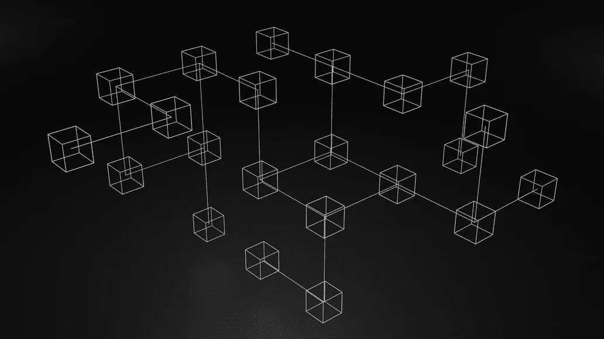

# 可量测性

> 原文：<https://medium.com/coinmonks/scalability-26a5ad6de6b7?source=collection_archive---------55----------------------->

区块链技术仍处于起步阶段:监管不足，承诺过多，交付不足。许多狂热分子大声疾呼采用这项技术，并深信区块链的技术将根除传统的金融服务。充分披露，我是这些人之一。但是在区块链技术真正被大众接受之前，有几个问题必须解决。

三个核心问题:去中心化、安全性和可伸缩性。

我个人认为大规模采用的最大阻碍是可扩展性。因此，本文的重点将是可伸缩性，以及它的重要性。

本文中的可伸缩性将被定义为有效利用系统的能力，而不管任何时间点的总用户数。

在此之前我想概述一下第 1 层和第 2 层的区别；开发第 2 层协议主要是为了解决可扩展性问题。通过这次讨论，我将指出它们为什么有价值。简单来说，它们之间的区别在于第 1 层指的是主区块链架构，而第 2 层是构建在底层区块链之上的重叠网络。

**1 层** 
1 层，通常被称为区块链基地。大部分较大的大写硬币是第一层。例子包括:以太坊(ETH)，BNB(币安智能链)，和卡尔达诺(ADA)。它充当基础层；它是允许应用程序和协议构建于其上的基础设施。正是在这里找到了共识机制，最常见的是工作证明(PoW)和利益证明(PoS)，它们规定了区块链如何就哪些区块是有效的和无效的达成一致。第 1 层网络的另一个特征是用于支付任何交易的本地令牌。

**共识机制** 
**工作证明**

向网络上的链节点添加新块必须解决一个复杂的难题。第一个完成谜题的人获得奖励的权利——来自网络的加密货币。所有参与者都试图成为第一个解决方案的人，这需要用蛮力计算能力进行数千次尝试。这就是采矿这个术语的来源。并且通过这种方式，交易被验证并被添加到块中。问题的难度与网络中计算机能力的数量成比例增加，更多的矿工意味着更困难的问题。要接管网络，一个人必须控制网络 51%的计算能力。

**股权证明**

新块的创建者是从已经下注一定数量的本地令牌的用户中随机选择的，因此有验证器来代替挖掘器。由于创建新块没有奖励，参与者从网络交易费用中获得奖励。没有大规模的能源需求，因为它已被经济处罚所取代——试图损害网络会导致资金损失。要接管这个网络，一个人必须接管这个链条上 51%的密码供应。

总之，第 1 层充当生态系统的中心网络，他们在自己的区块链上处理和完成交易，并拥有本地令牌。

**第 1 层的可扩展性问题** 
第 1 层网络必须克服的一个问题是它们无法扩展，这主要是由于共识机制。

以比特币网络为例。它是第 1 层，因为它在自己的链上处理所有交易，并使用本地令牌比特币(BTC)支付交易费用。比特币网络依赖于工作共识机制的证明，这是网络的安全特征。
这大约需要十分钟。工作证明共识机制需要大量的计算能力，并且最近由于其所需的电量而受到欧盟的批评和攻击。这项功能使网络安全，但代价是速度。

在高需求时期，网络根本无法在足够的时间内处理交易。当交易量增加时，费用和确认时间也会增加——通过网络的数据量会导致网络拥塞。交易验证的速度被称为吞吐量或 TPS(每秒交易数)，比特币网络的平均 TPS 为 5，根据网络使用情况在 3 到 7 之间变化。每笔交易都必须由全球节点网络接受、挖掘、分发和验证。全球领先的支付处理商 Visa 的 TPS 大约是 1700 英镑。Visa 使用集中账本，速度之差令人震惊。比特币网络不是为在全球范围内使用而设计的，也不可能。这里值得注意的是，比特币网络只处理资产转移，而以太坊等其他第一层网络执行更复杂的功能，需要更多的计算能力，如在分散交易所(dex)交易和铸造 NFT。

以太坊是最大的生态系统，网络可以处理交易，存储数据。交易是在各方之间发送资产的过程。数据更复杂。以太坊网络上存储数据的可能性允许个人或团体用可以在网络上运行的代码编写程序，这就是通常所说的智能合同。这是以太坊成为一个拥有超过 1140 亿美元的庞大生态系统的主要原因。它的区块链允许任何人建立去中心化的应用程序(Dapps ),这只是一个带有用户界面的智能合约，在它的基础上，它还在继续成长。
交易是根据支付的天然气费用进行优先排序的，因此参与者要么必须支付高得离谱的天然气费用，要么必须忍受漫长的等待时间才能执行他们的流程。以太坊网络的平均汽油费目前为 46 美元，但已经达到接近 300 美元的高点。这远远达不到本文开头概述的可伸缩性的定义，并且对于全球采用来说是不可接受的。

**如何克服这个问题？** 
随着越来越多的参与者开始利用区块链，它的可扩展性或缺乏，变得越来越紧迫。第 1 层解决方案可以大致分为三类:

-增加块大小，这将允许在每个块中处理更多的数据
-改变共识机制，利害关系的证明更快并且需要更少的计算能力
-实现分片，一种数据库分区的形式

**改变共识机制** 
以太坊正在改变其共识机制，原因如上所述。它计划从工作证明(PoW)转向利益证明(PoS ),但这需要大量的时间和工作来实施。以太坊 2.0 将成为新的网络，最初计划于 2019 年推出。这种多阶段升级被称为宁静号。

第一阶段于 2020 年 12 月 1 日启动，即信标链的启动。它允许参与者在本地下注以太坊，并成为验证者；这为证明利害关系铺平了道路。第二阶段将主网络与信标链合并，最后阶段将涉及分片。

分片是一种用于分割区块链网络的技术。简而言之，它更广泛地分配工作量。每个节点只保存与其特定碎片相关的信息，并且只负责整个事务的一小部分。因此，网络的整体处理能力可以大大提高。

在此过程中，从以太坊到以太坊 2.0，预计网络将经历 TPS 的巨大增长，从目前的 10 TPS 一路增长到 100，000 TPS。这对于更广泛的商业应用是必不可少的。很可能要到 2023 年才会全面放开。

许多新的第 1 层网络的快速发展从根本上是由其可扩展性解决方案推动的。两个值得注意的例子是埃尔隆德(EGLD)和 Fantom (FTM ),前者使用分片技术，后者使用有向无环图(DAG)代替区块链。

**第二层解决方案** 
通常被称为离链解决方案，因为交易是在主链之外处理的。

开发第 2 层解决方案是为了直接解决可扩展性问题。它们依靠第 1 层网络来保证安全性和一致性，但允许用户以更高的速度和更低的成本进行交易。它们在第 1 层区块链的顶部工作，在基础层之上形成第二层。最著名的例子是比特币的闪电网络和 Polygon an 以太坊兼容侧链。它们旨在提高 TPS 和降低天然气费用。在这一点上，必须强调以太坊区块链存储数据的能力，因为多个交易可以被分组到一条数据中。

**不同类型的第二层解决方案** 
**通道**

通道是最早广泛使用的解决方案。最著名的应用是比特币闪电网络。信道只是网络上两个节点或用户之间的双向通信。最常见的是国家渠道及其子类型支付渠道，各方可以在其中相互发送或接收付款。这些交易是在链外完成的，因此不需要被主链验证。双方理论上可以在不通知主链的情况下无限次数地交换资金。当通道关闭或打开时，信息被发送到主链。这极大地提高了事务处理速度，因为不必让网络上的所有节点验证每个事务处理。主要的缺点是渠道不提供开放的参与。它们只对两个预先知道的团体可用，并且需要这些团体之间的高度信任。资金必须锁定在渠道的多签约合同中，并且仅适用于交易而非通用智能合同。

**等离子链** 
这一概念最初由约瑟夫·潘(Joseph Poon)和以太坊(Ethereum)的联合创始人维塔利克·布特林(Vitalik Buterin)提出。它是一个在以太网上构建可伸缩应用程序的框架。通过利用智能合同和 Merkle 树，一种用于更有效地编码区块链数据的数据结构，Plasma 允许创建理论上无限数量的子链，这些子链是以太坊母链的副本。事务被分发到子链，以减少父链上的工作负载。

缺点是想取出资金的人要等待很长时间，而且这种方法也不能用于扩展通用智能合约。

**汇总** 
这是两种类型的汇总:ZK 汇总(零知识)和乐观汇总。

这个第 2 层解决方案将多个事务捆绑或汇总成一个事务，执行它，然后将事务数据返回到主链。

**ZK**

生成一个加密证明，以验证捆绑包中的所有交易在提交回主网络之前都已经过验证。它们比乐观汇总更快、更高效，但不提供将现有智能合约迁移到第 2 层的方法。

**乐观向上**

这个名字来源于这样一个事实，即他们自然地假设事务在默认情况下是有效的。乐观汇总在受到质疑时使用欺诈证明，而不是创建有效性证明。如果发现欺诈性交易，并且可以证明是欺诈性交易，交易将被撤销，块验证程序将被取消——这是一种经济处罚，参与者将损失部分赌注资产。乐观汇总的强大之处在于，它们允许现有的智能合约发挥作用。这在 DeFi 领域非常重要，因为主要的智能合同已经通过了实战检验。

**侧链**

一个独立的区块链通过双向挂钩与另一个区块链相连。当主链过载时，可以将工作负载分配到副链。这些侧链倾向于更加集中，因为安全性是以速度为代价的，这在侧链上是可以接受的，而在主链上是不可接受的。侧链是完全独立的，有自己的共识机制，对自己的安全负责。双向挂钩意味着资产可以自由地从一个链条流向另一个链条。它包括两个阶段:锁定和释放。当参与者锁定他们的资金时，这些资金被发送到主链上的一个输出地址，然后参与者在侧链上收到等值的代币。当参与者释放他们的资金时，侧链上的代币被销毁，硬币从主网络上的地址返回。

Polygon 是以太坊主链最好的例子，也是最受欢迎的侧链。它使用了一个利益一致机制的证明，并且有自己的验证器，这意味着它的 TPS 比以太坊的要快得多。它与以太坊链平行运行，与以太坊链协同运行，理论上 TPS 为 7200，交易或汽油费用总计不到 1 美分。Polygon 已经成为了自己的生态系统，并且还在继续扩张。它目前拥有 AAVE 最大的分散式贷款协议之一，以及非常受欢迎的分散式交易所(DEX)quick swap。

**结论**

第 2 层解决方案从主链中提取一部分工作负载，执行事务，然后只将事务性数据返回给主链。这大大减轻了主链的负担，允许更高的 TPS 和更低的交易费用。随着越来越多的参与者加入加密领域并希望与生态系统互动，这对区块链技术的发展至关重要。

以太坊 2.0 的推出将是生态系统的一次重大飞跃，但仍然需要 Polygon 等解决方案的效用，以允许更广泛的市场参与。全球环境问题也对从工作证明共识机制转向利益证明共识机制施加了压力。对于小投资者来说，当前的以太坊网络速度慢得令人无法接受，费用高得令人望而却步，要使 crypto 成为一个可行的全球交易网络，必须解决可扩展性问题，而且随着用户群的扩大，这个问题只会越来越严重。因此，许多第 2 层协议取得了巨大的成功。

区块链技术在不断进化。我毫不怀疑将会有新的方法诞生来解决可伸缩性的问题，在未来，我们都将能够以创纪录的速度和可以忽略不计的费用来利用区块链技术。解决可扩展性问题是 crypto 必须跨越的一条大河，它要从一种仅对投机者和技术爱好者有吸引力的不稳定资产转变为它所承诺的传统金融弊病的解决方案。

> *加入 Coinmonks* [*电报频道*](https://t.me/coincodecap) *和* [*Youtube 频道*](https://www.youtube.com/c/coinmonks/videos) *了解加密交易和投资*

# 另外，阅读

*   [Bookmap 评论](https://coincodecap.com/bookmap-review-2021-best-trading-software) | [美国 5 大最佳加密交易所](https://coincodecap.com/crypto-exchange-usa)
*   最佳加密[硬件钱包](/coinmonks/hardware-wallets-dfa1211730c6) | [Bitbns 评论](/coinmonks/bitbns-review-38256a07e161)
*   [新加坡十大最佳加密交易所](https://coincodecap.com/crypto-exchange-in-singapore) | [购买 AXS](https://coincodecap.com/buy-axs-token)
*   [红狗赌场评论](https://coincodecap.com/red-dog-casino-review) | [Swyftx 评论](https://coincodecap.com/swyftx-review) | [造币厂评论](https://coincodecap.com/coingate-review)
*   [投资印度的最佳密码](https://coincodecap.com/best-crypto-to-invest-in-india-in-2021)|[WazirX P2P](https://coincodecap.com/wazirx-p2p)|[Hi Dollar Review](https://coincodecap.com/hi-dollar-review)
*   [加拿大最佳加密交易机器人](https://coincodecap.com/5-best-crypto-trading-bots-in-canada) | [库币评论](https://coincodecap.com/kucoin-review)