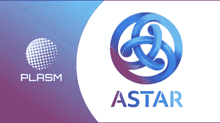

# Astar 网络的真正可扩展性和互操作性

> 原文：<https://medium.com/coinmonks/scalability-and-interoperability-astar-network-f7bef43ca483?source=collection_archive---------37----------------------->

一个 **星形网络**是一个面向 Web3.0 的可扩展和可互操作的基础设施，它采用奇偶校验的底层框架构建。允许 Astar 连接到 Polkadot 网络。目前，Astar 是一个 Polkadot Parachain，因此，Parachain 提供了链之间的交互(数据和令牌可以在 Parachain 之间无缝传输)，而 Relaychain 提供了共享安全性(para chain 可以导入 Relaychain 安全性)。通过将 Astar 网络连接到 Polkadot，实现了真正的互操作性。

事实上，Astar Network 是 Polkadot 上第一个可扩展的智能合同平台之一。为了采用区块链技术，更高的性能是必要的。可扩展性是 Astar 网络寻求优化的一个关键问题。Polkadot 使用分片技术，允许更大的可伸缩性(第 1 层(水平)可伸缩性)。Astar 还支持尖端的第 2 层解决方案(第 2 层(垂直)可扩展性)。Astar 网络架构的其他优势包括:

**更快的终结**

**灵活的 dApps 开发**

**交易(燃气)成本低**

要考虑的一个重要方面是**乐观虚拟机** (OVM)。OVM 实际上是一套简化和统一 Astar 网络中不同第 2 层协议的标准。有了它，开发人员只需要担心清楚地表达他们的应用程序的逻辑，OVM 将随时负责执行这些规则。通过这种方式，部署在 Astar 网络上的应用程序和智能合约可以通过称为 L1 适配器的专用客户端应用程序来创建和执行，这是许多区块链开发人员习惯使用的方案，因为这是我们可以看到的模型，例如在以太坊(ETH)的等离子体可扩展性协议中部署的应用程序。并且，虽然是一个复杂的开发模型，但是对于应用开发者来说，这个系统极大地方便了多链应用的实现和部署。

Astar 网络具有的其他附加功能:

**运营商交易**:这是一种涉及运营商买卖 Astar 应用的机制。

**dApps 奖励**:这是针对 dApps(包括 Astar 应用)开发者的奖励制度。所以 Astar Network 付钱给 dApp 开发者，让他们在网络上部署自己的应用。或者更确切地说，它在网络内部创造了一个激励系统，目的是帮助 dApps，使他们能够得到发展和资助。首先，必须选择 dApp 智能合约的管理员或操作员。该操作员将代表 dApp 获得奖励。现在，为了获得这一奖励，社区出于其认为必要的原因，通过投票或提名 dApp 的经营者拥有最终发言权。50%的奖励分配给该区块的验证者。通过这样做，一半的区块奖励可以作为 DApp 开发者的基本收入，这不仅激励了验证者，也激励了平台的开发者

**落锁**:基本上，落锁可以被看作是由 Astar 令牌持有者(ASTR)按照与他们在系统中的参与程度相称的比例执行的固定期限的赌注。由于获得了令牌，您有“机会”参与网络，或者作为网络中的节点，或者在网络中执行操作。*Multi-Lockdrop 是一种机制，我们在其中多次重复前面提到的 Lockdrop。

智能合同功能与第 2 层架构相结合，使 Astar 网络上许多有趣的 dApps 成为可能。(例如游戏、物联网、支付、DEX 和桥牌)

Astar，在草间弥生/波尔卡多特生态系统中给我们一个独特的建议。不仅因为它以非常简单的方式在多个链上部署 dApps 并将其完全集成到 Substrate 的技术中时向我们展示的独特能力，还因为它对 dApps 创作者的激励政策，这在任何其他区块链中都是独一无二的。

Astar Network 专注于打造最好的智能合约平台，以便 Polkadot 上的 dApps 开发人员无需过多关注基础设施，可以更加专注于他们的 dApps。理想情况下，开发人员可以在 star 网络上构建任何应用程序，而不必考虑其可扩展性。

总之，Astar 网络解决了突出的问题:可扩展性和互操作性。

最后，如果你能在推特上关注我 [@Mikefosk](https://twitter.com/Mikefosk) &我的[媒体简介](/@Mikefosk)，我将不胜感激！

> 加入 Coinmonks [电报频道](https://t.me/coincodecap)和 [Youtube 频道](https://www.youtube.com/c/coinmonks/videos)了解加密交易和投资

# 另外，阅读

*   [如何在 Bitbns 上购买柴犬(SHIB)币？](https://coincodecap.com/buy-shiba-bitbns) | [买弗洛基](https://coincodecap.com/buy-floki-inu-token)
*   [CoinFLEX 评论](https://coincodecap.com/coinflex-review) | [AEX 交易所评论](https://coincodecap.com/aex-exchange-review) | [UPbit 评论](https://coincodecap.com/upbit-review)
*   [十大最佳加密货币博客](https://coincodecap.com/best-cryptocurrency-blogs) | [YouHodler 评论](https://coincodecap.com/youhodler-review)
*   [AscendEx 保证金交易](https://coincodecap.com/ascendex-margin-trading) | [Bitfinex 赌注](https://coincodecap.com/bitfinex-staking)
*   [最好的卡达诺钱包](https://coincodecap.com/best-cardano-wallets) | [Bingbon 副本交易](https://coincodecap.com/bingbon-copy-trading)