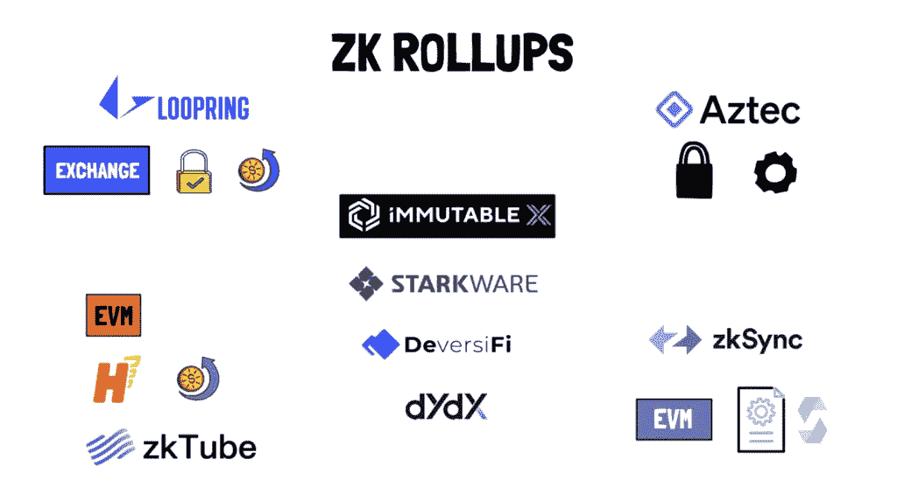

# 缩放层 1:ZK-上卷和分片

> 原文：<https://medium.com/coinmonks/scaling-horizontally-zk-rollups-and-sharding-7f8e37242348?source=collection_archive---------2----------------------->

**概述**:以下概述了 L1 的缩放问题，以及 ZK 卷和分片的结合将如何带来缩放方面的巨大改进。

**缩放层 1 的基本问题**

区块链负责三项主要任务:执行、安全性(或共识)和数据可用性。

*   **执行** —处理事务，包括计算工作(给定状态 N 和状态转换- >状态 N+1)
*   **安全性**(或**共识** ) —定义如何将块添加到链中，以及参与者如何同意块是正确的块
*   **数据可用性** —数据存储在每个区块链节点上。使用区块链的任何人都可以获得这些数据

试图完成所有这三项任务的铁板一块的区块链固有地受到区块链三难困境的限制，原因如下。所有节点必须存储分类帐的整个状态，或者(在轻节点的情况下)具有一种机制，通过该机制可以合理地确保发布该块的验证器也发布了整个区块链数据。这一要求是必要的，因为验证器和完整节点必须能够针对先前存储的状态重新计算建议的块中的事务，以确保块生产者遵循区块链的规则(例如，不包括无效事务)。验证器必须有足够的磁盘空间(数据存储)、处理速度(CPU)和内存(RAM)来履行这些义务。

考虑到这些硬件要求，基本层的吞吐量可以主要通过两个杠杆来提高:

*   **提高块生产速度**:在以太坊的情况下，块生产速度可以通过增加每个时期的槽数来提高(这可能需要更快的一致机制来确保活跃度)
*   **增加区块大小**:可以通过提高区块气体限制(目前为 3000 万)来增加区块大小

但是，这两种调整都会增加硬件节点需求。如果数据块更大或生成速度更快，节点必须提高处理速度和内存来“跟上”数据链。作为二阶效应，节点必须增加磁盘空间，否则网络将更快达到状态膨胀*(警告:无论块大小和速度如何，在没有新的实现(如分片或状态到期)的情况下，最终将达到状态膨胀)。增加节点硬件要求会排挤速度较慢的计算机，从而降低分散性。为了突出这个问题，让我们简单地看看索拉纳:*

*   *验证器硬件要求:2.8GHz 12 核 CPU、256GB RAM、1TB 存储空间*
*   *验证器数量:1，500*
*   *规定 TPS: 65k*

*2021 年 6 月，Cypherpunk 的联合创始人之一使用一台 3.2 GHz 6 核 CPU、32GB RAM、1TB 存储的计算机测试了各种区块链的完全验证同步性能。使用可信快照(即甚至不下载和验证整个交易历史)与 Solana 同步，他的计算机在 54 分钟后崩溃。事实上，每 0.4 秒就有 300KB 的数据块到达，无论存储容量如何，一台相对强大的计算机甚至都赶不上这个链。点击这里查看更多节点同步测试:[https://blog.lopp.net/2021-altcoin-node-sync-tests/](https://blog.lopp.net/2021-altcoin-node-sync-tests/)*

*显然，我们在基本层扩展区块链时遇到了一个根本性的问题。更高的硬件要求减少了网络中验证器和完整节点的参与，这意味着能够检查块生产者是否遵循区块链规则的团体更少。虽然很难估计足以满足安全目的的分散化水平，但存在其他可扩展性途径(如汇总),允许区块链仅针对基础层的分散化和安全性优化*。**

> **交易新手？试试[密码交易机器人](/coinmonks/crypto-trading-bot-c2ffce8acb2a)或[复制交易](/coinmonks/top-10-crypto-copy-trading-platforms-for-beginners-d0c37c7d698c)**

**过去已经提出了一些方法(如等离子体)来使执行脱离链并绕过 L1 的硬件要求限制。然而，这些方法需要离线维护数据可用性(即，等离子体链中的参与者必须存储整个交易历史)，这具有安全隐患。**

****ZK-汇总:使执行脱离链****

****

**ZK-汇总使执行脱离链，无需存储整个 L1 分类账。ZK 汇总有两个主要特征，使 L1 缩放:数据压缩和有效性证明。**

**ZK-汇总利用智能合同链来维护汇总的状态根(本质上，汇总分类帐的加密压缩版本)。当汇总接收到事务时，汇总确认器(或中继器)将压缩的事务批连同先前的状态根和新的状态根一起发布到汇总合同链上。这个过程本质上与主链上的执行相同(状态 N +状态转换->状态 N+1)，但是增加了数据压缩。通过这样做，执行状态转换所需的计算工作被转移到了链外，从主链中移除了部分执行负担。**

**虽然主链上的智能合同确保了汇总的先前状态根是正确的，但是在没有有效性证明的情况下，无法确保由汇总执行的转换到新状态根的计算工作是正确完成的。除了压缩的事务数据、先前的状态根和新的状态根之外，验证器还发布称为 ZK-斯纳克的加密证明，向智能合同链证明新的状态根是执行批处理的正确结果。**

**由于 ZK 汇总预先提供了这种加密证明(与乐观汇总相反)，因此这些汇总可以完全删除某些交易数据(例如随机数)或压缩某些交易数据，从而减轻主链的数据负担。例如，每笔交易的天然气价格可以压缩成一批天然气价格，签名几乎可以完全删除，因为 ZK-斯纳克已经证明签名数据是经过验证的(例如，签名匹配发送者和接收者)。据估计，使用 rollup 可以将简单以太坊交易的数据从大约 110 字节压缩到大约 12 字节。**

**由于这种数据压缩，证明的链上验证不随批量大小而缩放的事实，以及 ZK 汇总的无信任假设，汇总验证器可以最大化吞吐量，而不会对主链带来安全风险。但是，汇总验证器会因为发布无效的有效性证明而受到惩罚，并且会被削减，因此为了确保活性，分散的验证器集仍然是首选。**

****分片:扩展数据可用性****

**ZK 汇总消除了区块链三难中隐含的执行限制，并在降低主链数据存储要求方面取得了重大进展。然而，使用 Geth 执行客户端，完整的节点同步大小仍然远远超过 1TB (OpenEthereum 大约为 575GB ),并且还在增长，因此仍然需要扩展 L1 数据层。尽管有这种限制，没有改进数据层的汇总仍然可以将以太坊 TPS 从 10–15 增加到 2–3k(尽管状态膨胀会更快达到)。以太坊的分片部署定于 2023 年，将允许网络处理大约 10 万 TPS，这可能是大规模采用所必需的。**

**以太坊的分片升级将把区块链账本的存储分成 64 个分片，所有分片都“报告”给信标链。信标链将负责一致性和验证器分配，但不会存储状态——事实上，每个碎片都有自己的状态(即用户帐户特定于一个碎片)和事务历史。验证器将被随机分配并定期重新分配给分片，通过投票来验证分片块。信标链将在提供终结之前验证分片块已经获得了必要的票数。分片的复杂性要高得多，特别是与跨分片通信相关的，这超出了本文的范围。不管怎样，我们可以看到分片已经显著降低了对验证器的数据存储需求，验证器现在只需要保存分配给它们的分片的状态。**

**然而，简单地将数据存储需求除以 64(注意:这并不完全是它的工作方式)从长远来看仍然不足以处理许多向主链发送数十万(甚至)压缩事务数据的 ZK 汇总。然而，关键的是，节点不需要实际存储该事务数据，它们只需要合理地确信事务数据通过汇总是可用的(例如，以便用户可以访问它们的余额)。因此，分片网络中的节点将利用数据可用性采样来获得这些合理的保证，而不必下载所有数据。在发布到主链之前，ZK-rollups 将使用一种称为擦除编码的工具复制压缩的交易数据。通过复制数据，主链上的节点只需要对数据进行采样，就可以合理地确保其可用性。如果采样数据不可用，节点可以拒绝汇总建议的块。分片和数据可用性采样的这种组合将指数级地降低基础层的数据存储需求。**

****总结****

**虽然 ZK 汇总使执行脱离链，并可能使以太坊网络的事务处理能力提高 100 倍，但我们仍然会遇到数据存储和可用性的问题。分片将扩展数据层，但只有结合数据可用性采样，网络才能充分利用汇总的执行能力。**

**引文**

1.  **【https://docs.solana.com/running-validator/validator-reqs **
2.  **[https://blog.lopp.net/2021-altcoin-node-sync-tests/](https://blog.lopp.net/2021-altcoin-node-sync-tests/)**
3.  **[https://vitalik.ca/general/2021/01/05/rollup.html](https://vitalik.ca/general/2021/01/05/rollup.html)**
4.  **[https://etherscan.io/chartsync/chaindefault](https://etherscan.io/chartsync/chaindefault)**
5.  **【https://vitalik.ca/general/2021/04/07/sharding.html 号**
6.  ***图片来源:Finematics***