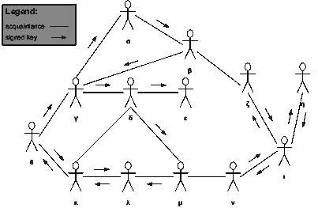

# 扩展本地 DAO 成员资格:信任网协议

> 原文：<https://medium.com/coinmonks/scaling-local-dao-memberships-the-web-of-trust-protocol-8004aa463931?source=collection_archive---------28----------------------->

全球 Dao 已经存在了一段时间，成员资格的解决方案采取了许多不同的形式:持有治理令牌、标上治理令牌、持有特殊 NFT、满足某些条件，如积极参与社区并以令牌的形式空投一种不可转让的认可形式，或者在社区内获得投票。

虽然这些解决方案适用于全球 Dao，但当您想要让居住在某个周边或区域内的人参与进来时，它们在本地级别上的扩展性并不好。其中一个例子是旨在帮助当地社区管理一块共享或集体所有的土地的当地 Dao。在这种情况下，不能通过治理令牌或 NFT 来买卖 DAO 的成员资格。手动操作也不是一种选择:道的创造者要敲开一个社区甚至一个城镇的每一扇门，并手动向每个人发放不可转让的令牌，以确保他们满足成为道成员的条件(例如，他们与要集体管理的那块土地的物理距离)。

令人欣慰的是，[信任网协议](https://en.m.wikipedia.org/wiki/Web_of_trust)能够以分散的方式快速扩展这样的本地成员。到目前为止，它已经被成功地用于测量法比的 T2 区块链 T3。传播的规则和原则可以使其变慢，但确保网络免受伪造帐户的创建。

简而言之，为邓尼特区块链实现的信任网协议的工作原理如下:

1)邓尼特区块链的开发者创建至少 5 个认证或验证账户，这些账户有权发布 100 个认证。

2)任何人都可以创建 Duniter 帐户，但是这样的帐户只能接收 Duniter 货币，而不能生成任何新的货币。

3)为了创建一个经过验证或认证的帐户，您需要从 5 个不同的人那里获得至少 5 个认证。

4)发布认证的规则是与想要被亲自认证的人会面(在物理会面中，您可以绝对确定地验证您正在认证“真实”人的账户)。

5)一旦一个人被认证，他可以反过来发布 100 个认证。

6)帐户每年都会到期，认证需要至少每年更新一次，否则您的帐户将失去认证帐户的地位。

7)任何用户都可以在他们颁发的证书过期之前续订证书，或者如果证书过期，他们可以重新获得将证书转移到另一个帐户的能力。

该系统允许以非常本地化的方式扩展网络的成员资格，因为为了加入网络，您需要亲自会见至少 5 个已经认证的人。这样的网络可以在非常局部的水平上快速传播。即使它的潜在传播没有限制，通常，在一块土地的集体治理的例子中，如果这块土地离你居住的地方太远，由于缺乏参与这种治理的兴趣，传播自然会停止。如果一个人住在离这样一块土地 50 公里远的地方，那么为什么这样一个人会想成为网络的一部分，因为他/她无论如何都不会从在这块土地上建造的任何东西中受益。此外，可以对网络的传播设置人为的限制，通过创建一个规则，根据您与本地 DAO 的核心创建者的“距离”来限制您可以颁发的证书的数量。例如，当创建本地 DAO 时，5 个核心成员被给予拥有发布 128 个认证的可能性的账户。由这些初始成员认证的账户只能发布 64 个认证，由该第二层成员认证的账户每个可以发布 32 个认证，因此将会有网络的最大传播度，其中在超过 6 或 7 个人的“距离”处的任何账户将被验证，但是不能再认证任何其他账户。可以调整这些规则，以确保网络的最佳传播。

信任网协议有几个主要优点:

*   它不需要为入职人员或管理本地 DAO 的成员资格进行手动 KYC 或身份验证过程；
*   在积极主动的社区中，它可以相对快速地扩展。就 Duniter 而言，该网络经常组织"面对面"会议，向感兴趣的人介绍 Duniter，并向所有与会者颁发证书。这也鼓励人们保持强大的社会关系和网络。例如，在一个社区内，当至少有 5 个人拥有一个经过验证的帐户时，他们可以为其他邻居举行一次会议，并在开始时发布证书。
*   一旦网络达到一定的成熟度，它就可以自我维护，人们自然地加入和退出，而不需要手动管理。例如，在本地 DAO 的情况下，根本不关心管理本地土地的人会让他们的证书过期，他们的帐户自然会失去其治理权。网络中的人是防止任何“接管”网络企图的守护者。例如，如果一个邻近的城市想要接管 DAO，他们需要说服足够多的人来颁发他们的证书，以便将网络传播到他们的城市，并对当地的 DAO 产生更大的影响。然而，如上所述，可能存在通过限制网络传播来自然防止这种尝试的规则。
*   有了信任网协议，通过连接和认证图，很容易发现任何试图“欺骗”和创建假账户的账户。例如，很容易识别一群成员，他们都从相同的 5 个人那里获得了认证，这可能表明这 5 个人试图创建假账户以获得对网络的更多控制。通常情况下，社会关系是多样化和多种多样的，人们将从各种各样的人那里获得认证，而不是系统地从同一个人那里获得认证。最重要的是，任何帐户都可以获得 5 个以上的认证，这使得它更加“值得信赖”，因为它与更多样化的社交网络有联系。

总之，与拥有可转移令牌等其他标准相比，任何希望搭载人员的本地 DAO 都应该考虑信任网协议。

> 加入 Coinmonks [Telegram group](https://t.me/joinchat/Trz8jaxd6xEsBI4p) 并了解加密交易和投资