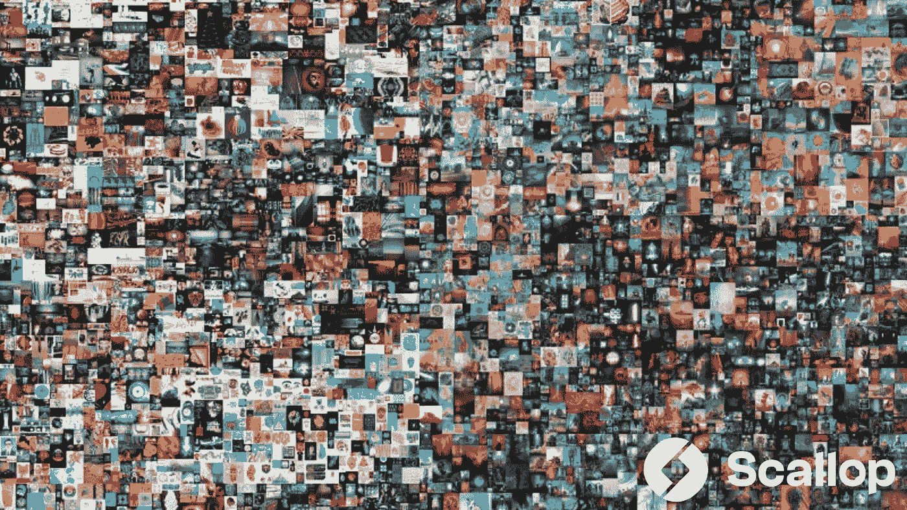

# 非同质化通证

> 原文：<https://medium.com/coinmonks/scallopx-product-nft-market-c649fe8c12f5?source=collection_archive---------62----------------------->

# 扇贝产品-NFT 市场

NFT 是不可替换令牌的首字母缩写。“不可替代”意味着它是独一无二的，不能被其他东西替代。一个比特币是可替代的，因为它可以换成另一个比特币，你会得到完全一样的东西。然而，独一无二的交易卡是不可替代的。如果你把它换成另一张卡，你会得到完全不同的东西。

在很高的层次上，大多数 NFT 都是以太坊区块链的一部分，尽管其他区块链也实现了他们自己版本的 NFT。以太坊是一种加密货币，就像比特币或 dogecoin 一样，但它的区块链也会跟踪谁持有和交易 NFT。它们真的可以是任何数字化的东西(如绘画、音乐、你的大脑下载并变成人工智能)，但目前的许多兴奋是围绕着使用技术来销售数字艺术。

自从 NFTs 大受欢迎以来，情况变得更加复杂。类人猿的照片已经卖到了数千万美元，关于 NFT 项目的百万美元黑客攻击的头条新闻层出不穷，企业抢现金的情况变得越来越糟。

销量从巅峰时期开始大幅下滑，尽管就像 crypto 中的所有东西一样，总有人在高峰到来之前宣布它已经结束了。我是不是在预测非功能性测试即将卷土重来？绝对不是，但我肯定在 NFT 的社区里有很多人确信他们仍然过着优裕的生活。

扇贝不会被排除在 NFT 空间之外。NFT 市场是扇贝产品之一。虽然还没有发布，但是承诺很多。扇贝 NFT 将把所有令人兴奋的、有趋势的和最好的 NFT 带到一个地方，供投资者、爱好者和 NFT 的创作者使用，扇贝 NFT 将利用内置的 NFT 市场为购买、销售和利用数字内容提供空间。

> 加入 Coinmonks [电报频道](https://t.me/coincodecap)和 [Youtube 频道](https://www.youtube.com/c/coinmonks/videos)了解加密交易和投资

# 另外，阅读

*   [Bookmap 点评](https://coincodecap.com/bookmap-review-2021-best-trading-software) | [美国 5 大最佳加密交易所](https://coincodecap.com/crypto-exchange-usa)
*   最佳加密[硬件钱包](/coinmonks/hardware-wallets-dfa1211730c6) | [Bitbns 评论](/coinmonks/bitbns-review-38256a07e161)
*   [新加坡十大最佳加密交易所](https://coincodecap.com/crypto-exchange-in-singapore) | [收购 AXS](https://coincodecap.com/buy-axs-token)
*   [红狗赌场评论](https://coincodecap.com/red-dog-casino-review) | [Swyftx 评论](https://coincodecap.com/swyftx-review) | [CoinGate 评论](https://coincodecap.com/coingate-review)
*   [投资印度的最佳加密软件](https://coincodecap.com/best-crypto-to-invest-in-india-in-2021)|[WazirX P2P](https://coincodecap.com/wazirx-p2p)|[Hi Dollar Review](https://coincodecap.com/hi-dollar-review)