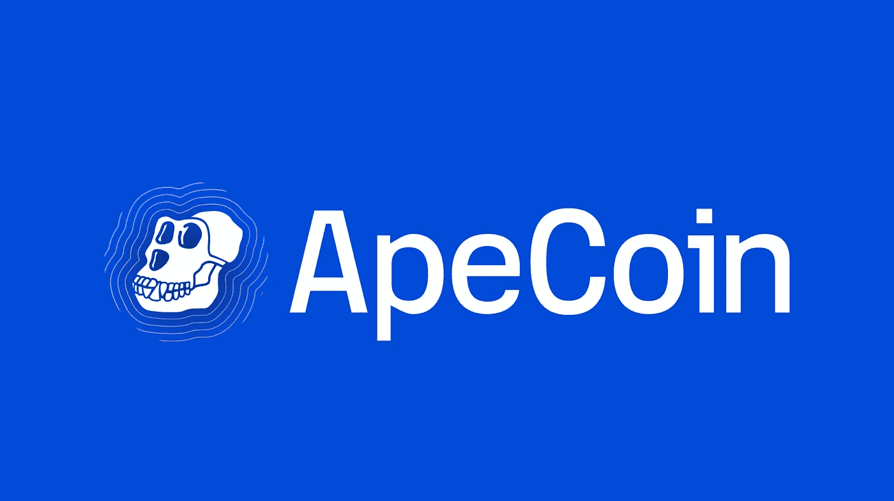

# 在 BAYC 推出 ApeCoin 令牌——Derev Blog 后，骗子立即发起网络钓鱼攻击

> 原文：<https://medium.com/coinmonks/scammers-launch-phishing-attacks-immediately-after-bayc-launches-apecoin-token-derev-blog-40f065e08d82?source=collection_archive---------35----------------------->

在其发布后不久，骗子们就建立了假冒 BAYC 的钓鱼网站。

*   在最近的一次公告中，BAYC 发布了它的 ApeCoin 令牌。
*   它还宣布空投给它的 NFT 持有者(无聊的猿猴和变异猿猴，以及与 [#BAYC](https://twitter.com/hashtag/BAYC?src=hashtag_click) 或 [#MAYC](https://twitter.com/hashtag/MAYC?src=hashtag_click) 配对的 [#BAKC](https://twitter.com/hashtag/BAKC?src=hashtag_click) 狗)