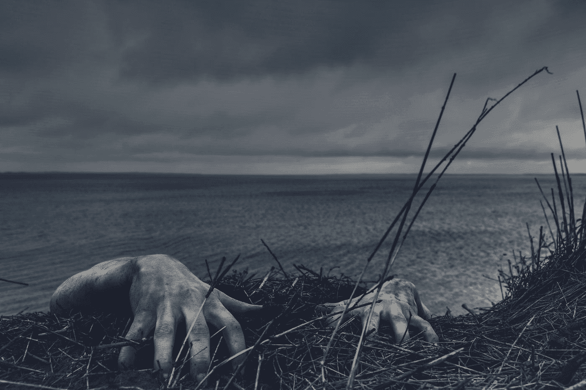

# 恐怖世界管理 101

> 原文：<https://medium.com/coinmonks/scary-world-management-101-c7552046d5d7?source=collection_archive---------54----------------------->

Photo by [Daniel Jensen](https://unsplash.com/@dallehj?utm_source=medium&utm_medium=referral) on [Unsplash](https://unsplash.com?utm_source=medium&utm_medium=referral)

我听了罗伯特·布里德洛夫和 T2·杰弗里·A·塔克(布朗斯通研究所的创始人)关于疫情、比特币、政府、暴力等的即兴演讲。

[它录制于 2021 年 12 月](https://youtu.be/kPCRgwjegVU)，所以在乌克兰之前，在卡车车队之前，在大多数可怕的事情发生之前。杰弗里·A·塔克最近出版了一本名为《清洗已经开始》的书。

以下是我听到的想法:

# 人类在自由中应该是平等的这一观点是相对较新的

从圣保罗开始:*不分犹太人、希腊人、为奴的、自主的、男的、女的，因为你们在基督耶稣里都成为一了。*

# 但是在 2020 年 3 月，发生了三件事:

## 1.我们重新发现:自由是一种理念。在下面。进攻。

这让很多人感到恐惧。

要么，*他们对自己*(管理责任)缺乏信心，要么

*他们喜欢权力*。变得暴力，然后看到结果。这是他们唯一能得到的快乐。真正的自由会带走这些。

## 2.政府重新引入了阶级的概念

只是这一次，阶级是由你的权力来定义的。

如果你在政府部门工作，你立刻成为上层阶级，其他人成为下层阶级。

截至 2020 年 3 月，获得权力决定了你一生中能做的很多事情。

## 3.千禧一代终于遇到了令人兴奋的事情

一个年轻女孩评论道:“这个疫情是发生在我们身上的第一件事。”

因此，他们中的许多人都加入了这股潮流。

# 纳粹作家卡尔·施米特的名言:

没有政治的生活既无聊又可怕。

我希望街道上血流成河。这就是为什么你知道你的生活很重要。我们需要大事发生在我们身上。一个要恨的敌人。

到底谁是敌人？

真正让人心寒的一点:*没关系！*

# 我们研究历史不是为了吸取教训

相反，我们研究历史是为了让自己更加自信。

因为每一代人都希望自己比之前的几代人更好。

(我们暗暗害怕我们可能不是。)

# 比特币是少数几个在疫情中保持运转的系统之一

但即使是比特币也无法帮助一个不愿相信自由的世界。

政府和央行害怕比特币。他们了解黄金。而比特币是更好的黄金。

但是他们害怕 stablecoins，stable coins 提供即时、低风险、低成本的交易。

他们*比不过那只*。

# 塔克的基本论点是:

*国家*注定要被淘汰。

政府普遍是一个大败笔。最后有用的国家成就:阿波罗登月？也许吧？

这个国家和它的管理者们都很恐慌。

寻找任何让他们看起来合法的东西。任何能让恐惧继续存在的东西。

Covid(现在是乌克兰)给了他们所希望的最后一次机会。

# 但这留下了可怕的问题:

生活在政府完全去合法化的西方民主国家是什么感觉？

当所有中央控制的西方系统都失灵时，会发生什么？

当国家变得无关紧要时。

更好的东西？(像真正的个人自由？)

或者更糟糕的事情？