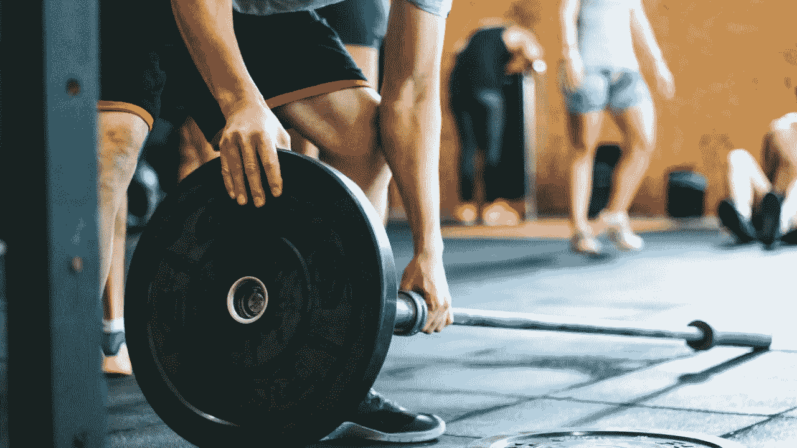
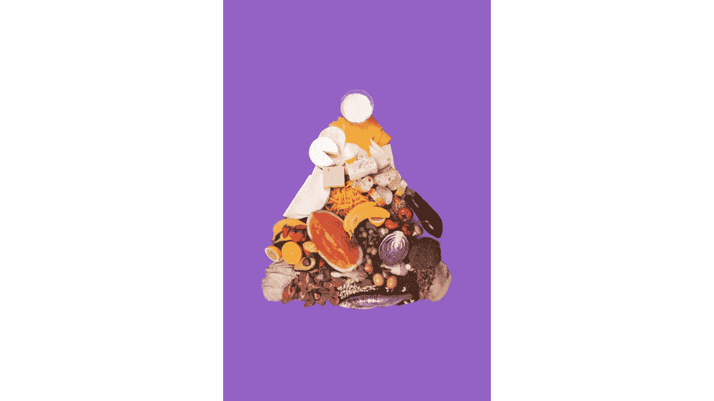
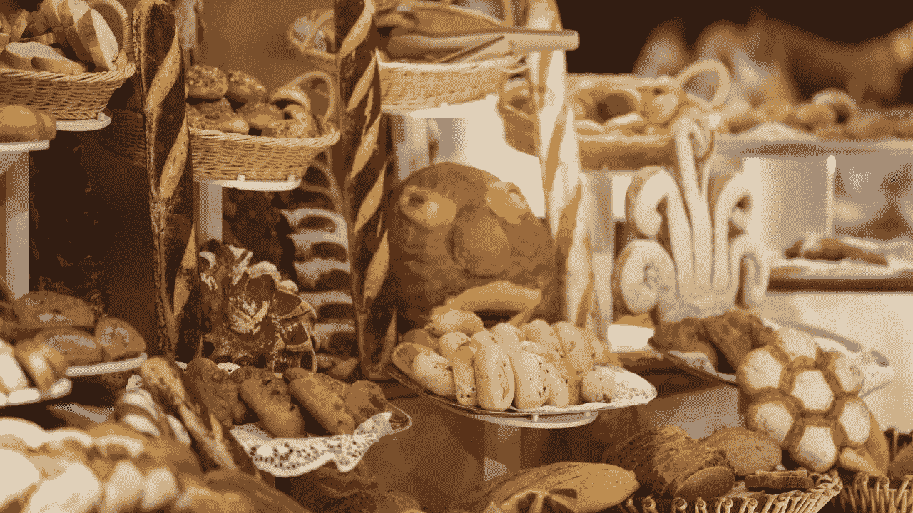
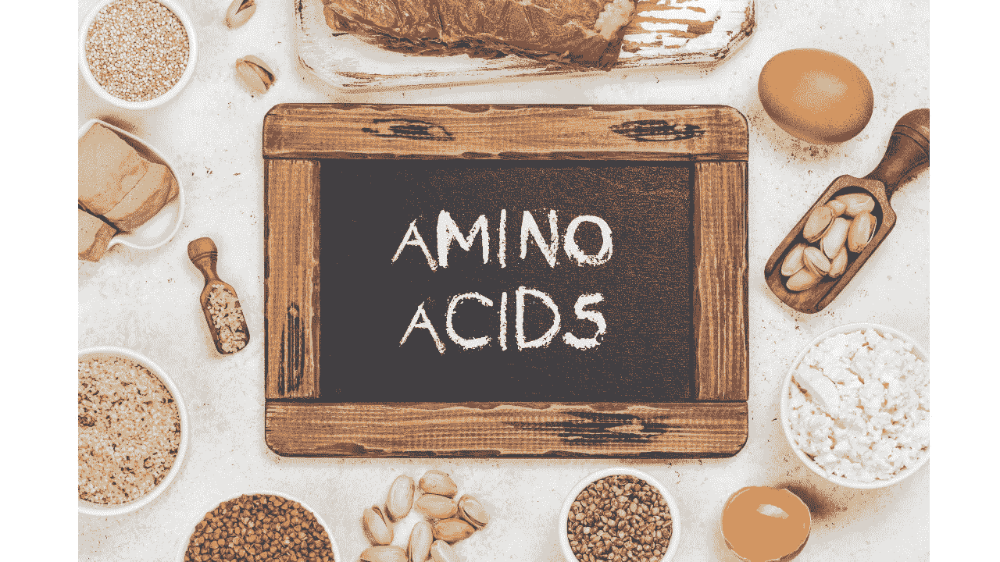

# 健美科学-1

> 原文：<https://medium.com/coinmonks/science-of-bodybuilding-1-e8b5a67092e1?source=collection_archive---------27----------------------->

Bodybuilding exposes muscles and tendons throughout the body to gradually increasing resistance

健美使全身的肌肉和肌腱逐渐增加阻力。因此，这是一种试图通过将身体置于越来越重的负荷下来增加骨骼肌的大小和力量的力量训练。

在大多数情况下，重力被用来实现这种改进。哑铃或杠铃的作用是作为一个大的质量(因此一个大的重力朝向地面)，人会试图用他们的肌肉来平衡。经常承受这种负荷的肌肉通过生理过程变得更大更强壮。

在本文中，我们将解释想要发展肌肉的个人应该在基本水平上了解的主题及其基本的生物基础设施，而不是肌肉的生理发展原则。由于这篇文章的目的不是准备一个完整的健美指南，我们强烈建议您考虑这里给出的一般科学信息作为介绍性信息，并转向个性化计划。

当然，想要锻炼肌肉的人必须进行重量训练来增强肌肉。然而，我们将在下面更详细地研究这个话题，让我们看看那些开始锻炼肌肉的人有时会忽略的其他重要因素。

## 营养:一切的关键！

传统上，健美运动员遵循持续 2 至 4 个月的低热量、高能量饮食，以减少脂肪和增加肌肉。因为肌肉生长发育所必需的营养物质必须存在于肌肉环境中。随着肌肉量的增加，有必要增加食物量。一个健美运动员需要非常了解蛋白质、糖和脂肪的摄入量、摄入时间和摄入方式。

## 营养哲学

生活中有些残酷的现实。例如，任何运动都无法弥补饮食的不足。或者正如营养科学界所说:“你不能通过跑步来战胜不良饮食。”这是想说，除非你是一个超级运动员(即使这样，也是有限度的)，否则你不能只通过锻炼而不改变饮食方式来减肥。这样做的原因很简单:很难燃烧卡路里，但很容易获得。

你知道那些著名的比较:你从市场上买的 100 克巧克力中有 527 千卡热量(或者说是“卡路里”,这是普遍错误的说法)。吃这个可能不会花你几分钟时间。但要燃烧同样的卡路里，你需要以每小时 5 公里的速度行走 1.5 小时以上。

当然，营养学中并不是所有的东西都是热量，但是你从哪里获得的热量决定了你吃得是否健康。换句话说，100 克巧克力的热量有 50%来自脂肪。100 克鸡肉有 165 卡路里，只有 5%是脂肪。

我们在这里并不是说“脂肪不好”，因为这样的概括不能适用于任何食物。扩展帕拉塞尔苏斯的名言:“药物(和食物)与毒药的区别在于剂量。”你只需要有一定比例的你需要摄入的食物组。此外，这些比率根据年龄、体重、身高、性别、健康状况、身体活动量和你想对体重做什么(是想减肥、练肌肉还是保持稳定体重)而变化。所以这些要由营养师来决定。

## 生命需要的生物分子

人体不仅仅由蛋白质组成。在这种情况下，它需要许多营养物质，从糖到蛋白质，从脂肪到维生素，从水到矿物质。在这方面，认识“生命生物分子”很重要，这样你就可以正确地倾听你身体的需求。

## 糖(碳水化合物)

众所周知，糖是我们身体的能量来源。然而，它们并不仅仅是为了给身体提供能量而用于健身。当糖进入你的身体，荷尔蒙胰岛素的分泌立即增加。这种激素可以降低血糖。然而，也已知它具有增加蛋白质合成的作用。没有摄入足够糖分的人会在力量训练和糖原快速消耗方面遇到困难。

但是过量摄入糖分会先以糖原的形式储存在体内，再以脂肪的形式储存。为此平衡要非常好，由专业营养师调整。

## 蛋白质

蛋白质是使肌肉工作的结构的主要物质。今天的专业人士说，健美运动员摄入的总热量的 25-30%应该来自蛋白质。但是这种想法并没有被普遍接受，所以你要根据自己的需求和目标来选择。

## 哪种食物中有多少蛋白质？

我们可以在一个迷你表格中显示不同食物的平均蛋白质值，如下所示(均以每 100 克食物给出):

*   帕尔马干酪:38 克
*   脱脂帕尔马干酪:40 克
*   低钠帕尔马干酪:42 克
*   牛排:23 克
*   15%脂肪，烤碎牛肉:26 克
*   30%脂肪的碎牛肉:14 克
*   红烧排骨:22 克
*   肩，无骨，瘦:20 克
*   舌头:15 克
*   胸肉:21 克
*   排骨:23 克
*   鸡肉:27 克
*   腿:24 克
*   翅膀:30 克
*   胸围:31 克
*   长棍面包:18 克
*   烤火鸡:29 克
*   烤胸肉:29 克
*   烤肉:28 克
*   腿:28 克
*   鱼(金枪鱼、凤尾鱼、鲑鱼等。):30 克
*   熟三文鱼:22 克
*   罗非鱼鲷:26 克
*   鲤鱼:23 克
*   鳟鱼:20 克
*   鱼子酱(鱼卵):25 克
*   蟹(王，熟):19 克
*   龙虾:26 克
*   花生:26 克
*   章鱼:30 克
*   杏仁:21 克
*   向日葵:21 克
*   鸡蛋:13 克
*   水煮:13 克
*   油炸:14 克
*   煎蛋卷:11 克
*   牛奶:3 克
*   母乳:1 克
*   1%脂肪:3.4 克
*   2%脂肪:3.3 克
*   3.7%脂肪:3.3 克
*   脱脂:3.4 克
*   全脂(3.25 脂):3.2 克
*   奶粉:26 克
*   鲜豆:1.8 克
*   水煮鲜豆:1.9 克

这些数值当然会因食物而异，但平均来说这些数据就足够了。

*译自 evrimagaci . com([https://bit.ly/3wZThNm](https://bit.ly/3wZThNm))。