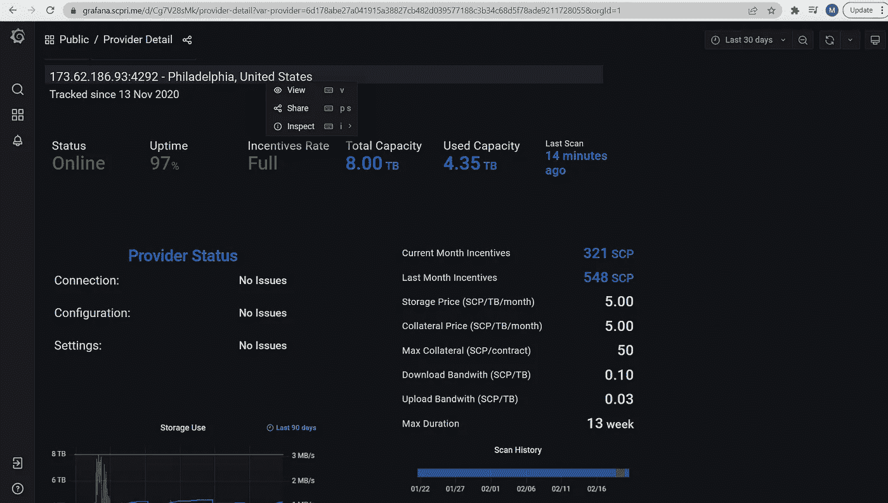

# SCPrime —提供您自己的存储的长期投资？

> 原文：<https://medium.com/coinmonks/scprime-long-term-investment-providing-your-own-storage-c2ab374c754a?source=collection_archive---------3----------------------->

From https://scpri.me

请记住这不是财务建议，请阅读文章底部的免责声明。

**什么是素数？**

一个分布式数据中心，允许个人和企业存储他们的信息，实际上是一个云存储平台。

这是一项企业级服务，例如，如果企业希望异地存储其平台和服务器备份，或者他们有不需要随时访问的数据，他们可以使用 SCPrime 平台来实现这一点。

这不是谷歌驱动/Dropbox 的替代品。虽然任何人都可以使用该平台来存储他们的信息，但它主要是针对那些希望异地存储大量信息的企业，这是该团队的目标市场。这可能是平台或服务的备份。所有的数据在通过网络分发之前都会被加密，关于这项服务的更多信息可以在这里找到:【https://scpri.me/value/。

这个团队在处理这个项目时肯定考虑到了客户。企业可以使用信用卡/借记卡或采购订单支付服务费用。这消除了企业需要从 TradeOgre 购买黄金的挑战！！

该小组由肯尼斯·斯科特·贝尔领导。我听了他们的一些 AMA 和肯尼斯可以非常直接，但很明显，该团队有一个项目的愿景，他们的目标是实现它。肯尼斯很诚实，直截了当，这可能会让一些人感到不安，但这些都是我个人认为使这个项目比大多数人更好的价值观。

他们的竞争对手是谁？

在加密领域，还有许多其他基于存储的项目，如 Sia、Chia、Filecoin 和 Storj。通过观察和比较这些项目的市值，我们可以了解到，如果 SCPrime 能够很好地执行他们的计划，他们在这个领域会做得如何。图 1 显示了当 SCP 达到与其他项目相同的市值时，SCP 的价格。(撰写本文时的价格为 0.96 美元)。

Fig 1

如果 Storj 市值达到 3.28 倍，Chia 是 5.1 倍，Sia 是 10.71 倍&如果 SCP 变得和 Filecoin 一样大，那就是 75.8 倍。

还有一些非加密的竞争对手，如 AWS、谷歌云和微软 Azure。现在我并不是说 SCP 将能够直接与这些猛犸象竞争，但是 AWS 公布了其整个 AWS 平台的全年收入数字为 622 亿美元，比上一年增长了 33%。为什么这很重要？嗯，两个原因，

1)如果 SCPrime 从 AWS、谷歌或微软获得哪怕一小部分客户，对项目来说都是巨大的

2)云计算是一个主要的增长领域，在未来几年都将如此。这意味着更多的数据需要存储在云中。

我怎样才能获得一些被动收入？

这个项目有两个部分。首先，它可以与像 Antminer A3 这样的 ASIC 一起使用。但是在你出去之前，请注意，团队计划在不久的将来迁移到 Stake 的证明。这意味着，如果你下注你的 SCP，你将获得下注的奖励，所以我不建议你出去为这个项目买一个 ASIC。

利用 SCP 赚钱的第二种方式是托管存储提供商。这是您向网络提供硬盘存储并通过 SCP 获得报酬的地方。你可以根据存储的数据量获得报酬，还可以根据你的设备上传和下载的数据量获得额外收入。这是我们要关注的。

**奖励&奖励**

奖励基于使用的存储容量以及下载和上传带宽。这可以由提供商设置。SCPrime 提供了关于如何为二手存储定价的最新指导。你的钱包里需要一些 SCP 作为抵押。这是锁定的，直到你完成存储合同。如果你不履行合同，这个抵押品将会丢失。

SCPrime 目前正在实施一项额外的激励计划，奖励供应商每月额外 115SCP/TB，该计划将每月减少 10SCP/TB，直到 2022 年底。当 TB 逐渐增加时，这是非常有利可图的。

举个简单的例子，看看当前的顶级提供商(图 2)，他们提供 8TB 的容量，但使用了 4.35TB。上个月，他们赚了 548 scp(526 美元)，这个月已经赚了 321 scp(308 美元)。

Fig 2

为了客观地看待这个问题，我从 1 月 28 日开始使用我的设备，到目前为止，我赚了 1.51 英镑(图 3)，但这一天比一天快。

Fig 3

那么为什么会有这么大的差别呢？收入最高者的设备在线时间超过 3 个月。这很重要，因为该提供商为他们的联系人设置的最大持续时间是 13 周。该提供商将从他们跨越几个月的合同中获得数据。

这意味着，收入最高的人会将前几个月的 4TB 中的相当一部分结转到本月。

**在这个项目中，你有什么选择？**

有不同的选项可以实现，我将介绍在 SCPrime 中与提供商合作的 4 种方式。

**XA-Miner**——[https://xaminer.net/shop/](https://xaminer.net/shop/)

这是官方特制的采矿机。我已经说出了下面的利弊。

赞成的意见

-有两种选择，16TB 和 64TB。

-它们提供 37.5%和 42.5%的返点，因此您可以在 12 个月内通过 SCP 收回这些返点

-折扣后，16TB 的价格不到 1，000 美元，64TB 的价格超过 2，000 美元

-它们是专为查看合同、钱包余额、交易和统计数据而设计的漂亮仪表板

-完全即插即用，对转发端口进行一些路由器配置更改

-支持项目的未来发展

骗局

-没有现货

-长长的等候名单

-表面上看起来很贵

**SCPrime 完整版—900 美元构建第一个 16TB**

我已经将一些相对便宜的组件与企业级磁盘放在一起开始使用。我还确保下面的组件相互兼容。利弊之下的完整列表。

赞成的意见

-大约与 16TB XA-Miner 的价格相同(折扣后)

-当您存储更多数据时，您可以随着项目进行扩展，因此非常灵活

-额外的 16TB 大约需要。$340

-您可以再添加 5 个硬盘。对于 16TB 的驱动器，这可能会使您达到 96TB，但这对于起步来说太大了！

-您不必从 16TB 开始，您可以从 2TB 开始。类似的企业级硬盘价格约为。$62.

-如果需要，您可以将零件用于替代项目。所以，如果你想建立一个 GPU 挖掘器，你有大部分的组件！

骗局

-你没有 XA-Miners 拥有的漂亮仪表盘

-你必须建造它，找地方存放它等等

SCPrime 团队明确表示，他们将优先考虑 XA-Miners 上的存储，因为这些存储为项目的持续发展提供资金

由于没有明确的计划，DIY 提供商将来可能会被踢出网络。这还没有得到证实，他们正在考虑 DIY 供应商有什么选择

内存— [16GB 海盗船 DDR4](https://www.amazon.com/gp/product/B07B2Y1N8B/ref=as_li_qf_asin_il_tl?ie=UTF8&tag=realisticcryp-20&creative=9325&linkCode=as2&creativeASIN=B07B2Y1N8B&linkId=9b1940f13d6b3af2cb32ffd1a4a36311)

处理器— [英特尔酷睿 i3–10100 f](https://www.amazon.com/gp/product/B08LKJPR5X/ref=as_li_qf_asin_il_tl?ie=UTF8&tag=realisticcryp-20&creative=9325&linkCode=as2&creativeASIN=B08LKJPR5X&linkId=64b1ef548b670503d56fc7e80f6a200f)

主板— [微星 B560M PRO-VDH WIFI](https://www.amazon.com/gp/product/B092HLGFXK/ref=as_li_qf_asin_il_tl?ie=UTF8&tag=realisticcryp-20&creative=9325&linkCode=as2&creativeASIN=B092HLGFXK&linkId=1a51e8b1c0fe26997e39effdd12e5448)

16TB 硬盘存储— [希捷 EXOS 企业版](https://www.amazon.com/gp/product/B07SPFPKF4/ref=as_li_qf_asin_il_tl?ie=UTF8&tag=realisticcryp-20&creative=9325&linkCode=as2&creativeASIN=B07SPFPKF4&linkId=07c1b34095fb79c7c6fab83b8a0a5638)

2TB 硬盘存储— [希捷梭鱼计算](https://www.amazon.com/gp/product/B07H2RR55Q/ref=as_li_qf_asin_il_tl?ie=UTF8&tag=realisticcryp-20&creative=9325&linkCode=as2&creativeASIN=B07H2RR55Q&linkId=e3ce62179dfd87f89b4020bde81d9473)

驱动操作系统 M.2(用于操作系统)——[西部数据蓝色 SN550 1TB](https://www.amazon.com/gp/product/B07YFFX5MD/ref=as_li_qf_asin_il_tl?ie=UTF8&tag=realisticcryp-20&creative=9325&linkCode=as2&creativeASIN=B07YFFX5MD&linkId=099db1112aa9d217b5fb40ffe0d13af2)

案例— [Antec P101 无声](https://www.amazon.com/gp/product/B07LBXP8KZ/ref=as_li_qf_asin_il_tl?ie=UTF8&tag=realisticcryp-20&creative=9325&linkCode=as2&creativeASIN=B07LBXP8KZ&linkId=0cef7a54110e761aeb44d8f53929999e)

PSU — [EVGA 500 GD 80+金](https://www.amazon.com/gp/product/B07WC79PPN/ref=as_li_qf_asin_il_tl?ie=UTF8&tag=realisticcryp-20&creative=9325&linkCode=as2&creativeASIN=B07WC79PPN&linkId=221a53f87c6bc91c1e63d47e7773166a)

**请注意**:已经在 PCPartPicker 上检查了兼容性，在编写本指南时这些被认为是兼容的

**简单，容易&可扩展！**—16TB—1000 美元(650 美元 NAS—16TB 驱动器 350 美元)

这是我选择的选项。我有一个 Synology DS920+ NAS，只有一个 16TB 的驱动器。需要注意的是，您可以直接在 NAS 上运行 Docker，因此不需要 PC 或笔记本电脑来运行该提供程序。这是一个只有 Linux 的版本，所以没有安装 Windows 操作系统的选项。

赞成的意见

-可升级到 4 个驱动器，以适应项目规模

-您也可以从小硬盘开始—60 美元的硬盘(总共 700 美元)

-还有一个可扩展的 NAS 设备，可再添加 5 个驱动器，总共 9 个。

-小巧紧凑，维护成本低

骗局

-您需要熟练使用命令行界面来设置设备

-如果某个组件出现故障，需要致电保修，它可能会离线很长时间

-它没有 XA-Miner 仪表盘

由于没有明确的计划，DIY 提供商将来可能会被踢出网络。这还没有得到证实，他们正在考虑 DIY 供应商有什么选择

-不像 PC 构建选项那样容易改变用途，但两者肯定都有转售价值。

Synology DS920+ — [(美国/加拿大/欧盟)](https://www.amazon.com/gp/product/B087Z34F3R/ref=as_li_qf_asin_il_tl?ie=UTF8&tag=realisticcryp-20&creative=9325&linkCode=as2&creativeASIN=B087Z34F3R&linkId=b052026cca23e559e23aeb8b73224ffc) [(仅限英国)](https://www.amazon.co.uk/gp/product/B08BG6WM3K/ref=as_li_qf_asin_il_tl?ie=UTF8&tag=realisticcryp-21&creative=6738&linkCode=as2&creativeASIN=B08BG6WM3K&linkId=b70bf4a48b268336b98d2852177caa64)

硬盘存储 16TB — [希捷 EXOS 企业](https://www.amazon.com/gp/product/B07SPFPKF4/ref=as_li_qf_asin_il_tl?ie=UTF8&tag=realisticcryp-20&creative=9325&linkCode=as2&creativeASIN=B07SPFPKF4&linkId=07c1b34095fb79c7c6fab83b8a0a5638)

2TB 硬盘存储— [希捷梭鱼计算](https://www.amazon.com/gp/product/B07H2RR55Q/ref=as_li_qf_asin_il_tl?ie=UTF8&tag=realisticcryp-20&creative=9325&linkCode=as2&creativeASIN=B07H2RR55Q&linkId=e3ce62179dfd87f89b4020bde81d9473)

**最后一个选项——使用您已经拥有的资源**

你可以利用你已经拥有的来做出贡献。您的 PC 或 NAS 设备等。

赞成的意见

-免费入场

-如果你改变主意，你可以免费退出

骗局

-如果您使用的是多用途设备，您可能会经历更多的停机和断电，从而降低奖励

-你不会得到 XA-Miner 仪表板

SCPrime 团队明确表示，他们将优先考虑 XA-Miners 上的存储，因为这些存储为项目的持续发展提供资金

**我的策略是什么？**

总之，在这个项目中有很多选择可以开始。他们的进入成本也相对较低。

我前面提到过，我的策略是 Synology NAS，但是，当 XA-Miner 可用时，我将购买一个并与我的 DIY 提供商一起运行它。我相信这个项目是长期的，我会在几年内设置和忘记我的 DIY 设备& XA-Miner(当我设法得到一个的时候)。我真的相信这个项目有很大的潜力，在可预见的未来我会继续关注它。

如果您有任何问题或意见，请随时联系我！

**附属链接**

更多优惠还可以在这里找到:[https://linktr.ee/RealisticCrypto](https://linktr.ee/RealisticCrypto)

还有，如果你想请我喝杯咖啡或者啤酒:) :

BTC—BC 1 qaxaq 2 q 9 js 89 gyzhr 0202 sxt 6 hgchprqjga 5 px

基于 ETH、BNB、AVAX、SOL 和 FTM 的令牌—0 x3b 7b 843d 8125 Fe 7 EBA 541 e 1d 751 a4 a 73 f 0 cfad 4c

**免责声明**

这不是财务建议，我不是财务顾问或会计或税务专家。这是我对帮助过我的软件工具的体验，以及我使用它们的经历。

我在本指南中使用了推荐链接。使用这些工具有助于以后的文章，所以如果你觉得这篇文章有用，并且想看看我提到的工具，请使用它们。我还会叫出你在哪里打折——双赢对吧？

> 加入 Coinmonks [电报频道](https://t.me/coincodecap)和 [Youtube 频道](https://www.youtube.com/c/coinmonks/videos)了解加密交易和投资

## 也阅读

 [## 杠杆代币[多头代币]终极指南

### 杠杆化令牌是具有杠杆化风险敞口的 ERC20 令牌，不考虑保证金、要求、管理…

medium.com](/coinmonks/leveraged-token-3f5257808b22)  [## 最佳加密交易所| 2022 年十大加密货币交易所| CoinCodeCap

### 哪一个是最好的加密交换？在本文中，我们将根据多种加密货币列出 10 大加密货币交易所

coincodecap.com](https://coincodecap.com/crypto-exchange)  [## 2022 年最佳加密交换平台| CoinCodeCap

### 随着时间的推移，我们大多数人将转向 dex 以获得更好的安全性和隐私。因此。在这里，我们将讨论…

coincodecap.com](https://coincodecap.com/best-swap-platforms)  [## 2022 年最佳加密和比特币赌场(美国批准，存款奖励)

### 接收、支付和赚取加密货币| |有各种各样的最佳在线赌场可供选择，有可能…

coincodecap.com](https://coincodecap.com/best-online-casinos)  [## 2021 年最佳加密借贷平台| 6 大比特币借贷平台

### 获得比特币和其他加密货币的最佳贷款利率

medium.com](/coinmonks/top-5-crypto-lending-platforms-in-2020-that-you-need-to-know-a1b675cec3fa)  [## 2021 年 6 大最佳硬件钱包|顶级加密硬件钱包[更新]

### 最好的加密货币硬件钱包是绝对必要的。我们将在 NGRAVE、Ledger Nano X 和…

medium.com](/coinmonks/the-best-cryptocurrency-hardware-wallets-of-2020-e28b1c124069)  [## 加密交易机器人——19 款最佳免费加密交易机器人

### 2022 年币安、比特币基地、库币和其他密码交易所的最佳密码交易机器人。四进制，位间隙…

medium.com](/coinmonks/crypto-trading-bot-c2ffce8acb2a)  [## 最佳 4 个加密交易信号电报通道

### 这是乏味的找到正确的加密交易信号提供商。因此，在本文中，我们将讨论最好的…

medium.com](/coinmonks/best-crypto-signals-telegram-5785cdbc4b2b)