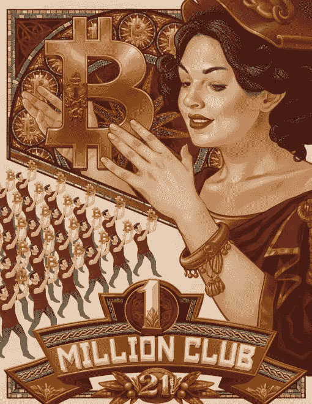
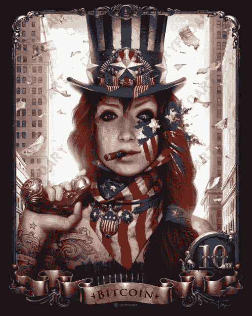

# 被任命为 Cryptoart 即将开展的 NFT 项目的集成合作伙伴

> 原文：<https://medium.com/coinmonks/scrypted-named-as-integration-partner-for-cryptoarts-forthcoming-nft-project-acf3aefba4f?source=collection_archive---------58----------------------->

**DC 华盛顿州**(2022 年 4 月 6 日)——专注于弥合数字资产和元宇宙之间差距的科技初创公司 Scrypted 今天宣布，他们已被选为 Cryptoart 即将发布的不可替代令牌(NFT)的集成合作伙伴。

1 Million Bitcoin Club by Alix Branwyn (Cryptoart.com)

Scrypted 最近加入了弗吉尼亚州严肃游戏研究所(VSGI) 的[常驻项目，是一家以元宇宙为中心的初创公司，由一群资深游戏和虚拟世界开发者支持，专注于解决 Web 3.0 核心的复杂问题。他们在加密货币、区块链技术和智能合约开发方面的专业知识使他们有独特的资格应对下一代互联网发展的潜在挑战。](https://www.pwcded.org/news/scrypted-inc-brings-metaverse-residency-to-virgina-serious-gaming-institute)

Scrypted 的最新项目是与 Cryptoart 的合作，crypto art 自 2013 年以来一直在销售融合比特币主题和区块链技术的实物艺术品。尤其著名的是他们的艺术品兼作加密货币的安全存储机制，这是他们的第一件实物艺术品，由乌克兰艺术家亚历山大·费多索夫(Alexander Fedosov)创作的“爱国者”(Patriot)，近十年前发行，限量印刷了 280 件，销售一空。

Patriot by Alexander Fedosov (Cryptoart.com)

自 2013 年以来，Cryptoart 已经向加密货币社区出售了数千件艺术品，最近宣布其整个投资组合将很快变得与形式无关，这意味着它可以作为数字和物理资产无缝地进出区块链。Scrypted 将负责创建管理这些交易的智能合同，并为所有者提供其艺术作品的前所未有的出处。所有者将拥有非商业复制权，并能够展示其艺术作品和委托实物复制品供个人使用。

“Cryptoart 项目特别令人兴奋，因为它需要这样的交互式代码，”Scrypted 的创始人蒂姆·科顿评论道。“它以艺术品生命周期的形式展示了 NFT 独特的效用:从实物到虚拟，然后再回来。Cryptoart 来找我们是因为 ERC721 和 ERC1155 令牌的样板 NFT 代码不能满足它。我们建立的技术专门处理现有客户的认证，同时防止抢注和欺诈，以及艺术本身的赎回和转换为非功能性交易。"

Scrypted 还为 Cryptoart 提供全栈 web 开发服务，以尽可能简化客户的入职流程，提供软钱包和基于 web 的指导用户体验，用于将现有艺术品兑换为 NFT 或购买新版本。此外，Cryptoart 将有权访问 Scrypted 的资产管理管道(AMP)，这是一个基于网络的平台，使向 NFT 智能合约添加新艺术品像使用网络表单一样简单。

鉴于自 2013 年以来 Cryptoart 的收藏艺术品价值的上升，许多现有客户可能会利用他们新发现的能力，将他们的艺术品兑换成 NFT。欲了解更多关于即将到来的销售和 NFT 发布的详情，请访问[www.cryptoart.com](http://www.cryptoart.com/)。

# **关于猜测**

*Scrypted 为元宇宙建立交互式数字资产。作为一家专注于 Web 3.0 和去中心化身份交叉的初创公司，Scrypted 正在为数字资产的各个方面提供支持，包括将现有产品(收藏品、奢侈品、艺术品)整合为不可替代的令牌(NFT)。Scrypted 还在开发以人工智能(AI)研究为中心的下一代区块链游戏和虚拟世界技术。更多信息请访问***。**

# ***关于 CRYPTOART***

**Cryptoart 出版与加密相关的艺术品，并应用区块链技术，使艺术品更容易收集、交易，并成为价值储存手段。更多信息请访问*[*www.cryptoart.com*](http://www.cryptoart.com/)*。**

> **加入 Coinmonks* [*电报频道*](https://t.me/coincodecap) *和* [*Youtube 频道*](https://www.youtube.com/c/coinmonks/videos) *了解加密交易和投资**

# *另外，阅读*

*   *[有哪些交易信号？](https://coincodecap.com/trading-signal) | [Bitstamp vs 比特币基地](https://coincodecap.com/bitstamp-coinbase) | [买索拉纳](https://coincodecap.com/buy-solana)*
*   *[ProfitFarmers 回顾](https://coincodecap.com/profitfarmers-review) | [如何使用 Cornix 交易机器人](https://coincodecap.com/cornix-trading-bot)*
*   *[十大最佳加密货币博客](https://coincodecap.com/best-cryptocurrency-blogs) | [YouHodler 评论](https://coincodecap.com/youhodler-review)*
*   *[MyConstant Review](https://coincodecap.com/myconstant-review) | [8 款最佳摇摆交易机器人](https://coincodecap.com/best-swing-trading-bots)*
*   *[MXC 交易所评论](/coinmonks/mxc-exchange-review-3af0ec1cba8c) | [Pionex vs 币安](https://coincodecap.com/pionex-vs-binance) | [Pionex 套利机器人](https://coincodecap.com/pionex-arbitrage-bot)*
*   *[我的密码交易经验](/coinmonks/my-experience-with-crypto-copy-trading-d6feb2ce3ac5) | [《比特币基地评论》](/coinmonks/coinbase-review-6ef4e0f56064)*