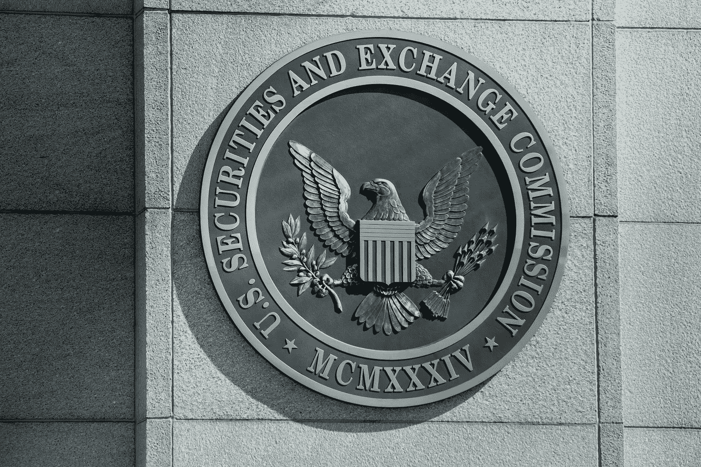

# SEC 增加了 20 名团队成员以扩大加密执行部门——Derev 博客

> 原文：<https://medium.com/coinmonks/sec-adding-20-team-members-to-ramp-up-crypto-enforcement-unit-derev-blog-d573cb123337?source=collection_archive---------51----------------------->

# 快速拍摄:

*   SEC 计划为其加密和网络安全部门招聘 20 名团队成员。
*   **增强的任务组将有助于保护投资者免受反复发生的数字资产诈骗。**

美国证券交易委员会(SEC)打算将…