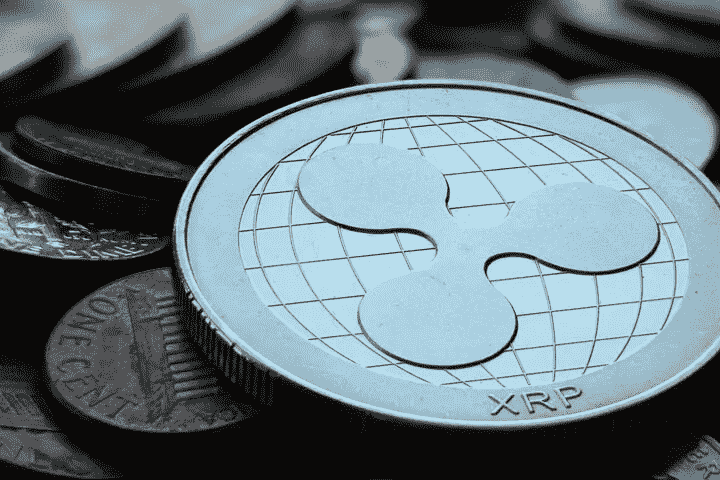

# SEC 诉 RIPPLE: Ripple 被勒令披露法律意见

> 原文：<https://medium.com/coinmonks/sec-v-ripple-ripple-ordered-to-disclose-legal-opinions-61e69e07a082?source=collection_archive---------30----------------------->

在过去的一周里，美国证券交易委员会(SEC)针对 Ripple Labs 及其加密令牌 XRP 的案件出现了潜在的关键进展。正如我们在之前的一篇博客文章中所讨论的，SEC 认为 XRP 是一只证券，Ripple 在没有注册的情况下出售 XRP 是证券立法的越位。

在最近的事态发展中，Ripple 被责令提供其在 2012 年 2 月和 10 月收到的两份法律意见的未经编辑的副本。这些法律意见是关于美国证券交易委员会是否会认为 XRP 是一个证券。

【2012 年 2 月意见

2012 年 2 月意见认定:[【1】](#_ftn1)

*购买的硬币可能是预付费访问:根据《银行保密法》,硬币可能会受到“预付费访问”的监管。这规范了预付费接入的提供商和销售商。*

*任何出售给投资者的硬币都可能被视为证券:“如果出售给为创始人提供启动和运营 NewCoin 所需资本的投资者，硬币可能会被视为证券，并受到联邦证券法的监管”。*

*最初未售出的硬币如果在日后售出，仍可构成证券:硬币日后在二级市场出售时可被视为证券。*

*此外，硬币可能成为商品:如果硬币的未来交割合同得以开发，它们可能会被归类为《商品交易法》下的商品。*

监管者可以将交易所视为货币传递者或货币兑换商。

**2012 年 10 月意见**

根据 2012 年 2 月的意见，Ripple 似乎修改了其业务计划，然后就其修改后的计划征求了意见。2012 年 10 月的第二份意见认为:

*尽管我们认为可以提出一个令人信服的论点，即根据联邦证券法，纹波信用不构成证券，但鉴于缺乏判例法，我们认为存在 SEC 不同意我们分析的风险，尽管风险很小*。

2012 年 10 月的意见还建议 Ripple 寻求 SEC 的一封信，确认它不会就 XRP 问题对 Ripple 采取行动。

**这在当前动作中意味着什么？**

在发布这些意见时，SEC 和 Ripple 都声称这些意见支持他们各自的案件。证交会认为，这些意见表明，Ripple 知道 2012 年存在 XRP 被证交会视为证券的风险。正如美国证券交易委员会进一步指出的那样，Ripple 忽视了这一风险，也没有寻求美国证券交易委员会的不作为函。

另一方面，2012 年积极征求意见。这是在美国证券交易委员会以有意义的方式将注意力转向加密资产之前的几年，当时缺乏关于这一主题的判例法。因此，Ripple 可以辩称，这些意见表明，它在推出 XRP 时是谨慎和勤勉的。

此外，Ripple 可以辩称，SEC 默许其有权对 Ripple 采取行动，直到 2020 年 12 月才启动这一行动。换句话说，如果 XRP 在 2012 年就令人担忧，为什么 SEC 等了 8 年才采取行动？

此外，从实践的角度来看，2012 年 10 月的意见确实承认，SEC 发现 XRP 是一种证券的风险很小。尽管美国证券交易委员会肯定会利用这一点，但这种“掩饰自己”的语言在法律意见中很常见。我预计双方会就该声明的权重进行辩论，Ripple 认为必须在整个意见的背景下进行考虑。

总的来说，法律意见的披露是有趣的，但可能对法律行动没有什么影响。然而，随着这一行动的继续，肯定会有更多的发展，我们将在这里提供更新。

本文不是理财建议。

凯文·斯坦纳和米哈伊·贝谢

[https://www . fxempire . com/forecasts/article/启封-documents-favor-ripple-and-xrp-905490](https://www.fxempire.com/forecasts/article/unsealed-documents-favor-ripple-and-xrp-905490)

> 加入 Coinmonks [电报频道](https://t.me/coincodecap)和 [Youtube 频道](https://www.youtube.com/c/coinmonks/videos)了解加密交易和投资

# 另外，阅读

*   [如何购买 Monero](https://coincodecap.com/buy-monero) | [IDEX 评论](https://coincodecap.com/idex-review) | [BitKan 交易机器人](https://coincodecap.com/bitkan-trading-bot)
*   [CoinDCX 评论](/coinmonks/coindcx-review-8444db3621a2) | [加密保证金交易交易所](https://coincodecap.com/crypto-margin-trading-exchanges)
*   [红狗赌场评论](https://coincodecap.com/red-dog-casino-review) | [Swyftx 评论](https://coincodecap.com/swyftx-review) | [CoinGate 评论](https://coincodecap.com/coingate-review)
*   [Bookmap 评论](https://coincodecap.com/bookmap-review-2021-best-trading-software) | [美国 5 大最佳加密交易所](https://coincodecap.com/crypto-exchange-usa)
*   [如何在 FTX 交易所交易期货](https://coincodecap.com/ftx-futures-trading) | [OKEx vs 币安](https://coincodecap.com/okex-vs-binance)
*   [CoinLoan 评论](https://coincodecap.com/coinloan-review) | [YouHodler 评论](/coinmonks/youhodler-4-easy-ways-to-make-money-98969b9689f2) | [BlockFi 评论](https://coincodecap.com/blockfi-review)
*   [XT.COM 评论](https://coincodecap.com/profittradingapp-for-binance)币安评论 |
*   [SmithBot 评论](https://coincodecap.com/smithbot-review) | [4 款最佳免费开源交易机器人](https://coincodecap.com/free-open-source-trading-bots)
*   [比特币基地僵尸程序](/coinmonks/coinbase-bots-ac6359e897f3) | [AscendEX 审查](/coinmonks/ascendex-review-53e829cf75fa) | [OKEx 交易僵尸程序](/coinmonks/okex-trading-bots-234920f61e60)