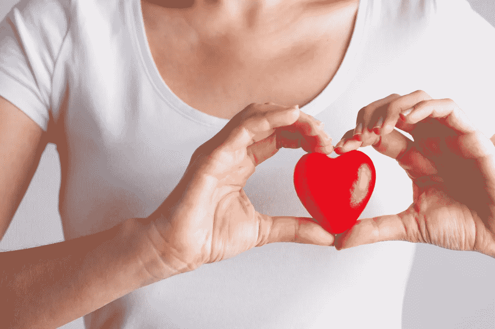

# 健康生活的秘密

> 原文：<https://medium.com/coinmonks/secrets-to-healthy-living-90e428cef43e?source=collection_archive---------89----------------------->

在这个忙碌和工作的时代，人们很难把照顾他们的健康作为优先事项，直到为时已晚。如果在所有的生活压力之后，你不得不把辛苦挣来的钱花在健康上，因为你从一开始就没有这样做，你会有什么感觉？那肯定会令人讨厌。从大多数医学研究来看，我们的健康基于我们的饮食、思维、呼吸和行为。如果这是如此简单，那么为什么我们都不健康，仍然有无数关于健康的问题在全球蓬勃发展。是的，这仍然是一个问题，因为我们为没有时间找借口。因此，我们接受我们得到的任何东西，以便为其他事情腾出时间。我并不是说我们都应该关注自己的健康，但至少我们应该像对待工作一样重视健康。

> “时间和健康是两种宝贵的资产，直到耗尽时，我们才意识到并珍惜它们”，丹尼斯·维特利。

健康是人类的一种完整状态。我们在情感上、精神上、身体上、社会上和经济上都充分发挥作用的状态。大多数人认为健康是没有不适的状态，但健康远不止于此。你可以过得很好，但在社会上、经济上或情感上你是不稳定的。所有这些都是有助于人类幸福的因素。我们的生活方式是影响我们生活的主要因素。

> “你的思维方式、行为方式、饮食方式会影响你 30 到 50 年的生活”，狄巴克·乔布拉。

在其他影响我们健康的因素中，它始于一个人。是的，这听起来很荒谬。大多数人总是低估自己。要么是他们没有价值，要么是他们感到被抛弃。虽然有这些感觉是好的，但是让它们占据你生活中最好的部分会对你的健康产生负面影响。最具欺骗性的是，我们没有意识到它对我们的影响。它慢慢地打断我们，直到为时已晚。情绪是人类的重要组成部分，因此拥有情绪是好事，但你确定你拥有正确的情绪吗？对一些人来说，根除消极情绪可能是一个艰难的决定，这听起来很奇怪，但却是事实。人们有时会原谅自己，说这是事实。你保持健康的决定必须是根除所有的消极，尽可能地保持积极的状态。

> “健康的外表从内心开始”，罗伯特·乌立希。

饮食是健康的另一个重要因素。在这个快餐时代，大多数人不需要太担心吃什么。我就是这方面的一个例子。在一整天的讲座和学习之后，我宁愿叫外卖也不愿自己做饭。这在大多数时候是非常错误的。我不是说外卖不好或什么的，但是你为自己准备一些美味健康的食物有多难？第一，它会提升你的情绪，因为你已经能够完成一些事情，同时保持你的健康。正确的饮食可以让我们远离很多医学威胁。多喝水，多吃水果和蔬菜，少吃对身体有害的东西。饮食包括身体活动。锻炼不仅包括去健身房，还包括在田野、房子或街道周围散步。

> “让食物成为你的药，让药成为他们的食物”，希波克拉底。

这是一些健康生活的小贴士，可以帮助你在有生之年保持正确的状态。不要被工作的世界所消耗，为了其他任何事情而放弃你的健康。听起来很简单，良好的休息可以让你远离许多健康问题，如抑郁、压力和其他问题。我建议在所有生活工作中，腾出时间休息。

> “在医生的书中，开怀大笑和长眠是最好的治疗方法”，爱尔兰谚语。

“你只能活一次，但如果你活得好，一次就足够了”，梅·韦斯特。

> 加入 Coinmonks [电报频道](https://t.me/coincodecap)和 [Youtube 频道](https://www.youtube.com/c/coinmonks/videos)了解加密交易和投资

# 另外，阅读

*   [SmithBot 评论](https://coincodecap.com/smithbot-review) | [4 款最佳免费开源交易机器人](https://coincodecap.com/free-open-source-trading-bots)
*   [比特币基地僵尸程序](/coinmonks/coinbase-bots-ac6359e897f3) | [AscendEX 审查](/coinmonks/ascendex-review-53e829cf75fa) | [OKEx 交易僵尸程序](/coinmonks/okex-trading-bots-234920f61e60)
*   [如何在印度购买比特币？](/coinmonks/buy-bitcoin-in-india-feb50ddfef94) | [瓦济克斯审查](/coinmonks/wazirx-review-5c811b074f5b)
*   [隐翅虫替代品](/coinmonks/cryptohopper-alternatives-d67287b16d27) | [HitBTC 审查](/coinmonks/hitbtc-review-c5143c5d53c2)
*   [CBET 回顾](https://coincodecap.com/cbet-casino-review) | [库科恩 vs 比特币基地](https://coincodecap.com/kucoin-vs-coinbase)
*   [折叠 App 审核](https://coincodecap.com/fold-app-review) | [Kucoin 交易机器人](/coinmonks/kucoin-trading-bot-automate-your-trades-8cf0ca2138e0) | [Probit 审核](https://coincodecap.com/probit-review)