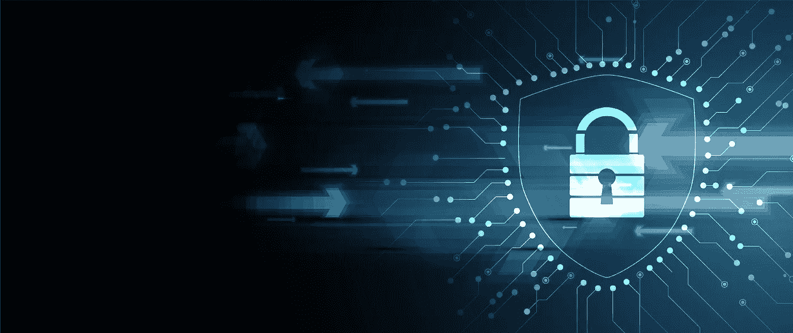
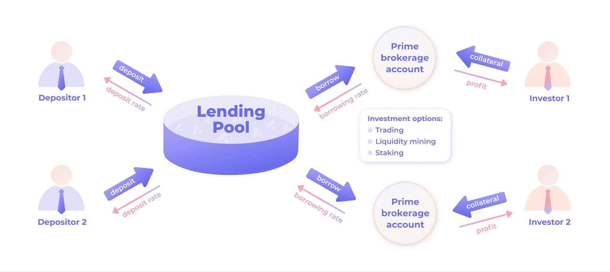

# 保护安全—超越审计

> 原文：<https://medium.com/coinmonks/securing-security-775977b17029?source=collection_archive---------12----------------------->

我们打算解锁区块链。意思是:将目前锁定在贷款协议中的 420 亿美元交到积极的投资者手中。我们通过提供分散的、抵押不足的贷款协议来实现这一目标，在该协议中，借入的资金可用于杠杆交易、赌注和流动性挖掘。

> 解锁区块链。

这是一项雄心勃勃的任务，关系到大量的资产。安全是关键。为此，我们正在尽一切努力确保《议定书》资金的充分安全。这包括团队在 mainnet fork 上对每个变更执行代码审查、严格的单元测试和集成测试。除此之外，由专业的、独立的审计员进行了几次审计，评估结果代码是安全的。你可以在这里找到审计权。当然，这对我们来说只是第一步。我们打算让我们处理证券的方式尽可能透明和易懂，对流动性提供者和借款者都一样。

**流动性提供者是沙布**

作为我们抵押不足的流动性池的流动性提供者，您是社区的重要组成部分。通过提供那些原本会闲置的资产，你给了他们一个活跃流动的生活。当然，与此同时，你也要确保你的资产不会在糟糕的投资中损失。

为了确保您的资金是沙布，DeltaPrime 协议通过以下方式保护安全性:

当你将资产存放在流动性池中时，交易就被保存下来，每个潜在的借款人都可以借一部分资金用于投资。作为担保手段，他们将不得不增加自己的资金存款，价值至少为贷款的 25%。当这种情况发生时，一个全新的智能合同被创建，贷款和存放的抵押品被发送到该合同。这份智能合同的唯一目的是作为提供商保护您的资产。

为了做到这一点，合同将资金的流动限制在平台提供的服务范围内。在这里，它跟踪贷款价值比(LTV)的百分比。这个百分比的计算方法是，将贷款的总价值(以$AVAX 为单位)除以你在智能合约中的抵押品价值。贷款的价值总是保持不变:投资者借的所有东西。根据投资的盈利能力，价值会有所不同。如果整体投资盈利，抵押品的价值增加，降低 LTV。如果整体投资亏损，抵押品的价值就会下降，LTV 就会增加。

这些合同通过防止贷款的 LTV 达到临界条件，确保所有流动性提供者全部收回贷款。这发生在两个方面:一个完全自动化的预防机制确保借款人的每一个行动都需要使贷款处于有偿付能力的状态。它防止任何导致破产贷款的行为发生。一旦合约的 LTV 达到 500%或更高，每个人都可以触发协议中的一个功能，旨在清算合约的一部分，使 LTV 回到安全值。这些“清算人”受到奖励，从被清算借款人的存款中支付。这种机制有两个目的。首先，它激励清算人在 LTV 上升到 500%以上时立即相互竞争清算贷款，从而加强了安全程序。其次，这一机制激励借款人避免承担不必要的风险，因为他们将为清算买单。

借款人承担其投资的全部风险，使你作为流动性提供者的存款安全。

Cashflow between depositors / liquidity providers — the lending pool — Personal Prime brokerage accounts and active investors / borrowers

**借款人为沙布**

"*借款人承担其投资的全部风险"*

作为借款人，你可能会问:*这种完全风险是什么？*

开始。你才是掌控一切的人。你控制自己的利润和风险。通过使用 DeltaPrime 协议，你给了自己放大资本实力的力量。如果你对自己的投资策略没有信心，就不要给自己这种力量。虽然使用杠杆放大了好的投资，导致更大的利润，但它也放大了坏的投资，这可能导致更大的损失。也就是说，该协议也在照顾你，帮助你将风险降低到负责任的水平。

第一次贷款时，最高 LTV 设定为 400%。这种缓冲保护你不会因为轻微的价格波动而面临立即清算的风险。

虽然你可以完全自由地根据自己的判断进行任何交易和投资，但该协议将保护你不犯任何可能导致立即平仓的错误。这意味着你可以交易和投资，而不必担心你的交易会立即清算你的资产。当然，你仍然必须对你的交易和投资保持清醒，特别是对于波动性极大的货币，从贷款到清算的时间窗口可能非常短。思考和做出这些决定的自由都是你的。

另一项安全措施是通过我们与 RedStone 的合作。通过利用依赖于多个数据提供者和元交易的 oracle，我们保护我们的用户免受价格操纵造成的损失。例如，AVAX 的当前价格是来自 14 个不同提供商的数据的结果。RedStone 和 DeltaPrime 上的数据完整性特别高，可以保护您免受 DeFi 生态系统中邪恶行为者的攻击。请务必阅读我们即将发布的文章，以了解更多关于我们与 RedStone 的合作以及这对 DeltaPrime 用户的益处。

**确保安全**

简而言之，使用 DeltaPrime，您的资金安全是我们的首要任务。无论你是流动性提供者还是借款者，无论你是短期还是未来几年都是如此。我们的协议是围绕安全性建立的，这比我们对代码进行的严格的专业审计更进一步。最重要的是，我们希望尽可能透明，所以如果你在读完这篇文章后有任何进一步的问题，请随时让我们知道我们的[不和谐](https://discord.com/invite/9bwsnsHEzD)。

# — — — — — — — — — — — — — — — — — —

# 关于 DeltaPrime

DeltaPrime 是您的主要经纪人，致力于释放 DeFi 的全部潜力。我们通过提供安全的低抵押贷款，重新分配资产，关注资金效用最大化来实现这一目标。我们的投资者建立在 Avalanche 网络的坚实基础之上，可以确保他们最重要的投资获得快速可靠的交易。

一定要来看看我们！

> ***|🐦* [*推特*](https://twitter.com/DeltaPrimeDefi) *|👾* [*不和*](https://discord.gg/9bwsnsHEzD) *|***