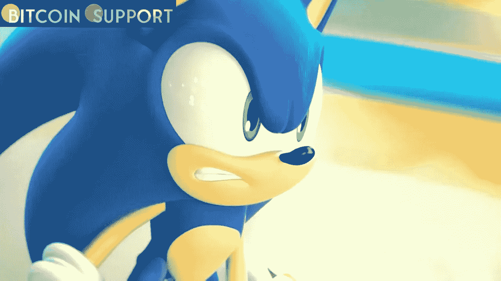

# 世嘉正在探索将 NFT 加入超级游戏项目，作为一种“逻辑扩展”

> 原文：<https://medium.com/coinmonks/segas-super-game-project-is-considering-adding-nfts-as-a-natural-expansion-bc26fc23c3d8?source=collection_archive---------32----------------------->

**Visit our website for full blog:-**[**https://bitcoinsupports.com/segas-super-game-project-is-considering-adding-nfts-as-a-natural-expansion/**](https://bitcoinsupports.com/segas-super-game-project-is-considering-adding-nfts-as-a-natural-expansion/)

世嘉制作人 Masayoshi Kikuchi 表示:“这是游戏未来的逻辑延伸，它将扩展到包括云游戏和网络设备在内的新领域。”日本游戏巨头世嘉(Sega)正在考虑将云技术和 NFTs 纳入其新的“超级游戏”计划，该计划将连接几个游戏。

这一消息引发了游戏界密码怀疑论者的强烈抗议，许多人本周在公司网站上发泄了他们的担忧。

超级游戏计划将在未来五年内启动，预计将催生一系列新的跨平台 AAA 级优质游戏。据报道，该公司正考虑在该项目上投资 8 亿多美元。在通过世嘉日本招聘网站进行的一次采访中，提到了 NFT 和云支持的可能性。上周早些时候，游戏新闻网站 Video Games Chronicle 制作了一份英文翻译。世嘉制作人 Masayoshi Kikuchi 在采访中指出，游戏行业有着向新的文化和技术形式扩张的“历史”，特别是社交媒体，近年来通过 YouTube 和 Twitch 等平台观看他人玩游戏变得越来越受欢迎。

菊池继续暗示向云计算和非易失性存储器的转变将不可避免，并补充道:

**“这是游戏未来的逻辑延伸，它将扩展到包括云游戏和基于网络的交易等新领域。此外，我们正在开发 SuperGame，目标是展示不同游戏的整合程度。”**

[https://twitter.com/DynamoSuperX/status/1513266676401426441](https://twitter.com/DynamoSuperX/status/1513266676401426441)

世嘉粉丝在推特上表达了他们的担忧，一名用户写道，“世嘉，你敢，你现在做得很好，不要搞砸了。”马修·亨泽尔说，“我以前说过，我袖手旁观..NFT 不代表该死，谢谢！我的情况不是这样。”与之前大型游戏公司宣布 NFT 计划的情况相比，这次的反应似乎要温和得多，这可能是因为这些评论来自世嘉日本公司的高管，而不是该公司的美国分公司。

[https://twitter.com/Kotaku/status/1513233488090128390](https://twitter.com/Kotaku/status/1513233488090128390)

在 Reddit 上，一些 r/gaming 社区对 NFTs 可能的整合提出了质疑，其中“Radingod123”声称，由于所谓的金字塔计划特征，游戏公司更喜欢 NFTs 的想法。

然而，其他用户，如“Bouldurr”，认为可以拥有和出售的跨游戏可转移数字资产的概念是一个“很好的概念”，可能在适当的情况下工作:

**“纳米结构薄膜是一种技术。他们本质上既不善良也不邪恶。这种恐惧源于目前游戏中存在的贪婪的微交易。一些人反对‘NFT’游戏的概念是合理的。”**

“然而，这个概念在某些情况下具有潜力。我希望能够卖掉我的炉石系列，即使亏本也在所不惜，”他们补充道。传奇演员吉姆·凯里在根据世嘉游戏改编的《刺猬索尼克》电影中饰演机器人尼克博士，他也宣布了进军 NFT 空间的野心，这让反加密游戏玩家雪上加霜。除了表演，凯里还是一位著名的艺术家，在本月早些时候接受 Access 采访宣传《刺猬索尼克 2》时，这位 60 岁的老人表示，他将很快推出一个名为“魔幻时刻”的 NFT 系列，其中将包括数字艺术和口语作品。

[【https://twitter.com/DCLBlogger/status/1510939691985833989】](https://twitter.com/DCLBlogger/status/1510939691985833989)

**访问我们的网站获取完整博客:-**[**https://bitcoinsupports . com/segas-super-game-project-is-considering-adding-nfts-as-a-natural-expansion/**](https://bitcoinsupports.com/segas-super-game-project-is-considering-adding-nfts-as-a-natural-expansion/)

**免责声明:以上为作者观点，不应视为投资建议。读者应该自己做研究。**

> 加入 Coinmonks [电报频道](https://t.me/coincodecap)和 [Youtube 频道](https://www.youtube.com/c/coinmonks/videos)了解加密交易和投资

# 另外，阅读

*   [如何购买 Monero](https://coincodecap.com/buy-monero) | [IDEX 评论](https://coincodecap.com/idex-review) | [BitKan 交易机器人](https://coincodecap.com/bitkan-trading-bot)
*   [CoinDCX 评论](/coinmonks/coindcx-review-8444db3621a2) | [加密保证金交易交易所](https://coincodecap.com/crypto-margin-trading-exchanges)
*   [红狗赌场评论](https://coincodecap.com/red-dog-casino-review) | [Swyftx 评论](https://coincodecap.com/swyftx-review) | [CoinGate 评论](https://coincodecap.com/coingate-review)
*   [Bookmap 点评](https://coincodecap.com/bookmap-review-2021-best-trading-software) | [美国 5 大最佳加密交易所](https://coincodecap.com/crypto-exchange-usa)
*   [如何在 FTX 交易所交易期货](https://coincodecap.com/ftx-futures-trading) | [OKEx vs 币安](https://coincodecap.com/okex-vs-binance)