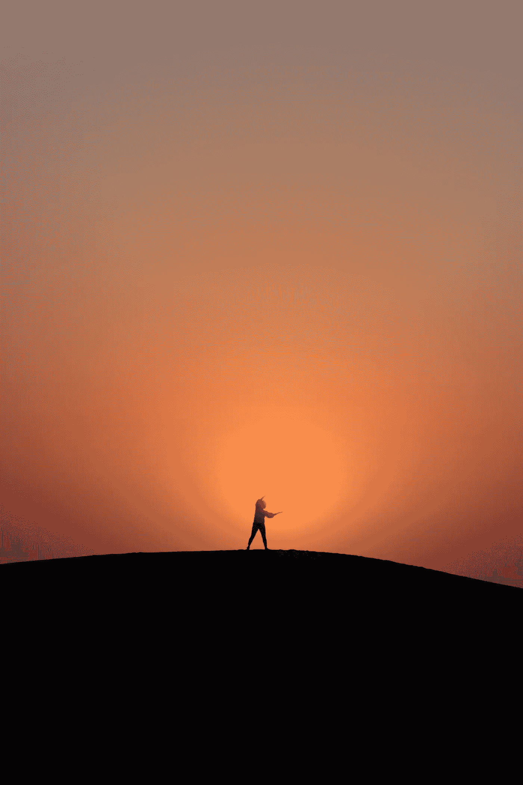

# 抓住每一天…每一天！

> 原文：<https://medium.com/coinmonks/seize-the-day-every-day-8ba81d77a659?source=collection_archive---------86----------------------->

来源:[塞尔万 B](https://unsplash.com/@selvan548)

## 太阳神善良

在夏天，当难得一见的太阳壮丽的光线照射到你的身体时，会发生一些奇妙的事情，尤其是我们这些生活在太阳每次都与你一起玩“顶峰啊呜”的地区的人。你变成了一个太阳神/女神……几乎是在追逐这种能量，只要你有机会。在…的心目中，它是如此巨大