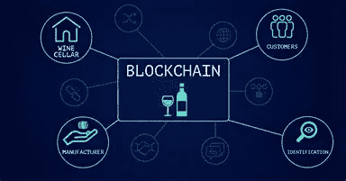

# 选择合适的区块链。为什么您应该使用 CSC

> 原文：<https://medium.com/coinmonks/selecting-an-appropriate-blockchain-why-you-should-use-csc-94c5e908bb3a?source=collection_archive---------38----------------------->

过去几年，人们对区块链技术的兴趣激增。分布式账本技术能够解决我们日益互联的社会中出现的许多问题，并解决现实世界中的业务问题。随着区块链市场的持续增长，一系列不同的分布式账本技术正可供企业用户应用区块链。在考虑您的选择时，一定要注意某些协议适合某些使用情形，并且可以通过利用现有的网络来加快实现价值。在这里，我们将看看选择区块链时需要考虑的一些因素。

*   区块链有多种口味。有些是集中式的，意思是一个机构控制网络和普通用户可以获得的信息。其他的是**分散式**，意味着工作和数据在整个网络中共享。甚至还有**混合**解决方案，其中一个集中的子链连接到一个分散的主网络。区块链技术的关键属性之一是去中心化，如果您的应用程序正在促进业务透明和不信任，您将希望将适当的数据存储在公共链上，以便可以轻松地、可验证地访问这些数据。

[CoinEx 智能链——CSC](https://www.coinex.org/?lang=en_US)是一个智能合同链，提供完全去中心化。

*   技术好用吗？

也许区块链技术最关键的方面之一是为企业用例配置技术的能力。

共识、权限和数据库等关键特性应该模块化，以满足特定用例的需求。许多区块链技术难以支持所需的模块化水平，因此必须依赖庞大的共识协议，如工作证明，以便进行扩展。更糟糕的是，对网络的这些方面进行更改，即使是用于专用网络，也可能需要复杂的开发过程来适应。

分布式分类账被称为**不可信**，因为在交易中建立交易对手可信度的负担是使用复杂的数学方法抽象出来的。

然而在现实中，信任仍然是被投资的；这只是在一个技术系统中，而不是在一个人身上。

这就意味着，分布式系统的设计必须为用户提供足够的好处，同时保持一个相对公平和不受干扰的记录，直到值得用户冒这个风险。

有了**工作证明**，任何一方都无法战胜在经典计算机上对质数的数学搜索的集体信心是如此之高，几乎不需要任何信任，对矿工来说几乎没有风险。

**利益证明**共识要求用户为了参与而冒险花钱。这有可能阻碍矿工篡改或以其他方式贬低该系统。作为对他们风险的回报，他们从系统中慢慢赚取利息。在股权证明系统中，这通常是所有加密货币的发源地。

随着新的共识协议仍在开发中，所有这些都变得越来越多样和复杂。

[CoinEx 智能链— CSC](https://www.coinex.org/?lang=en_US) 采用 CPOS 共识协议，在支持高性能交易方面与 EVM 完全兼容。

CoinEx 团队经过严谨的调查研究，坚持去中心化的原则，结合 POS 和 POA 的特点，实现 CPOS，又不失网络的稳定性和安全性。CPOS 的特点如下:

1.  生成的块最多有 101 个验证器节点。
2.  验证器轮流生成块。当验证器节点正常产生块时，难度为 2；当验证器节点不按预定顺序产生块时，难度降为 1；当方块分叉时，会系统地选择难度最大的链。
3.  任何人都可以为他们信任的验证器下注。

*   可扩展性—分布式分类帐技术必须能够随着网络在交易和参与者方面的增长而扩展。诸如集中式验证服务和复杂的对等编译过程之类的事情很可能会限制规模。CSC 坚持去中心化和免许可的原则，这样任何人都可以通过 CET 成为验证者

任何人都可以在没有任何许可的情况下通过下注 CET 成为验证者。

*   监管风险——区块链领域最大的公开问题之一是加密货币作为分布式账本技术应用的监管视角。应适当考虑对支持公共加密货币的协议采取监管措施的可能性。CoinEx 围绕密码发行、流通、应用和价值发现建立了完整的产业生态布局。
*   技能可用性——由于新编程语言的不成熟，区块链领域已经出现了许多引人注目的数据和资产泄露事件。企业用户应该利用分布式分类帐技术，使他们的开发人员能够使用他们已经熟悉的工具和编程语言。文职人员委员会
*   支持——像任何企业应用程序一样，需要对整个体系提供适当级别的支持。无论是通过开源社区还是平台和解决方案提供商，从构建到生产阶段都需要支持。随着 CoinEx 智能链基金会 [CSC](https://www.coinex.org/?lang=en_US) 生态支持计划的发布，我们鼓励开发者在 CSC 上创建自己的 DApps，为优质项目提供资金、技术、市场等资源的多维度支持。
*   数据保护

有时，您的用户想要表明他们拥有正确的私人信息，但不共享实际数据。

为了证明数据存在但不泄露它，您可以使用一个**加密散列**为该数据创建一个唯一的标签。加密哈希是单行道；您可以轻松地使用数据来重新创建散列，但不能使用散列来重新创建数据。拥有该数据的任何其他人都可以使用相同的算法来生成相同的哈希，比较哈希可以告诉您，您共享了相同的信息。可靠且经济高效地在区块链上放置哈希标签，向世界表明您拥有一组特定的数据，而不会泄露这些数据是什么。

*   业内人士通常会将“区块链”和“加密货币”混为一谈

加密货币是运行在复杂的分布式数据库之上的**协议**，允许我们在数字空间中建立有限的供应；换句话说，它们不能被复制和粘贴，因此可以保留价值。

历史上，大多数加密货币都建立在区块链或其他分布式账本架构之上，如 **DAG** s

对于普通用户来说，这些定义变得特别模糊，因为一些区块链专门用于维护加密货币，而像 CET 这样的加密货币既可以作为价值存储，也可以作为一种“加密燃料”，允许用户购买遍布 CSC 网络的计算能力。换句话说，CSC 的价值既是感知的产物。

*   一般化

为了使您的区块链项目高度可用，尽可能“通用”是很重要的。所选择的平台将决定使用该系统需要什么样的硬件，或者给定的用户是否由于他或她的散列能力而处于优势。通用系统不需要高度专用的硬件，也不需要长时间的培训和教育就能变得有用。

CSC 与所有类型的设备和硬件兼容。

## **结论。**

应该清楚的是，在分布式分类帐空间中有各种各样的可能性。我们正处于金融和人类组织新时代的转折点，尽管该领域的大部分内容尚未被探索，但区块链技术的前景从未如此明朗。

无论是在一系列技术上进行概念验证，还是仅仅尝试基本的开发工具，接触区块链是采用该技术的最好的第一步。

当考虑分布式应用程序或协议时，记得首先定义我们已经讨论过的隐私、规模、经济性和可访问性。CSC 提供所有这些特征，甚至更多。它是一个高效的智能链。

要获得更多资源，

*   加入 CSC 的[电报组](https://t.me/CoinExChain)。
*   关注 CSC 的[推特](https://twitter.com/CoinEx_CSC)账号。
*   加入 CSC 的[不和](https://discord.gg/5uBGRW9qSp)小组。

关注我的[推特](https://twitter.com/kryptmystro)获取更多更新。

> 加入 Coinmonks [电报频道](https://t.me/coincodecap)和 [Youtube 频道](https://www.youtube.com/c/coinmonks/videos)了解加密交易和投资

# 另外，阅读

*   [八大加密附属计划](https://coincodecap.com/crypto-affiliate-programs) | [eToro vs 比特币基地](https://coincodecap.com/etoro-vs-coinbase)
*   [最佳以太坊钱包](https://coincodecap.com/best-ethereum-wallets) | [电报上的加密货币机器人](https://coincodecap.com/telegram-crypto-bots)
*   [交易杠杆代币的最佳交易所](https://coincodecap.com/leveraged-token-exchanges) | [购买 HTZ 代币](https://coincodecap.com/how-to-buy-htz-token)
*   [5 大最佳社交交易平台](https://coincodecap.com/best-social-trading-platforms) | [瓦济克斯 NFT 印度](https://coincodecap.com/wazirx-nft-india)
*   [10 本关于加密的最佳书籍](https://coincodecap.com/best-crypto-books) | [英国 5 个最佳加密机器人](https://coincodecap.com/uk-trading-bots)