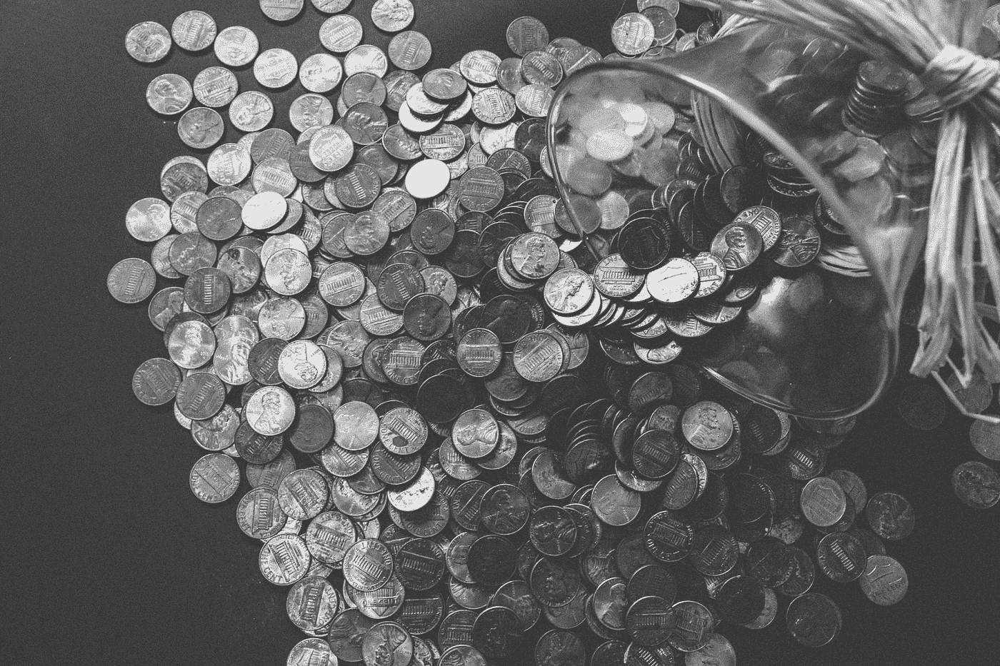

# 自我导向个人退休帐户与常规个人退休帐户

> 原文：<https://medium.com/coinmonks/self-directed-ira-vs-regular-ira-7ad417fd1815?source=collection_archive---------64----------------------->

很有可能，你以前听说过个人退休帐户，你甚至可能通过你的雇主设立了一个。但是，与普遍的看法相反，IRA 不仅仅是一个用来描述退休账户的总称。不同类型的个人退休帐户有不同的用途、目的和好处。在本帖中，我们将讨论两种不同类型的个人退休账户投资的区别:自我导向型个人退休账户和常规个人退休账户。

# 什么是普通个人退休帐户？

个人退休账户，简称 IRA，是一种延税储蓄账户，目的是为退休提供收入来源。经纪人或投资顾问通常监管这些账户，这些账户仅限于传统投资，例如:

*   股票。
*   债券。
*   共同基金。

# 自我导向个人退休帐户与常规个人退休帐户

这两种类型的个人退休帐户的目的是为退休存钱。当涉及到管理账户时，差异就出现了。自我导向的个人退休帐户投资者可以自由地作出大部分(如果不是部分)的投资决定，包括另类投资。

您可以用自主个人退休帐户投资的替代投资包括:

*   房地产。
*   加密货币。
*   黄金和其他贵金属。
*   水权。
*   未开发的或未开垦的土地。
*   牲畜。
*   对冲基金。
*   商品。
*   期货。
*   私募股权/债务。
*   外币。
*   还有更多。

有了如此广泛的投资产品，选择自主个人退休帐户的人可以分散他们的投资组合，这反过来又使他们能够以更低的风险更快地获得股息。

有些东西你不能用自主个人退休帐户投资，包括收藏品，如:

*   罕见的硬币。
*   艺术。
*   古董。
*   酒精。
*   珠宝。
*   棒球卡。
*   纪念品。
*   邮票。

这些限制影响了你可以在自己的个人退休帐户中持有的贵金属投资种类。例如，虽然你可以用你的个人退休帐户投资黄金市场，但你不能购买可收藏的金币。

您也不能使用您的个人退休帐户中的资金做以下事情:

*   借钱。
*   出售财产。
*   用它作为贷款的抵押。
*   购买房产供个人使用。

自我导向的个人退休帐户为所有者提供税收优惠。他们也有捐款限额。2022 年，50 岁以下的人的最高缴款额为 6 000 加元，50 岁及以上的人为 7 000 加元。

常规个人退休帐户和自我指导个人退休帐户的规则是相同的，都是由美国国税局(IRS)管理的:

*   当你年满 72 岁时，你需要开始从你的账户中提取 rmd，即最低分配额。如果你在 2019 年或更早的时候年满 70.5 岁，你必须从那一点开始服用它们。
*   你在 59.5 岁之前获得的任何分配都将被征税，你可能面临 10%的额外罚款。
*   你退休时的分配将作为正常收入征税。
*   这两种个人退休帐户都没有收入限制。
*   根据你的具体情况，你可能有资格享受税收减免。这是你应该每年和你的报税人讨论的事情。

# 自主个人退休帐户和房地产投资

正如我们上面提到的，房地产是自我导向的 IRA 投资者中非常受欢迎的投资选择。例如，你可以用你个人退休帐户中的钱购买止赎房产，这些房产将以你账户托管人的名义持有。这些限制是从禁止你实际居住在该房产的角度来考虑的。

# 如何建立一个自我导向的个人退休帐户

虽然你对自我导向的个人退休帐户有更多的控制权，但你不能完全独自管理它。通常，人们使用第三方服务或平台来帮助他们管理个人退休账户投资。

如果您想开立一个自主个人退休帐户，请采取以下步骤:

*   找一个能帮你管理账户的平台或规模较小的本地托管机构。
*   选择你想做的投资。
*   进行投资或要求账户托管人执行您的交易。

不同类型的个人退休帐户投资将最适合不同的人。如果你正在考虑投资哪一个，花点时间对需求、缴费限额、福利、税收减免等做充分的研究。，这样你就可以做出最明智的决定，让自己过上舒适的退休生活。

# 最后的想法

自主个人退休帐户和常规个人退休帐户都是为退休储蓄的工具。然而，它们的工作方式有几个不同之处。常规 IRA 由经纪人管理，仅限于传统资产；自我导向的个人退休账户由账户所有人投资，通常提供投资组合多样化，投资于另类资产。它们都有美国国税局确定的缴费限额和规定。

> 加入 Coinmonks [电报频道](https://t.me/coincodecap)和 [Youtube 频道](https://www.youtube.com/c/coinmonks/videos)了解加密交易和投资

# 另外，阅读

*   [红狗赌场评论](https://coincodecap.com/red-dog-casino-review) | [Swyftx 评论](https://coincodecap.com/swyftx-review) | [CoinGate 评论](https://coincodecap.com/coingate-review)
*   [Bookmap 评论](https://coincodecap.com/bookmap-review-2021-best-trading-software) | [美国 5 大最佳加密交易所](https://coincodecap.com/crypto-exchange-usa)
*   [如何在 FTX 交易所交易期货](https://coincodecap.com/ftx-futures-trading) | [OKEx vs 币安](https://coincodecap.com/okex-vs-binance)
*   [CoinLoan 评论](https://coincodecap.com/coinloan-review) | [YouHodler 评论](/coinmonks/youhodler-4-easy-ways-to-make-money-98969b9689f2) | [BlockFi 评论](https://coincodecap.com/blockfi-review)
*   [XT.COM 评论](https://coincodecap.com/profittradingapp-for-binance)币安评论 |
*   [SmithBot 评论](https://coincodecap.com/smithbot-review) | [4 款最佳免费开源交易机器人](https://coincodecap.com/free-open-source-trading-bots)