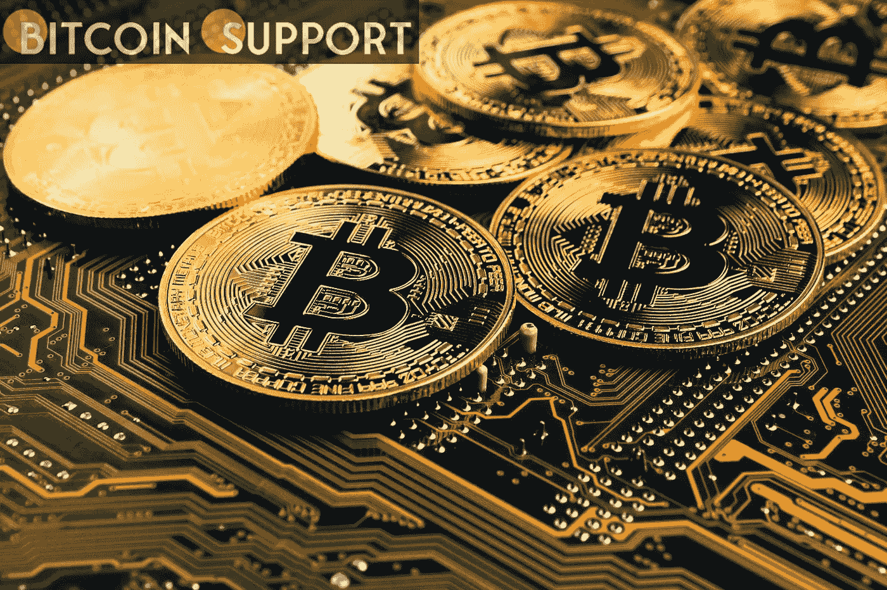
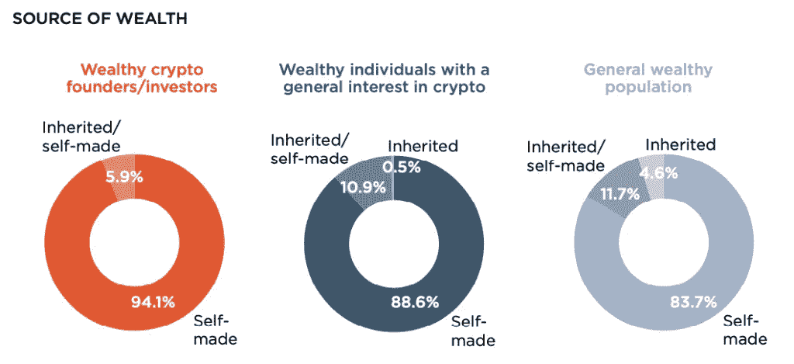

# 报告显示，相比继承的财富，白手起家的财富更有可能流入加密货币

> 原文：<https://medium.com/coinmonks/self-made-wealth-is-more-likely-to-flow-into-cryptocurrency-than-inherited-wealth-report-c3be498bf461?source=collection_archive---------67----------------------->

**Visit our website:-** [**https://bitcoinsupports.com/**](https://bitcoinsupports.com/)

根据一项新的调查，94%的富裕秘密企业家完全靠自己创造了财富。一项新的调查显示，在全球范围内，白手起家的富裕个人往往比那些财富主要是继承而来的人更愿意投资比特币(BTC)等加密货币。

周四，财富研究公司 Wealth-X 对全球富人的加密投资特质进行了新的分析。

这项研究针对的是净资产至少 500 万美元的富裕人群，包括那些专业从事加密货币行业的人，以及那些只是对该领域感兴趣的人。

[https://twitter.com/WealthX/status/1501913519704481792](https://twitter.com/WealthX/status/1501913519704481792)

这份报告是基于财富专属 X 的数据库在 2022 年 1 月完成的关于富人的信息和研究。根据这份报告，该分析分析了一个富裕人口模型，该模型根据全球前 70 大经济体和 200 个城市的财富和可投资资产水平，以统计方式计算私人财富总额和人口规模。根据财富研究，X 高达 94%的富裕秘密企业家是独立创造财富的，没有人完全依靠继承。根据调查，大约 90%对加密有兴趣的人是白手起家的百万富翁，只有 0.5%的人依靠继承的财富。此外，调查补充说，绝大多数富人(84%)是白手起家的。

**Visit our website:-** [**https://bitcoinsupports.com/**](https://bitcoinsupports.com/)

“数据表明，白手起家的富裕个人似乎更容易接受投资于风险更高、波动更大的资产类别，如加密货币，”Wealth-X 专家在论文中表示。研究人员补充说:“鉴于他们通过加密货币积累了财富，继承在加密企业家和投资者的财富创造中扮演如此次要的角色也就不足为奇了。”。

加密货币行业造就了几个世界首富。据报道，FTX 比特币交易所首席执行官萨姆·班克曼-弗里德成为福布斯 400 富豪榜中最富有的白手起家的新人。截至 2022 年初，他仅用三年时间就在 crypto 领域积累了约 100 亿美元的净资产。

**访问我们的网站:-**[**https://bitcoinsupports.com/**](https://bitcoinsupports.com/)

**免责声明:以上为作者观点，不应视为投资建议。读者应该自己做研究。**