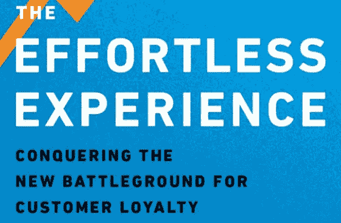

# 自我管理单元:客户支持

> 原文：<https://medium.com/coinmonks/self-managed-units-customer-support-3933d9b289c0?source=collection_archive---------31----------------------->

在 Zignaly，我们试图保持一个扁平的结构，授权人们做出自己的决定，并对他们负责。这不是一项容易的任务，有些领域比其他领域需要更多的指导，但客户支持是一个很好的案例研究。

# 轻松的体验

这一成功的关键因素之一是整个团队围绕[轻松体验](https://www.amazon.com/-/es/Matthew-Dixon-ebook/dp/B00D2HWCY0)中阐述的理念保持一致。

我们来自 [Disrupt](https://www.disrupt.com/) 的好朋友介绍了这本书。它让您对支持的含义有了新的认识。这不是解决问题，而是修复你失去的用户忠诚度，因为他们必须获得支持。

这本书的一些要点:

*   首次触摸分辨率
*   避免下一个问题
*   自助解决方案
*   体验工程

作为支持团队的一员，你必须阅读这本书，这也是你与我们共事的第一周的任务之一。

# 成就事业

分为六个不同级别的职业道路是团队介绍的最后一件事，它有助于设定预期并清楚地了解团队对你的期望。

每个级别都描述了您需要达到的目标，以及您需要通过一些指标来提升的目标。它还包含一个完成该级别的截止日期和该级别的工资(100%透明)。

每个级别的描述和要求更加广泛，但是为了让您快速了解，下面是它的样子:

## 一级

主要是入职培训，掌握我们使用的工具，并协助处理简单的票证。

**练级的一些要求:**

*   阅读轻松体验
*   完成入职任务

**一些指标:**

*   解决最少 50 张票。

完成时间: 4 周

**工资:**2000 美元/月

## 第二级

你从用户的角度理解 Zignaly，从交易者的角度学习。您可以找出我们文档中的弱点并加以改进。你开始报道周末。

**调平的一些要求:**

*   你从用户和交易者的角度掌握了 Zignaly 的工作方式。
*   没有学长也可以周末工作。
*   您已经完成了事故程序练习。

**一些指标:**

*   解决 250 票
*   1-2 次触摸分辨率:月平均超过 50%

**完成时间:** 3 个月

薪水:每月 2000 美元

## 第三级

您可以快速了解新的功能和特性，开始创建内容和待办任务。还有，你可以一个人或者和 2 级队友一起周末工作。

**练级的一些要求:**

*   你已经帮助 1 级或 2 级队友入职。
*   你可以处理突发事件。
*   可以举报 bug。

**一些指标:**

*   满意度得分:月均 85%以上

**完成时间:** 10 个月

**工资:**$ 2500/月

## 四级

你完全了解 Zignaly 的工作原理。可以支持三级代理，关心需要关注的票。

**练级的一些要求:**

*   你能处理最难的票。
*   你可以引导项目为用户的轻松体验做出贡献。
*   你已经开始在某个领域展现出对团队有贡献的专长。

**一些指标:**

*   1-2 次触摸分辨率:月平均超过 50%

**完成时间:**此时，你已经掌握了 Zignaly，正在增值。从这里开始没有时间压力，想成长多快由你自己决定。

薪资:3000 美元

## 第 5 级

您继续在您的专业领域工作，这有利于团队的最终目标:用户轻松的体验。

你认真对待 OKRs，甚至拥有一些关键结果的所有权。

**调平的一些要求:**

*   你获得了一些关键成果的所有权。
*   你的专长现在由团队决定。

**一些指标:**

代理正在增加日常票证解决操作之外的更多价值，只关注困难的问题，因此不需要他们的指标，只需要他们的答案和支持的质量。

薪水:4000 美元

## 6 级

你已经证明了你的价值和承诺，即使在支持团队之外，你也是一个参考对象。

**练级的一些要求:**

*   您的行动对每个用户登录的票证数量产生了积极影响。
*   你已经取得了一些关键成果，产生了出色的结果。

工资:5000 美元

## 接下来:

在这一点上，代理很可能可以在支持之外为公司增加更多的价值；他们去哪里将取决于他们的专业。

这种方法为代理提供了一个清晰的画面，让他们知道会发生什么以及他们会在哪里结束。同样有趣的是，代理人的发展与时间无关，而是取决于他们的成长速度。

# 当前团队

正如我们所说的，我们试图保持一个尽可能少层级的扁平组织。尽管如此，当代理人达到他们专业的第五个层次时，领导者会更多地出现。

我们现在有两个特工在第五层。他们中的一个已经接管了这个团队，帮助和指导这个团队。她总是提出改进、新服务或工具，并每周报告团队的表现。另一个代理人专门研究交易员，是任何与他们相关的事物的参考，并帮助团队掌握 Zignaly 的这一方面。鉴于他对这一主题的了解，他是我们最好的资产招募交易者，他计划推出他的“交易者成功”团队，这是一个专门从事交易者的客户成功团队。

如果我们把这个部门从支持中剥离出来，这可能会成为支持中的一个分支。一旦你达到一定的水平，比如说 4 或 5，你可以决定移动到这个单位(及其水平)，或留在中央单位。

第 4 级的代理(实际上是两个)也开始专门化，其中一个用数据做。她帮助准备所有关于团队表现和产品运作的报告。另一个代理专门负责内容。她帮助修改文章、宏和任何与帮助中心相关的内容。

然后我们让第二层的其他五个特工完成他们的编队。

# 团队成员

正如你所看到的，这些关卡试图增强团队成员的能力。奖励是给那些让团队变得更好的人，因为他们在，所以他们在帮助团队的基础上设定了里程碑和要求。

# 团队的自我管理程度如何？

我们为公司设定季度目标(我们与 OKRs 合作)，这样他们就知道我们在努力完成什么，以及他们可以在哪些方面做出更多贡献。

我们每周都会打电话来看看团队表现如何，并讨论需要改进或改变的地方，但如果他们提出新工具或新代理或任何东西，这取决于他们。他们处理招聘和解雇事宜，或者与服务提供商谈判价格和交易。他们仍然要求批准费用，但这可能很容易通过分配预算来解决。

他们要求与营销和开发部门开会，以了解计划或功能，从而提供更好的支持。他们有雄心提出改变或发现产品需要改进的地方(因为它产生了太多的支持)。

没有人需要管理支持团队，告诉他们该做什么。这有助于我们有一些指标，让我们能够容易地确定它是否在总体上起作用。

支持是非常独立的，是 Zignaly 内部自我管理更好的单位。

# 他们有任何帮助吗？

即使这种自我管理的优点都在他们身上，他们也会在需要的时候寻求反馈和意见。我们分享我们的想法，有时，我们知道事情是因为我们对公司整体有更好的了解，所以这些解释有助于他们做出更好的决策。

我们创建了一个人力资源部门，他们可以依靠这个部门来加快招聘速度，并就公司使命和文书工作委派入职会议。

当一张票需要技术帮助时，他们也依靠技术团队(他们已经要求自己的技术代理有一段时间了，最后他们得到了 I(目前在 2 级培训)。

# 挑战

我们反复检测到的一种模式是人们试图从 support 访问 Zignaly。你的目标是在营销或技术团队工作；你没有通过这些面试，并决定尝试从支持，在那里的要求通常较低。这没有错。唯一的问题是当你的想法是在几个月后搬家。这不起作用有两个简单的原因。第一，如果几个月前面试没通过，现在大概也不会通过。第二，也是最重要的，支持是对你的投资，是花费时间和资源。如果你几个月后离开，他们会浪费所有的资源。他们将不得不从新的候选人开始。

《打造职业指南》有助于缓解这个问题。现在，任何想跳到其他领域的人都知道他们需要完成什么。工资也是如此。一些人接受低于需要的工资，仅仅因为几周后要求加薪。同样，这一点从《职业指南》开始就很清楚了。

我们面临的第二个挑战是团队之间发生冲突的时候。当你的两个最优秀、最有动力的特工不能合作时，你会怎么做？我们的解决方案是将这些人中的一个调离支持部门。

# **决赛**

如果 Zignaly 的其他单位也能有同样水平的无层级自我管理，那就太好了。在团队内部拥有相同的理想，比如轻松经验手册提供的支持，以及设定期望并赋予团队所遵循的文化和价值的职业道路，是实现这种自我管理水平的关键因素。

**我很想听听你的经历。你在任何自组织自治的单位工作吗？什么对你有效，你遇到了什么挑战？**

> 加入 Coinmonks [电报频道](https://t.me/coincodecap)和 [Youtube 频道](https://www.youtube.com/c/coinmonks/videos)了解加密交易和投资

# 另外，阅读

*   最佳[区块链分析](https://bitquery.io/blog/best-blockchain-analysis-tools-and-software)工具| [赚比特币](/coinmonks/earn-bitcoin-6e8bd3c592d9)
*   [Cloudbet 赌场评论](https://coincodecap.com/cloudbet-casino-review) | [点火赌场评论](https://coincodecap.com/ignition-casino-review)
*   [加密套利](/coinmonks/crypto-arbitrage-guide-how-to-make-money-as-a-beginner-62bfe5c868f6)指南| [如何做空比特币](/coinmonks/how-to-short-bitcoin-568a2d0b4ae5)
*   [如何在加拿大购买加密货币？](https://coincodecap.com/how-to-buy-cryptocurrency-in-canada)
*   [无聊猿游艇俱乐部(BAYC)回顾](https://coincodecap.com/bored-ape-yacht-club-bayc-review) | [拜比特 vs 比特币基地](https://coincodecap.com/bybit-vs-coinbase)