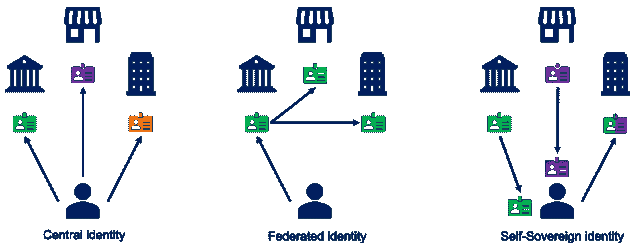
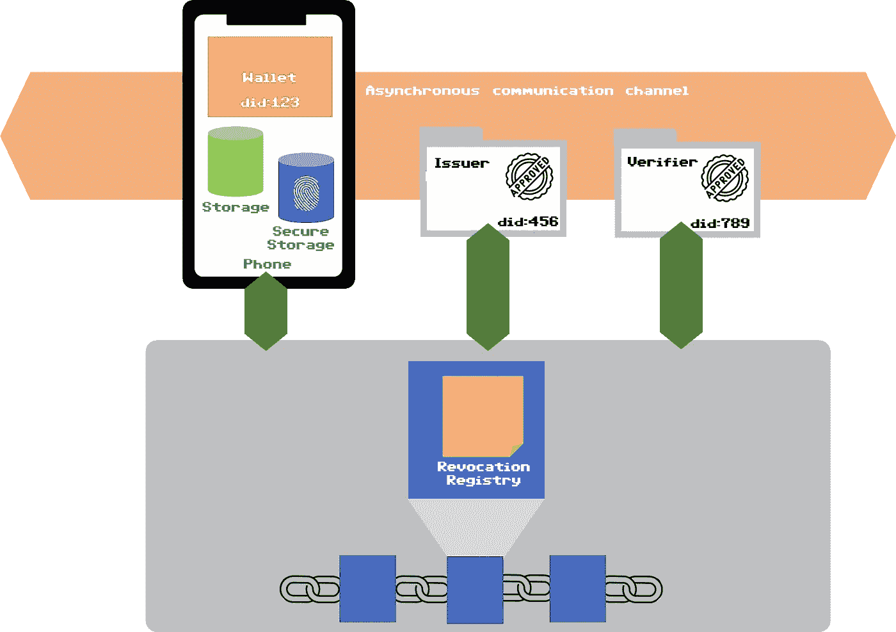

# 自我主权认同:一种采纳的路径

> 原文：<https://medium.com/coinmonks/self-sovereign-identity-a-path-for-the-adoption-1ca43d068907?source=collection_archive---------26----------------------->

## 没有生态系统，SSI 就不可能成功(顺便说一句，就像我们在 21 世纪设计的每一款新应用一样)

Photo by [Raimond Klavins](https://unsplash.com/@raimondklavins?utm_source=medium&utm_medium=referral) on [Unsplash](https://unsplash.com?utm_source=medium&utm_medium=referral)

自我主权身份，简称 SSI，是数字身份管理方式的一种范式转变，从更广泛的意义上说，首先是公民的看法，然后是发行、处理和验证身份和证书的其他机构的看法。

Progress in digital identities (image credits: [https://innovalor.nl/en/Blogs/self-sovereign-identity](https://innovalor.nl/en/Blogs/self-sovereign-identity))

在上图中，您可以看到 SSI 是如何被视为数字身份演变过程中的一个强制性步骤的:从集中式的第一次切割到数字身份，可以预见一个渐进和增量的演变过程，在未来，处理此类身份的分布式方式将成为处理它们的常用方式。

值得注意的是，形容词*分发*的含义不仅指保存凭证的组件的架构，而且主要是指**如何发布、保存和共享凭证的责任**的分配:这是*自我主权*的确切含义，持有人、公民或公司的法定代表将负责她自己的凭证，并将对该凭证的生命周期进行控制。

## 我们需要一个生态系统

无论这种愿景多么迷人，有必要澄清的是，没有任何 SSI 解决方案可以独自工作，SSI 解决方案必须首先培育一个尽可能华丽的生态系统，在其中托管所有流程。

我个人跟踪了至少三种不同钱包应用的开发，每一种都有细微的差异，对于每一种，一旦你阐明了用户体验的细节以及你在手机上安全存放秘密的方式，很明显你需要开发一个发行者和验证者，以展示你漂亮的 [JWT](https://www.w3.org/TR/vc-data-model/) 将如何被交换。

A modern SSI logic architecture: the ecosystem is composed by wallets, issuers, verifiers and ledger

在上图中，您可以看到一个简单的示意图，展示了现代 SSI 系统是如何组成的。

让我们简单评论一下每个组件:

*   钱包:它是一个应用程序(它可以是一个 web 应用程序，但它在这个技术框架中是不相关的:这两个概念是一致的)，它必须能够接收异步消息，扫描二维码，访问两个不同的本地存储；
*   存储:一个由生物统计学加密和保护，另一个只提供对应用程序状态起作用的持久性。它们之间的差异是众多的，但简言之，如果你丢失了你的手机，加密存储将很难被任何人找到，所以这是一个保存你的秘密(如私钥)的好地方；
*   分类账:它可以是区块链(当然)但不是必要的，区块链将开放最纯粹的 SSI 形式，区块链将扮演唯一真相来源的角色，开放、公开、对失败和崩溃有弹性、不可阻挡和防篡改。
*   注册中心:您至少需要一个撤销注册中心来记录将被撤销的凭证和表示。看起来可能需要更多的注册中心，但这只是撤销注册中心的一个变种；
*   发行者和验证者:这些是 SSI 中每个交易所的其他参与者，除了钱包之外，他们将有特定的角色，最重要的是，他们将为其他人创建凭证，并要求提供此类凭证，以验证他们的角色。
*   分布式标识符:这是包含 DID 和 DID 文档的 DID 基础设施(查看我的好朋友 Francesco Zurolo 的[这篇好文章](https://www.linkedin.com/pulse/decentralized-identifiers-francesco-zurolo/))；
*   异步通信信道:该信道必须考虑在认证的端点之间交换加密信息的想法，必须对这些端点进行加密演示以控制这些端点。

## 培育生态系统:发行者和验证者

发行者和验证者是最复杂的部分，几乎不受设计 SSI 系统和钱包的人的控制:发行者和验证者(以这种精确的顺序)必须尽快参与到这个过程中。

对于给定的一组凭证，发行者必须是权威的，一些例子:一组大学的文凭，一组城市的停车许可，一些小企业的忠诚计划。

验证器应该包括在内，但这更容易，因为一旦你的钱包将一直托管凭证，很明显，检查它们将使公民有一种新的方式获得服务:学生将能够在找工作时证明自己的文凭，停车许可将是防篡改的，容易被官员检查，更多的客户将被购物时收集忠诚度积分的想法所吸引。

发布者和验证者都是主体，因为*已经有了涉及凭证*的过程，将需要设想软件包来帮助他们在过程中添加一种全新的方式来做他们已经做的事情:发布凭证(例如，文凭、停车许可、忠诚度积分)并验证它们。必须明确的是，有必要建立一个流程，在该流程中，传统凭证(甚至可能是基于纸张的凭证)和新的 SSI 凭证将共存，因此该流程必须能够适应这两种凭证。

## 结论

SSI 是数字身份不可避免的演变，提前规划是必要的(当然),并且它是旨在拥有发行者和验证者的生态系统的基础，越快越好。采用 SSI 方法是一场值得打的战斗，但不能单独取胜。

> 加入 Coinmonks [电报频道](https://t.me/coincodecap)和 [Youtube 频道](https://www.youtube.com/c/coinmonks/videos)了解加密交易和投资

# 另外，阅读

*   [3 商业评论](/coinmonks/3commas-review-an-excellent-crypto-trading-bot-2020-1313a58bec92) | [Pionex 评论](https://coincodecap.com/pionex-review-exchange-with-crypto-trading-bot) | [Coinrule 评论](/coinmonks/coinrule-review-2021-a-beginner-friendly-crypto-trading-bot-daf0504848ba)
*   [莱杰 vs n rave](/coinmonks/ledger-vs-ngrave-zero-7e40f0c1d694)|[莱杰 nano s vs x](/coinmonks/ledger-nano-s-vs-x-battery-hardware-price-storage-59a6663fe3b0) | [币安评论](/coinmonks/binance-review-ee10d3bf3b6e)
*   [Bybit Exchange 审查](/coinmonks/bybit-exchange-review-dbd570019b71) | [Bityard 审查](https://coincodecap.com/bityard-reivew) | [Jet-Bot 审查](https://coincodecap.com/jet-bot-review)
*   [3 commas vs crypto hopper](/coinmonks/3commas-vs-pionex-vs-cryptohopper-best-crypto-bot-6a98d2baa203)|[赚取加密利息](/coinmonks/earn-crypto-interest-b10b810fdda3)
*   最好的比特币[硬件钱包](/coinmonks/hardware-wallets-dfa1211730c6) | [BitBox02 回顾](/coinmonks/bitbox02-review-your-swiss-bitcoin-hardware-wallet-c36c88fff29)