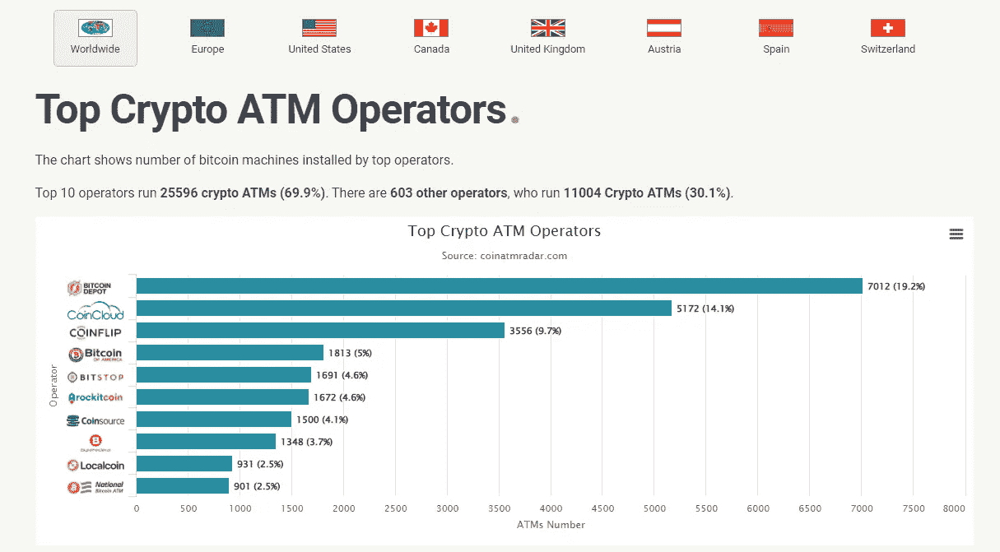

# 加密 ATM 服务的语义核心:搜索营销指南

> 原文：<https://medium.com/coinmonks/semantic-core-of-crypto-atm-services-search-marketing-guideline-dddca4ec36cd?source=collection_archive---------43----------------------->

就加密服务的增长战略而言，搜索营销以及品牌意识至关重要。搜索营销是一个很好的长期投资，相对较小的成本和长期的播放效果。让我们来看看创建有效的搜索营销策略和构建加密 ATM 服务的语义核心的基本步骤。

Very first ATM — a grandfather of modern crypto ATMs

> 根据 Grand View Research，Inc. 的一份新报告，全球[加密 ATM 市场](https://www.grandviewresearch.com/industry-analysis/crypto-atm-market-report?utm_source=prnewswire&utm_medium=referral&utm_campaign=ict_17-january-22&utm_term=crypto_atm_market&utm_content=rd)的规模预计**到 2028 年将达到 18.8 亿美元，从 2022 年到 2028 年将以 59.2%的 CAGR 扩张。市场的增长可归因于新加密货币用户数量的持续增长以及随后对加密 ATM 将加密货币转换为法定货币的需求。根据加密货币支付公司 TripleA 提供的统计数据，截至 2021 年，全球约有 3 亿名加密用户。**

只需计算上述加密 ATM 市场营销预算的 20%,就能看出你的营销投资对一个好的 SEO 优化网站和你的品牌认知度有多重要。

# 方法:

1.寻找加密 ATM 市场的主要参与者

2.评估他们在所有渠道中的搜索营销

3.查找领先(高频)搜索词和查询

4.打造行业语义核心

5.在你的搜索营销策略中实施新数据

[Coinatmradar](https://coinatmradar.com/charts/top-operators/) 展示了**美国、加拿大、英国、西班牙、瑞士、澳大利亚等国家的加密 ATM 运营商**的情况。这有助于比较至少 60 家公司。

Coinatmradar TOP crypto ATM operators [https://coinatmradar.com/charts/top-operators/](https://coinatmradar.com/charts/top-operators/)

[Similarweb](https://www.similarweb.com/website/bitcoindepot.com/) 帮助我们**估算搜索渠道在所有营销渠道中的权重**。搜索营销通常在整个渠道中起着重要作用(主导或主导之一):

*   bitcoindepot——48%是搜索流量
*   蜜獾——56.6%
*   shit coins——13.4%(因为 2022 年 2 月有 41.5%来自展示广告)

Bitcoindepot marketing channels distribution

**品牌搜索查询**

Bitcoidepot brand search queries

这里你可以看到**品牌搜索查询可能会给你 50%** 的搜索流量。了解客户如何从他们的角度和记忆感知来搜索你的品牌。

使用[谷歌广告关键词规划器](https://ads.google.com/) **通过输入竞争对手网站的域名发现关键词**。您也可以选择国家/城市和语言

Google Ads Keyword Planner

现在你可以在你选择的位置看到每个竞争对手的网站、数量、动态、竞争和付费搜索价格的独特查询。

Bitcoindepot.com in Google Keyword Planner

Vaerdex.ch in Google Keyword Planner

人们可以将加密 ATM 公司的域名放到关键字规划器中，并获得所有行业的语义核心。只要用 BitcoinDepot、CoinCloud、CoinFlip、Bitcoinofamerica、Rockitcoin、Bitstop、Kurant、Shitcoins、Bitbase、Bitcoinmat、Localcoin、Bitcoinwell、HoneyBadger、Instacoin、DBScoins、Weex、Bity、TibC 等试试就知道了。

您可以从 SEMRush 的有限免费访问中获得一些基本信息:

Vaerdex.ch SEMRush organic research

**语义核心**
下一步是创建你的竞争对手的频繁查询列表，从而创建一个语义核心。现在你可能会得到至少 60 个加密 ATM 市场的搜索查询，并将其划分为不同的逻辑类别。

> **你的品牌+加密**
> 品牌+ atm，品牌+比特币，品牌+货币，品牌+加密货币，品牌+加密货币，品牌+加密 atm，品牌+费用

**自动柜员机**
自动柜员机位、自动柜员机硬币、自动柜员机硬币费用、自动柜员机硬币百分比、自动柜员机硬币雷达、自动柜员机加密货币、自动柜员机加密货币、我附近的自动柜员机加密价格、自动柜员机雷达、我附近的自动柜员机查找器

**比特币**
比特币 atm，Btc atm，我附近的比特币地点，我附近的比特币 atm，我附近的比特币机器，Bitomat

**买**
用现金买密码，买 btc，买 ltc，买 eth，买密码，买密码 atm，用比特币买

**加密 atm**
加密 atm，加密 atm，加密 bit，加密 bankomat，加密 get，加密 point，加密购买，加密货币瑞士，加密欧元，加密 atm 瑞士法郎，加密 atm 卡，加密 ATM 费用，加密 ATM 地图，加密亭，加密亭附近，加密提款机，加密自动售货机

**其他查询**
现金转加密 atm、现金比特币、硬币 atm、硬币 atm、Eth atm、Ltc atm、机器加密、地图加密、最近加密 atm、最近加密货币 atm

> **如何创建查询也有一些通用的规则:**
> 
> 加密货币+自动柜员机— eth 自动柜员机
> 
> 查询您的自动柜员机的地理位置(+苏黎世、纽约、多伦多)—自动柜员机 btc 纽约
> 
> 法定货币+加密 atm

将这些语义核心用于你的网站页面(新的和旧的)，社交媒体标签和一般的内容策略。这个核心也是一个关于如何宣传你的加密 ATM 品牌的点子库。

激活并使用[谷歌搜索控制台](https://search.google.com/search-console/about)来控制你的搜索流量和性能。将你的语义核心与行业的参考核心进行比较。

考虑到你的客户可能对你的服务有不同的认知和决策水平。这就是为什么你应该定义三种类型的搜索查询:信息查询(ATM 加密价格，btc atm 费用)，交易查询(购买 btc，获取加密)和导航查询(atm near me，eth in new york，atm map)。

Shitcoin SEMRush organic research

**额外见解**

[谷歌趋势](https://trends.google.com/trends/explore?geo=US&q=crypto%20atm)也可以帮助你找到当地的搜索趋势——直到州或城市的水平。

在我的文章 [**中阅读更多关于加密营销的信息，加密交易所如何绕过谷歌、脸书和 Twitter 的广告禁令**](/@wltrnsk/how-crypto-exchanges-bypass-ad-bans-of-google-facebook-and-twitter-ffadeae9488d) **(2018)**

> *加入 Coinmonks* [*电报频道*](https://t.me/coincodecap) *和* [*Youtube 频道*](https://www.youtube.com/c/coinmonks/videos) *了解加密交易和投资*

# 另外，阅读

*   [Bookmap 评论](https://coincodecap.com/bookmap-review-2021-best-trading-software) | [美国 5 大最佳加密交易所](https://coincodecap.com/crypto-exchange-usa)
*   最佳加密[硬件钱包](/coinmonks/hardware-wallets-dfa1211730c6) | [Bitbns 评论](/coinmonks/bitbns-review-38256a07e161)
*   [新加坡十大最佳加密交易所](https://coincodecap.com/crypto-exchange-in-singapore) | [购买 AXS](https://coincodecap.com/buy-axs-token)
*   [红狗赌场评论](https://coincodecap.com/red-dog-casino-review) | [Swyftx 评论](https://coincodecap.com/swyftx-review) | [CoinGate 评论](https://coincodecap.com/coingate-review)
*   [投资印度的最佳密码](https://coincodecap.com/best-crypto-to-invest-in-india-in-2021)|[WazirX P2P](https://coincodecap.com/wazirx-p2p)|[Hi Dollar Review](https://coincodecap.com/hi-dollar-review)
*   [加拿大最好的加密交易机器人](https://coincodecap.com/5-best-crypto-trading-bots-in-canada) | [库币评论](https://coincodecap.com/kucoin-review)