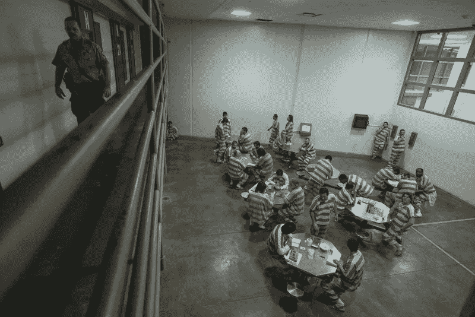

# 银行与国家分离

> 原文：<https://medium.com/coinmonks/separation-of-bank-and-state-e094f318020?source=collection_archive---------47----------------------->

那是 10 年前。

哇！很难相信，十年过去了。我第一次对比特币产生兴趣，并开始写中本聪给世界的礼物。其实这篇文章最早发表于 2013 年 8 月 24 日，作者是***LetsTalkBitcoin****(并在此转载)*。*当然，这是在萨尔瓦多让比特币成为法定货币之前，也是在一把刀为乌克兰士兵筹集到数百万元对抗俄罗斯军队之前……尽管如此，我写的还是常青树。人们对区块链理工大学如何瓦解整个腐败体系充满热情，更重要的是，为什么它必须这样做。*

*2013 年 7 月 30 日，数百名企业家聚集在曼哈顿中城，参加为期一天的“比特币内幕”会议。*

*“这个国家是建立在政教分离的基础上的，”比特币初创企业 ZipZap 的创始人艾伦·萨法希(Alan Safahi)说，“我认为我们应该把银行和国家分开。”这句话赢得了热烈的掌声。——[华尔街日报](http://blogs.wsj.com/moneybeat/2013/07/31/bitcoin-and-the-rise-of-a-digital-counterculture/)*

*四十多年前，F.A .哈耶克提出了同样的建议，但在当时，它似乎没有成为现实的机会。他主张货币非国有化，废除政府对货币供应的垄断，建立竞争性的私人货币发行制度。[1]*

*哈耶克想让政府越来越不可能限制个人、货币和资本的国际流动，从而保护持不同政见者逃脱压迫的能力。另一个原因是阻止反复出现的严重通货膨胀和通货紧缩，这种通货膨胀和通货紧缩会导致银行取消对家庭农场和房屋的赎回权。除此之外，哈耶克还想完全停止通货膨胀支出，这种支出剥夺了个人的劳动力，以资助不必要的战争。*

*1987 年，詹姆斯·奥林·格雷勃提笔描绘了“普通货币的终结”。在这篇由两部分组成的文章中，引用了哈耶克的话，并在比特币到来的 20 年前就预示了它的到来。*

***货币简史***

*为什么国王会发行刻有他们肖像的金币？有人可能会说这纯粹是自恋。然而，大卫·格雷伯教授解释说，这样做有两个主要原因。一个原因是实际问题，国王需要支付他在外国的占领军，金币是一个好办法。其次，随着这些硬币开始流通，国王可以向他的臣民征税，并保持对这些新占领领土的控制。*

*扪心自问，我们今天使用的货币有这么大的不同吗？*

*金钱一直是每个政治体系中无处不在的控制架构。当处于这种虚假权威下的人们仍然不知道他们是如何被操纵的时候，这种方法最有效。*

*每一种政治结构都是如此，包括各种宗教。在许多一神论中，罪总是被等同于欠上帝的债。在信仰的表面下，教会真正的法定货币是内疚，因此对地狱的恐惧成为每个牧师的储备和交易。*

*美帝国的僧侣阶层是那些神秘的家族，他们拥有并经营着美联储银行，控制着外汇平准基金。40 多年前，这只看不见的手利用美国的军事力量(以及他们自己的巨额资本)，用数字货币取代了金本位制。*

*今天，世界上每个国家都用美元支付石油；然而，时代在变。看不见的手利用国际货币基金组织和世界银行用债务奴役第三世界国家，就像容易获得的信用卡坑害美国消费者一样。经上记着说:“富户管辖穷人，欠债的是债主的奴仆。”*

*当人们开始觉醒并提出问题时，这些政治结构对他们的控制开始减弱。国王和王国的旧制度让位于共和国和民主，但只要货币主义继续，寡头控制也就继续。我们今天所见证的是一场巨大的范式转变，正在远离法定货币，这可能意味着货币主义的终结。*

*虽然我们没有想到它，但货币作为一种人工智能，几乎统治着人类的每一个企业、信仰和行为。金钱提供了对人的控制，这是政治结构所期望和要求的。事实上，如果没有控制和操纵货币供应的能力，它们就无法发挥作用。*

***近期历史回顾***

*2008 年发生了两件大事。中本聪在一篇论文中描述了一种加密货币，但在当时这还不算什么。然而，没有人没有注意到的是美国帝国货币体系的史诗般的失败。世界上最后一个超级大国无处不在的控制架构陷入了危机。至少，这是我们被引导去相信的。*

*人们以为天要塌下来了，他们吓坏了。*

*参议员们甚至在国会的秘密会议上被告知，如果没有“空白支票”救助，美国将会实行戒严。乔治·布什总统告诉全世界，我们的金融结构处于如此绝望的状态，如果国会不把 7000 亿美元交给不知名的党派，整个结构将立即崩溃。*

*事后五年回顾这件事，我们现在知道这张“空白支票”实际上是美国人民最初被告知的金额的 10 倍多。无处不在的控制架构，即政府维持对人民的权力，实际上被移交给了少数银行精英。这是我们的政治领导人管理不善的结果，还是仅仅是世界真正的统治者巩固权力的结果？*

*他们用那些钱做了什么？似乎没有人知道，但有一点是清楚的，无处不在的控制架构不那么无处不在，既定的货币体系正面临前所未有的信心危机。人们对这个系统失去了信心，转而寻找任何他们能找到的替代方案。*

*当我们想到没有钱的地球时，它对我们来说就像一个对贫穷和战争一无所知的世界一样陌生。在吉恩·罗登伯里创造的星际迷航宇宙中，金钱不再是世界上的消极力量，贫困结束，各国停止相互开战。虽然大多数人梦想一个和平的世界，但对大多数人来说，完全放弃金钱的概念太难理解了。它被视为纯粹的娱乐——科幻小说。*

*具有讽刺意味的是，很难想象人类如何能够超越我们好战的文化，除非并且直到我们超越所谓的金钱，即无处不在的政治结构控制架构。这意味着如果我们想看到世界和平，那么我们必须成为我们想看到的世界变化。这必须从我们的理财习惯开始。人类必须学会用他们的钱投票——但要不受政治控制。*

***前瞻思维***

*我们怎样才能重塑货币，使其 1)像黄金一样有价值，2)不受可能利用它发动战争的政治结构的控制？这个双重问题很少有人费心去问，更不用说试图去回答。当其他人仍在试图改革一个失败的系统时，一个神秘的黑客实际上找到了答案。来自维基百科:*

> *比特币(BTC)是假名开发商中本聪在 2008 年的一篇论文中首次描述的一种密码货币，他称之为点对点电子现金系统。比特币的创建和传输基于开源加密协议，不受任何中央机构的管理。*

*巴克明斯特·富勒曾经说过，“你永远不会通过对抗现存的现实来改变事情。要改变什么，构建一个新的模型，使现有的模型过时。”这正是 Satoshi 所做的。称比特币为“颠覆性技术”是轻描淡写的说法。不受任何中央机构监管的货币是新模式。随着政治结构所依赖的旧货币变得过时，政治结构本身也将过时。*

*不要担心，这不会在一夜之间发生，但我相信这是前进的趋势。虽然大多数人不太想这个问题，但我们可以说，金钱让我们成为这个系统的奴隶。这听起来可能相当消极，甚至有些夸张，但当我们从计算机技术的角度重新审视这个问题时，解决方案开始出现，比特币是一个非常积极的答案。*

*我们看到的是一个政治控制结构正在崩溃的世界。有了比特币，权力金字塔正变得像煎饼一样平。人们正在从虚假的权威那里收回他们的权力，个人正在收回他们自己的主权出生权。*

*2008 年 9 月启动的对华尔街的纾困是基于一个可怕的预测，即如果允许庞大的衍生品合约体系中的主要交易对手倒下，整个连锁的纸牌屋就会倒塌，整个经济也会随之崩溃。如果我们在明年或十年后面临同样的银行业危机会怎样？只要看看 10 年期美国国债的收益率，你就会发现我们正走向困境。*

*在这种情况下，像比特币这样的替代货币会被允许填补空白吗？*

*简而言之，答案是否定的。只要我们继续使用“允许”这样的词，答案就永远是否定的，绝对不是。这个系统想要继续生存、成长和控制。只要我们是它的臣民，它就是我们的主人。为了确保我们的自由，我们必须改变我们的思想和我们使用的语言。不要请求许可。*

***比特币是货币吗？***

*比特币的与众不同之处在于它不是政治性的。如果一个政府将比特币作为他们的国家货币，那么你可能会称之为政治，但在这种情况下，人们可以简单地放弃比特币，转而使用另一种加密货币。这并不是说他们有理由这样做，但关键是:即使有官方支持，比特币也不会成为另一种政治控制手段。*

*简单地说，金钱提供了对人的控制，这是政治结构所要求的。因此，非政治性的交换体系不是货币，至少不是世人所熟知的货币。或许更正确的说法是，让财产转移在任何政治体系之外成为可能的对等交换体系，是有史以来发明的最伟大的货币形式！*

***开放的货币革命***

*是的，要求诚实政府的时候到了，这意味着我们必须要求诚实的金钱。比特币的存在并不需要许可，同样，我们也不需要向任何虚假的权威机构寻求使用它的许可。毫无疑问，开源资金是一场革命。唯一的死亡将是法定货币的虚假权威，而叛乱是由你们的支出资助的。*

*这是很重要的一点，所以请允许我重复一遍。我们需要政府，我们需要钱，我们只是不需要一个控制另一个。当金钱控制政府时，寡头和公司就有了不正当的影响力。当政府控制了金钱，那么政治体系就能控制公民。共和制的理念是人民控制政府，但为了实现这一理念，我们需要将金钱和国家分开，就像我们将教会和国家分开一样。*

*那些关注占领运动的人会记得一个突出的主题，那就是我们需要从政治过程中获取金钱。这个迷因引起了很多人的共鸣。人们认为，如果我们能阻止华尔街收买我们的政治家，他们可能会自我改造，成为我们人民更好的代表。*

*当你深入思考时，你开始意识到这个问题更为根本。虽然 K 街的游说团体确实对我们的政治体系有不正当的影响，但这不是问题的根源。凌驾于政府之上的巨额资金池是问题的根源。随着比特币的兴起，像我这样的人开始提出新的问题，制定新的解决方案。也许我们需要政府，但是我们需要政府发行的货币吗？*

*谈论将金钱从政治过程中剔除是一回事，但将政府与金钱完全分开是完全不同的另一回事——事实上，这是革命性的。政教分离在人类历史上是一个相当新的想法，大多数人认为这是一个进步。随着自主和匿名金融工具的兴起，我们必须问这样一个问题:我们现在准备好把钱从国家中分离出来了吗？*

*政教分离非常有争议，但它为所有人带来了更大的多元化。美国在这一演变过程中扮演了重要角色。大宪章签署后，启蒙运动的人们不再满足于被国王统治。今天，曾经坐在国王宝座后面的老寡头们仍然通过任命银行家担任曾经由民选官员担任的政治职位来维护自己的权利。我们今天看到的是新封建主义，国王被少数几个拥有大量资本的强大家族所取代。他们控制了政治进程，因为他们控制了金钱。*

*我所描述的是所谓的“新的世界秩序”，那些投资于这个腐败体系的人正在推动一个全球主义议程，迫使全世界的劳动人民遵守和服从其强大的意志，而不考虑他们的个人权利。是的，人们抱怨这种公开的阴谋，但他们不知道对此能做些什么。或许答案很简单:停止使用国家发行的货币。*

*如果全世界的人们都采用各种形式的加密货币(或数字代币、DAO 等)。)，这将严重削弱超级国家控制他们的权力，最终也会使寡头政治无力控制国家。到那时，也只有到那时，自由的人民才有机会恢复他们的政府，重建一个既负责任又代表他们最佳利益的宪政共和国。这是为所有人带来更大自由的前进道路。*

*———————————–*

*[1]哈耶克，弗里德里希·a·冯，货币的非国有化:对并发货币的理论和实践的分析，经济事务研究所，兰辛，1976 年。*

* [## 银行与国家分离

### 马克·马修斯于 2013 年 8 月 24 日出版 2013 年 7 月 30 日，数百名企业家聚集在…

letstalkbitcoin.com](https://letstalkbitcoin.com/separation-of-bank-and-state) 

> 加入 Coinmonks [电报频道](https://t.me/coincodecap)和 [Youtube 频道](https://www.youtube.com/c/coinmonks/videos)了解加密交易和投资

# 另外，阅读

*   《XT.COM 评论》|
*   [SmithBot 评论](https://coincodecap.com/smithbot-review) | [4 款最佳免费开源交易机器人](https://coincodecap.com/free-open-source-trading-bots)
*   [比特币基地僵尸工具](/coinmonks/coinbase-bots-ac6359e897f3) | [AscendEX 审查](/coinmonks/ascendex-review-53e829cf75fa) | [OKEx 交易僵尸工具](/coinmonks/okex-trading-bots-234920f61e60)
*   [如何在印度购买比特币？](/coinmonks/buy-bitcoin-in-india-feb50ddfef94) | [瓦济克斯评论](/coinmonks/wazirx-review-5c811b074f5b)
*   [隐翅虫替代品](/coinmonks/cryptohopper-alternatives-d67287b16d27) | [HitBTC 审查](/coinmonks/hitbtc-review-c5143c5d53c2)
*   [CBET 评论](https://coincodecap.com/cbet-casino-review) | [库科恩 vs 比特币基地](https://coincodecap.com/kucoin-vs-coinbase)
*   [折叠 App 审核](https://coincodecap.com/fold-app-review) | [Kucoin 交易机器人](/coinmonks/kucoin-trading-bot-automate-your-trades-8cf0ca2138e0) | [Probit 审核](https://coincodecap.com/probit-review)
*   [如何匿名购买比特币](https://coincodecap.com/buy-bitcoin-anonymously) | [比特币现金钱包](https://coincodecap.com/bitcoin-cash-wallets)
*   [币安 vs FTX](https://coincodecap.com/binance-vs-ftx) | [最佳(SOL)索拉纳钱包](https://coincodecap.com/solana-wallets)*