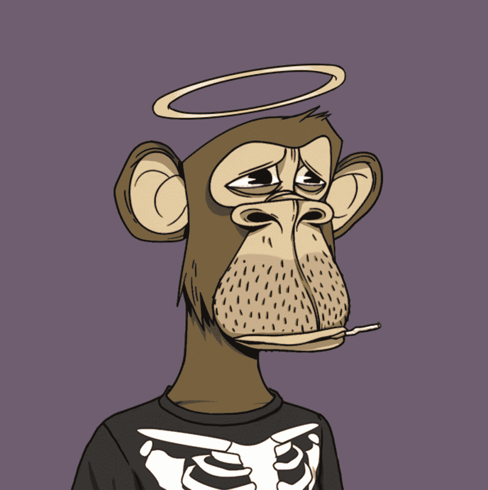

# 专家说，赛斯·格林小偷偷了无聊的猿，没有权利

> 原文：<https://medium.com/coinmonks/seth-green-thief-stole-bored-apes-not-the-rights-say-experts-9ae47820b2b7?source=collection_archive---------50----------------------->

《王牌大贱谍》的男配角赛斯·格林在他的猩猩被偷并卖给另一方后，引发了一场关于谁拥有使用无聊猩猩游艇俱乐部非伪造令牌(NFT)的商业权利的争论

格林在 5 月 18 日发推文称，在他访问一个钓鱼网站后，他的四个 NFT 被盗，包括 BAYC #8398、突变猿游艇俱乐部(MAYC) #9964 和#19182 以及 Doodle #7546。

“机器鸡”的创造者和《盖伊家族》的联合主演格林指出，已经有一个化名为“黑暗之翼 84”的人买下了这条 NFT 鲨鱼。现在，法律专家和社区成员正在权衡盗窃对 BAYC 知识产权(IP)的影响。

BAYC 的许可证没有规定偷窃的情况。它只是说“当你买了一幅 NFT，你就完全拥有了潜在的无聊的猿，艺术。”一些人认为这意味着即使 NFT 是从小偷手里买来的，使用权也会转移给新主人。

格林正在开发一个名为白马酒馆的电视节目，该节目以无聊的猿猴为主角，所以如果这个解释是正确的，他可能无法继续这个节目，因为他已经失去了商业使用权。该节目的预告片于周六在明尼阿波利斯的 VeeCon NFT 会议上首次亮相，但发布日期未知。

圣克拉拉大学(Santa Clara University)的知识产权和技术法律教授埃里克·戈德曼(Eric Goldman)周三告诉 Buzzfeed News，如果买家无意中购买了一件被盗物品，他们通常会受到法律保护，硬币中心通信主任尼拉杰·k·阿格拉瓦尔(Neeraj K. Agrawal)表示，如果格林仍然在他的节目中使用 BAYC，他可能会被起诉。

但是，区块链协会的政策负责人 Jake Chervinsky 表示，这种解释是不正确的，法院可能会做出有利于 Green 保留 BAYC 图像合法权利的裁决，并补充说，“换句话说，代码不是法律。

格林星期三已经暗示，如果夜鹰 84 号还不回来，他将上法庭把它要回来。

安德森·基尔律师事务所(Anderson Kill)的技术律师普雷斯顿·伯恩(Preston Byrne)同意，格林可能有很强的理由保留这件艺术品的产权。在周三的一条推文中，伯恩表示，这是一个“经典的‘不干净的手’场景”，因为 BAYC 是在盗窃受害者通知的情况下从小偷手中购买的。

5 月 8 日，早在格林发推文描述其状态之前，这辆有问题的 BAYC 就被盗并被出售了。高盛认为，不可改变的区块链记录在法律上是否比缺乏通知更重要的问题将会被提出。

DarkWing84 还没有就如何处置这只猿发表公开评论。

一段时间以来，BAYC 用户一直是网络钓鱼诈骗的目标，类似于袭击 Green 的那种。4 月 25 日，一名黑客控制了 BAYC Instagram 账户，并发布了一个钓鱼网站链接，从 BAYC NFTs 中提取了约 240 万美元。

同样的事情发生在一年前的 2021 年 4 月，当时另一名黑客劫持了 BAYC Instagram 账户，关闭了一个钓鱼网站，并带走了大约 100 只猿。

根据 CoinGecko 的说法，BAYC 在 OpenSea 的底价是 91 Ether (ETH)，价值约为 183，000 美元。

> 加入 Coinmonks [电报频道](https://t.me/coincodecap)和 [Youtube 频道](https://www.youtube.com/c/coinmonks/videos)了解加密交易和投资

# 另外，阅读

*   [CoinDCX 点评](/coinmonks/coindcx-review-8444db3621a2) | [加密保证金交易交易所](https://coincodecap.com/crypto-margin-trading-exchanges)
*   [红狗赌场评论](https://coincodecap.com/red-dog-casino-review) | [Swyftx 评论](https://coincodecap.com/swyftx-review) | [CoinGate 评论](https://coincodecap.com/coingate-review)
*   [Bookmap 评论](https://coincodecap.com/bookmap-review-2021-best-trading-software) | [美国 5 大最佳加密交易所](https://coincodecap.com/crypto-exchange-usa)
*   [如何在 FTX 交易所交易期货](https://coincodecap.com/ftx-futures-trading) | [OKEx vs 币安](https://coincodecap.com/okex-vs-binance)
*   [CoinLoan 审查](https://coincodecap.com/coinloan-review) | [YouHodler 审查](/coinmonks/youhodler-4-easy-ways-to-make-money-98969b9689f2) | [BlockFi 审查](https://coincodecap.com/blockfi-review)
*   《XT.COM 评论》的|