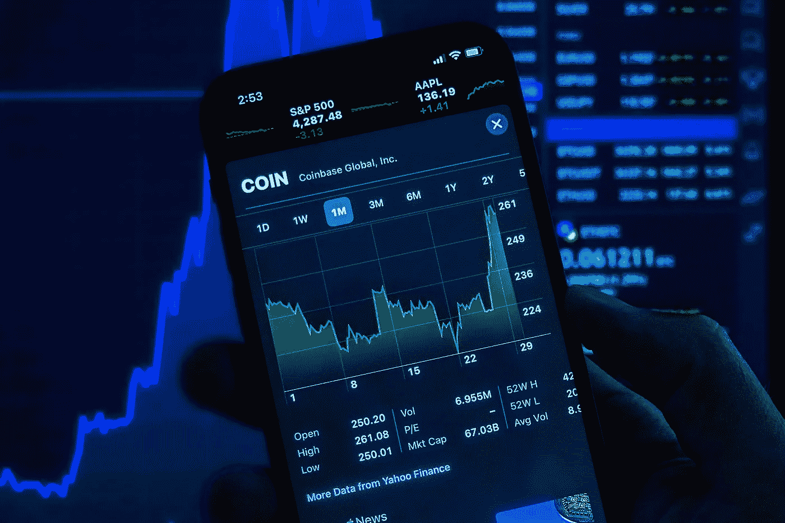

# 建立加密组合

> 原文：<https://medium.com/coinmonks/setting-up-a-crypto-portfolio-f62897dbbba4?source=collection_archive---------53----------------------->

## 要考虑的重要步骤和指南

对任何潜在投资者来说，以正确的方式进入 crypto 应该是优先考虑的事情。购买不同的硬币或代币构成一个投资组合。

Photo by [Jeremy Bezanger](https://unsplash.com/@unarchive?utm_source=unsplash&utm_medium=referral&utm_content=creditCopyText) on [Unsplash](https://unsplash.com/s/photos/crypto-portfolio?utm_source=unsplash&utm_medium=referral&utm_content=creditCopyText)

但建立一个良好的投资组合需要获得加密货币不同领域的资产。

风险管理也很重要。有些硬币是高风险的，有些是中等风险的，有些同样是低风险的。

构建平衡投资组合的步骤

1.自己做研究。这一点怎么强调都不过分。

2.只投资你能承受的损失。即使事情出了差错，你也会心安理得。

3.根据不同的风险水平划分你的投资组合来平衡你的风险。也有一些高风险投资和低风险投资。

高市值硬币——低风险。低市值铸就高风险。

4.只要持有稳定的硬币，就有一定的流动性。这在需要逢低买入时很有帮助。或者与一些 DeFi 平台进行交互。

5.随波逐流。如果市场的情况发生变化，进行相应的重组。

投资组合由 coinmarketcap.com 和 coingecko.com 这样的跟踪者进行跟踪和监控，这就更容易了。

管理一个有这么多硬币的投资组合可能看起来很糟糕，因为一些损失可能会抵消一些收益。从长远来看，通过一点策略，将规模最小化并进行集中将是有利可图的。

> 加入 Coinmonks [电报频道](https://t.me/coincodecap)和 [Youtube 频道](https://www.youtube.com/c/coinmonks/videos)了解加密交易和投资

# 另外，阅读

*   [用于 Huobi 的加密交易信号](https://coincodecap.com/huobi-crypto-trading-signals) | [Swapzone 审查](/coinmonks/swapzone-review-crypto-exchange-data-aggregator-e0ad78e55ed7)
*   最佳[密码交易机器人](https://coincodecap.com/best-crypto-trading-bots) | [购买索拉纳](https://coincodecap.com/buy-solana) | [矩阵导出评论](https://coincodecap.com/matrixport-review)
*   [Coldcard 评论](https://coincodecap.com/coldcard-review) | [BOXtradEX 评论](https://coincodecap.com/boxtradex-review)|[uni swap 指南](https://coincodecap.com/uniswap)
*   [比特币基地评论](/coinmonks/coinbase-review-6ef4e0f56064) | [德里比特评论](/coinmonks/deribit-review-options-fees-apis-and-testnet-2ca16c4bbdb2) | [FTX 评论](/coinmonks/ftx-crypto-exchange-review-53664ac1198f)
*   [Unocoin 评论](https://coincodecap.com/unocoin-review) | [最佳加密赌注硬币](https://coincodecap.com/best-crypto-staking-coins)
*   [如何使用 MetaMask Wallet 获取 KCC 地址？](https://coincodecap.com/kcc-address-metamask)