# 设置 Geth 以太坊私有区块链，连接 Remix

> 原文：<https://medium.com/coinmonks/setup-geth-ethereum-private-network-3806ef7fbe42?source=collection_archive---------0----------------------->

本教程将在 ubuntu 机器上设置 Geth 私人以太坊区块链并连接网络进行混音。本教程仅设置 1 节点私人以太坊区块链。您可以使用引导节点创建多节点专用区块链(不包括在本教程中)。

# **Geth 是什么？**

Geth 是在以太网上运行节点的最流行的独立 CLI 客户端之一。使用 Geth 你可以加入以太坊网络，在账户间转移以太，甚至挖掘以太。

# Geth 以太坊专网设置 **:**

首先，我们需要安装 geth 包。

登录 ubuntu 机器，按照下面的说明安装以太坊 geth 包。

命令:

sudo apt-get 安装软件-属性-通用
sudo add-apt-repository -y ppa:以太坊/以太坊
sudo apt-get 更新
sudo apt-get 安装以太坊

检查 geth 的版本。

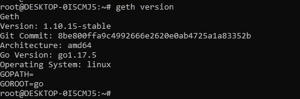

创建一个目录，命名为“节点”。它将包含您所有的文件和数据目录。

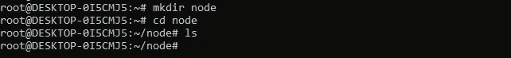

现在 geth 已经安装好了，让我们为以太坊区块链网络创建帐号。我正在创建两个帐户。同样地，你可以想创造多少就创造多少。

在 geth 中创建帐户的命令:geth — datadir <directory>account new</directory>

它会提示您输入密码，然后创建包含公共地址和其他详细信息的帐户。把公共广播放在一边。

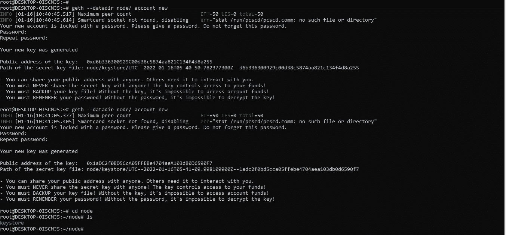

account creation

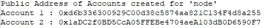

public address for the accounts

现在我们已经有了帐户，让我们创建一个起源文件。创世纪文件包含了创世纪块的细节，定义了你的区块链的初始状态。可以看作是你区块链的高度 0。

如果您已经有一个 genesis 文件，您可以导入它，或者使用以太坊专用网络管理器 puppeth 创建一个新的 genesis 文件。

在这里，当您运行“puppeth”时，它将启动 CLI 向导。要创建一个创世纪块，你需要以下细节:

1.  网状名字
2.  科内苏斯算法。目前 puppeth 只支持 2 种一致性算法，即 Ethash(PoW)和 Clique(PoA)。
3.  密封人帐户—您可以提及一个或多个帐户作为密封人。
4.  预基金账户—您可以预基金您的账户。
5.  网络 Id

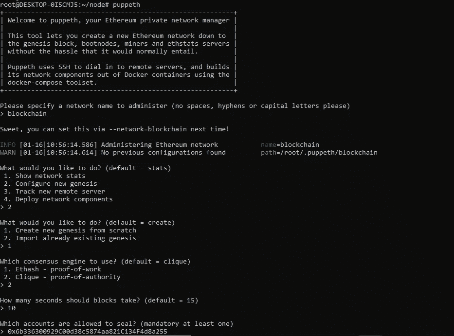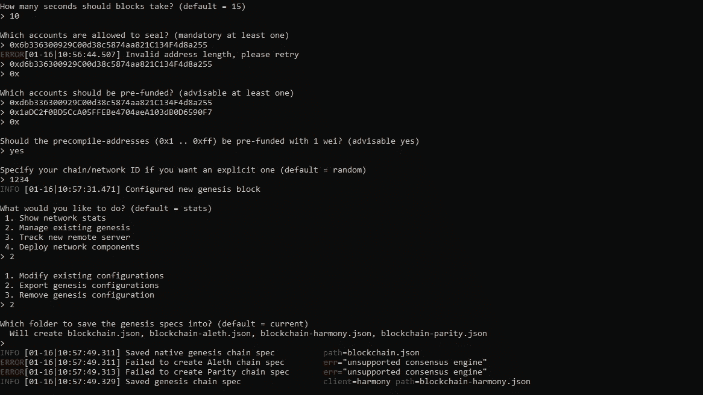

这里我们为 PoW(工作团证明)共识算法创建了起源文件。一旦您导出 genesis 配置，它将在“节点”目录中创建文件。

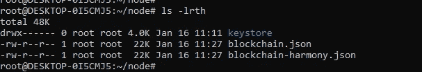

“blockchain.json”是我们将用来建立私人 geth 区块链网络的源文件。

我们的起源文件准备好了，让我们初始化起源文件。

命令:geth—datadir node/init node/block chain . JSON

如果 genesis 文件有任何问题，该命令将抛出错误。

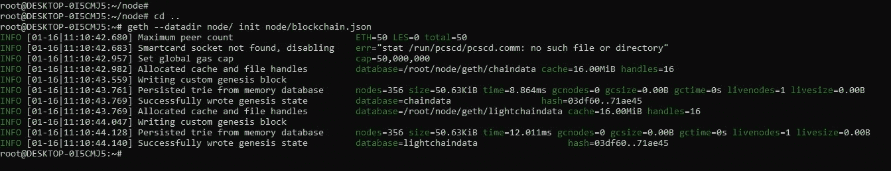

为上面创建的帐户创建一个密码文件；以便我们在进行交易时不需要明确地解锁账户。

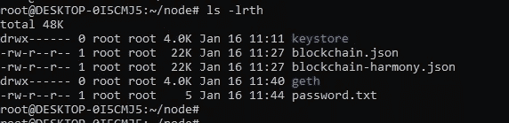

最后一步，让我们使用下面的命令启动 geth 区块链:

命令:geth—network id 1234—datadir node/—port 30303—IPC disable—sync mode full—http—http . addr 0 . 0 . 0 . 0—http . API admin、eth、miner、net、txpool、personal、web 3—allow—unsecured—unlock—http . CORS domain " * "—http . vhosts " * "—http . port 8545—unlock 0xd6b 6300929 c 00d 38 c 5874 aa 821 c 11 c

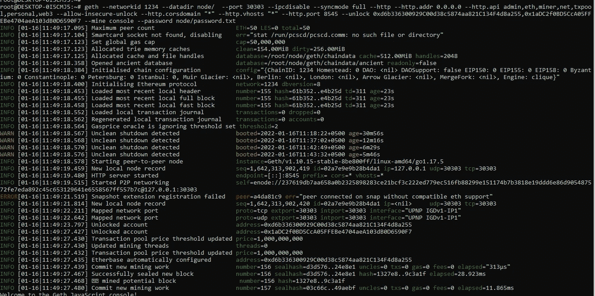

现在，geth 私人以太坊区块链网络正在工作，您可以在控制台上看到详细信息:

eth.accounts →这将向您显示可用的帐户列表(2)。

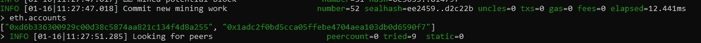

admin.nodeInfo →这将显示节点的详细信息。

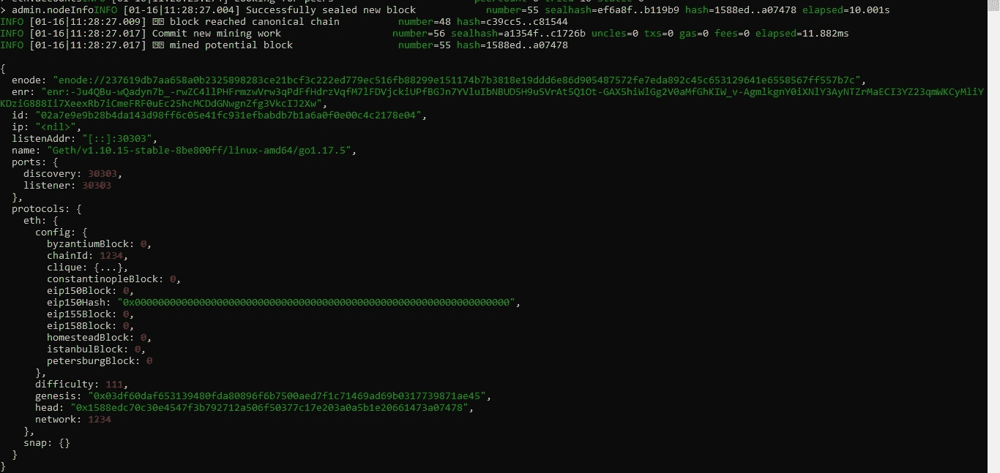

交易和其他功能的详细终端命令请参考 geth 官方网站:[https://geth.ethereum.org/docs/getting-started](https://geth.ethereum.org/docs/getting-started)

# **连接 Geth 私有区块链进行混音**

下一步是连接 geth 以太坊私人区块链混音。

什么是混音？=> Remix 是一个基于 web 的以太坊 IDE。它允许为像区块链这样的**以太坊**开发、部署和管理智能合约。

1.  在 http 模式下打开 REMIX。

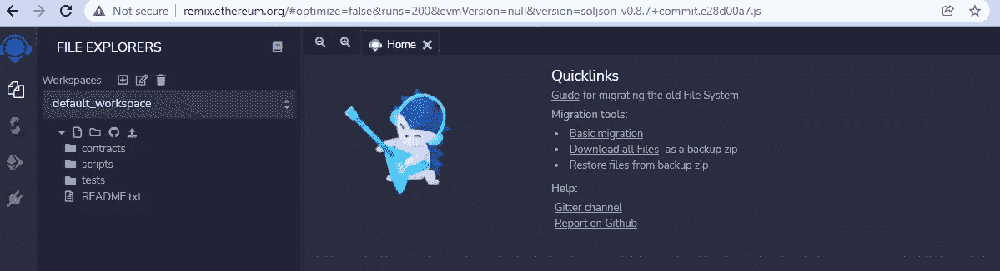

2.在“部署并运行事务”部分，为环境选择“Web3 提供程序”。输入专用区块链网络的 IP。: [http://localhost:8545](http://localhost:8545)

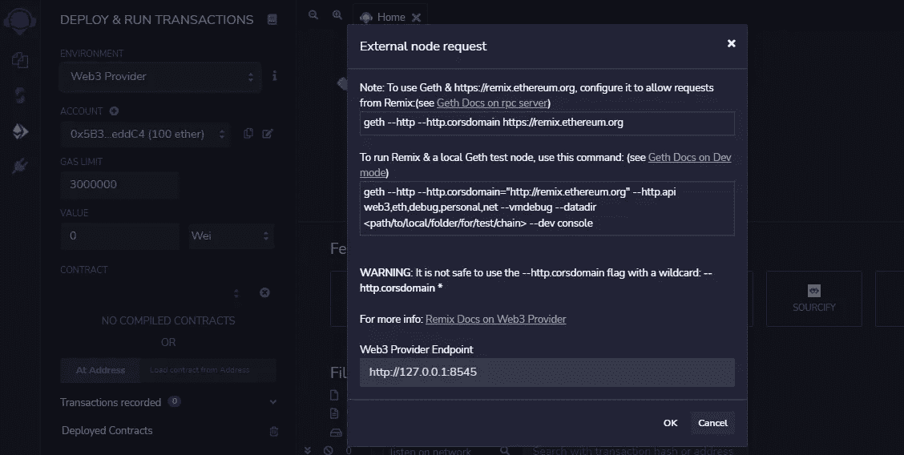

3.设置环境后，您应该能够看到特定连接的帐户。

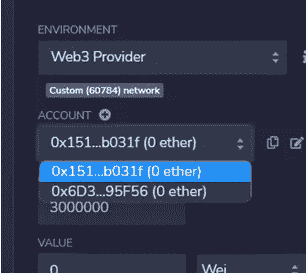

耶！！！！您已经使用 Geth 成功创建了您的以太坊专用网络。

快乐学习！！

> 加入 Coinmonks [电报频道](https://t.me/coincodecap)和 [Youtube 频道](https://www.youtube.com/c/coinmonks/videos)了解加密交易和投资

## 另外，阅读

*   [Botsfolio vs nap bots vs Mudrex](/coinmonks/botsfolio-vs-napbots-vs-mudrex-c81344970c02)|[gate . io 交流回顾](/coinmonks/gate-io-exchange-review-61bf87b7078f)
*   [CoinFLEX 评论](https://blog.coincodecap.com/coinflex-review) | [AEX 交易所评论](https://blog.coincodecap.com/aex-exchange-review) | [UPbit 评论](https://blog.coincodecap.com/upbit-review)
*   [AscendEx 保证金交易](https://blog.coincodecap.com/ascendex-margin-trading) | [Bitfinex 赌注](https://blog.coincodecap.com/bitfinex-staking) | [bitFlyer 点评](https://blog.coincodecap.com/bitflyer-review)
*   [Bitget 回顾](https://blog.coincodecap.com/bitget-review)|[Gemini vs block fi](https://blog.coincodecap.com/gemini-vs-blockfi)|[OKEx 期货交易](https://blog.coincodecap.com/okex-futures-trading)
*   [AscendEx Staking](https://blog.coincodecap.com/ascendex-staking)|[Bot Ocean Review](https://blog.coincodecap.com/bot-ocean-review)|[最佳比特币钱包](https://blog.coincodecap.com/bitcoin-wallets-india)
*   [霍比评论](https://blog.coincodecap.com/huobi-review) | [OKEx 保证金交易](https://blog.coincodecap.com/okex-margin-trading) | [期货交易](https://blog.coincodecap.com/futures-trading)
*   [网格交易机器人](https://blog.coincodecap.com/grid-trading) | [Cryptohopper 审查](/coinmonks/cryptohopper-review-a388ff5bae88) | [Bexplus 审查](https://blog.coincodecap.com/bexplus-review)
*   [7 个最佳零费用加密交易平台](https://blog.coincodecap.com/zero-fee-crypto-exchanges)
*   [氹欞侊贸易评论](https://blog.coincodecap.com/anny-trade-review) | [霍比保证金交易](/coinmonks/huobi-margin-trading-b3b06cdc1519)
*   [分散交易所](https://blog.coincodecap.com/what-are-decentralized-exchanges) | [比特 FIP](https://blog.coincodecap.com/bitbns-fip) | [Pionex 审查](https://blog.coincodecap.com/pionex-review-exchange-with-crypto-trading-bot)
*   [用信用卡购买密码的 10 个最佳地点](https://blog.coincodecap.com/buy-crypto-with-credit-card)