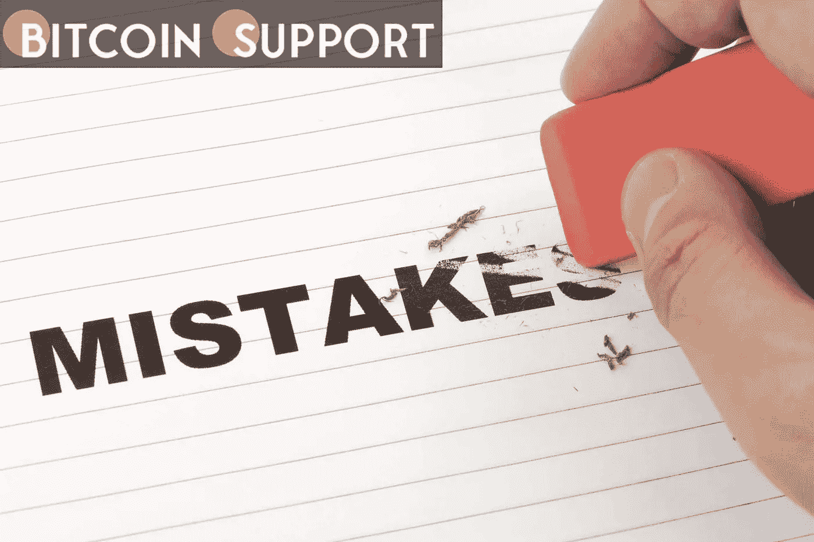

# 加密货币交易商和投资者经常犯的七个错误

> 原文：<https://medium.com/coinmonks/seven-frequent-blunders-made-by-cryptocurrency-traders-and-investors-d4311e68894e?source=collection_archive---------45----------------------->

**Visit our website:-** [**https://bitcoinsupports.com/**](https://bitcoinsupports.com/)

The cryptocurrency markets are already unpredictable enough without committing easy-to-avoid blunders.

Investing in cryptocurrency and other digital assets has never been easier. Investors can purchase and sell tokens without going via a traditional financial institution or paying significant fees and charges by using online brokers, centralised exchanges, and even decentralised exchanges.

Cryptocurrencies were created with the goal of being decentralised. This means that, while they’re a novel way to send money throughout the world, there are no trustworthy authority involved to ensure the security of your funds. Once you’ve taken control of your digital assets, you’re responsible for any losses.

Here, we’ll look at some of the most typical blunders made by cryptocurrency investors and traders, as well as how to avoid losing money.

**You have misplaced your keys**

Cryptocurrencies are based on blockchain technology, a distributed ledger system that provides high levels of security for digital assets without requiring a central custodian. Asset holders, on the other hand, bear the burden of protection, and carefully keeping the cryptographic keys to your digital asset wallet is an important element of that.

Private keys, which operate as a unique identifier to prevent unauthorised access to your bitcoin wallet, are used to establish and sign digital transactions on the blockchain. You cannot reset or recover your keys if you lose them, unlike a password or a PIN. As a result, it’s critical to keep your keys safe and secure, because losing them means losing access to all digital assets held in that wallet.

One of the most common blunders made by crypto investors is losing their keys. According to Chainalysis, over 20% of the 18.5 million Bitcoin (BTC) mined to date has been lost due to forgotten or misplaced keys.

**Coins are stored in online wallets**

The most convenient way for investors to obtain cryptocurrencies is through centralised cryptocurrency exchanges. These exchanges, on the other hand, do not provide you access to the wallets that house the tokens, instead providing a service comparable to that of a bank. While the user technically owns the coins kept on the platform, the exchange holds them, making them vulnerable to platform assaults and putting them at risk.

There have been numerous recorded attacks against high-profile cryptocurrency exchanges, resulting in the theft of millions of dollars worth of cryptocurrencies. The most safe way to protect your funds from such threats is to hold them offline and then withdraw them to a software or hardware wallet after purchase.

**Keeping a tangible copy of your seed phrase is a bad idea**

You will be asked to put down a seed phrase consisting of up to 24 randomly generated words in a certain order in order to generate a private key for your crypto wallet. This seed phrase can be used to generate your private keys and access your bitcoins if you ever lose access to your wallet.

Keeping a hard copy record, such as a printed document or a piece of paper with the seed phrase written on it, might assist you avoid losing money due to broken hardware wallets, malfunctioning digital storage systems, and other issues. Traders have lost a lot of money due to crashed computers and corrupted hard drives, just like they have lost their private keys.

**Fat-finger mistake**

When an investor makes a fat-finger error, they accidentally enter a trading order that isn’t what they intended. A single misplaced zero can result in significant losses, and even a single decimal place can have significant consequences.

When the DeversiFi platform erroneously paid out a $24-million fee, it was an example of this fat-finger error. Another memorable incident occurred when a highly sought-after Bored Ape nonfungible token was sold for $3,000 instead of $300,000.

**Inadvertently sending to the wrong address**

When transmitting digital assets to another person or wallet, investors should exercise extreme caution because there is no way to recover them if they are delivered to the wrong address. When the sender isn’t paying attention while entering the wallet address, this error frequently occurs. Transactions on the blockchain are irrevocable, and unlike a bank, there are no customer service lines to assist you.

This type of blunder can be disastrous for a portfolio. Tether, the company behind the world’s most popular stablecoin, did, however, recover and repay $1 million in Tether (USDT) to a group of crypto traders who transmitted the cash to the incorrect decentralised finance platform in 2020\. This anecdote, however, is just one illustration of how things don’t always go as planned. When it comes to digital asset transfers, hodlers should be cautious and take their time. There’s no going back after you’ve made a mistake.

**Diversification in excess**

Diversification is essential for developing a stable cryptocurrency portfolio, especially given the market’s extreme volatility. However, due to the vast variety of options available and the widespread desire for large returns, cryptocurrency investors frequently over-diversify their portfolios, which can have disastrous repercussions.

Over-diversification can result in a large number of underperforming assets being held by one investor, resulting in considerable losses. It’s critical to diversify into cryptocurrencies only when the underlying value is evident, and to have a thorough understanding of the many sorts of assets and how they’ll likely perform in different market conditions.

**Not putting in place a stop-loss order**

A stop-loss order allows investors to sell an investment only if the market hits a predetermined price. This is used by investors to ensure that they do not lose more money than they are prepared to lose, and that they at least recoup their initial investment.

Investors have lost a lot of money in the past because they set their stop losses erroneously before asset prices collapsed. It’s also crucial to realise that stop-loss orders aren’t flawless, and in the event of a massive, rapid drop, they may fail to trigger a sale.

However, the value of establishing stop losses to preserve assets cannot be overstated, as they can dramatically reduce losses during a market slump.

Investing and trading in cryptocurrency is a high-risk endeavour with no promises of success. Patience, care, and understanding, as with any other sort of trading, can go a long way. Because blockchain lays the burden of proof on the investor, it’s critical to spend time learning about the market and learning from prior mistakes before putting your money at risk.

**访问我们的网站:-**[**【https://bitcoinsupports.com/】**](https://bitcoinsupports.com/)

**免责声明:以上为作者观点，不应视为投资建议。读者应该自己做研究。**

> 加入 Coinmonks [电报频道](https://t.me/coincodecap)和 [Youtube 频道](https://www.youtube.com/c/coinmonks/videos)了解加密交易和投资

# 另外，阅读

*   [如何在 FTX 交易所交易期货](https://coincodecap.com/ftx-futures-trading) | [OKEx vs 币安](https://coincodecap.com/okex-vs-binance)
*   [CoinLoan 评论](https://coincodecap.com/coinloan-review) | [YouHodler 评论](/coinmonks/youhodler-4-easy-ways-to-make-money-98969b9689f2) | [BlockFi 评论](https://coincodecap.com/blockfi-review)
*   [XT.COM 评论](https://coincodecap.com/profittradingapp-for-binance)币安评论 |
*   [SmithBot 评论](https://coincodecap.com/smithbot-review) | [4 款最佳免费开源交易机器人](https://coincodecap.com/free-open-source-trading-bots)
*   [比特币基地僵尸程序](/coinmonks/coinbase-bots-ac6359e897f3) | [AscendEX 审查](/coinmonks/ascendex-review-53e829cf75fa) | [OKEx 交易僵尸程序](/coinmonks/okex-trading-bots-234920f61e60)